# Diagram 02 — Aggregate Failure Modes (Xanadu + Cybersyn + Stack Overflow + Friend.tech)

```mermaid
graph TB
  subgraph "Xanadu 54yr — over-design failure"
    X1[7-feature bundle simultaneous]
    X2[Performance / scope mismatch]
    X3[Rabid prototyping]
    X4[Perpetual 6-month estimates]
    X5[Techno-hubris persistent denial]
    X6[Anti-WWW resistance]
    X7[Utopianism over pragmatism]
  end

  subgraph "Cybersyn 2yr — political destruction"
    C1[Political regime coupling]
    C2[Single-founder dependency Beer]
    C3[Visible Opsroom symbol]
    C4[No documented retrospective]
  end

  subgraph "Stack Overflow 15yr — slow gamification decay"
    S1[Asymmetric downvote design]
    S2[Privilege gating class system]
    S3[Volunteer labor uncompensated]
    S4[AI extinction event 2023-2026]
  end

  subgraph "Friend.tech 13mo — financialization bubble"
    F1[Tokenize identity]
    F2[Token = membership coupling]
    F3[Fee extraction asymmetry 50%]
    F4[Silent shutdown null address]
  end

  X1 --> J[Jetix risk inventory]
  X3 --> J
  X5 --> J
  C1 --> J
  C2 --> J
  C3 --> J
  S1 --> J
  S2 --> J
  S3 --> J
  F1 --> J
  F3 --> J

  J --> M1[R1 surface-only discipline]
  J --> M2[Foundation Architecture LOCKED pre-handoff]
  J --> M3[H8 multi-signal trust + reset]
  J --> M4[R12 anti-extraction enforced]
  J --> M5[Pre-mortem + retrospective per phase]
  J --> M6[Multi-Clan distributed substrate]

  style X1 fill:#fecaca,color:#1a202c
  style X2 fill:#fecaca,color:#1a202c
  style X3 fill:#fecaca,color:#1a202c
  style X4 fill:#fecaca,color:#1a202c
  style X5 fill:#fecaca,color:#1a202c
  style X6 fill:#fecaca,color:#1a202c
  style X7 fill:#fecaca,color:#1a202c
  style C1 fill:#fecaca,color:#1a202c
  style C2 fill:#fecaca,color:#1a202c
  style C3 fill:#fecaca,color:#1a202c
  style C4 fill:#fecaca,color:#1a202c
  style S1 fill:#fecaca,color:#1a202c
  style S2 fill:#fecaca,color:#1a202c
  style S3 fill:#fecaca,color:#1a202c
  style S4 fill:#fecaca,color:#1a202c
  style F1 fill:#fecaca,color:#1a202c
  style F2 fill:#fecaca,color:#1a202c
  style F3 fill:#fecaca,color:#1a202c
  style F4 fill:#fecaca,color:#1a202c
  style J fill:#fef3c7,color:#1a202c
  style M1 fill:#bbf7d0,color:#1a202c
  style M2 fill:#bbf7d0,color:#1a202c
  style M3 fill:#bbf7d0,color:#1a202c
  style M4 fill:#bbf7d0,color:#1a202c
  style M5 fill:#bbf7d0,color:#1a202c
  style M6 fill:#bbf7d0,color:#1a202c
```

**4 failure-mode shapes, 6 Jetix cures.** Each cure already in Foundation Architecture v1.0 — diagram validates existing posture against empirical failure data.
