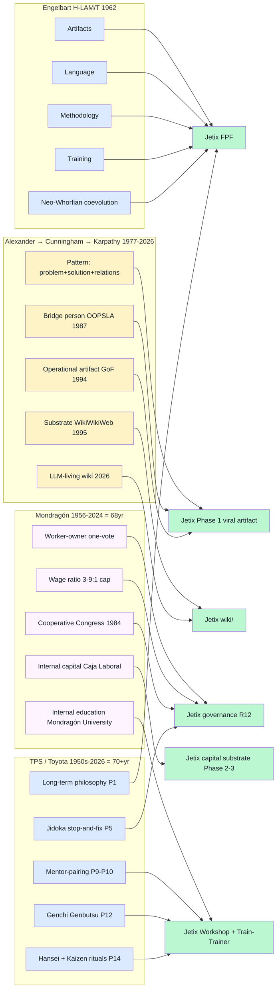

# Diagram 03 — Success Mechanism Lineage

**4 success lineages, ~20 primitives mapped to 6 Jetix-element clusters.** Engelbart + TPS feed FPF substrate; Alexander → Karpathy feeds wiki + viral artifact; Mondragón feeds governance + capital + education.
