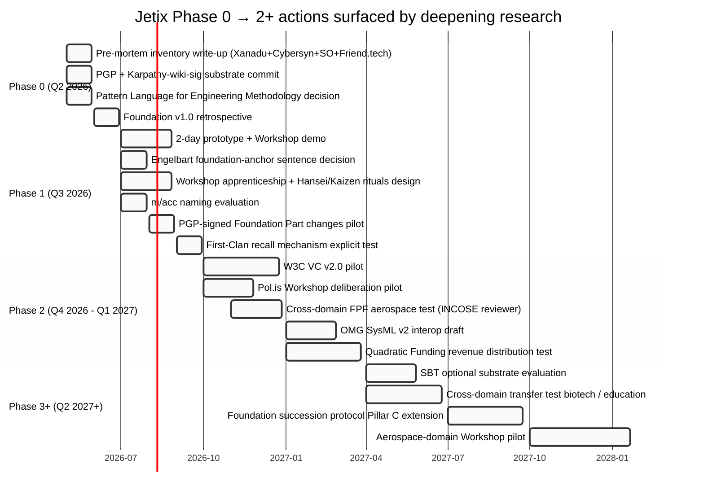

# Diagram 04 — Jetix Phase Actions by Pattern

**Action density:** Phase 0 = 4 zero-cost actions; Phase 1 = 6 design+pilot decisions; Phase 2 = 5 production pilots; Phase 3+ = strategic extension. Drives Phase 0 work-plan.
