# Diagram 05 — 9 Cross-Cutting Patterns × 14 Directions Coverage

```mermaid
graph TB
  subgraph "9 Cross-Cutting Patterns"
    P1[1. Substrate-vs-governance trade-off]
    P2[2. Single-founder fragility]
    P3[3. Tacit-explicit transfer lossiness]
    P4[4. Visible-symbol vs distributed]
    P5[5. Anti-gaming necessity]
    P6[6. Cross-domain transfer 4 elements]
    P7[7. Pre-mortem + retrospective discipline]
    P8[8. Open-source + recall governance]
    P9[9. Network composition for sovereignty]
  end

  D01[01 Xanadu] --> P1
  D01 --> P7

  D02[02 Cybersyn] --> P2
  D02 --> P4
  D02 --> P7

  D03[03 SO+FriendTech] --> P5
  D03 --> P7

  D04[04 Engelbart] --> P2
  D04 --> P3

  D05[05 Alexander lineage] --> P1
  D05 --> P3
  D05 --> P6

  D06[06 Mondragón] --> P1
  D06 --> P3
  D06 --> P8
  D06 --> P9

  D07[07 substrate matrix] --> P1
  D07 --> P5

  D08[08 SEMAT vs FPF] --> P3
  D08 --> P6

  D09[09 Karpathy] --> P2
  D09 --> P3

  D10[10 Buterin d/acc] --> P1
  D10 --> P8

  D11[11 Tang+Weyl Plurality] --> P2
  D11 --> P8

  D12[12 FPF→aerospace] --> P6

  D13[13 EVE 20yr] --> P4
  D13 --> P8
  D13 --> P9

  D14[14 TPS tacit→explicit] --> P3
  D14 --> P5

  style P1 fill:#fef3c7,color:#1a202c
  style P2 fill:#fef3c7,color:#1a202c
  style P3 fill:#fef3c7,color:#1a202c
  style P4 fill:#fef3c7,color:#1a202c
  style P5 fill:#fef3c7,color:#1a202c
  style P6 fill:#fef3c7,color:#1a202c
  style P7 fill:#fef3c7,color:#1a202c
  style P8 fill:#fef3c7,color:#1a202c
  style P9 fill:#fef3c7,color:#1a202c
  style D01 fill:#dbeafe,color:#1a202c
  style D02 fill:#dbeafe,color:#1a202c
  style D03 fill:#dbeafe,color:#1a202c
  style D04 fill:#dbeafe,color:#1a202c
  style D05 fill:#dbeafe,color:#1a202c
  style D06 fill:#dbeafe,color:#1a202c
  style D07 fill:#dbeafe,color:#1a202c
  style D08 fill:#dbeafe,color:#1a202c
  style D09 fill:#dbeafe,color:#1a202c
  style D10 fill:#dbeafe,color:#1a202c
  style D11 fill:#dbeafe,color:#1a202c
  style D12 fill:#dbeafe,color:#1a202c
  style D13 fill:#dbeafe,color:#1a202c
  style D14 fill:#dbeafe,color:#1a202c
```

**Coverage density:** P3 (tacit-explicit) surfaces в 6 directions = most-load-bearing. P7 (pre-mortem) surfaces в 3 + this corpus itself = built-in discipline. P6 (cross-domain transfer) surfaces в 3 directions = next-priority for Phase 1-2.
