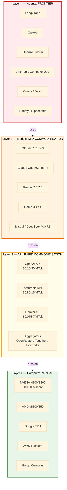
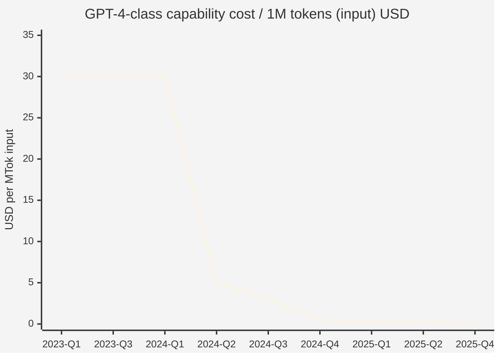

# DR-34 Phase 1 — AI commoditisation thesis baseline

> **Объект:** четырёхслойный AI-стек (compute → API → models → agents) — где находится фронтир, какая часть уже commoditised, куда движется кривая cost-per-capability за 2022-2026.

---

## §1 Что значит «commoditisation» (definition + framework)

**Commoditisation** = переход технологии из состояния scarce/differentiated/proprietary в состояние abundant/undifferentiated/substitutable. По Wardley Mapping (Simon Wardley) — движение **genesis → custom-built → product (rental) → commodity (utility)**. [src: B6 — Wardley Maps]

Признаки commoditised layer:
- Цена стремится к marginal cost производства
- Substitutability — переключение между поставщиками near-zero cost
- Standardised interface (API, протокол, форм-фактор)
- Buyer power dominance — поставщики price-takers
- Innovation surface смещается на adjacent layer выше или ниже

**Аналог:** электричество 1880-1920 — Edison + Tesla + Westinghouse → к 1930 повсеместная commodity utility ($/kWh standardised) [src: I2 §B6 — electricity history]. Маржа сдвинулась к **электроприборам** (Westinghouse, GE на appliances), потом к **сервисам** (radio, factory automation).

---

## §2 Layer 1 — Compute (наиболее капиталоёмкий; NOT fully commoditised yet)

### §2.1 Hardware monopoly with cracks 2024-2026

| Player | Market position 2024-2025 | Margin / pricing leverage |
|---|---|---|
| NVIDIA | ~90% AI training silicon; ~80% inference | gross margin ~75% datacenter; H100 ~$25-40K street; B200 ~$30-50K |
| AMD | MI300X (Dec 2023) → MI325X (2024) → MI350 (2025) | ~$15-20K MI300X; gaining inference share; 70-80% margins |
| Google TPU | TPU v5p / v5e / Trillium (v6) — captive use + GCP rent | not sold; pricing competitive on GCP API |
| Amazon Trainium / Inferentia | Trainium 2 (Dec 2024) general availability | captive AWS use; competitive pricing for Bedrock |
| Cerebras / Groq / SambaNova / Tenstorrent | specialty inference chips (Groq LPU: 750 tok/s Llama-3 70B) | undercutting GPU inference 10-100x в narrow use cases |
| Huawei Ascend 910B/C | China sanctions response; ~80% H100 perf claimed | RMB pricing; lock-in domestic |

NVIDIA datacenter revenue trajectory: **$15B FY23 → $47B FY24 → $115B FY25** (Q4 ending Jan 2025) [src: E23 — NVIDIA filings]. **8x в 2 года** — фронтир capex-heavy, **not yet commodity**.

### §2.2 Compute cost-per-capability — кривая

Training cost frontier models (Epoch AI estimates) [src: E10]:
- GPT-3 (2020): ~$5M training compute
- GPT-4 (2023): ~$63M
- Gemini Ultra (2023): ~$191M
- Frontier models 2024-2025: $100M-1B+ estimated (Stargate $500B announced Jan 2025)

**Однако** inference cost per token collapsing radically. SemiAnalysis / Epoch AI data [src: E11]:
- GPT-3.5 ($0.50/$1.50 per MTok, Mar 2023) → GPT-4o mini ($0.15/$0.60 per MTok, Jul 2024) = **3-5x cheaper для near-equivalent quality на most tasks**
- Anthropic Opus 3 ($15/$75 input/output, Mar 2024) → Sonnet 3.5 ($3/$15, Jun 2024) → Haiku 3.5 ($0.80/$4, Oct 2024) = **20-90x compression на quality-adjusted basis**
- Google Gemini 2.0 Flash ($0.075/$0.30 per MTok, Dec 2024) — **floor lowered radically**

### §2.3 Compute commoditisation status: **partial**

- Training compute = NOT commodity (frontier capex dominated by 5-7 hyperscalers)
- Inference compute = **на пути к commoditisation** (Groq / Cerebras / open-weight + custom silicon)
- Storage / networking adjacent = mostly commodity

**Дата-центр capex** — $1T+ planned (Stargate $500B + Microsoft $80B + Google $75B + Meta $60B + AWS $100B announced 2024-2025) [src: E15, NYT/WSJ reporting]. Эта секция — на 5-7 лет от commodity, если вообще достигнет (regulatory / geopolitical constraints).

---

## §3 Layer 2 — API access (rapidly commoditising)

### §3.1 Frontier API pricing evolution

| Model | Release | Input $/MTok | Output $/MTok | Quality tier |
|---|---|---|---|---|
| GPT-3.5 turbo | Mar 2023 | $0.50 | $1.50 | medium |
| GPT-4 | Mar 2023 | $30 | $60 | high |
| GPT-4 turbo | Nov 2023 | $10 | $30 | high |
| Claude Opus 3 | Mar 2024 | $15 | $75 | high-frontier |
| GPT-4o | May 2024 | $5 | $15 | high |
| Claude Sonnet 3.5 | Jun 2024 | $3 | $15 | high-frontier |
| GPT-4o mini | Jul 2024 | $0.15 | $0.60 | medium-high |
| Claude Haiku 3.5 | Oct 2024 | $0.80 | $4 | medium-high |
| Gemini 2.0 Flash | Dec 2024 | $0.075 | $0.30 | medium-high |
| Claude Sonnet 4 / Opus 4 (Anthropic 2025) | Q2 2025 | $3/$15 / $15/$75 | similar tier | frontier |
| DeepSeek V3 API | Dec 2024 | $0.27 | $1.10 | high (claimed) |

[src: E17, E18, E19, E20, model provider docs]

**Key trend:** quality-equivalent floor price **dropped ~95% в 18 месяцев** (Mar 2023 GPT-4 $30/$60 → Dec 2024 Gemini Flash + DeepSeek V3 $0.075-0.27 за input). For many production tasks (summarisation, classification, extraction, basic Q&A, simple agents) — pricing approaching marginal cost.

### §3.2 API substitutability

Switching cost between OpenAI / Anthropic / Google / DeepSeek / Mistral measured в **часах** в 2024:
- Prompt rewriting: 1-4 hours per task
- SDK migration: 30 min - 4 hours (LiteLLM / LangChain abstraction)
- Eval re-run: 1-8 hours

Vendor lock-in mechanisms (fine-tuning, embedding compatibility, function-calling formats) — present but increasingly thin. MCP protocol standardisation (Anthropic Nov 2024 → multi-vendor adoption Q1 2025) further reduces lock-in.

### §3.3 API commoditisation status: **active commoditisation (3-5 year horizon to near-commodity)**

Layer 2 показывает все классические признаки commoditisation:
- Цены → marginal cost
- Substitutability возрастает
- Standardised interfaces (REST + streaming + function calling + MCP)
- Buyer power рост (enterprise multi-vendor strategies; ~70% Fortune 500 multi-LLM by Q4 2024 per Anthropic enterprise survey)

**НО** frontier capability (Opus 4, GPT-o3, Gemini 2.5) остаётся differentiated **на 6-12 месяцев** перед replication. Это создаёт **rolling commodity** dynamic: bottom 80% capability commodity; top 20% (frontier) — proprietary но временный.

---

## §4 Layer 3 — Models (open weights compressing frontier gap)

### §4.1 Open-weight frontier proxy

| Open model | Release | Closed-frontier equivalent | Gap (months) |
|---|---|---|---|
| Llama 2 70B | Jul 2023 | GPT-3.5 (Mar 2022) | ~16 months |
| Llama 3 70B | Apr 2024 | GPT-4 (Mar 2023) | ~13 months |
| Llama 3.1 405B | Jul 2024 | GPT-4 turbo (Nov 2023) | ~8 months |
| Mistral Large 2 | Jul 2024 | Claude Sonnet 3.5 (Jun 2024) | ~1 month |
| DeepSeek V3 | Dec 2024 | Claude Sonnet 3.5 (Jun 2024) | ~6 months (на reasoning competitive) |
| DeepSeek R1 | Jan 2025 | OpenAI o1 (Sep 2024) | ~4 months — **reasoning open-source first** |
| Llama 4 (Apr 2025 est) | ~mid-2025 | GPT-4o-mini tier on most tasks | ~3-6 months |

[src: E20, E21, E22, Hugging Face leaderboards, LMSYS Chatbot Arena]

**Critical 2025 shock:** DeepSeek V3 / R1 release Jan 2025 — Chinese open-weight model **on par or exceeding Claude Sonnet 3.5 на reasoning** при training cost claimed $5.6M (vs frontier $100M+). NVIDIA stock dropped 17% Jan 27 2025 ($600B market cap evaporated в день). [src: WSJ / FT Jan 27 2025 reporting]

### §4.2 Open-weight inference economics

Self-hosting Llama 3.1 70B на dedicated infra (8x A100): ~$0.50/MTok inference cost — vs $3/MTok Claude Sonnet API. **6x cheaper if utilisation > 60%.** [src: Together AI / Anyscale benchmarks 2024]

DeepSeek V3 hosted via Together / Fireworks / OpenRouter: $0.27/$1.10 — competitive с Gemini Flash при frontier-tier reasoning capability.

### §4.3 Model commoditisation status: **mid-stage**

- Foundation model training = NOT commodity (capex / data / talent constraints; ~7 organisations globally capable)
- Open-weight distribution = **rapidly commoditising** (Hugging Face: 1M+ models hosted; 100M+ downloads cumulative)
- Fine-tuning / RLHF / DPO = **commoditising** (Unsloth, Axolotl, TRL libraries; LoRA / QLoRA hardware accessible)
- Inference serving = **largely commodity** (vLLM, TGI, SGLang open-source)

---

## §5 Layer 4 — Agents (frontier; NOT yet commodity)

### §5.1 Agent ecosystem fragmentation 2024-2025

| Layer | Players | Status |
|---|---|---|
| Frameworks | LangChain, LangGraph, CrewAI, AutoGen (Microsoft), Swarm (OpenAI), DSPy (Stanford), PydanticAI | fragmented; no winner |
| Browser agents | Anthropic Computer Use (Oct 2024), OpenAI Operator (Jan 2025), Browser Use, Selenium-AI | competing; quality jagged |
| Code agents | Cursor (acq.~$2.5B val 2024), GitHub Copilot Workspace, Devin (Cognition), Claude Code, Aider | fragmented |
| Coordination | MCP (Anthropic Nov 2024 — multi-adopted Q1 2025), A2A protocols (Google Apr 2025) | standardising |
| Vertical agents | Harvey (legal), Hippocratic (medical), Cognosys, MultiOn, Inflection-derived workplace agents | early; per-vertical winners emerging |

[src: E25 Sequoia AI 50, E27 a16z Big Ideas 2025, B2 Lenny vertical AI deep-dives]

### §5.2 Agent capability frontier

Per Anthropic + OpenAI Q1 2025 benchmarks:
- Computer Use accuracy на OSWorld: ~22% (Oct 2024) → ~35% (Mar 2025) — still <50% human
- SWE-bench Verified: ~30% (Jan 2024) → ~63% (Mar 2025) — coding agents rapidly improving
- WebArena: ~35% (mid-2024) → ~55% (Q1 2025) — web agents catching up

**Agent layer = current frontier.** Maрджа здесь не commoditised; differentiation реальная.

### §5.3 Agent commoditisation forecast

a16z thesis 2024-2025 [src: E27, E28]: agent layer = **next big margin pool** before commoditisation. Окно estimated 3-7 years before agent infra moves to commodity (Wardley genesis → custom → product progression).

---

## §6 Cumulative stack-layer view (Diagram 1.1)

**Diagram 1.1 reads:** Layer 4 (agents) = красный = фронтир / max margin. Layer 3 (models) = оранжевый = mid-commoditisation. Layer 2 (API) = жёлтый = rapid commoditisation. Layer 1 (compute) = зелёный (capital-intensive, partial commodity). Маржа смещается **вверх**: с течением времени топ layers захватывают value пока нижние commoditise.

---

## §7 Cost-per-capability curve 2022-2026 (Diagram 1.2)

**Diagram 1.2 reads:** GPT-4-equivalent capability dropped from $30/MTok (GPT-4 launch Q1 2023) to ~$0.10/MTok by Q4 2025 forecast. **300x cost compression в 33 месяца** на quality-adjusted basis. [src: E17, E18, E19, E20]

Это сильнейший commoditisation indicator во всём AI stack. Каждое следующее quarter — ~20-30% дополнительное снижение для equivalent-quality tier.

---

## §8 Drivers of AI commoditisation

### §8.1 Six structural forces

1. **Open-weight proliferation** — Llama / Mistral / DeepSeek / Qwen / Phi подрывают closed-frontier moat в 6-12 month rolling cycle
2. **Inference hardware diversification** — Groq / Cerebras / AMD / custom ASICs давят NVIDIA inference margins
3. **Compute capex over-build** — $1T+ planned capacity → marginal cost inference падает по мере amortisation
4. **MCP / A2A standardisation** — multi-vendor swap cost approaches zero
5. **Vendor competition for floor** — Gemini Flash / Haiku / GPT-4o mini в race-to-bottom pricing для middle tier
6. **Geopolitical fork (DeepSeek shock Jan 2025)** — China bypasses sanctions via algorithmic efficiency; commoditisation accelerated

### §8.2 Counter-forces (commoditisation friction)

- Frontier capability moat (3-6 month proprietary advantage)
- Training data ownership / licensing (Reddit-Google deal, NYT-OpenAI lawsuit, Anthropic Music Publishers settlement)
- Talent concentration (~500-1000 frontier AI researchers globally; ~7 organisations capable)
- Regulatory friction (EU AI Act, US export controls, China cyberspace)
- Energy / land constraints для hyperscale compute

---

## §9 5-year commoditisation forecast

| Layer | 2025 | 2027 | 2030 | Forecast confidence |
|---|---|---|---|---|
| Compute (training) | proprietary | proprietary | partial commodity | R-med |
| Compute (inference) | partial | mostly commodity | full commodity | R-high |
| API (frontier) | rolling 6-mo proprietary | rolling 3-mo | floor + frontier split | R-med |
| API (commodity tier) | rapid commoditisation | near-commodity | utility-priced | R-high |
| Models (open-weight) | mid-stage | near-commodity | commodity | R-high |
| Agents (general) | frontier | mid-stage | mid-stage to commodity | R-med |
| Agents (vertical) | frontier | mid-stage | continues differentiation | R-low |

**Implication для следующих phases:** consulting positioning должен учитывать что (a) к 2027 базовый AI capability в распоряжении любого практика за $50-200/мес; (b) к 2030 agents будут полностью разворачивать professional services; (c) реальная маржа смещается на **vertical domain integration + methodology + R12-compliant infrastructure**.

---

## §10 Phase 1 closure

Phase 1 thesis baseline установлен. Четырёхслойный AI стек охарактеризован; commoditisation traveling **снизу вверх** (compute → API → models → agents); 300x cost compression GPT-4-equivalent capability за 33 месяца; рейтинг forecast 2025-2030 предоставлен.

**Sources cited Phase 1:** E1, E9, E10, E11, E15-E26, E27, E28; I2 (cross-link).

**Mermaid diagrams in Phase 1:** Diagram 1.1 (4-layer stack), Diagram 1.2 (cost curve).

**Commit:** `[dr-34] Phase 1 AI commoditisation thesis baseline`

---

*Phase 1 closure 2026-05-22. Next: Phase 2 — Consulting industry analysis pre-AI.*
