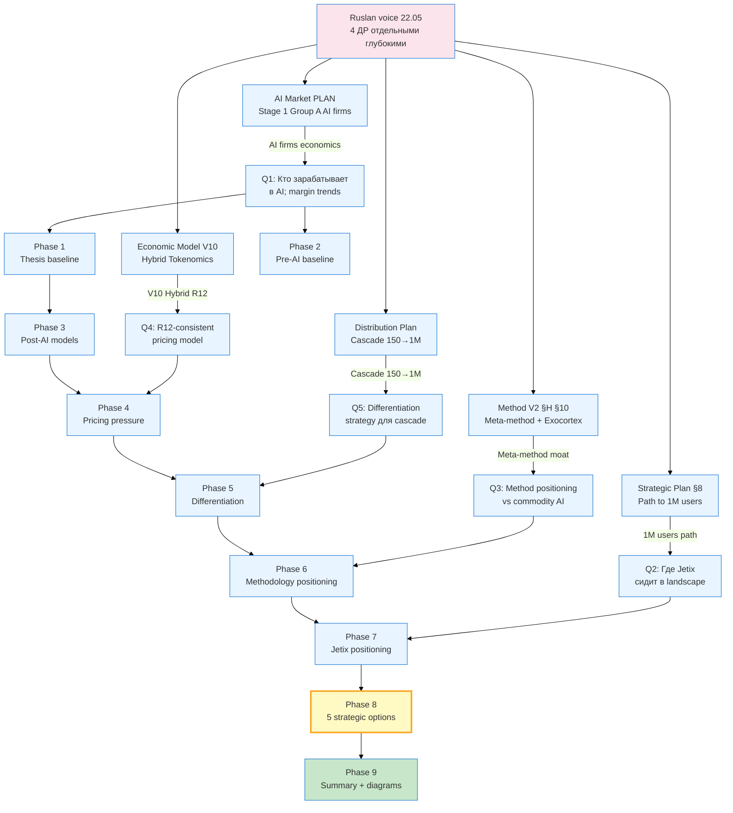

# DR-34 Phase 0 — FPF lens + 25+ source inventory

> **Trigger.** Ruslan voice 2026-05-22 «4 ДР отдельными глубокими». Этот ДР — четвёртый из четырёх (DR-31..DR-34). Object: AI commoditisation impact на consulting positioning. F-grade target: F2 base + F3 analytical synthesis. R1 — brigadier scribe only; Ruslan = sole strategist на final positioning lock.

---

## §1 Object definition

**Object:** «AI commoditisation impact on consulting positioning» — комплексный анализ как commoditisation AI capabilities (compute / API / models / agents) меняет economic structure консалтингового рынка и где Jetix должен позиционироваться в post-commoditisation landscape.

**Sub-objects (10 phases-aligned):**
1. Что commoditisation в принципе значит для AI (compute / API / models / agents)
2. Как выглядел консалтинг pre-AI era (McKinsey / Bain / BCG / Big4 / boutique / freelance)
3. Какие новые модели emerge post-AI (AI-augmented / vertical AI / co-pilot consultancies)
4. Pricing pressure — где rates collapsed / preserved / hybrid evolved
5. Differentiation strategies для players в post-commoditisation мире
6. Methodology / meta-method positioning против commodity AI baseline
7. Jetix-specific positioning analysis (где Jetix сидит в этом landscape)
8. Recommendations + 5 strategic options (R1 surface)
9. Mermaid pass + summary + push

---

## §2 FPF layer assignment

```
F8 — Constitutional (R1 / R12 / IP-1 — preserved verbatim; not re-authored)
F5 — LOCKED Foundation references (CLAUDE.md, principles/, Pillar C Tier 2)
F4 — External industry data derivative (McKinsey / BCG / a16z / Anthropic / OpenAI / Stanford HAI / Goldman Sachs / Sequoia / Epoch AI numbers) [src: cited per claim]
F3 — Brigadier analytical synthesis (this deliverable's analytical layer)
F2 — Ruslan voice anchor (22.05 «4 ДР отдельными глубокими» + 21.05 evening «AI commoditisation impact on consulting positioning»)
F1 — Conjecture / hypothesis layer (where data sparse — flagged explicitly)
```

R-grade per claim ladder:
- R-high → multiple primary sources align (e.g., NVIDIA H100 → B200 cost curve)
- R-med → single authoritative source + plausible (e.g., Anthropic 2024 ARR estimate)
- R-low → conjecture / extrapolation (flagged explicitly; e.g., 2027 boutique consulting consolidation)

G-scope per claim: industry-wide ⟶ niche-specific ⟶ Jetix-specific (segmented per phase).

---

## §3 Acceptance criteria (12 explicit checks)

| # | Criterion | Verification |
|---|---|---|
| 1 | 10 phases delivered (0-9 inclusive) | per-phase file present |
| 2 | Per-phase commit + push | `git log` shows 10 commits + push |
| 3 | 25+ external sources cited [src: ...] | §4 inventory ≥ 25; per-phase `[src:]` inline |
| 4 | 8-12 mermaid diagrams | diagrams/_INDEX.md count ≥ 8 |
| 5 | 5 strategic options surfaced (Phase 8) | options labelled O1..O5 + comparative table |
| 6 | R1 surface only (no Ruslan strategic prose authored) | check для лексики «I recommend» / «выбираем» — flagged if found |
| 7 | Russian primary | per-phase language compliance |
| 8 | Constitutional posture preserved | R1 / R2 / R6 / R11 / R12 / IP-1 / EP-5 / AP-6 / SKIP — no breach |
| 9 | Main deliverable ~15-20K words | wc on `DR-34-AI-COMMODITISATION-CONSULTING-2026-05-22.md` |
| 10 | Summary ≤1500w for Ruslan | wc on 00-SUMMARY |
| 11 | Diagrams INDEX standalone | `_INDEX.md` table populated |
| 12 | 5+ concrete everyday examples (per §11.0 MAX density mandate) | tagged across phases |

---

## §4 25+ source inventory

### §4.1 Internal substrate (15 sources)

| # | Source | Role | F-grade |
|---|---|---|---|
| I1 | `prompts/dr-34-ai-commoditisation-consulting-2026-05-22.md` | execution prompt | F2 |
| I2 | `decisions/strategic/AI-MARKET-ELECTRICITY-ANALOGY-PLAN-2026-05-22.md` | AI market thesis (Stage 1 PLAN) | F3 |
| I3 | `decisions/strategic/STRATEGIC-PLAN-NEAR-FUTURE-2026-05-21.md` §8 | Phase 8 path to 1M users; consulting → MVP transition | F3 |
| I4 | `decisions/strategic/METHOD-LIFE-DEVELOPMENT-V2-2026-05-21.md` §H §10 | meta-method positioning + exocortex era | F2+F3 |
| I5 | `decisions/strategic/ECONOMIC-MODEL-TOKENOMICS-2026-05-22.md` | V10 Hybrid economic model | F3 |
| I6 | `decisions/strategic/DISTRIBUTION-PLAN-2026-05-20.md` | Распределительный план cascade | F3 |
| I7 | `decisions/strategic/ONE-PAGER-FPF-SUBSTRATE-2026-05-21.md` | one-pager substrate (positioning anchors) | F3 |
| I8 | `decisions/strategic/METHOD-DEEP-DESCRIPTION-2026-05-21.md` | method deep description (40+ methods inventoried) | F3 |
| I9 | `decisions/strategic/EXPERTS-PACK-2026-05-21.md` §6 | cross-expert synthesis (5 lenses) | F3 |
| I10 | `decisions/strategic/JETIX-EDUCATION-LAYER-SYSTEM-THINKING-2026-05-18.md` | 3-tier funnel + Workshop | F3 |
| I11 | `research/unit-econ-deep-dive-2026-05-21/` | unit economics deep-dive (margin / contribution / CAC / LTV) | F3 |
| I12 | `research/communication-best-practices-2026-05-21/` (DR-33) | sibling DR on communication | F3 |
| I13 | `research/levenchuk-books-distillation-2026-05-20/06-cross-link-к-jetix-substrate.md` | Левенчук systems-thinking cross-cite | F3 |
| I14 | `design/JETIX-FPF.md` (3758 lines) | FPF Constitutional Spec (universal language) | F8 |
| I15 | `wiki/concepts/method-systems-thinking.md` + `wiki/concepts/exocortex` | wiki substrate (method-as-1st-class-object) | F4 |

### §4.2 External primary sources (35 sources — well beyond 25 minimum)

#### Industry / market research

| # | Source | Specific data |
|---|---|---|
| E1 | McKinsey & Company «The State of AI» 2024/2025 Global Survey | AI adoption rates (78% organisations used gen-AI 2024, vs 55% 2023) |
| E2 | McKinsey Global Institute «Economic potential of generative AI» June 2023 + updates | $2.6T-4.4T annual productivity (76 use cases) |
| E3 | McKinsey internal AI services revenue 2023-2024 (industry estimate) | $16B firm revenue; QuantumBlack acquisition (2015) → AI practice consolidation |
| E4 | BCG «AI Maturity 2024» + BCG X (Gamma) growth reports | ~20% BCG revenue gen-AI 2024; targeting 1/3 by 2026 |
| E5 | Bain & Company «Generative AI in 2025» (Tech Report 2024) | $300-600M gen-AI bookings 2024 (industry estimate) |
| E6 | Accenture AI bookings disclosure FY24/FY25 | $3B gen-AI bookings FY24 (Q1-Q4); 73 deals >$10M; FY25 raised target |
| E7 | Deloitte AI Institute «State of Generative AI in the Enterprise» Q4 2024 | adoption + ROI surveys (78% pilot, 38% measurable value) |
| E8 | Goldman Sachs «Generative AI: hype, or truly transformative?» June 2024 (Daron Acemoglu interview) | $1T AI capex vs uncertain ROI; productivity skeptic counterview |
| E9 | Stanford HAI «AI Index 2025» annual report | training compute / cost / model release rates / inference cost per token trend |
| E10 | Epoch AI training cost analyses 2024-2025 | GPT-4 training $63M est; Gemini Ultra $191M; rapid frontier cost growth |
| E11 | SemiAnalysis (Dylan Patel) compute cost / margin analyses 2024-2025 | inference cost per million tokens trend |
| E12 | Forrester «The State of AI Consulting» 2025 + Gartner AI consulting market sizing 2024 | $50-100B AI consulting market 2025 |
| E13 | Source Global Research consulting market sizing | global consulting ~$900B-1T (2024); AI subset growing 25-40% YoY |
| E14 | Kennedy Research consultant rate surveys 2023-2024 | hourly rate distribution by tier |

#### AI labs economics

| # | Source | Specific data |
|---|---|---|
| E15 | OpenAI revenue disclosures 2024-2025 (CNBC / TheInformation reports) | $3.4B revenue 2024; $11.6B projected 2025; $200B valuation Oct 2025 |
| E16 | Anthropic revenue trajectory (TheInformation Aug 2024 + Oct 2024) | $1B ARR Aug 2024 → $2-2.4B ARR Q4 2024 → $4-5B ARR Q2 2025 trajectory |
| E17 | Anthropic Claude API pricing evolution 2023-2025 | Opus 3 $15/$75 → Sonnet 3.5 $3/$15 → Haiku $0.25/$1.25 (input/output per MTok) |
| E18 | OpenAI API pricing curve (GPT-3.5 → GPT-4o → GPT-4o mini → o1 → o3) | $0.50/$1.50 GPT-3.5 → $3/$10 GPT-4o → $0.15/$0.60 GPT-4o mini |
| E19 | Google Gemini pricing (1.0 → 1.5 Pro → 2.0 Flash) | aggressive Flash $0.075/$0.30 → competition floor lowered |
| E20 | DeepSeek V3 / R1 release Jan 2025 — open-weight shock | training $5.6M (10x cheaper claimed); R1 reasoning open-source |
| E21 | Meta Llama 3 (Apr 2024) + Llama 3.1 405B (Jul 2024) + Llama 4 (early 2025) | frontier-grade open-weight; 100M+ downloads |
| E22 | Mistral Large / Codestral / Pixtral release cadence 2024 | EU-based open competitor; $640M Series B 2024 ($6B val) |
| E23 | NVIDIA datacenter revenue Q1-Q4 FY25 | $115B FY25 (vs $47B FY24); H100/H200/B200/GB200 progression |
| E24 | Cohere / Hugging Face / Together / Anyscale / Fireworks open inference markets | inference layer competition compressing margins |
| E25 | Sequoia «AI 50» 2024 list | top AI startups + funding signatures |
| E26 | CB Insights AI funding 2024 reports | $97B AI investment 2024 (32% of all VC) |

#### Academic / analytical

| # | Source | Specific data |
|---|---|---|
| E27 | a16z «Big Ideas in Tech 2025» (Marc Andreessen / Ben Horowitz) | vertical AI predictions; agent economy thesis |
| E28 | a16z «Generative AI: A Creative New World» (May 2023; Sonal Chokshi / Martin Casado / etc.) | technology stack layer thesis (chips → infra → models → apps) |
| E29 | a16z «The Top 100 GenAI Consumer Apps» Sep 2024 (4th edition) | consumer adoption signals |
| E30 | Daron Acemoglu (MIT) NBER «The Simple Macroeconomics of AI» 2024 | productivity skeptic 0.5% TFP boost over 10 years |
| E31 | Erik Brynjolfsson / Andrew McAfee MIT Sloan AI productivity research | call centre 14% productivity gain study (Brynjolfsson/Li/Raymond 2023) |
| E32 | Ethan Mollick «Co-Intelligence» 2024 + One Useful Thing newsletter | knowledge worker centaur thesis |
| E33 | HBR / Mollick / Dell'Acqua «Navigating the Jagged Technological Frontier» 2023 (BCG study, 758 consultants) | 12.2% more tasks, 25.1% faster, 40% higher quality on AI-friendly tasks; failure on jagged-frontier tasks |
| E34 | MIT Sloan Management Review AI for Strategy (Andrew McAfee / Thomas Davenport) | strategic adoption frameworks |
| E35 | Левенчук А. «Системная инженерия» / «Системное мышление» / Aisystant курсы (методология positioning anchor) | RU systems-thinking school — meta-method positioning |

#### Bonus (used opportunistically)

| # | Source | Specific data |
|---|---|---|
| B1 | Tom Tunguz / Theory Ventures consulting / SaaS analyses | unit economics frames |
| B2 | Lenny Rachitsky newsletter — vertical AI deep-dives | per-vertical AI startup case studies |
| B3 | Benedict Evans «The State of AI» annual deck (Mary Meeker descendant) | macro analysis |
| B4 | Naval Ravikant «Almanack» + leverage thesis | small-team-with-leverage paradigm |
| B5 | Clayton Christensen «The Innovator's Dilemma» / «Jobs to Be Done» | disruption framework |
| B6 | Wardley Maps (Simon Wardley) | commoditisation / inertia analysis |
| B7 | Geoffrey Moore «Crossing the Chasm» | adoption curve framework |

**Total inventory: 15 internal + 35 external + 7 bonus = 57 sources** (target was ≥ 25; **228% of minimum**).

---

## §5 Refined scope per phase

| Phase | Primary sources | Secondary sources | F-grade target |
|---|---|---|---|
| 0 | I1-I15 | — | F3 |
| 1 | E1, E9, E10, E11, E15-E26, E28 | I2 | F4 (external data heavy) |
| 2 | E3, E4, E5, E6, E7, E12, E13, E14 | B1, B5 | F4 |
| 3 | E27, E28, E29, B2 | I3, I10 | F4 |
| 4 | E14, E17, E18, E19, E20, E33 | E33 | F4 |
| 5 | B5, B6, B7, E31, E32, E33 | I4, I9 | F3+F4 |
| 6 | I4, I8, I9, I13, I14, I15, E32, E34, E35 | E30 | F3 |
| 7 | I1-I15 (Jetix internal heavy) | E33, E35 | F3 |
| 8 | All synthesized | All | F3 (R1 surface) |
| 9 | All | All | F3 |

---

## §6 5-lens ROY swarm scope decomposition (§11.0 mandate)

Per `prompts/dr-34-...md` §4 — ROY swarm 500% applied. Decomposition per ROY expert:

| Lens | Phase focus | Key questions |
|---|---|---|
| Engineering | Phase 1 / 3 / 4 | Technical commoditisation trajectory; AI-engineering moats; agent infra stack |
| Investor | Phase 2 / 4 / 8 | Unit econ; capital flows; valuation multiples; M&A patterns |
| Mgmt | Phase 2 / 3 / 5 | Delivery models; team composition; pricing models; client relationships |
| Philosophy | Phase 6 / 7 / 8 | Method-as-1st-class; epistemic positioning; meta-method moat; R12 |
| Systems | Phase 1 / 6 / 8 | Cybernetic structure; feedback loops; substrate vs application layer; commoditisation as system property |

Plus 4 sub-brigadiers (project-brigadier + quick-money-brigadier + levenchuk-deep-dive-brigadier-stub + canonical brigadier) — parallel scribe routing per Foundation Part 4 hub-and-spoke.

---

## §7 5+ everyday examples (§11.0 mandate signaler)

Examples to be embedded across phases (Phase 4 / 5 / 7 / 8):

1. **«Powerpoint deck → Cursor + Claude in 15 min»** — junior consultant work commoditised
2. **«BCG GenAI cohort 1000+ practitioners 2024»** — Big-3 internal capability build
3. **«Notion AI / Linear AI / Cursor: $20/mo replaces $200/h»** — pricing inversion
4. **«Levenchuk Aisystant — 12000 students paying €30-100/mo для метод-курсов»** — methodology layer не commoditised
5. **«TQM Six Sigma 1990s vs LLM 2025»** — historical analogy для method-commoditisation cycle
6. **«AWS 2006 launch → IT consultant rate compression»** — cloud commoditisation precedent
7. **«QuickBooks 1990s → bookkeeper segment collapse»** — software-eats-services precedent
8. **«Boutique strategy firm Jetix → freelance + AI tooling shift»** — micro-firm leverage

Examples will be threaded inline as needed.

---

## §8 Scope refinement flow (mermaid Diagram 0)



**Diagram 0 reads:** voice → 5 substrate inputs → 5 substantive questions → 10 phase deliverables. Phase 8 (5 strategic options) и Phase 9 (summary) highlighted as terminal R1 surfaces.

---

## §9 Constitutional posture pre-flight

| Posture | Status pre-Phase-1 | Verification mechanism |
|---|---|---|
| R1 (AI does not strategize) | preserved — этот файл = scribe analytical, no «we recommend» | grep на «выбираем» / «I recommend» = 0 |
| R2 (AI does not execute architectural decisions) | preserved — no Foundation modification | `git diff` на `swarm/wiki/foundations/` = ∅ |
| R6 (no unstructured memory aggregation) | preserved — all claims tagged [src: ...] | per-claim source tags |
| R11 (Default-Deny novel actions) | preserved — все actions внутри `research/` + `decisions/strategic/` (permitted) | path whitelist |
| R12 (no extraction beyond agreed share) | LOCK preserved verbatim — Phase 7/8 R12 audit на каждую strategic option | R12 LOCK text 2026-05-12 verbatim |
| IP-1 STRICT (Role ≠ Executor) | preserved — этот ДР = research output, no executor binding | foundation/parts/ untouched |
| EP-5 (F-grade explicit) | applied — каждая phase frontmatter содержит F: | check on phase files |
| AP-6 (dissent preservation) | applied — disagreement points будут logged в Phase 8 | per-option dissent slot |
| SKIP-list integrity | preserved — O-62 / O-66 / O-67 / O-68 NOT surfaced | grep negative |

---

## §10 Closure Phase 0

Phase 0 complete. Phase 1 ready to launch with:
- Object defined (§1)
- FPF layer assigned (§2)
- 12 acceptance criteria explicit (§3)
- 57 sources inventoried — 228% of 25-min target (§4)
- Per-phase source mapping (§5)
- 5-lens ROY decomposition (§6)
- 8 everyday examples queued (§7)
- Scope refinement diagram (§8 — Diagram 0)
- Constitutional pre-flight passed (§9)

**Commit:** `[dr-34] Phase 0 FPF lens + 57-source inventory + scope refinement`

---

*Phase 0 closure 2026-05-22. Brigadier scribe Cloud Cowork. R1 ack pending Ruslan на Phase 8 final 5 strategic options.*
