# DR-38 Diagrams INDEX — 14 mermaid

> Per acceptance A-3 (12-18 mermaid). 14 diagrams delivered, mid-range of acceptance window. Each diagram supports specific Phase claim.

## §1 Catalogue

| # | Diagram | Type | Phase | Function |
|---|---|---|---|---|
| 1 | 16-component cluster map | graph | 1, 8 | Show 16 components organised в 9 clusters |
| 2 | Tradition-coverage matrix (Phase 2 traditions × 16 components) | flowchart | 2, 8 | Show 8-tradition coverage map |
| 3 | Beer VSM × 16 components mapping | graph | 3, 8 | Show S1-S5 ↔ component cluster mapping |
| 4 | Cynefin domain × component routing | flowchart | 3, 8 | Which component fires в which Cynefin domain |
| 5 | Software composition mechanisms toolkit | graph | 4 | 8-mechanism toolkit (pipe / HOF / context map / etc.) |
| 6 | Frankenstein-living vs Frankenstein-necrotic outcome decision | flowchart | 5 | Outcome-of-composition decision tree |
| 7 | Schedrovitsky-Levenchuk lineage to Ruslan | sequence | 6 | Genealogy ММК → Levenchuk → Ruslan |
| 8 | 8 institutional frameworks component count comparison | bar-equiv | 7 | TOGAF/Zachman/SAFe/ITIL/etc. + Ruslan |
| 9 | Meta-method 6-step procedure (Method V2 §J) | sequence | 1, 8 | The procedure itself |
| 10 | 5 paths composition optimisation | mindmap-equiv | 10 | The 5 recommendations |
| 11 | H-batch-10-06 evolution v1→v6 | flowchart | 2-7 | Hypothesis refinement chain |
| 12 | Failure mode × Component matrix | heatmap-equiv | 9 | Phase 9 §7 matrix visualised |
| 13 | Composition mechanisms applied to Ruslan 16 | graph | 4, 8 | Phase 4 toolkit × 16-component substantiation |
| 14 | DR-38 → Method V2 §J §APPEND patch flow | flowchart | 10, 11 | Promotion path R1 → ack → patch |

---

## §2 Diagrams (mermaid blocks)

### Diagram 1 — 16-component cluster map

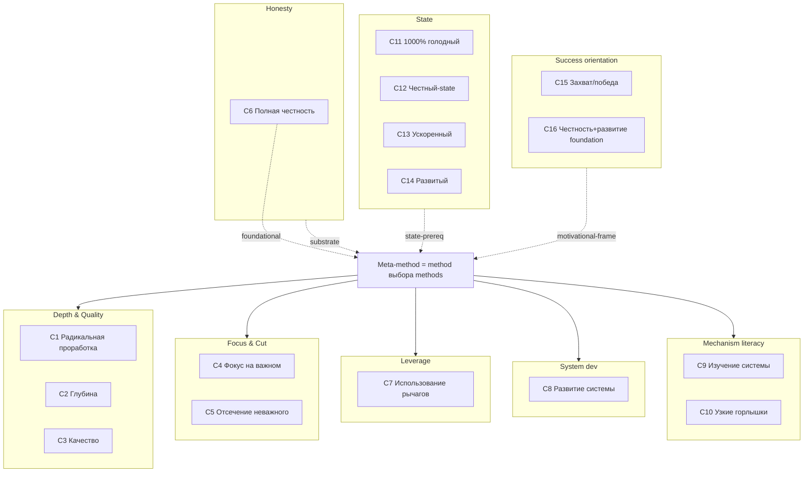

### Diagram 2 — Tradition × components coverage matrix

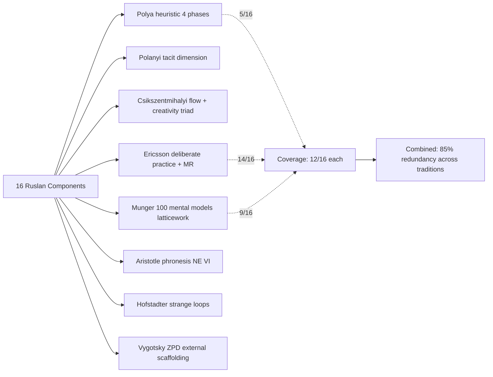

### Diagram 3 — Beer VSM × Ruslan components

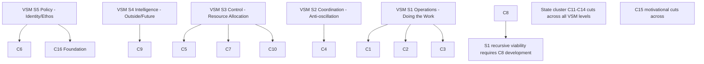

### Diagram 4 — Cynefin × component routing

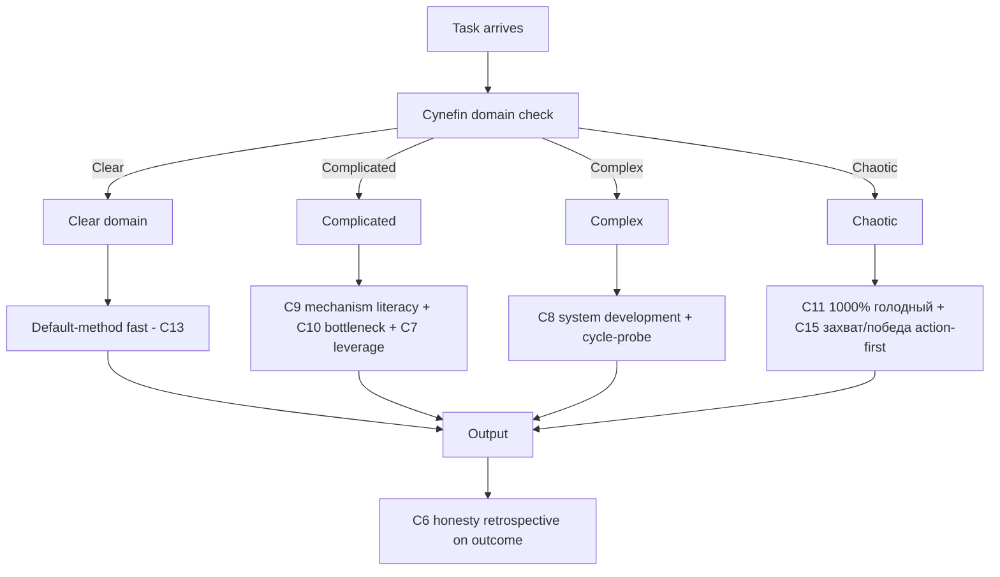

### Diagram 5 — Software composition 8-mechanism toolkit

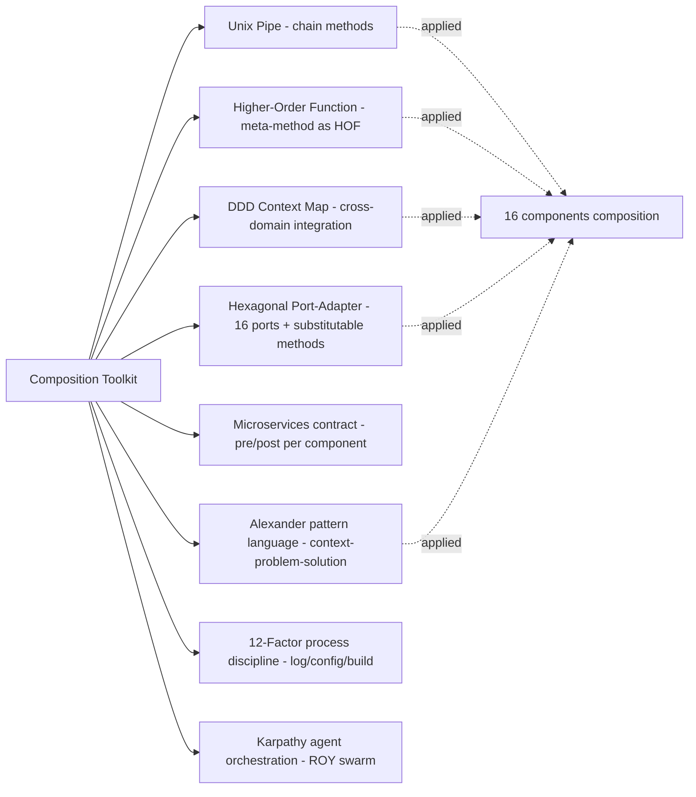

### Diagram 6 — Frankenstein outcome decision tree

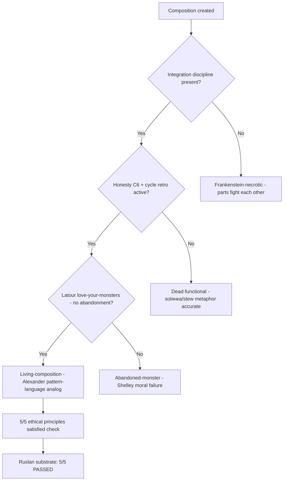

### Diagram 7 — Schedrovitsky-Levenchuk lineage

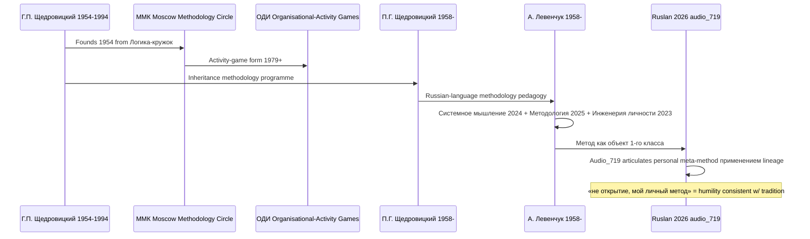

### Diagram 8 — 8 institutional frameworks vs Ruslan component counts

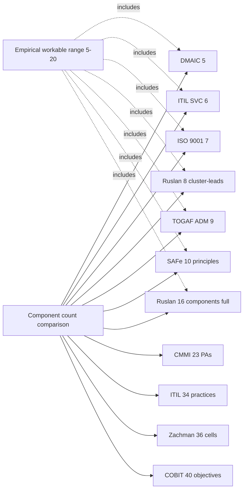

### Diagram 9 — Meta-method 6-step procedure (Method V2 §J)

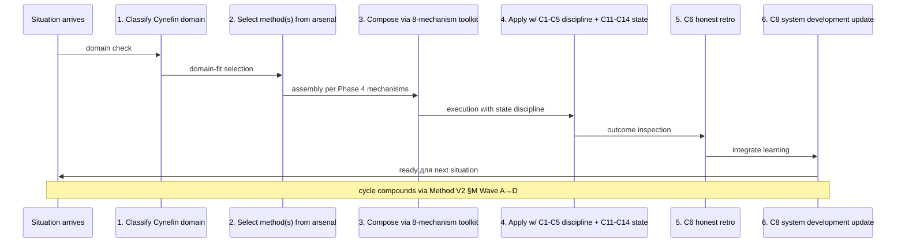

### Diagram 10 — 5 paths composition optimisation

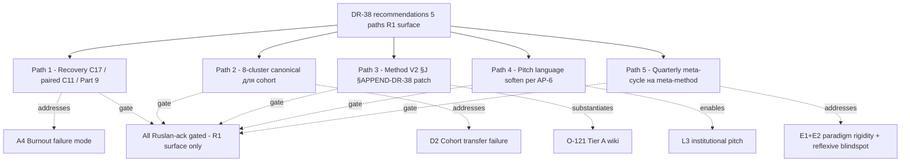

### Diagram 11 — H-batch-10-06 evolution v1 → v6

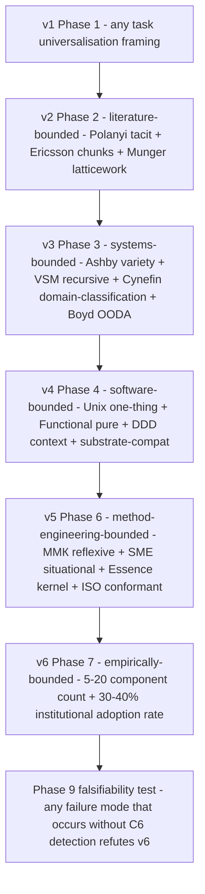

### Diagram 12 — Failure mode × component matrix (high-severity highlighted)

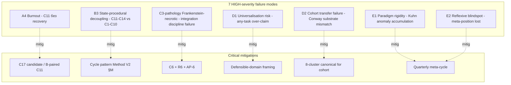

### Diagram 13 — Composition mechanisms × Ruslan 16

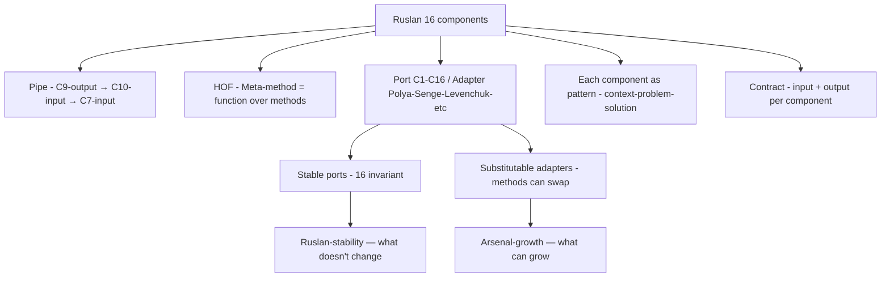

### Diagram 14 — DR-38 promotion path

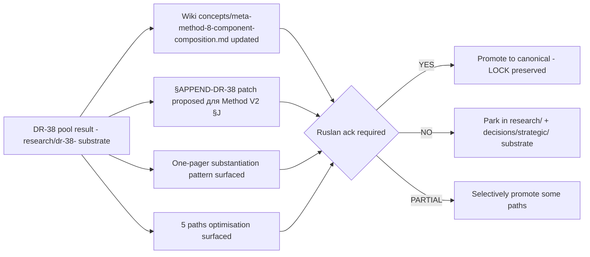

---

## §3 Diagrams summary

- 14 mermaid diagrams (mid-range of 12-18 acceptance window)
- Each diagram supports specific Phase claim
- Visual substantiation для O-121 Tier A wiki + Method V2 §J §APPEND + one-pager
- Schedrovitsky schema-thinking tradition continued (per Phase 6 §2.4)

---

*Diagrams INDEX closure 2026-05-22. 14 diagrams produced. Acceptance A-3 satisfied.*
