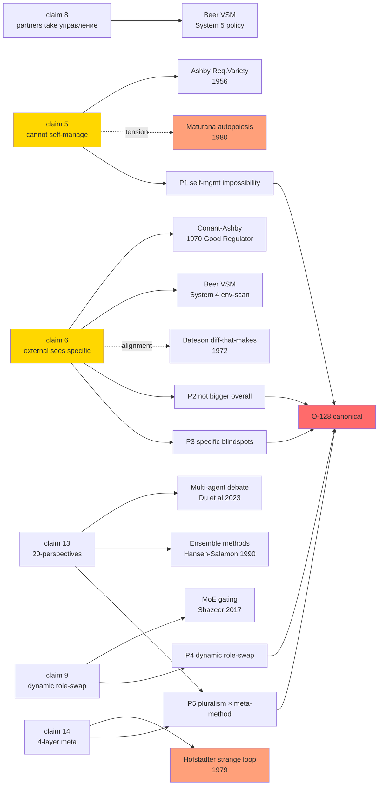
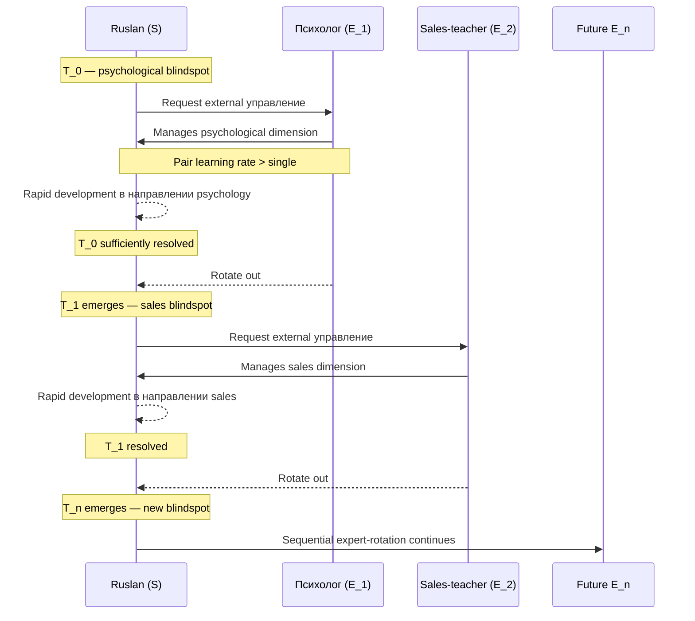

# Phase 1 — Voice decode audio_721 → cybernetic claim structure

> Цель: извлечь из audio_721 точную формулировку O-128 в форме, пригодной для cybernetic literature mapping. Verbatim claims 5/6/8/12/13/14 = primary; смежные 7/9/10/11 = operational.

---

## §1 Verbatim core (O-128 nucleus)

**Claim 5** *[src: raw/voice-memos-2026-05-22-batch/audio_721@22-05-2026_12-11-58.md L31]*:

> «⭐⭐⭐ еще важное, что я вижу, как бы система не может сама себя со стороны изнутри... важно описать что система не может сама себя сам сама собой же адекватно управлять то есть ей должен у этой системы должна быть другая управляющая система которая вот видит возможно больше ну или чуть в другом направлении»

**Claim 6** *[src: raw/voice-memos-2026-05-22-batch/audio_721@22-05-2026_12-11-58.md L33]*:

> «не и не особенно прям эта система должна быть больше во всех смыслах, и знать вот эта управляющая система больше, чем основная система. Нет. Но эта система, которая управляющая, в какой-то конкретный момент она должна знать и управлять этой системой в тех местах и в тех направлениях, где основная система не сильно шарит, или где она не может дать себе адекватную обратную связь»

**Claim 12** *[src: ibid L45]*:

> «в управлении Jetix должна быть похожая ситуация. И как раз это решает вопрос того, что система не может адекватно вокруг себя все видеть»

**Claim 13** *[src: ibid L47]*:

> «об одной ситуации. Два мнения, два метода ее решения. И потом, если посмотреть вот эти два метода решения, их можно соединить и можно получить вариант получше. Или же можно даже еще больше сделать, чтобы посмотрели на эту систему с 20 разных сторон, соответственно 20 разных методов предложили, а этих 20 разных методов предложили на основе просто еще миллионов методов, которые использовались, которые изучались вот этими людьми ранее. И все это на базе метода выбора методов»

**Claim 14** *[src: ibid L49]*:

> «адекватным подходом даже к выбору подхода, по которому будет создан подход для разработки этой системе»

---

## §2 Structural decomposition (5 propositions)

Извлекаю из voice 5 пропозиций, каждая maps на cybernetic literature:

### P1 — Self-management impossibility (Ashby-grade)

**Statement:** Управляемая система S не может адекватно управлять самой собой только изнутри.

**Voice anchor:** claim 5 «система не может сама себя со стороны изнутри... адекватно управлять».

**Cybernetic mapping:** Ashby Requisite Variety (1956 §11/5) — для того чтобы регулятор R справлялся с возмущениями D на выходе T, должно выполняться: $V(R) \geq V(D)$, где $V$ = variety (количество различимых состояний). Если регулятор = подмножество системы, его variety ≤ system variety, и недостаточен для регулирования полного множества возмущений. См. Phase 2 §1 deep dive [src: Ashby 1956].

### P2 — External system not bigger overall

**Statement:** Внешняя управляющая система E не обязана быть «больше» (variety-wise) основной системы S во всех направлениях; E видит больше только в специфических moments/directions.

**Voice anchor:** claim 6 «не особенно прям эта система должна быть больше во всех смыслах... в каком-то конкретный момент она должна знать и управлять этой системой в тех местах и в тех направлениях, где основная система не сильно шарит».

**Cybernetic mapping:** Conant-Ashby «Every Good Regulator» theorem (1970) — регулятор должен моделировать ту часть системы, которой управляет, не всю систему. Связано с Beer VSM System 4 (environment-scanning) — System 4 наблюдает specific external environment слой, который System 1/2/3 не видят напрямую [src: Conant-Ashby 1970; Beer 1972].

### P3 — Specific blindspot territories

**Statement:** У S есть «territories» (moments × directions × competence areas) где S не может получить адекватную обратную связь от себя. E компетентен именно в этих territories.

**Voice anchor:** claim 6 «в тех местах и в тех направлениях, где... не может дать себе адекватную обратную связь».

**Cybernetic mapping:** Bateson «difference that makes a difference» (1972) + Polanyi tacit dimension (1966) — есть классы differences которые система embedded в, не может различить (например, вкус воды для рыбы). Внешний наблюдатель различает то, что для внутреннего инвариантно [src: Bateson 1972; Polanyi 1966].

### P4 — Dynamic role-swap by task-context

**Statement:** При смене task T → T' внешний оперант E_T заменяется на E_{T'} (sequential expert-rotation).

**Voice anchor:** claim 9 «другая задача появляются... уже например другая система управляет в решении той задачи»; claims 10-11 (psychologist → sales-teacher life-example).

**Cybernetic mapping:** Beer VSM recursive viability — на каждом уровне рекурсии System 4 environment-scanning адаптируется под относящееся к этому уровню окружение. Также MoE (Shazeer 2017) gating mechanism: routing к разным experts по signature task [src: Beer 1979; Shazeer 2017].

### P5 — Pluralism scaling × meta-method base

**Statement:** Эффект внешнего управления масштабируется через множество E_1, E_2, ..., E_n (20 perspectives × 20 methods × millions prior); композиция методов выполняется на базе мета-метода (method-of-method-selection).

**Voice anchor:** claim 13 (20-perspectives scaling); claim 14 (4-layer recursive meta-method).

**Cybernetic mapping:** Multi-agent debate (Du et al 2023) — collaborative debate агентов улучшает factuality vs single agent; Ensemble methods (Hansen-Salamon 1990) — committee dominates individual classifier когда errors decorrelated. Также Hofstadter «strange loop» recursion на уровне выбора подхода [src: Du et al 2023; Hofstadter 1979; Hansen-Salamon 1990].

---

## §3 Formal restatement (O-128 candidate canonical text)

Дистилляция P1-P5 в кандидатную формулировку для Tier A wiki:

> **O-128 (cybernetic external-system principle).** Для любой управляемой системы S, осуществляющей нетривиальные внешние взаимодействия, существуют области blindspot — moments × directions × competence-territories — где S не способна сформировать адекватную обратную связь от самой себя (consequence Ashby Requisite Variety + Conant-Ashby + второпорядковой cybernetics). Для адекватного управления S требуется внешняя управляющая система E (или композиция E_1, E_2, ..., E_n), которая (a) видит S от внешней точки наблюдения, (b) компетентна именно в blindspot territories S, (c) не обязана быть «больше» S по variety во всех направлениях. Композиция множественных E работает через мета-метод (выбор подхода) с рекурсивной глубиной ≥4 (подход → выбор подхода → подход к разработке подхода → разработка системы).

**F-G-R:**
- **F2** (voice articulation; awaiting wiki promotion).
- **G:** systems engineering / cybernetics / Jetix application.
- **R refuted if:** primary cybernetic lit противоречит механизму; ИЛИ modern AI empirics показывают, что single-system ≥ multi-system на benchmark; ИЛИ voice misattributed.

---

## §4 Operational atoms (claims 7-11 supporting)

**Claim 7** «концепция ученик и учитель... пара работает в разы лучше чем один тренер или один исполнитель» — operational: pair-learning > single-learning. Hypothesis-grade [src: ibid L35]. Cybernetic anchor: Vygotsky ZPD (1934) + Bateson «pattern that connects» — paired structure создаёт differential через что появляются «differences that make difference».

**Claim 8** «партнёры берут управление основной системой на себя где они более ответственные» — operational: partnership = external feedback layer. R12 conformance check: voluntary opt-in clause частично implicit; soft-form: «partners with relevant expertise are invited to lead in their domain» [src: ibid L37 + AUDIO-721-INSIGHTS-REPORT §7].

**Claim 9** «другая система управляет в решении той задачи» — dynamic role-swap. Sequential expert-rotation pattern [src: ibid L39].

**Claims 10-11** (psychologist → sales-teacher life-example) — Ruslan personal narrative validation: sequential E rotation корреллировала с быстрым development в соответствующих directions. **AP-6 dissent:** это N=1 personal narrative; не RCT evidence. Treatment: presents-existence-proof, not strength-of-effect [src: ibid L41-43].

---

## §5 Conformance check vs constitutional posture

| Posture | Status | Notes |
|---|---|---|
| R1 surface only | ✅ | Brigadier-scribe extracts; Ruslan = sole strategist |
| R2 hard limits | ✅ | No public-facing artifact emitted |
| R6 no aggregated memory | ✅ | Pool/append-only discipline |
| R11 blast-radius | ✅ | Research action class = low blast |
| R12 anti-extraction LOCK | ⚠️ | Claim 8 needs voluntary opt-in soften для public; flagged для Phase 9 R12 conformance pass |
| IP-1 STRICT | ✅ | E framed as abstract role, not executor binding |
| EP-5 dissent | ✅ | AP-6 atoms surfaced (§4 N=1 caveat; §6 §7 below) |
| AP-6 atoms | ✅ | Recorded inline |
| Append-only | ✅ | This is new file; no overwrites |

---

## §6 AP-6 dissent atoms (Phase 1)

1. **«Cannot self-manage» universal-claim risk.** Formulation «система не может» — strong universal. Cybernetic literature actually says: «не может handle disturbance variety exceeding regulator variety» — weaker, conditional. Phase 2 will sharpen. **Soften для public:** «systems benefit from external feedback layers, particularly где internal variety insufficient».

2. **«External system» rhetorical vs literal.** Voice использует «другая управляющая система» — может означать (a) external feedback signal, (b) external observer, (c) external full subsystem. Phase 2-4 разделяют: Ashby оперирует regulator (signal-grade), Beer оперирует viable subsystem (full system-grade), Maturana отвергает strict external-observer frame. O-128 articulation подразумевает (c) — но это самый strong claim, и наиболее уязвим.

3. **Maturana counter-thread.** Autopoiesis literature (Maturana-Varela 1980; 1987) утверждает, что наблюдатель не «внешний» — он structurally coupled, sharing medium. Это качественно меняет O-128 — Phase 4 проводит эту tension explicitly.

4. **Hofstadter strange-loop counter-thread.** GEB (1979) demonstrates, что self-reference + level-crossing создают «strange loops», которые не разрешаются добавлением external observer — они embedded constitutively. Возможно O-128 — не «нужна external», а «нужна level-crossing structure». Phase 7 распакует.

---

## §7 Mermaid diagrams

### Diagram 1.1 — Voice claim → cybernetic literature mapping

### Diagram 1.2 — Sequential expert-rotation life-example (claims 10-11)

---

## §8 Cross-refs

- **Source verbatim:** `raw/voice-transcripts/audio_721@22-05-2026_12-11-58.txt`
- **5-cell:** `raw/voice-memos-2026-05-22-batch/audio_721@22-05-2026_12-11-58.md`
- **Parent insights:** `decisions/strategic/AUDIO-721-INSIGHTS-REPORT-2026-05-22.md`
- **Phase 0 master index:** `00-MASTER-INDEX.md`
- **Next:** Phase 2 — Ashby Requisite Variety deep dive

---

*Phase 1 closure 2026-05-22. O-128 nucleus extracted. P1-P5 propositions mapped to cybernetic literature. Strange-loop / autopoiesis tensions flagged. R1 — Ruslan = sole strategist for canonical wiki promotion.*
