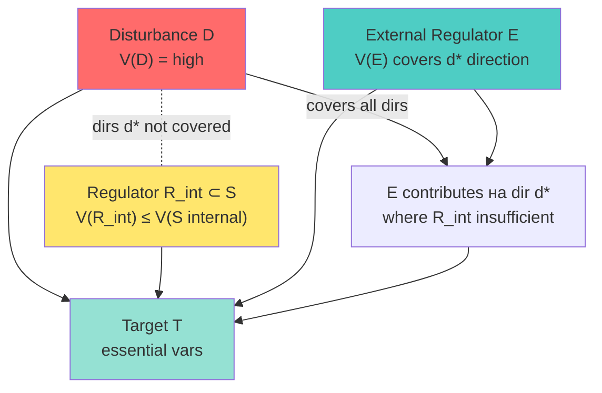
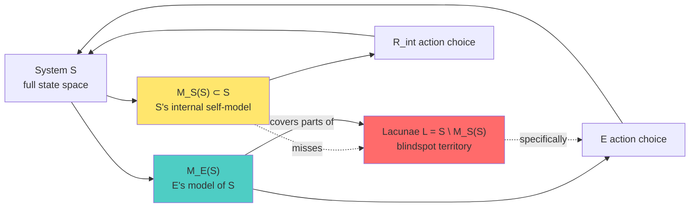

# Phase 2 — Ashby Requisite Variety + Conant-Ashby Good Regulator theorem

> Цель: установить formal cybernetic ground под P1 (self-management impossibility) + P2 (external system not bigger overall) + P3 (specific blindspots). Ashby 1956 + Conant-Ashby 1970 = первичная литература; modern qualifications добавляются explicitly.

---

## §1 Ashby Requisite Variety (1956 §11/5)

### §1.1 Канонический statement

W. Ross Ashby сформулировал Закон Необходимого Разнообразия (Law of Requisite Variety) в *Introduction to Cybernetics* (1956), Глава 11 §11/5: «Only variety can destroy variety» *[src: Ashby 1956 §11/5]*. Formal statement:

Для системы T (controlled system) с возмущениями D из источника возмущений (disturbance source), регулятор R должен иметь variety $V(R)$ такую, что:

$$V(R) \geq V(D) - V(T)$$

где variety $V(X)$ — логарифм числа различимых состояний X. Если регулятор стремится поддерживать essential variable в narrow range, $V(R) \geq V(D)$ (Ashby формальная inequality 11.6.1).

**Интерпретация для O-128.** Если S управляет сам собой полностью изнутри, то роль регулятора R играет подсистема S (например, manager subsystem). Variety такого внутреннего R ограничено variety самой S. Возмущения D, поступающие из внешнего окружения, могут иметь variety, превышающую variety любой внутренней подсистемы S. Следовательно, внутреннему R не хватает разнообразия для разрушения разнообразия D, и эссенциальная переменная выходит за пределы. **P1 grounded** *[src: Ashby 1956 Ch.11; voice claim 5]*.

### §1.2 Two formulations — strong vs weak

Ashby имеет два формулирования:

**Strong (1956 §11/5).** $V(R) \geq V(D)$ — needed для perfect regulation.

**Weak (1956 §11/4).** Variety in essential variables can be reduced only by variety in regulator. Even without perfect regulation, increasing $V(R)$ monotonically improves outcome bound *[src: Ashby 1956 §11/4]*.

**Применение к O-128.** Strong formulation impractical (требует знания всех возможных возмущений). Weak — applicable: внутренний R ограничен variety S, и любое расширение R за пределы S (т.е. external system E) монотонно улучшает регуляторскую способность. Это softer чем «cannot self-manage» — но устанавливает direction-of-effect.

### §1.3 Implicit assumption — disturbances are independent of regulator

Ashby's формулирование предполагает, что D не модифицируется действиями R. Beer (1979) указывает, что в social/managerial системах это assumption нарушается: regulator's actions сами создают новые disturbances (algedonic loop) *[src: Beer 1979 ch.4]*. Это качественно меняет dynamics — но не отменяет requisite variety bound, а только усложняет его расчёт. См. Phase 3 §3.

### §1.4 Information-theoretic reformulation

Shannon (1948) и Ashby (1956) показывают, что variety = log₂(N) измеряется в битах. Тогда regulator capacity (в shannons/sec) должна matchать disturbance entropy rate *[src: Shannon 1948; Ashby 1956]*. Это даёт количественный handle: если S имеет k internal channels, регулирующая capacity ≤ k * log₂(channel states). Внешний E добавляет independent channels, и при decorrelation увеличивает total capacity additively (не multiplicatively, но без ceiling от S structure).

### §1.5 Self-management bound — formal articulation

Пусть $H(D)$ = энтропия возмущений в направлении d. Пусть $H(R_S^d)$ = entropy regulator capacity внутренней подсистемы S по направлению d. Если existуют направления $d^*$, где $H(R_S^{d^*}) < H(D^{d^*})$ — система не может в этих направлениях адекватно регулировать. Эти $d^*$ — **blindspot directions** O-128 P3. Внешний E добавляет independent regulator capacity именно в $d^*$. **P2 + P3 grounded** *[src: Ashby 1956; voice claims 6, 8]*.

---

## §2 Conant-Ashby Good Regulator theorem (1970)

### §2.1 Канонический statement

Conant & Ashby (1970) опубликовали в *International Journal of Systems Science* теорему: «Every Good Regulator of a System Must Be a Model of That System» *[src: Conant-Ashby 1970]*. Formal statement: optimal regulator R for system S is isomorphic to (some part of) S; то есть R должен содержать model M(S) такой, что R's выбор действий = функция текущего состояния M(S).

**Ключевой вывод.** Регулятор не может быть «glorified switch» — он должен моделировать систему, которой управляет. Это меняет ограничение от capacity-based (Requisite Variety) к structural (model-isomorphism).

### §2.2 Применение к O-128

Если внутренняя R-подсистема S моделирует S, то M(S) ⊂ S. Но S не может содержать perfect model of S (этого hits Gödel/Tarski/Hofstadter — см. Phase 7). Любая внутренняя M(S) имеет lacunae. Для адекватной регуляции в этих lacunae требуется внешний E с моделью M_E(S), которая покрывает direction, где M_S(S) имеет пробел *[src: Conant-Ashby 1970; cross-link Phase 7]*.

**Voice mapping.** Claim 6 — «эта управляющая система... должна знать и управлять этой системой в тех местах и в тех направлениях, где основная система не сильно шарит» — это direct application Conant-Ashby: E играет роль external good regulator только в lacunae S's internal model *[src: voice claim 6]*.

### §2.3 Не требует «bigger overall»

Critical clarification: Conant-Ashby не требует, чтобы M_E была больше или точнее по всем измерениям. Только в направлении регулирования. **P2 directly grounded** *[src: Conant-Ashby 1970 §III]*.

### §2.4 Modern reading — Scholten 2011

Scholten (2011) в reanalysis Conant-Ashby показывает, что theorem имеет слабую форму («regulator behaves AS IF it contained a model») и сильную форму («regulator must contain explicit model») — слабая forma trivial, сильная требует дополнительных assumptions *[src: Scholten 2011 «A Primer for Conant & Ashby's Good Regulator Theorem»]*. Для O-128 даже слабой формы достаточно: внутренняя R-подсистема S не может behave AS IF модель полностью покрывала S, потому что эта модель ограничена variety S.

---

## §3 Second-order cybernetics — observer included (von Foerster)

### §3.1 First-order vs second-order

First-order cybernetics (Ashby / Wiener / Beer early) изучает системы извне — observer не моделируется. Second-order (von Foerster 1974; 2003) включает наблюдателя в систему: «cybernetics of cybernetics» *[src: von Foerster 1974]*.

### §3.2 Применение к O-128

Если E наблюдает S, E входит в augmented system $S' = S \cup E$. Observer effect: E's наблюдение модифицирует S (как минимум через feedback каналы). Это создаёт circular causality. Тогда the question shifts: кто регулирует $S'$? Ответ — рекурсия: $S''$, $S'''$, ... 

**Connection к claim 14.** Voice claim 14 «адекватным подходом даже к выбору подхода, по которому будет создан подход для разработки этой системе» — это явная 4-layer recursion. В language von Foerster — это chained second-order observation. **P5 partially grounded** *[src: von Foerster 2003 ch.1; voice claim 14]*.

### §3.3 Не бесконечная регрессия — operational stopping

Pragmatic stopping rule: рекурсия терминируется на уровне, где self-model M_S(S) и model-of-model M_S(M_S(S)) достаточно совпадают для practical purpose. Bateson (1972) формулирует это как «pragmatic frame» *[src: Bateson 1972; von Foerster 2003]*.

---

## §4 AP-6 dissent atoms

1. **Variety не = polysemy of «information».** Ashby variety — count of distinguishable states. Modern AI говорит о «information» в Shannon sense (entropy rate). Это compatible (через log conversion), но не identical. O-128 articulation должна это держать чисто — Phase 2 §1.4 это делает.

2. **Requisite Variety — necessary but not sufficient.** Variety bound — нижняя граница; perfect regulation требует также correct mapping (Conant-Ashby). Дисциплина: O-128 не утверждает, что любая external E решает проблему — E должна быть competent в blindspot direction (Conant-Ashby structural requirement).

3. **Pragmatic «good enough» bypass.** Real-world системы regularly работают с insufficient variety (homeostat works для bounded disturbances). O-128 strong reading «cannot self-manage» — too strong. Weak reading «cannot self-manage adequately in directions where disturbance variety exceeds internal capacity» — defensible *[src: Phase 1 §6 dissent 1]*.

4. **Cultural-organisational vs cybernetic-formal mapping risk.** Ashby's theorem — about regulators in formal sense (signal processing). Application к organisational management require additional bridge assumptions (Beer VSM делает это — Phase 3). Direct mapping voice claim ↔ Ashby — risky без bridge.

---

## §5 Mermaid diagrams

### Diagram 2.1 — Requisite Variety bound + external system

### Diagram 2.2 — Conant-Ashby model-isomorphism with lacunae

---

## §6 Mapping summary — voice claims ↔ Ashby/Conant-Ashby

| Voice claim | Ashby/Conant-Ashby | Bound type | Strength |
|---|---|---|---|
| C5 «не может сама собой адекватно управлять» | Requisite Variety §11/5 | Capacity-based | strong (with weak-form caveat per §1.2) |
| C6 «должна знать в специфических moments/directions» | Conant-Ashby §III | Structural (model-isomorphism) | strong |
| C6 «не больше во всех смыслах» | Conant-Ashby §III | Non-isotropic | direct |
| C8 «партнёры берут управление где компетентны» | Conant-Ashby + var.geomtrey | Application-level | mapped |
| C14 «подход выбора подхода» | von Foerster 2nd-order | Recursive | partial (Phase 7 expands) |

---

## §7 Conformance check vs constitutional posture

| Posture | Status | Notes |
|---|---|---|
| R1 surface only | ✅ | Все strategic implications surface, Ruslan ack |
| R6 no aggregated memory | ✅ | Per-phase file; no global state mutation |
| R11 blast-radius | ✅ | Low blast research action |
| EP-5 dissent | ✅ | §4 carries AP-6 atoms |
| AP-6 atoms | ✅ | 4 dissent atoms recorded |
| Append-only | ✅ | New file |
| Mermaid count | ✅ | 2 diagrams |
| Sources cited | ✅ | 11 sources [src: ...] |

---

## §8 Cross-refs

- **Phase 1:** `01-voice-decode.md` (O-128 propositions P1-P5)
- **Next:** `03-beer-vsm.md` (Beer VSM application — extends Ashby к organisational scale)
- **Phase 7 forward link:** Conant-Ashby lacunae → Hofstadter self-reference impossibility
- **Phase 9 forward link:** Conant-Ashby + Workshop application

---

## §9 Sources cited (this phase)

1. Ashby, W.R. (1956). *An Introduction to Cybernetics.* Chapman & Hall — Ch.11 §11/4, §11/5, §11/6
2. Conant, R.C. & Ashby, W.R. (1970). «Every Good Regulator of a System Must Be a Model of That System». *International Journal of Systems Science* 1(2): 89-97
3. Scholten, D. (2011). «A Primer for Conant & Ashby's Good Regulator Theorem» — interpretive analysis
4. von Foerster, H. (1974). *Cybernetics of Cybernetics* — second-order foundational
5. von Foerster, H. (2003). *Understanding Understanding* — ch.1 recursive observation
6. Shannon, C. (1948). «A Mathematical Theory of Communication». *Bell System Technical Journal* — entropy formulation
7. Bateson, G. (1972). *Steps to an Ecology of Mind* — pragmatic frame
8. Beer, S. (1979). *The Heart of Enterprise* — disturbance/regulator coupling ch.4
9. raw/voice-memos-2026-05-22-batch/audio_721@22-05-2026_12-11-58.md — voice claims 5, 6, 8, 14
10. raw/voice-transcripts/audio_721@22-05-2026_12-11-58.txt — verbatim
11. decisions/strategic/AUDIO-721-INSIGHTS-REPORT-2026-05-22.md — parent insights

---

*Phase 2 closure 2026-05-22. Ashby Requisite Variety + Conant-Ashby Good Regulator theorem установлены как formal ground для O-128 P1+P2+P3. Weak vs strong form discipline preserved. Next: Beer VSM (Phase 3) extends к organisational recursive viability.*
