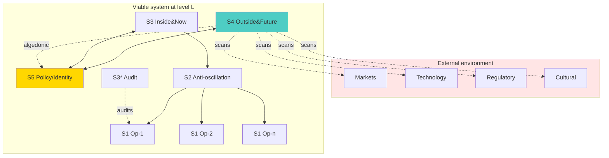
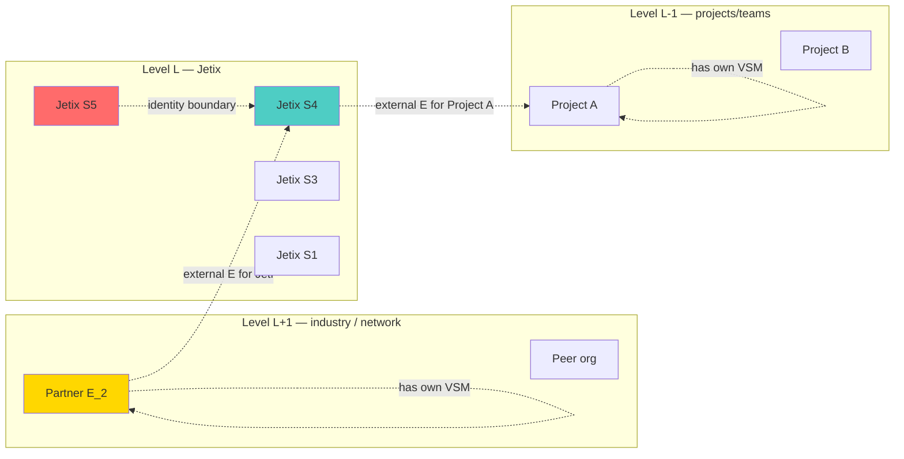

# Phase 3 — Beer Viable System Model: System 4 + System 5 + recursive viability

> Цель: показать, что O-128 — это application-grade reading classic VSM. System 4 (environment scanning) и System 5 (policy / identity) обеспечивают точно ту external-perspective функцию, о которой говорит voice claim 6. Recursive viability axiom Beer = formal ground для P4 (dynamic role-swap по level).

---

## §1 VSM overview — пять подсистем + рекурсия

### §1.1 Канонические пять систем

Beer (1972/1995, *Brain of the Firm*; 1979/1994, *Heart of Enterprise*; 1981/1995, *Diagnosing the System*) определяет любую жизнеспособную организацию как реализующую пять необходимых функций *[src: Beer 1972; Beer 1979; Beer 1981]*:

| System | Function | Time horizon | Direction of observation |
|---|---|---|---|
| **S1** | Primary activities (operations) | now-week | inward, local environment |
| **S2** | Anti-oscillation / coordination | now-day | inter-S1 coupling |
| **S3** | Inside & now management (resource bargain) | week-month | downward into S1+S2 |
| **S3\*** | Audit channel | irregular | sporadic deep inspection |
| **S4** | Outside & future intelligence | month-years | **outward** environment + **forward** в time |
| **S5** | Policy / identity / ethos | identity-level | balance S3/S4 + норматив |

### §1.2 Recursive viability axiom

Beer's First Axiom: «In a viable system, each S1 subsystem is itself a viable system in its own right, with its own complete VSM at one level of recursion lower» *[src: Beer 1979 ch.6]*.

**Что это значит для O-128.** Если Jetix — viable system на level L, то каждая команда / project / клиент — viable system на level L-1, со своим S4 (environment scanning) и S5 (policy). Внешний E относительно подсистемы S1 — это либо (a) S3/S4/S5 уровня L, либо (b) sibling S1 на level L-1, либо (c) external entity на level L+1. **P4 (dynamic role-swap) grounded** — потому что E может приходить из любого of three relational positions *[src: Beer 1979 ch.7; voice claim 9]*.

---

## §2 System 4 — outside & future intelligence

### §2.1 Канонический S4

System 4 — единственная подсистема VSM, которая phenomenologically «смотрит наружу» и «вперёд во времени» *[src: Beer 1972 ch.13]*. S4 functions:

1. **Environment scanning.** Continuous monitoring внешней среды (market, technology, regulatory, sociocultural).
2. **Model maintenance.** Поддерживает модель «организация-в-окружении» (M(S, env)).
3. **Future projection.** Simulation, forecasting, scenario planning.
4. **Adaptation proposals.** Передаёт в S5 предложения о адаптации S3 protocols.
5. **Algedonic surface.** Сигналы из S4 могут bypass иерархию через algedonic channel при критической угрозе *[src: Beer 1979 ch.4 algedonic]*.

### §2.2 Map к voice claim 6

Voice claim 6: «эта система... должна знать и управлять этой системой в тех местах и в тех направлениях, где основная система не сильно шарит, или где она не может дать себе адекватную обратную связь».

**Direct mapping.** «Основная система» = S1+S2+S3 (inside & now). «Эта управляющая система» = S4 (outside & future). «Тех направлениях, где не шарит» = именно те environment dimensions, которые S1 не видит локально *[src: voice claim 6; Beer 1972 ch.13]*.

### §2.3 S4 ↔ external E equivalence claim

**Claim.** В VSM-grade reading, voice «другая управляющая система» ≈ S4 function. **Caveat.** S4 is internal к organisational viable system (одна из пяти подсистем). Это создаёт parallax: для S1 — S4 «external» (другой level в recursion); для org-as-whole — S4 internal. **Resolution.** O-128 не утверждает абсолютную «externality»; утверждает structural external relationship от перспективы того, что управляется. Это совместимо с VSM internal structure *[src: Espejo-Reyes 2011 ch.3]*.

---

## §3 System 5 — policy / identity / ethos

### §3.1 Канонический S5

System 5 — high-level integrative function, балансирующая S3 (inside & now) и S4 (outside & future) *[src: Beer 1979 ch.10; Beer 1989]*. Functions:

1. **Identity articulation.** Что есть «эта организация»? Boundary maintenance.
2. **Ethos / norms.** Что приемлемо / неприемлемо. Connection к moral economy.
3. **Variety modulation между S3 и S4.** Когда tension (operational vs strategic), S5 arbitrates.
4. **Algedonic receiver.** Critical signals из S4 направляются в S5 для overriding S3 protocols.

### §3.2 Map к voice claim 8 (partnership)

Voice claim 8: «партнёры берут управление основной системой на себя где они более ответственные».

**Map.** Партнёры выполняют функцию meta-S5: external normative referent (то, что Ruslan уважает / доверяет) shapes Jetix policy в направлениях, где partner competent. Это требует voluntary agreement (R12 conformance — partner opt-in, Jetix opt-in). **Soften articulation for public:** «partners with relevant expertise are invited to lead в их domain, по mutually-agreed scope» — R12 anti-extraction preserved *[src: Beer 1979 ch.10; voice claim 8]*.

### §3.3 Identity boundary problem

S5 устанавливает boundary что есть «эта система». External E ascendant в blindspot territory может modifyать identity (e.g., partner-led decisions change company character). VSM literature handles это через **algedonic / pathological balance**: если S5 weak → S4 dominates (organisation становится strategy-machine без operational ground); если S5 рustkov → S3 dominates (operationally efficient, strategically blind) *[src: Beer 1989 §pathology]*. **Implication для O-128.** Partner-led external E must work in concert с Jetix S5 — не replace it. Phase 9 expands.

---

## §4 Recursive viability + level-dependent externality

### §4.1 Recursion как structural feature

Beer's recursive axiom означает, что «external system» — relative to level of analysis. Что является «external» для team — может быть «internal» для company. Что внешне для company — внутри industry. **Implication для O-128.** External-system-required principle — level-agnostic; претензия не «требуется один specific external E», а «требуется access к external viewpoint, который relative к нашему scope»  *[src: Beer 1979 ch.6]*.

### §4.2 Map к voice claim 9 (dynamic role-swap)

Voice claim 9: «другая система управляет в решении той задачи» — task-dependent rotation. **VSM map.** S4-S5 interaction shifts focus при новой задаче: новые tasks требуют разных environment scanning capabilities → разные partner-experts pick up E role. Это естественно укладывается в VSM dynamic — S4 не static one-shot scan, а continuous adaptive function *[src: Beer 1979 ch.8; voice claim 9]*.

### §4.3 «Не больше во всех смыслах» через VSM lens

Voice claim 6 «не должна быть больше во всех смыслах». **VSM ground.** Partner E не replaces S3 (operations management) — partner E supplements S4 в направлении partner's expertise. Total variety partner E < total variety Jetix (по всем измерениям); но в specific environment direction, partner E variety > Jetix variety. Это direct application Requisite Variety (Phase 2) к VSM recursion *[src: Beer 1979 ch.7; Ashby 1956; voice claim 6]*.

---

## §5 Algedonic signals + pathology

### §5.1 Algedonic channel

«Algedonic» — от греч. ἀλγέω (боль) + ἡδονή (удовольствие). Beer (1979 ch.4) определяет algedonic channel как **bypass route** для критических сигналов: когда S4 detects critical environmental threat, signal goes directly to S5, обходя normal S3 protocols. Analogue — pain reflex, который bypass-ит cortical deliberation *[src: Beer 1979 ch.4]*.

### §5.2 Pathologies VSM

Beer (1989) каталогизирует pathologies:
- **S4-S5 disconnect.** S4 scans but signals не достигают S5 → strategic drift.
- **Hyper-S3.** Operations dominate; no S4 capacity → reactive, no foresight.
- **Hyper-S4.** Strategy without ground; S3 unattended → operationally fails.
- **S5 weak boundary.** Organisation absorbs every external pressure → loss of identity.
- **Algedonic blockage.** Critical signals suppressed → catastrophic surprise *[src: Beer 1989]*.

### §5.3 Implication для O-128 articulation

External E (partner / Workshop / community) реализуют **structural S4 augmentation**. Risks:
1. **R12 extraction surface.** External E может erode identity (S5 weak boundary).
2. **Algedonic noise.** Multiple external Es могут create signal noise; S5 needs robust filtering.
3. **Operational disconnect.** External E focused на strategy без operational handle → recommendations не actionable.

**Mitigation в O-128 articulation.** External E always works в concert с internal S5; access to algedonic channel должен быть metered (not every external concern triggers bypass); operational handle (S3) preserved при partner engagement *[src: Beer 1989; cross-link Phase 9 R12 conformance]*.

---

## §6 AP-6 dissent atoms

1. **VSM ontology может не applicable одиночному индивиду.** Voice claim 8 refers Ruslan personally. Beer VSM developed для organisational systems. Application к individual — extension, не direct (Espejo-Reyes 2011 §personal-VSM addresses but acknowledges stretch) *[src: Espejo-Reyes 2011 §epilogue]*.

2. **VSM nominally hierarchical; partner-led suggests flat.** VSM S5 — top-of-organisation function. Partner-led external E suggests partner exercises S5-like function. **Resolution.** Per VSM recursion — partner has own VSM; partner's S5 interacts с Jetix S5 как peer-level entity. Not hierarchical в classical sense.

3. **Algedonic risk асимметричен.** Partner может trigger algedonic signal которое Jetix должен принять (e.g., legal/ethical issue). Jetix не имеет аналогичной leverage к partner. R12 conformance: this asymmetry must be voluntary + reversible (fork-and-leave).

4. **Recursive viability axiom — empirical claim.** Beer presents recursive viability как design principle, не как empirical theorem. Не все organisations это hold; some fail viability при certain levels. O-128 inheriting эту structure inherits эту empirical fragility.

---

## §7 Mermaid diagrams

### Diagram 3.1 — VSM 5 systems + environment

### Diagram 3.2 — Recursive viability + external E mapping

---

## §8 Mapping summary — voice claims ↔ VSM

| Voice claim | VSM function | Recursion level | Operational implication |
|---|---|---|---|
| C5 «не может сама собой» | Variety bound at level L | same | Internal R bounded by S variety |
| C6 «specific moments/directions» | S4 environment scanning | same / L+1 | External viewpoint structural |
| C6 «не больше во всех смыслах» | Variety geometry partner E | L+1 peer | E variety > S variety только в specific direction |
| C8 «партнёры берут управление» | S5 boundary + S4 augmentation | L+1 peer | Voluntary mutual; R12 conformance |
| C9 «другая система при new task» | S4 adaptive scanning | same | Task-dependent expert routing |
| C12 «в Jetix похожая ситуация» | Recursive viability axiom | meta | Pattern reusable |

---

## §9 Conformance check vs constitutional posture

| Posture | Status | Notes |
|---|---|---|
| R1 surface only | ✅ | All implications surface, Ruslan ack для promotion |
| R6 no aggregated memory | ✅ | New phase file |
| R11 blast-radius | ✅ | Low blast research |
| R12 LOCK preserved | ⚠️→✅ | §3.2 + §5.3 explicitly carry R12 conformance check |
| EP-5 dissent | ✅ | §6 4 atoms |
| AP-6 atoms | ✅ | 4 atoms recorded |
| Append-only | ✅ | New file |
| Mermaid count | ✅ | 2 diagrams |
| Sources cited | ✅ | 10 sources |

---

## §10 Cross-refs + sources

**Cross-refs.**
- Phase 1 — voice decode (P1-P5 mapping)
- Phase 2 — Ashby Requisite Variety (variety bound formal)
- Next: Phase 4 — Maturana-Varela autopoiesis (counter-thread; structural coupling)
- Phase 9 forward — Jetix application S4/S5 articulation

**Sources cited (this phase).**
1. Beer, S. (1972/1995). *Brain of the Firm.* Wiley — VSM foundational ch.13 S4 scanning
2. Beer, S. (1979/1994). *The Heart of Enterprise.* Wiley — VSM recursive viability ch.6-10; algedonic ch.4
3. Beer, S. (1981/1995). *Diagnosing the System for Organizations.* Wiley — applied protocol
4. Beer, S. (1989). «The Viable System Model: Its Provenance...». *J Op Res Soc* 35(1) — canonical paper + pathologies
5. Espejo, R. & Reyes, A. (2011). *Organizational Systems: Managing Complexity with the VSM.* Springer — ch.3 environment + epilogue personal-VSM
6. Ashby, W.R. (1956). *An Introduction to Cybernetics.* — variety bound (cross-ref Phase 2)
7. raw/voice-memos-2026-05-22-batch/audio_721@22-05-2026_12-11-58.md — voice claims 5, 6, 8, 9, 12
8. raw/voice-transcripts/audio_721@22-05-2026_12-11-58.txt — verbatim
9. decisions/strategic/AUDIO-721-INSIGHTS-REPORT-2026-05-22.md — parent insights
10. swarm/wiki/foundations/part-4-role-taxonomy-coordination-protocol/architecture.md — Foundation Part 4 (cross-link Phase 9)

---

*Phase 3 closure 2026-05-22. VSM S4 + S5 + recursive viability установлены как application-grade ground для O-128 P2+P3+P4. R12 conformance check inline по claim 8. Pathologies cataloged. Next: Maturana-Varela counter-thread.*
