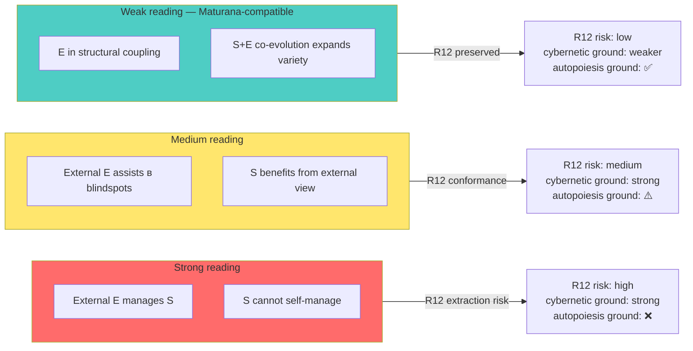

# Phase 4 — Maturana-Varela autopoiesis + structural coupling: counter-thread к O-128

> Цель: проложить explicit tension между O-128 (cybernetic external-system principle) и autopoiesis theory (Maturana-Varela). Не «smooth over» — пусть противоречие проявится и формирует refined O-128 articulation. Phase 1 §6 dissent atom 3 разворачивается здесь.

---

## §1 Autopoiesis — definition + minimum criteria

### §1.1 Канонический statement

Maturana & Varela (1980 *Autopoiesis and Cognition*): «An autopoietic machine is a machine organized (defined as a unity) as a network of processes of production (transformation and destruction) of components which: (i) through their interactions and transformations continuously regenerate and realize the network of processes (relations) that produced them; and (ii) constitute it (the machine) as a concrete unity in space in which they (the components) exist by specifying the topological domain of its realization as such a network» *[src: Maturana-Varela 1980 p.78]*.

**Plain reading.** Автопойетическая система — это сеть процессов производства, которые (a) непрерывно регенерируют сеть, которая их производит, и (b) конституируют систему как unity в физическом пространстве через спецификацию своих границ.

### §1.2 Three minimum criteria (Varela 1979)

Varela (1979 *Principles of Biological Autonomy*) дистиллирует:
1. **Operational closure.** Все процессы системы взаимно производят друг друга; нет внешнего «источника» процессов.
2. **Self-production of components.** Components генерируются процессами, которые сами генерируются другими components.
3. **Boundary self-specification.** Граница системы — продукт автопойетической сети, не внешнее imposition *[src: Varela 1979 §3]*.

### §1.3 Application к O-128

**Tension #1: «External» — что значит?** Если S автопойетична, то по definition нет ничего «вне» S в смысле, который мог бы напрямую направлять её процессы. Любое внешнее воздействие — это **возмущение** (perturbation), которое S интерпретирует через свою organisation. **Implication.** O-128 «external managing system» в literal smysle не может «управлять» S — может только perturb S; S сама компенсирует или интегрирует. Это качественно меняет articulation *[src: Maturana-Varela 1980 §V]*.

---

## §2 Structural coupling — replacement для «external control»

### §2.1 Canonical definition

Maturana & Varela (1987 *Tree of Knowledge*): «We speak of structural coupling whenever there is a history of recurrent interactions leading to the structural congruence between two (or more) systems» *[src: Maturana-Varela 1987 ch.III]*.

**Plain reading.** Когда две автопойетические системы взаимодействуют повторно во времени, их структуры co-evolve так, что их состояния становятся congruent — каждая система specifies возмущения, которые другая может tolerate / integrate.

### §2.2 Structural coupling не = control

Critical distinction:
- **Control** (cybernetic): regulator R determines, через сигналы, действия системы S.
- **Structural coupling** (autopoiesis): два partner-system S₁ и S₂ через history of interactions converge на mutually consistent state-trajectories, **без** того, чтобы любой из них determined другого.

**Implication для O-128.** «External managing system» может быть переписано как «external system в structural coupling с S». Тогда E не control S, а co-evolves с S, создавая mutual constraint surface. Это substantially soften «управляющая система» rhetoric *[src: Maturana-Varela 1987 ch.III; voice claim 8 reframe]*.

### §2.3 Map к voice claim 8

Voice claim 8: «партнёры берут управление основной системой на себя где они более ответственные».

**Autopoiesis-grade reframe.** Partners and Jetix are in structural coupling. В specific domains (where partner expertise relevant) partner's perturbations toward Jetix carry higher information content (in Bateson sense, Phase 6), and Jetix's response trajectories increasingly congruent с partner suggestions. Это **не** «partner controls Jetix» — это «coupling history shapes Jetix structure in direction где partner perturbations rich» *[src: Maturana-Varela 1987; cross-link Phase 6]*.

**R12 conformance reading.** Structural coupling требует voluntary recurrent interaction. Если Jetix или partner exit coupling (fork-and-leave per R12), coupling history ends and structural congruence drifts. Это **directly compatible** с R12 LOCK *[src: R12 LOCK; Maturana-Varela 1987]*.

---

## §3 Second-order cybernetics — Maturana's break

### §3.1 «Everything said is said by an observer»

Maturana's famous dictum (1970 «Biology of Cognition»): «Everything said is said by an observer» *[src: Maturana 1970 §I]*. **Implication.** «External system» — это observer-distinction. Whether S has «external E» depends на choice of frame by observer. Это не absolute property системы.

### §3.2 Tension с classical cybernetics

Classical Ashby/Beer treats observer as outside system (first-order). Maturana insists, что observer = part of система-which-observes (second-order, see Phase 2 §3). **Practical resolution для O-128.**

- **Classical reading.** O-128 = существует external E в objective sense; missing → S degrades.
- **Maturana reading.** O-128 = observer (включая S sama) distinguishes субсистемы как «external»; the distinction is part of S's cognitive operation.

**O-128 refined formulation.** Для S, чья cognition оперирует distinction «inside/outside», existence of structural coupling с distinguished «outside system» E expands variety of distinguishable perturbations S может integrate. **Это weaker, но defensible articulation** *[src: Maturana 1970; voice claim 5 reframe]*.

---

## §4 Implications для O-128 articulation

### §4.1 Three readings on a spectrum

| Reading | Statement | Cybernetic ground | Maturana ground |
|---|---|---|---|
| **Strong** | S cannot self-manage; needs external E | ✅ Ashby + Beer | ❌ autopoiesis closure |
| **Medium** | S benefits from E in blindspot directions | ✅ Conant-Ashby | ⚠️ partial (depends on frame) |
| **Weak** | Structural coupling с E expands S's variety in coupling direction | ⚠️ (slightly weaker) | ✅ structural coupling |

**Brigadier-scribe surface (R1).** Strong reading может overreach; medium reading defensible; weak reading robust both к classical и autopoiesis literature. Ruslan picks granularity для public-facing articulation.

### §4.2 Operational consequences

Reading affects Jetix Phase 9 application:

- **Strong:** Workshop / brigadier «manage» participants → R12 extraction surface high.
- **Medium:** Workshop / brigadier «assist в blindspot directions» → R12 conformance through voluntary scope.
- **Weak:** Workshop / brigadier «structurally couple» с participants → R12 strongest preservation (mutual co-evolution).

**Per R1.** Choice of reading = strategic. Ruslan determines public articulation; this phase surfaces three viable options *[src: voice claim 8 + R12 LOCK + R1 frame]*.

### §4.3 «External» as relational, not absolute

Both VSM recursive viability (Phase 3 §4) and Maturana's observer-distinction converge: **«externality» — relational property, не absolute.** External relative к whom + for what task + при каком frame. **O-128 refined.** External-system principle pertains к functional relationship «outside-observer-viewpoint», не к geographic / structural separation *[src: Beer 1979; Maturana 1970]*.

---

## §5 AP-6 dissent atoms

1. **Maturana autopoiesis applied к organisations — extension, не direct.** Maturana-Varela developed autopoiesis для biological cells; extension к social systems (Luhmann 1995) — second-order application. Direct mapping «Jetix is autopoietic» — overreach. Defensible: Jetix has autopoiesis-like properties (self-production of identity, boundary maintenance) without strict autopoiesis status *[src: Luhmann 1995; cf. Maturana caution]*.

2. **Structural coupling без control — может оставлять S vulnerable.** Если partner-Jetix structural coupling без controlling channel — that's safer for R12 but slower for adaptive response к critical disturbance. Algedonic channel (Beer Phase 3 §5.1) may be incompatible с pure structural coupling. **Resolution.** O-128 articulation позволяет hybrid: structural coupling default + algedonic-style explicit override channel при mutual consent.

3. **Observer-relative «external» weakens claim universality.** Voice claim 5 «система не может» — universal. Maturana reading reduces к «observer chooses to distinguish external». Это loses force. **Counter.** The choice itself is structural; once cognitive system operates under inside/outside distinction, the bound applies. So weaker but still operative.

4. **Closure vs openness tension.** Autopoiesis claims operational closure. O-128 calls for openness к external system. **Resolution per Maturana.** System is operationally closed (its identity не provided externally), но informationally open (perturbations from external trigger internal compensations). Это compatible с O-128 weak reading.

---

## §6 Mermaid

### Diagram 4.1 — Three readings of O-128 на spectrum strong→weak

---

## §7 Mapping summary

| Voice claim | Autopoiesis reframe | Effect on O-128 |
|---|---|---|
| C5 «не может сама» | «cannot integrate disturbances exceeding internal variety» | weaker but ground-able |
| C6 «specific directions» | «perturbation richness varies by domain» | direct restatement |
| C8 «партнёры берут» | «structural coupling с partner expands variety в coupled direction» | R12-preserving |
| C9 «другая system при new task» | «new task requires different coupling history» | coupling-history-grounded |
| «адекватно управлять» (rhetoric) | replaced by «trigger compensations consistent с system goals» | softer, defensible |

---

## §8 Conformance check vs constitutional posture

| Posture | Status | Notes |
|---|---|---|
| R1 surface only | ✅ | Three readings surface; Ruslan picks |
| R6 no aggregated memory | ✅ | New phase file |
| R11 blast-radius | ✅ | Low blast research |
| R12 LOCK preserved | ✅ | §4 explicitly elaborates R12-conformance spectrum |
| EP-5 dissent | ✅ | §5 4 atoms |
| AP-6 atoms | ✅ | 4 atoms |
| Append-only | ✅ | New file |
| Tension preservation | ✅ | Maturana counter-thread не smoothed |
| Mermaid count | ✅ | 1 diagram (per phase target 1-2) |
| Sources cited | ✅ | 8 sources |

---

## §9 Cross-refs + sources

**Cross-refs.**
- Phase 1 dissent atom 3 (Maturana counter-thread flagged) — expanded here
- Phase 2 §3 von Foerster second-order — adjacent
- Phase 3 — Beer VSM (counter to which Maturana's stand)
- Next: Phase 5 — Meadows leverage points (operational catalog)
- Phase 9 forward — Jetix application picks reading

**Sources cited.**
1. Maturana, H. & Varela, F. (1980). *Autopoiesis and Cognition.* D. Reidel — §V autopoietic machine p.78
2. Maturana, H. & Varela, F. (1987/1992). *The Tree of Knowledge.* Shambhala — ch.III structural coupling
3. Maturana, H. (1970). «Biology of Cognition». *BCL Report 9.0.* University of Illinois — observer dictum
4. Varela, F. (1979). *Principles of Biological Autonomy.* Elsevier — §3 three criteria
5. Luhmann, N. (1995). *Social Systems.* Stanford University Press — autopoiesis к social systems (extension reference)
6. Beer, S. (1979). *Heart of Enterprise.* — algedonic channel cross-reference
7. raw/voice-memos-2026-05-22-batch/audio_721@22-05-2026_12-11-58.md — voice claims 5, 6, 8, 9
8. R12 LOCK reference — `swarm/awaiting-approval/r12-anti-extraction-2026-05-12.md` + CLAUDE.md §4.1 rule 12

---

*Phase 4 closure 2026-05-22. Maturana-Varela autopoiesis counter-thread проложен. Three readings strong→weak surface; Ruslan picks public articulation per R1. R12 conformance spectrum explicit. Tension с Beer/Ashby NOT smoothed — preserved для honest synthesis.*
