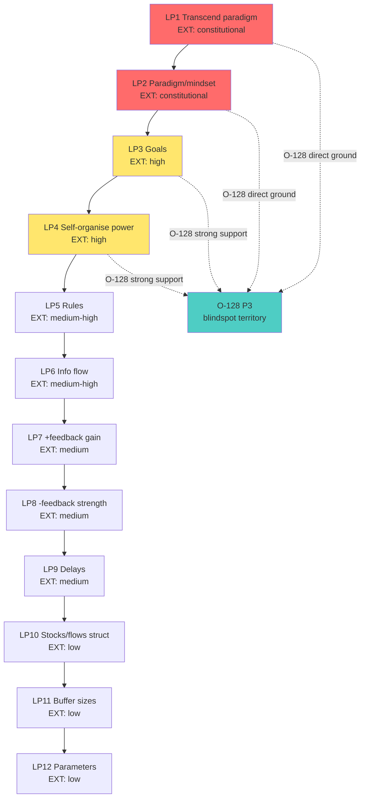

# Phase 5 — Meadows 12 leverage points + feedback-from-outside

> Цель: каталогизировать leverage points Meadows и идентифицировать, какие из них (a) требуют external-system perspective, (b) реализуются через external-system intervention, (c) недоступны for endogenous reform. Это даёт operational handle для O-128 P3 (specific blindspots) и P4 (dynamic role-swap).

---

## §1 12 leverage points — canonical ordering

Donella Meadows (1999 «Leverage Points: Places to Intervene in a System» Sustainability Institute paper; 2008 *Thinking in Systems*) сформулировала 12 leverage points в **порядке возрастания leverage**, от слабых к сильным *[src: Meadows 1999; Meadows 2008 ch.6]*:

| # | Leverage point | Strength | External-perspective requirement |
|---|---|---|---|
| 12 | Constants, parameters, numbers (e.g., subsidies, taxes) | low | usually internal |
| 11 | Sizes of buffers / stocks | low | usually internal |
| 10 | Structure of material stocks and flows | low | usually internal |
| 9 | Lengths of delays | medium | needs external timing view |
| 8 | Strength of negative feedback loops | medium | requires loop visibility |
| 7 | Gain around positive feedback loops | medium | requires loop visibility |
| 6 | Structure of information flows | medium-high | **often external — who has access** |
| 5 | Rules of the system (incentives, punishments, constraints) | high | external surface common |
| 4 | Power to add, change, evolve, or self-organize system structure | high | **constitutionally external boundary** |
| 3 | Goals of the system | very high | **identity-level — boundary problem** |
| 2 | Mindset / paradigm out of which system arises | very high | **external observer to recognise paradigm** |
| 1 | Power to transcend paradigms | highest | requires beyond-paradigm vantage |

---

## §2 Which leverage points require external perspective?

### §2.1 Categorisation

Meadows herself notes that **higher-leverage points are inherently harder for system to address from within** *[src: Meadows 1999 §closing]*. Bridging к O-128:

**Group A — typically endogenously addressable (LP12-LP10).** Parameters, buffers, flow structure — могут tune изнутри. External E helpful, не требуется.

**Group B — visibility-dependent (LP9-LP7).** Delays, loops — требуют system-level visibility. Endogenous if S has S4-like environment scanning capacity (Beer Phase 3); **otherwise external visibility helpful**. Often what consultants / coaches provide.

**Group C — flow-of-information (LP6).** **Often external surface.** Who has access к what data, who-talks-to-whom topology — exposed and reshaped by external observers more easily, поскольку insiders take topology for granted.

**Group D — rules / power / goals (LP5-LP3).** **External anchor common.** Rules embedded в legal/social/contractual surfaces typically external (governments, contracts с partners, market norms). Power to change structure (LP4) often requires external authority. Goals (LP3) — identity-defining; system rarely re-examines without external trigger.

**Group E — paradigm (LP2, LP1).** **External vantage constitutionally required.** Paradigm = unconscious assumption set. Internal system uses paradigm to think; cannot think *about* paradigm without external reference. Highest-leverage, hardest-to-access — это direct ground для O-128 P3 strongest reading *[src: Meadows 1999 LP2; cf. Kuhn 1962 paradigm shifts]*.

### §2.2 Application к voice claims

| Voice claim | Most-relevant LP | External-perspective requirement |
|---|---|---|
| C5 «не может сама себя» | LP2 (paradigm) + LP3 (goals) | constitutional |
| C6 «specific directions» | LP6 (info flow) + LP9 (delays) | strong |
| C8 «партнёры берут управление» | LP4 (power to change structure) + LP5 (rules) | strong |
| C13 «20 perspectives» | LP1 (paradigm transcend) + LP2 (paradigm) | constitutional |
| C14 «выбор подхода» | LP1 (transcend) | constitutional |

**Implication.** Highest-leverage points (LP1-LP3) каноничны для O-128 — именно те domains, где endogenous reform structurally hardest. **P3 directly grounded в Meadows literature** *[src: Meadows 1999; voice claim 5-6-13-14]*.

---

## §3 Feedback-from-outside — specific Meadows formulations

### §3.1 LP8 negative feedback strength

Meadows (2008 ch.6 LP8): «The strength of the feedback loop is critical relative to the impact it's trying to correct». **Important detail.** Self-correcting loop requires (a) signal, (b) channel, (c) capacity to respond. **External system contributes по часам, где endogenous signal weak.** Example: organisation's quality issues — internal QA может report; external customer feedback adds independent signal with different bias structure *[src: Meadows 2008 LP8]*.

### §3.2 LP6 information flow

Meadows (1999 LP6): «There is a systematic tendency on the part of human beings to avoid accountability for their own decisions». **Critical claim.** Endogenous information flow shaped by accountability-avoidance gradient. **External observer's information flow** не subject к этому gradient (или subject к different gradient). **Effect.** Adding external info flow channel (e.g., external auditor, external advisor) corrects systemic distortion *[src: Meadows 1999 LP6]*.

### §3.3 LP2 paradigm — most relevant to O-128

Meadows (1999 LP2): «The mindset or paradigm out of which the system — its goals, structure, rules, delays, parameters — arises». **Key for O-128.** Paradigm shifts «happen in personal lives… in the consciousness of one person and gradually spread… external impetus needed». Meadows explicitly: «You keep pointing at the anomalies and failures in the old paradigm. You keep speaking and acting, loudly and with assurance, from the new one. You insert people with the new paradigm in places of public visibility and power» *[src: Meadows 1999 LP2 closing paragraph]*.

**Direct map к O-128.** «Inserting people with new paradigm в places of visibility» = external E entering system to shift paradigm. Voice claim 13 «20 perspectives» = paradigm pluralism — exactly Meadows's LP1 + LP2 *[src: Meadows 1999 LP2 + LP1; voice claim 13]*.

---

## §4 Counter-example: when internal can address high-leverage

Не каждая high-leverage intervention требует external. **Counter cases:**

1. **LP3 internal goal revision.** Если организация имеет robust S5 (identity function per VSM Phase 3), может revise goals endogenously. Beer's VSM specifies этот mechanism.

2. **LP2 paradigm self-recognition.** Sometimes individuals recognize own paradigm (через crisis, contemplative practice, deep study). Bateson's «double bind» (1972) — example, где stuck в paradigm trigger meta-recognition.

3. **LP4 self-organisation.** Living systems demonstrate endogenous structural reorganisation (Kauffman 1995 autocatalytic sets) — though external triggers usually present.

**Counter-implication.** O-128 articulation не «cannot ever», but «typically blocked from within»; external E increases probability + speeds the process *[src: Meadows 2008 LP4; Kauffman 1995; Bateson 1972]*.

---

## §5 Operational catalog — external feedback channels

Из Meadows + Senge (1990) + Sterman (2000) каталогизирую external feedback channels по leverage range:

| Channel | Leverage range | External character | Examples |
|---|---|---|---|
| External audit (financial, ops, security) | LP12-LP10 | direct external | Big 4 audit, security pentest |
| External benchmarking | LP9-LP8 | partial external | Industry reports, KPI benchmarks |
| Customer feedback / NPS | LP8-LP6 | partial external | Surveys, support tickets |
| Independent advisor / consultant | LP6-LP4 | strong external | McKinsey, специализированный consultant |
| Board / partnership | LP5-LP3 | structural external | Board of directors, joint ventures |
| Coach / mentor (personal) | LP3-LP1 | constitutional external | One-on-one mentorship, Workshop |
| Peer community | LP2-LP1 | distributed external | Mastermind, professional community |
| Crisis / market shock | LP2-LP1 | involuntary external | Recession, regulatory shift |

**Implication для Jetix application (Phase 9).** Workshop (Mastermind / Workshop) sits в LP3-LP1 range — exactly the highest-leverage zone, где external constitutionally required *[src: Meadows 1999; Senge 1990 ch.7; Sterman 2000 ch.21]*.

---

## §6 AP-6 dissent atoms

1. **Meadows ranking — empirical claim под-supported.** Meadows основано на her experience с system dynamics modelling; full RCT validation отсутствует. Ranking «paradigm > goals > rules» — defensible но не proven. O-128 не должен hang на precise ordering.

2. **«External» в Meadows — informal.** Meadows не использует «external» как strict concept; пишет о «outside the system» в loose sense. Mapping к cybernetic «external system» — careful — Meadows refers к **vantage**, не к full subsystem.

3. **LP1 paradigm-transcendence — mystical reach.** Meadows LP1 «power to transcend paradigms» drifts in philosophical / contemplative territory. Hard к operationalise. O-128 application Phase 9 — careful не overpromise paradigm-transcendence через Workshop.

4. **Self-organisation counter (Kauffman).** Living systems do exhibit endogenous high-leverage reorganisation. O-128 strong reading overlooks это; medium/weak readings accommodate.

---

## §7 Mermaid

### Diagram 5.1 — 12 leverage points + external-perspective requirement

---

## §8 Mapping summary

| Voice claim | Meadows LP | External-requirement | O-128 proposition supported |
|---|---|---|---|
| C5 «не может сама» | LP2 + LP3 | constitutional | P1 + P3 |
| C6 «specific directions» | LP6 + LP9 | strong | P3 |
| C8 «партнёры берут» | LP4 + LP5 | strong | P2 + P3 |
| C9 «новая задача → новая система» | LP6 + LP4 task-shift | medium | P4 |
| C13 «20 perspectives» | LP1 + LP2 | constitutional | P5 |
| C14 «meta-method» | LP1 | constitutional | P5 |

---

## §9 Conformance check vs constitutional posture

| Posture | Status | Notes |
|---|---|---|
| R1 surface only | ✅ | Catalog surface; Ruslan picks operational application |
| R6 no aggregated memory | ✅ | New phase file |
| R11 blast-radius | ✅ | Research low-blast |
| R12 LOCK preserved | ✅ | §5 channel catalog explicitly distinguishes voluntary (advisor/coach) from involuntary (crisis) — O-128 applies к voluntary only |
| EP-5 dissent | ✅ | §6 4 atoms |
| AP-6 atoms | ✅ | 4 atoms |
| Append-only | ✅ | New file |
| Mermaid count | ✅ | 1 diagram |
| Sources cited | ✅ | 8 sources |

---

## §10 Cross-refs + sources

**Cross-refs.**
- Phase 2 — Ashby variety; Meadows LP4 ↔ requisite variety
- Phase 3 — Beer S4 ↔ Meadows LP6 environment-scanning
- Phase 4 — Maturana counter to LP1 «transcend» as endogenous-possible
- Next: Phase 6 — Bateson «difference that makes difference» refines LP6
- Phase 9 forward — Workshop application LP3-LP1 zone

**Sources cited.**
1. Meadows, D. (1999). «Leverage Points: Places to Intervene in a System». *Sustainability Institute paper.* — canonical 12 LP enumeration + LP2 paradigm passage
2. Meadows, D. (2008). *Thinking in Systems: A Primer.* Chelsea Green — ch.6 leverage points elaborated
3. Senge, P. (1990). *The Fifth Discipline.* — ch.7 systems thinking + 11 laws
4. Sterman, J. (2000). *Business Dynamics.* — ch.21 system dynamics intervention
5. Kauffman, S. (1995). *At Home in the Universe.* — self-organisation counter-evidence
6. Bateson, G. (1972). *Steps to an Ecology of Mind.* — double bind paradigm-crisis
7. raw/voice-memos-2026-05-22-batch/audio_721@22-05-2026_12-11-58.md — voice claims 5,6,8,9,13,14
8. Kuhn, T. (1962). *The Structure of Scientific Revolutions.* — paradigm shift reference

---

*Phase 5 closure 2026-05-22. Meadows 12 leverage points cataloged + LP1-LP3 identified as constitutional external-requirement zone. P3 strongly grounded. Operational channel catalog (§5) sets up Phase 9 Jetix application. Counter-examples preserved (§4).*
