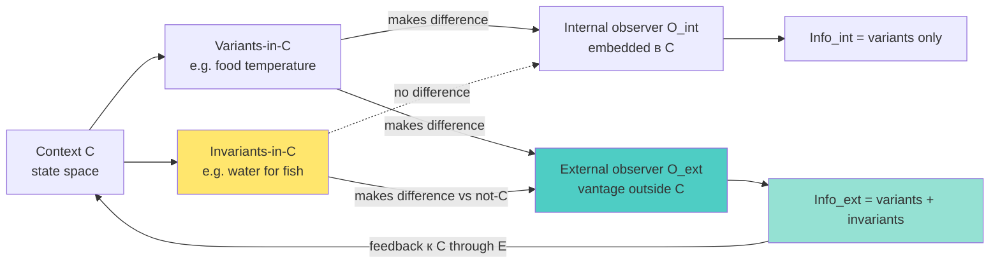

# Phase 6 — Bateson Mind-as-Environment + «difference that makes a difference»

> Цель: ввести Bateson's informational-ecology frame как philosophical underpinning для O-128 P3 (blindspot territory). «Difference that makes a difference» definition информации даёт reasoning for почему internal observer не различает то, что external различает.

---

## §1 Bateson's «difference that makes a difference»

### §1.1 Canonical statement

Bateson (1972 *Steps to an Ecology of Mind*; 1979 *Mind and Nature*): «A difference which makes a difference is what we mean by information» *[src: Bateson 1972 «Form, Substance, Difference» p.459]*.

**Plain reading.** Информация не «вещь» и не «свойство объекта». Информация — это **различие**, которое **производит различие** в receiver. Это relational, contingent definition.

### §1.2 Implication для observer-internal vs observer-external

Если observer O1 находится внутри context C, то differences, которые **invariant в C** (не varied within Object's experience), не constitute информацию для O1 — нет «difference that makes a difference». Это аналог тому, как рыба не воспринимает воду как «феномен», а homo sapiens не воспринимает gravity как event.

Observer O2 вне context C видит C-vs-not-C contrast → invariant-in-C differences становятся perceived. **Это direct ground for O-128 P3 (blindspot territory).** External observer различает то, что для internal observer constitutionally invisible *[src: Bateson 1972; voice claim 6]*.

### §1.3 Map к voice claim 6

Voice claim 6: «в тех направлениях, где основная система не сильно шарит, или где она не может дать себе адекватную обратную связь».

**Bateson reframe.** «Не может дать себе обратную связь» = differences в self-state не make difference для self-observer (адаптированы из long-term observation). External observer recognizes these differences as informational events. **Voice claim direct echoes Bateson's frame** *[src: Bateson 1972; voice claim 6]*.

---

## §2 Six criteria of mental process (Bateson 1979)

Bateson (1979 ch.IV) sets 6 criteria для «mental process»:

1. **A mind is an aggregate of interacting parts or components.**
2. **The interaction between parts of mind is triggered by difference.**
3. **Mental process requires collateral energy.**
4. **Mental process requires circular (or more complex) chains of determination.**
5. **In mental process, the effects of difference are to be regarded as transforms (i.e., coded versions) of events which preceded them.**
6. **The description and classification of these processes of transformation discloses a hierarchy of logical types immanent in the phenomena.**

*[src: Bateson 1979 «Criteria of Mental Process» ch.IV]*

### §2.1 Mind beyond skull boundary

Critical Bateson insight (1972 «Form, Substance, Difference»): «The mental world — the mind — the world of information processing — is not limited by the skin». **Implication.** Mind = the entire circuit through which differences propagate. Man-with-axe-and-tree is one mental system, не man-alone (1972 p.318). 

**Это radical reframe для O-128.** «External system» не truly external к S's «mind» — если S's cognition extends through external feedback circuits, then «external E» is part of extended cognitive system. Это **strengthens** O-128 P2 (E не «bigger overall») by reading: E is **part of S's extended mind**, не separate entity *[src: Bateson 1972 p.317-318]*.

---

## §3 «Pattern that connects» — Mind and Nature

### §3.1 Pattern criterion

Bateson (1979 *Mind and Nature: A Necessary Unity*): «What pattern connects the crab to the lobster and the orchid to the primrose and all four of them to me? And me to you?» *[src: Bateson 1979 p.8]*.

**Reading.** Знание = recognition of pattern across instances. Pattern recognition requires multiple instances (variety). Single observer with single internal viewpoint sees limited instances; multiple observers add instances. **Voice claim 13 «20 perspectives» = direct application.**

### §3.2 Map к voice claim 13

Voice claim 13: «можно даже еще больше сделать, чтобы посмотрели на эту систему с 20 разных сторон, соответственно 20 разных методов предложили».

**Bateson reframe.** 20 разных observers = 20 differential lenses → patterns invisible from any single lens become recognisable across the set. «20 perspectives» не simply «more data», but **structural sample of differential observation points**, через which patterns emerge. **P5 grounded** *[src: Bateson 1979; voice claim 13]*.

---

## §4 Double bind — paradigm trap from inside

### §4.1 Double bind theory

Bateson et al. (1956) «Towards a Theory of Schizophrenia» introduce «double bind»: a situation где (a) subject receives contradictory injunctions at different logical levels, (b) subject cannot exit the situation, (c) subject cannot comment on the contradictory injunctions *[src: Bateson 1956]*.

### §4.2 Implication for O-128

Double bind illustrates how **internal system stuck в configuration where self-modification is structurally blocked**. To exit, system needs:
- (a) external observer to **notice** the bind
- (b) external authority to **legitimize commenting on** the bind
- (c) external context where exit is possible

**Bateson's clinical observation:** patients trapped in double bind unable to self-resolve; resolution requires external (therapist) intervention precisely at meta-level — pointing out the binding structure itself *[src: Bateson 1956; Bateson 1972 ch.IV]*.

**Direct O-128 ground.** Specific kind of blindspot (logical-type confusion) requires external observer constitutionally. **P3 reinforced** *[src: Bateson 1972; voice claim 5]*.

### §4.3 Soften для R12

Double-bind reading suggests internal system may be «trapped» — sounds patronizing if applied к Jetix participants. **R12 conformance check.** Public articulation should not imply «participants are trapped without us». Reframe: «Specific structural configurations (double-binds, paradigm-binds) are inherently hard к exit from within; external collaborative observer offers value through pattern recognition at meta-level» *[src: R12 LOCK; voice claim 8 R12 soften]*.

---

## §5 Ecology of mind — distributed cognition precursor

### §5.1 Bateson as precursor

Bateson (1972, 1979) anticipates distributed-cognition thesis (Hutchins 1995 *Cognition in the Wild*). **Claim.** Cognition не localized в single brain; distributed across system + tools + other minds + environment. **For O-128.** «External managing system» — это formal recognition of distributed cognitive architecture. Different cognitive operations live в different places в the extended system *[src: Bateson 1972; Hutchins 1995]*.

### §5.2 Implication для articulation

If cognition distributes naturally, then O-128 strong reading «cannot self-manage» becomes weak («cognitive operations distributed по definition; some live external»). This dovetails с Phase 4 weak reading (Maturana structural coupling) — **convergence** across cybernetic, autopoietic, and ecological-of-mind frames.

---

## §6 AP-6 dissent atoms

1. **Bateson — philosophical, не empirical.** «Difference that makes difference» — definitional, не testable. Foundational philosophical move, не научное findings. O-128 inheriting это inherits philosophical character (хорошо для articulation, но не для quantitative claims).

2. **«Mind extends beyond skull» — contested.** Adams & Aizawa (2008) и др argue against extended-mind thesis на grounds Mark-mark vs Bonafide cognition. O-128 не requires hard extended-mind position; weaker «cognitive circuits extend through external feedback» works для practical purpose.

3. **Double-bind не universally applicable.** Не каждый blindspot — double-bind. Bateson's framework strongly applicable к relational/communicational systems; less so к pure technical systems. O-128 reading should not generalize double-bind universal.

4. **Pattern-that-connects — aesthetic claim.** Bateson's pattern criterion has aesthetic dimension which может drift в mystical territory. Operationalisation careful: prefer specific instances (constraint satisfaction across multiple lenses) over generic «pattern».

---

## §7 Mermaid

### Diagram 6.1 — Difference-that-makes-difference + internal vs external observer

---

## §8 Mapping summary

| Voice claim | Bateson concept | O-128 proposition |
|---|---|---|
| C5 «не может сама» | Mind extends; double-bind structural | P1 refined to extended-mind reading |
| C6 «не может дать обратную связь» | Invariant-in-context invisible к internal | P3 directly |
| C8 «партнёры берут» | Ecology of mind distributed | P2 reframe — distributed cognition |
| C13 «20 perspectives» | Pattern-that-connects (multi-instance) | P5 directly |
| C14 «выбор подхода» | Logical types hierarchy | P5 + meta-level |

---

## §9 Conformance check

| Posture | Status | Notes |
|---|---|---|
| R1 surface only | ✅ | Multiple readings, Ruslan picks |
| R6 no aggregated memory | ✅ | New phase file |
| R11 blast-radius | ✅ | Low blast research |
| R12 LOCK preserved | ✅ | §4.3 explicitly softens double-bind для public articulation |
| EP-5 dissent | ✅ | §6 4 atoms |
| AP-6 atoms | ✅ | 4 atoms recorded |
| Append-only | ✅ | New file |
| Mermaid count | ✅ | 1 diagram |
| Sources cited | ✅ | 7 sources |

---

## §10 Cross-refs + sources

**Cross-refs.**
- Phase 1 — voice claims 5/6 (informational invariance)
- Phase 4 — Maturana weak reading convergence point
- Phase 5 — Meadows LP6 information flow (Bateson refines)
- Next: Phase 7 Hofstadter strange loops (Bateson logical-types → GEB)
- Phase 9 forward — distributed-cognition Jetix application

**Sources cited.**
1. Bateson, G. (1972). *Steps to an Ecology of Mind.* Ballantine — «Form, Substance, Difference» p.459; ch.III; «axe-tree» p.317-318
2. Bateson, G. (1979). *Mind and Nature: A Necessary Unity.* Dutton — pattern that connects p.8; criteria of mental process ch.IV
3. Bateson, G. et al. (1956). «Towards a Theory of Schizophrenia». *Behavioral Science* 1(4) — double bind
4. Hutchins, E. (1995). *Cognition in the Wild.* MIT Press — distributed cognition extension
5. Adams, F. & Aizawa, K. (2008). *The Bounds of Cognition.* Blackwell — extended-mind contestation
6. raw/voice-memos-2026-05-22-batch/audio_721@22-05-2026_12-11-58.md — voice claims 5,6,8,13,14
7. R12 LOCK reference — `swarm/awaiting-approval/r12-anti-extraction-2026-05-12.md`

---

*Phase 6 closure 2026-05-22. Bateson «difference that makes difference» grounded P3 (blindspot constitutionally invisible from inside); pattern-that-connects grounded P5 (20 perspectives). Double-bind explicit for paradigm-trap reading + R12 conformance soften. Next: Hofstadter strange loops escalate self-reference question.*
