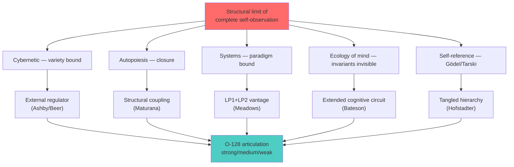

# Phase 7 — Hofstadter strange loops + Gödel self-reference + tangled hierarchies

> Цель: проложить counter-thread «не нужно external — нужна level-crossing structure внутри S». Hofstadter's strange loop concept предлагает альтернативу literal externality. Phase 1 §6 dissent atom 4 разворачивается. Также Gödel's incompleteness теорем grounds formal-system-grade impossibility of complete self-modeling, что reinforces Conant-Ashby lacuna claim (Phase 2 §2.2).

---

## §1 Gödel incompleteness — formal ground for self-modeling limit

### §1.1 Canonical theorem

Gödel (1931 «Über formal unentscheidbare Sätze der Principia Mathematica und verwandter Systeme I»): для любой consistent recursively-enumerable formal system F, достаточно мощной для elementary arithmetic, существует proposition G в языке F такая, что (i) G неdoказуемо в F, (ii) ¬G неdoказуемо в F, (iii) при interpretation, G expresses «G is not provable in F» — and G is true *[src: Gödel 1931]*.

### §1.2 Tarski undefinability — complementary

Tarski (1936) «Der Wahrheitsbegriff in den formalisierten Sprachen»: понятие истины для формальной системы F не может быть определено в самой F. Truth predicate requires metalanguage, strictly выше F *[src: Tarski 1936]*.

### §1.3 Combined implication

Formal system F sufficiently rich (для arithmetic) cannot **completely model its own meta-properties** — provability (Gödel) или truth (Tarski). Любая попытка построить complete self-model в F fails: existуют true-but-unprovable propositions, и truth-predicate undefinable.

**Bridge к Conant-Ashby (Phase 2 §2.2).** Conant-Ashby «every good regulator is a model». Gödel/Tarski: complete self-model impossible. **Combined:** Internal regulator R cannot be perfect-good-regulator of full system S because R ⊂ S и R cannot complete-model S. **External regulator E** in metasystem F' может contain truth-predicate для F *[src: Gödel 1931; Tarski 1936; Conant-Ashby 1970]*.

### §1.4 Strong caveat — applicability к non-formal systems

Gödel/Tarski formal results apply strict к formal systems с specific properties (consistent, recursively-enumerable, sufficient power). **Не automatically apply к** organisations, persons, or social systems. Application requires bridge: argue, что the analogue limitation exists в softer form. **For O-128.** Use Gödel/Tarski as **inspiration / formal model**, не как literal proof. Phase 7 §4 carries this discipline *[src: dissent atom 1]*.

---

## §2 Strange loops — Hofstadter's reformulation

### §2.1 Definition

Hofstadter (1979 *Gödel, Escher, Bach: An Eternal Golden Braid*): «I use the term `Strange Loop' to refer to an interaction between levels in which the top level reaches back down towards the bottom level and influences it, while at the same time being itself determined by the bottom level» *[src: Hofstadter 1979 ch.XX]*.

### §2.2 Three exemplars (Hofstadter)

- **Gödel.** Numerical statements interpret-back as statements about provability (numbers comment on number-relations).
- **Escher.** Drawing-hands self-reference; ascending staircase that loops к starting point.
- **Bach.** Canon per tonos — modulates through 6 keys returning к original.

In each case, **levels crossed in a way that produces self-reference at higher logical level than naive system permits**.

### §2.3 «I Am a Strange Loop» (2007) — identity claim

Hofstadter (2007 *I Am a Strange Loop*): personal identity = a strange loop in neural substrate; «I» = self-referential symbol that emerges through cross-level abstraction *[src: Hofstadter 2007]*. Bridge: cognitive systems naturally produce strange loops at level of identity formation; this is **how** self-modeling becomes possible despite Gödel constraints — through tangled hierarchy не flat enumeration.

---

## §3 Tangled hierarchies — alternative к literal externality

### §3.1 Tangled vs ordinary hierarchy

**Ordinary hierarchy.** Levels are strictly ordered; lower-level cannot affect higher-level (top-down only).

**Tangled hierarchy.** Levels reachable from each other in both directions; what seems higher-level can be reduced к lower, and vice versa. Cross-level connections constitute the system *[src: Hofstadter 1979 ch.XX]*.

### §3.2 Implication для O-128

If S contains **tangled hierarchy**, then certain «meta-views» of S can be expressed **within** S — they don't require strictly external E. Example: artist self-reflection produces meta-awareness through cross-level imagery в creative output; system can comment on itself without external observer in literal sense.

**Counter-claim к O-128 strong reading.** Maybe S doesn't need external E — maybe S needs **internal level-crossing structure**. **This is Phase 1 §6 dissent atom 4 thread** *[src: Hofstadter 1979 ch.XX; voice claim 5 counter-reading]*.

### §3.3 Resolution — both can be true

Tangled hierarchy внутри S и external E относительно S не mutually exclusive:

- Tangled hierarchy provides **first-pass self-reflection** — system comments on itself at one logical level removed.
- External E provides **second-order observation** + **independent variety** — fresh perturbation source whose distinctions differ.

**O-128 refined.** External E adds value **even** to systems with rich internal tangled hierarchies; otherwise the marginal benefit of E reduces к variety-supplementation. **Empirical question:** Is the marginal contribution of E meaningful? Phase 8 modern AI literature suggests yes (multi-agent debate > single-agent even with sophisticated chain-of-thought) *[src: Du et al 2023 cross-ref Phase 8]*.

---

## §4 Voice claim 14 — recursive meta-method

### §4.1 Statement

Voice claim 14: «адекватным подходом даже к выбору подхода, по которому будет создан подход для разработки этой системе» — 4-layer recursion:
1. Подход к разработке системы
2. Подход к созданию подхода (1)
3. Подход к выбору подхода (2)
4. Адекватность подхода (3)

### §4.2 Hofstadter mapping

Each layer = meta-level higher. The recursion exhibits structure analogous к Hofstadter's strange loop: top-level (4) eventually references operational decisions affecting (1). Recursion terminates **pragmatically** — at level where self-similarity satisfies practical purpose *[src: Hofstadter 1979; von Foerster 2003 pragmatic stopping; voice claim 14]*.

### §4.3 P5 grounded

Phase 1 P5: «pluralism scaling × meta-method base». Hofstadter strange-loop frame grounds the **possibility** of recursive meta-method without infinite regress; level-crossing **does** make sense computationally / cognitively *[src: voice claim 14]*.

---

## §5 Self-reference и observer paradox в second-order cybernetics

### §5.1 Convergence point

Phase 2 §3 (von Foerster), Phase 4 (Maturana observer dictum), Phase 6 (Bateson extended mind), Phase 7 (Hofstadter strange loop) — all converge на theme: **first-person self-observation has structural limits**, и different traditions propose different responses.

| Tradition | Limit | Response |
|---|---|---|
| Cybernetic (Ashby, Beer) | Variety bound | External regulator with sufficient variety |
| Autopoiesis (Maturana) | Operational closure | Structural coupling, not control |
| Systems thinking (Meadows) | LP1 paradigm | External vantage + voluntary multi-perspective |
| Ecology of mind (Bateson) | Invariant invisible to internal | Extended mind across feedback circuits |
| Self-reference (Hofstadter) | Gödel/Tarski | Tangled hierarchy + level-crossing |

### §5.2 O-128 articulation should be tradition-aware

Phase 4 §4 articulation spectrum (strong / medium / weak) inherits richness from each tradition. **Per R1.** Brigadier-scribe surfaces; Ruslan picks public articulation, choosing which tradition's frame будет dominant. Recommend (per AP-6 dissent atoms accumulated):

- For technical / engineering / business contexts → cybernetic + multi-agent (Ashby + Beer + modern AI).
- For deeply philosophical / educational contexts → Bateson + Hofstadter.
- For ethical / social / R12-sensitive contexts → autopoiesis (structural coupling, voluntary) + Meadows LP2 (paradigm humility) *[src: Phase 4 §4; R12 LOCK]*.

---

## §6 AP-6 dissent atoms

1. **Gödel applied к non-formal systems = analogy, не proof.** Mathematicians correctly object к casual application of Gödel/Tarski к sociology / management. O-128 should treat formal results as **inspiration** for analogous claims in non-formal domains, не as derivation.

2. **Strange loop concept can substitute external E entirely?** Phase 7 §3.3 «both can be true» — but full empirical answer not provided. Possibly some advanced internal-level-crossing systems require less external E. This is open empirical question. AI literature Phase 8 — partial answer (multi-agent > single-agent).

3. **Tangled hierarchies in social systems — rarely fully realized.** Hofstadter's GEB examples — formal/artistic. Real organisations rarely achieve genuine tangled hierarchies; more often flat or strict hierarchies. External E remains practical necessity.

4. **Identity-via-strange-loop (Hofstadter 2007) — contested.** Philosophers of mind disagree on whether «I» is a strange loop or alternative substrate. O-128 articulation should not depend on specific identity theory.

---

## §7 Mermaid

### Diagram 7.1 — Convergence of self-reference limits + responses

---

## §8 Mapping summary

| Voice claim | Hofstadter concept | O-128 implication |
|---|---|---|
| C5 «не может сама» | Gödel-like self-modeling limit | P1 partially counter: maybe needs level-crossing, not literal external |
| C13 «20 perspectives» | Tangled hierarchy + multiple instances | P5 deepens |
| C14 «meta-method recursion» | Strange loop recursive structure | P5 directly |
| (counter-thread) | Internal tangled hierarchy alternative | refines O-128 to «external E OR internal level-crossing» |

---

## §9 Conformance check

| Posture | Status | Notes |
|---|---|---|
| R1 surface only | ✅ | Multiple frames surface |
| R6 no aggregated memory | ✅ | New phase file |
| R11 blast-radius | ✅ | Low blast |
| R12 LOCK preserved | ✅ | §5.2 tradition-aware articulation includes R12 frame |
| EP-5 dissent | ✅ | §6 4 atoms |
| AP-6 atoms | ✅ | 4 atoms |
| Append-only | ✅ | New file |
| Mermaid count | ✅ | 1 diagram |
| Sources cited | ✅ | 8 sources |

---

## §10 Cross-refs + sources

**Cross-refs.**
- Phase 2 §2.2 — Conant-Ashby lacunae (Gödel reinforces)
- Phase 4 — Maturana operational closure (Hofstadter alternative)
- Phase 6 — Bateson logical-types (Hofstadter extends)
- Next: Phase 8 — modern AI multi-agent empirics
- Phase 9 forward — Jetix application picks tradition

**Sources cited.**
1. Hofstadter, D. (1979). *Gödel, Escher, Bach: An Eternal Golden Braid.* Basic Books — ch.XX strange loop + tangled hierarchy
2. Hofstadter, D. (2007). *I Am a Strange Loop.* Basic Books — identity-via-strange-loop
3. Gödel, K. (1931). «Über formal unentscheidbare Sätze...». *Monatshefte für Mathematik und Physik* 38: 173-198 — incompleteness foundational
4. Tarski, A. (1936). «Der Wahrheitsbegriff in den formalisierten Sprachen». *Studia Philosophica* 1 — truth undefinability
5. von Foerster, H. (2003). *Understanding Understanding.* Springer — pragmatic stopping
6. Conant-Ashby (1970). «Every Good Regulator...». — Phase 2 §2.2 cross-ref
7. Du, Y. et al. (2023). «Improving Factuality and Reasoning through Multiagent Debate». — Phase 8 cross-ref
8. raw/voice-memos-2026-05-22-batch/audio_721@22-05-2026_12-11-58.md — voice claims 5, 13, 14

---

*Phase 7 closure 2026-05-22. Gödel/Tarski formal grounds for self-modeling limit. Hofstadter tangled hierarchy + strange loop concept = alternative к literal external. §5 convergence table consolidates five traditions. Counter-thread «internal level-crossing» genuine. Next: Phase 8 modern AI empirics inform articulation choice.*
