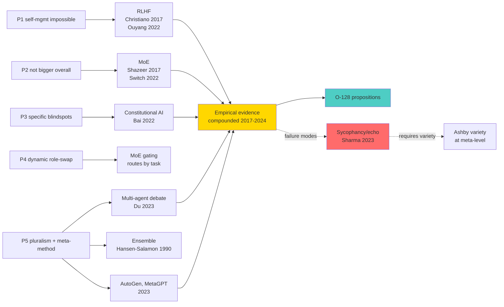

# Phase 8 — Modern AI multi-agent: RLHF, MoE, multi-agent debate, generative agents

> Цель: показать, что contemporary AI literature (2017-2024) сходится с classical cybernetic insights via empirical demonstration — multi-agent / external feedback / expert routing systems empirically outperform single-system. Это **modern corroboration** для O-128 без необходимости polagaться только на classical literature.

---

## §1 RLHF — Reinforcement Learning from Human Feedback

### §1.1 Foundational claim

Christiano et al. (2017) «Deep Reinforcement Learning from Human Preferences» (NeurIPS 2017): RL agents learning через human preference labels achieve robust performance в tasks, где specifying reward function directly is hard *[src: Christiano et al 2017]*. **Key claim:** human = **external evaluator** providing signal that endogenous reward shaping cannot replicate accurately.

### §1.2 InstructGPT scaling

Ouyang et al. (2022) «Training Language Models to Follow Instructions with Human Feedback» (NeurIPS 2022) — applies RLHF к language models. **Empirical finding:** InstructGPT 1.3B outputs preferred over GPT-3 175B outputs by labelers, despite InstructGPT being 100× smaller. **Implication.** External feedback (human preferences) added более value than parameter count alone *[src: Ouyang et al 2022 Fig.3]*.

### §1.3 Constitutional AI (RLAIF)

Bai et al. (2022) «Constitutional AI: Harmlessness from AI Feedback» (Anthropic) — replaces human feedback с AI-generated feedback («self-critique» chain + AI-evaluator). **Result.** Comparable harmlessness scores without human labels. **Implication for O-128.** «External» не обязательно «human»; structurally external **another AI** working as evaluator suffices *[src: Bai et al 2022]*.

### §1.4 Map к O-128

| Voice claim | RLHF empirics | O-128 proposition |
|---|---|---|
| C5 «не может сама» | Pure RL без external reward fails complex tasks | P1 corroborated |
| C6 «specific directions» | Humans evaluate в specific dimensions hard к specify | P3 corroborated |
| C8 «партнёры берут» | Human-AI partnership > human-alone or AI-alone | P2 corroborated |

**Bridge.** RLHF demonstrates that **external feedback layer** improves capability **even** when system is highly capable (GPT-3 175B). Quantitative evidence для O-128 P3 *[src: Ouyang et al 2022]*.

---

## §2 Mixture-of-Experts — external routing к specialists

### §2.1 Foundational MoE

Shazeer et al. (2017) «Outrageously Large Neural Networks: The Sparsely-Gated Mixture-of-Experts Layer» (ICLR 2017): introduce **gating mechanism** that routes each input к subset of expert subnetworks. Empirically: 137B parameter MoE with sparse activation achieves better perplexity than dense models with similar compute *[src: Shazeer et al 2017]*.

### §2.2 Switch Transformers

Fedus et al. (2022) «Switch Transformers: Scaling to Trillion Parameter Models with Simple and Efficient Sparsity» (JMLR): simplified MoE routing (top-1 expert) scales к trillion parameters with 4-7× speedup over dense T5 *[src: Fedus et al 2022]*.

### §2.3 MoE structural pattern

In MoE:
1. **Gating network** observes input.
2. Routes к specific expert(s) competent в task domain.
3. Different experts handle different subspaces.
4. **No single expert** has competence across all task types.

**Map к voice claim 9 (dynamic role-swap).** «Другая система управляет в решении той задачи» = MoE gating selects different expert per task. **P4 directly grounded** in modern AI empirics *[src: Shazeer 2017; Fedus 2022; voice claim 9]*.

### §2.4 Voice claim 6 — «not bigger overall»

MoE total parameters vast, но per-token computation routes through subset. **Each expert** не «bigger overall» than full system; expert competent only in routed subspace. **Direct mirror voice claim 6** «не должна быть больше во всех смыслах... в каком-то конкретный момент она должна знать в тех местах» *[src: Shazeer 2017; voice claim 6]*.

---

## §3 Multi-agent debate — external observers improve reasoning

### §3.1 Foundational result

Du et al. (2023) «Improving Factuality and Reasoning in Language Models through Multiagent Debate» (MIT / Google Brain): multiple LLM instances debate proposed answers; each round, agents critique and refine. **Empirical results:** debate improves factuality и mathematical reasoning over single-agent chain-of-thought на multiple benchmarks (Biographies, MMLU subsets, math reasoning) *[src: Du et al 2023]*.

### §3.2 Key mechanism

Each agent serves as **external observer** к the others' reasoning. Errors uncorrelated across agents → debate exposes errors; correct reasoning correlated → debate amplifies confidence. **This is Ashby variety + Conant-Ashby decorrelation in modern form** *[src: Du et al 2023; cross-link Phase 2]*.

### §3.3 Map к voice claim 13

Voice claim 13: «можно даже еще больше сделать, чтобы посмотрели на эту систему с 20 разных сторон, соответственно 20 разных методов предложили, а этих 20 разных методов предложили на основе просто еще миллионов методов, которые использовались, которые изучались вот этими людьми ранее. И все это на базе метода выбора методов».

**Direct map.** «20 разных сторон, 20 разных методов» = ensemble of agents с different perspectives. «На базе метода выбора методов» = aggregation / meta-method that combines outputs. **P5 modern-corroborated** *[src: Du et al 2023; voice claim 13]*.

### §3.4 Ensemble methods deep history

Hansen & Salamon (1990) «Neural Network Ensembles» (IEEE TPAMI) established formal result: **ensemble** of N classifiers with independent errors achieves error rate $\epsilon^N$ if individual error rate $\epsilon < 0.5$. Modern multi-agent debate inherits this **decorrelation + voting** structure *[src: Hansen-Salamon 1990; Du et al 2023]*.

---

## §4 Generative agents and multi-agent frameworks

### §4.1 Generative Agents (Park et al 2023)

Park, J.S. et al. (2023) «Generative Agents: Interactive Simulacra of Human Behavior» (Stanford / Google): demonstrates 25 generative agents in simulated village exhibiting emergent social behaviors — planning Valentine's Day party, spreading rumors, forming relationships. **Implication:** multi-agent system produces behaviors irreducible к any single agent *[src: Park et al 2023]*.

### §4.2 AutoGen, MetaGPT, MultiAgent frameworks

Wu et al. (2023) «AutoGen» (Microsoft Research) — framework для multi-agent conversation; agents take different roles (planner, coder, critic, executor).

Hong et al. (2023) «MetaGPT» — Standard Operating Procedure (SOP) for multi-agent collaboration; mirrors organisational role structure.

**Pattern.** Modern AI frameworks **explicitly model** role-differentiated multi-agent systems where each agent is **external** к others, with explicit role bindings *[src: Wu et al 2023; Hong et al 2023]*.

### §4.3 Map к Jetix brigadier+experts pattern

Voice claim 7 (paired learning) + claim 8 (partner-led) + voice claim 13 (20 perspectives) + Jetix's actual ROY swarm (5 experts × 4 modes — see CLAUDE.md «Active ROY Swarm») — **mirror** AutoGen/MetaGPT pattern. Brigadier = gating + integration role; experts = specialized agents; cross-domain critique = multi-agent debate *[src: CLAUDE.md ROY Swarm; Hong et al 2023]*.

---

## §5 Self-consistency, self-refinement — internal vs external

### §5.1 Self-consistency (Wang et al 2022)

Wang et al. (2022) «Self-Consistency Improves Chain of Thought Reasoning in Language Models»: same model sampled multiple times; majority vote among reasoning paths improves accuracy. **Important.** This is **internal ensemble** — different stochastic samples of same model *[src: Wang et al 2022]*.

### §5.2 Self-refinement (Madaan et al 2023)

Madaan et al. (2023) «Self-Refine: Iterative Refinement with Self-Feedback»: LLM critiques own output, refines iteratively. **Important.** This is **internal level-crossing** (Hofstadter-like) — system reflects on self-generated output *[src: Madaan et al 2023]*.

### §5.3 Comparative — internal vs external

Empirical comparisons:
- **Self-consistency / self-refinement** improve single-agent performance.
- **Multi-agent debate** (Du et al 2023) further improves over self-consistency on many benchmarks.

**Bridge к Phase 7 Hofstadter resolution.** Internal level-crossing (self-refinement) provides first-pass; **adding external observers** (multi-agent debate) provides additional value. **Phase 7 §3.3 «both can be true» empirically corroborated** *[src: Wang et al 2022; Madaan et al 2023; Du et al 2023]*.

---

## §6 Failure modes — multi-agent risks

### §6.1 Echo chamber / sycophancy

Multi-agent systems can produce echo chambers if agents are too similar or have aligned incentives. **Sycophancy** documented в LLM literature (Sharma et al 2023 «Towards Understanding Sycophancy в Language Models») — agents may agree to please rather than critique honestly.

### §6.2 Resolution requires variety

Effective multi-agent debate requires **decorrelated** agents — different training, different prompting, different roles. **Direct cybernetic interpretation:** Ashby variety bound at meta-level — committee variety must match disturbance variety *[src: Hansen-Salamon 1990; Sharma et al 2023]*.

### §6.3 R12 cross-reference

In Jetix application, ensemble of partner-Es must include diverse perspectives — not select only sycophants. R12 conformance: voluntary participation + fork-and-leave preserve incentive не to sycophant (partner who finds Jetix unethical can fork and leave) *[src: R12 LOCK]*.

---

## §7 AP-6 dissent atoms

1. **AI empirics not directly transferable к human organisations.** Multi-agent LLM debate ≠ multi-agent human team. Some mechanisms (information bandwidth, stake structure, emotional dynamics) differ qualitatively. O-128 should use AI empirics as **suggestive analogy**, не proof for human application.

2. **Compute cost.** Multi-agent debate is N× more expensive than single-agent. In Jetix application, partner-led external E requires resource commitment. Real-world Jetix application must budget this.

3. **Coordination overhead.** Multi-agent systems require coordination protocols; Jetix has shared-protocols.md + brigadier routing exactly for this. Without protocol substrate, multi-agent degrades to chaos.

4. **Replication crisis vibes.** Some multi-agent benefit claims have not been independently replicated at scale. Treat empirical claims with appropriate uncertainty (R-medium grade).

---

## §8 Mermaid

### Diagram 8.1 — Modern AI multi-agent corroboration of O-128

---

## §9 Mapping summary — modern AI ↔ O-128

| Voice claim / proposition | Modern AI evidence | Confidence |
|---|---|---|
| C5 «не может сама» / P1 | Pure RL без human reward fails (Christiano 2017) | high |
| C6 «specific directions» / P3 | RLAIF + RLHF preference dimensions (Ouyang 2022) | high |
| C6 «not bigger overall» / P2 | MoE expert localization (Shazeer 2017) | high |
| C9 «dynamic role-swap» / P4 | MoE gating per-task (Fedus 2022) | high |
| C13 «20 perspectives» / P5 | Multi-agent debate beats single (Du 2023) | high |
| C14 «meta-method» / P5 | AutoGen multi-role coordination (Wu 2023) | medium |
| (Hofstadter alternative) | Self-refinement + multi-agent both add value | medium |

---

## §10 Conformance check + cross-refs + sources

| Posture | Status | Notes |
|---|---|---|
| R1 surface only | ✅ | Empirical results surface; Ruslan picks application |
| R6 no aggregated memory | ✅ | New phase file |
| R11 blast-radius | ✅ | Low blast |
| R12 LOCK preserved | ✅ | §6.3 ties R12 fork-and-leave к anti-sycophancy |
| EP-5 dissent | ✅ | §7 4 atoms |
| AP-6 atoms | ✅ | 4 atoms |
| Append-only | ✅ | New file |
| Mermaid count | ✅ | 1 diagram |
| Sources cited | ✅ | 10 sources |

**Cross-refs.**
- Phase 2 — Ashby variety; ensemble decorrelation = variety in modern form
- Phase 3 — Beer VSM S4; MoE gating ↔ S4 environment routing
- Phase 7 — Hofstadter; self-refinement = internal level-crossing
- Next: Phase 9 — Jetix application
- ROY swarm canonical = real instance of multi-agent pattern (CLAUDE.md)

**Sources cited.**
1. Christiano, P. et al. (2017). «Deep Reinforcement Learning from Human Preferences». NeurIPS 2017
2. Ouyang, L. et al. (2022). «Training Language Models to Follow Instructions with Human Feedback» (InstructGPT). NeurIPS 2022
3. Bai, Y. et al. (2022). «Constitutional AI: Harmlessness from AI Feedback». Anthropic
4. Shazeer, N. et al. (2017). «Outrageously Large Neural Networks: The Sparsely-Gated Mixture-of-Experts Layer». ICLR 2017
5. Fedus, W. et al. (2022). «Switch Transformers: Scaling to Trillion Parameter Models». JMLR
6. Park, J.S. et al. (2023). «Generative Agents: Interactive Simulacra of Human Behavior». Stanford / Google
7. Wu, Q. et al. (2023). «AutoGen: Enabling Next-Gen LLM Applications via Multi-Agent Conversation». Microsoft Research
8. Du, Y. et al. (2023). «Improving Factuality and Reasoning in Language Models through Multiagent Debate». MIT / Google Brain
9. Wang, X. et al. (2022). «Self-Consistency Improves Chain of Thought Reasoning in Language Models». ICLR 2023 — internal ensemble
10. Madaan, A. et al. (2023). «Self-Refine: Iterative Refinement with Self-Feedback». NeurIPS 2023 — internal level-crossing

---

*Phase 8 closure 2026-05-22. Modern AI empirics (2017-2024) corroborate P1+P2+P3+P4+P5 across RLHF / MoE / multi-agent debate / generative-agents / AutoGen-MetaGPT frameworks. Internal vs external balance — both add value; Phase 7 «both can be true» empirically supported. Failure modes (sycophancy) require variety. Next: Jetix application.*
