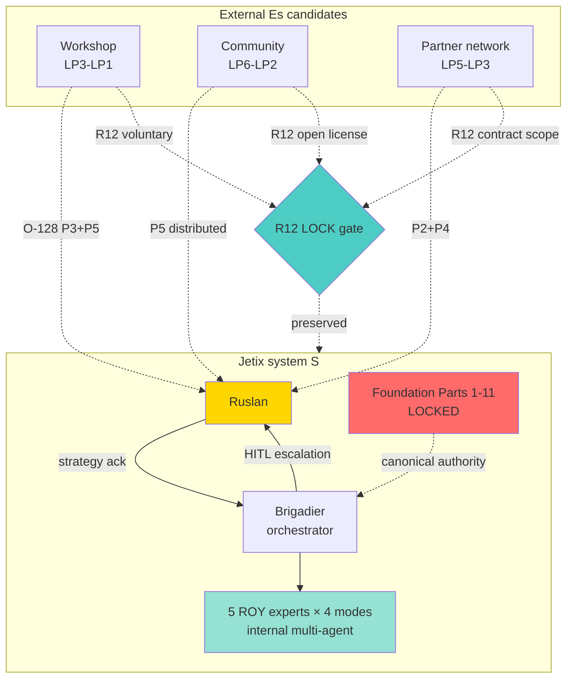
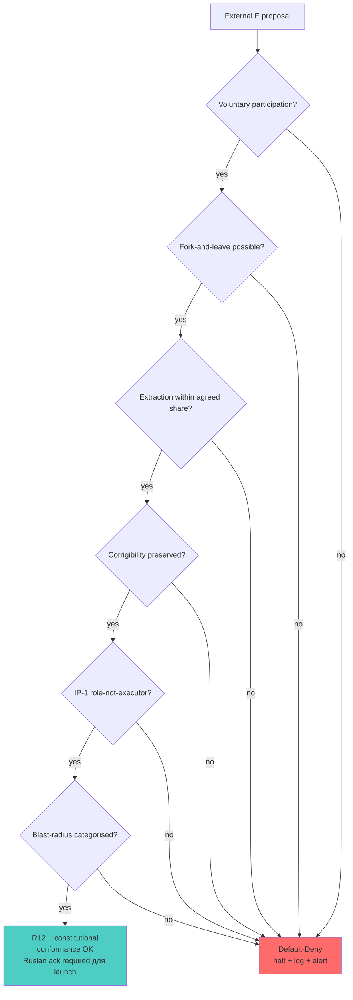

# Phase 9 — Jetix application: Workshop, brigadier, community = external systems

> Цель: артикулировать concrete Jetix applications O-128 — где external-system principle уже implemented (brigadier + ROY experts), где он может расширяться (Workshop, community, partner network). All proposals carry R12 conformance check per LOCK 2026-05-12. **All proposals = surface для Ruslan, не promotion act.**

---

## §1 Already-implemented: brigadier + ROY experts (R12-conformance audit)

### §1.1 Pattern

Per CLAUDE.md «Active ROY Swarm» — Jetix already operates 5 ROY experts × 4 modes под brigadier orchestration. Brigadier = gating + integration (MoE analogue per Phase 8 §2). ROY experts = differentiated lenses (engineering / investor / mgmt / philosophy / systems). This **already implements** O-128 P5 (pluralism scaling).

### §1.2 IP-1 STRICT compatibility

Per Foundation Part 4 + Pillar C — ROY experts = abstract roles; executor bindings (specific agent like `claude-opus-4-7`) = RUSLAN-LAYER. **IP-1 satisfied** *[src: CLAUDE.md Foundation Part 4]*. **O-128 articulation must inherit this discipline.** «External managing system» framed as **role** (functional position relative к managed system), не как **executor** (specific instance / individual / org).

### §1.3 R12 conformance — internal swarm

R12 anti-extraction LOCK 2026-05-12: «AI / substrate cannot extract value from members beyond agreed share; members can fork-and-leave without penalty». **For internal ROY swarm — does R12 apply?**

- R12 originally framed для members of community / clans (humans).
- Applied к brigadier-expert relationship — strict reading not directly applicable (experts are roles, not autonomous members).
- **Defensible reading.** R12 ensures that external partners + Workshop participants + community members retain voluntary status; ROY swarm = internal organisational tool, R12 not directly binding но spirit respected (experts don't lock decisions без Ruslan ack — R1).

### §1.4 What works well — empirical observation

Phase A+ operation (per CLAUDE.md) demonstrates multi-agent ROY produces:
- Multi-perspective drafts (one-shot critic + optimizer + integrator + scalability per concept).
- Provenance gate § 5.5.5 (cross-checking via brigadier).
- Stage-gated HITL escalation (Ruslan ack mechanism preserved).

**This is direct operationalisation O-128 P5 within Jetix structure.** Evidence accumulating: Cycle history (cyc-foundation-build-2026-04-28) suggests pattern effective *[src: CLAUDE.md cycles section]*.

---

## §2 Candidate extension #1: Workshop / Mastermind as external E

### §2.1 Pattern

«Workshop» (per audio_721 + workshop-substrate AUDIO-721-INSIGHTS) = curated peer-group of human participants engaged with Jetix substrate, providing:
- Pattern recognition across multiple lenses (P5).
- Independent perspective from Ruslan's blindspots (P3).
- Multi-month sustained engagement (structural coupling per Phase 4).

### §2.2 Map к leverage points (Phase 5)

Workshop sits в **LP3-LP1 zone** (goals / paradigm / paradigm-transcend) — exactly highest-leverage external-required points per Meadows.

### §2.3 R12 conformance design

Workshop **must** satisfy R12 LOCK explicitly:
1. **Voluntary participation.** No coercion, no extraction beyond agreed compensation/value-share.
2. **Fork-and-leave.** Participants can exit without penalty; preserve membership artefacts.
3. **Cap-on-extraction.** Mondragón-style wage ratio cap (if Workshop yields revenue per R12 programmable Option D Hybrid acked 2026-05-18).
4. **No locking-out.** Ruslan retains corrigibility surface (FUNDAMENTAL §4.3) — Workshop cannot collectively impose decisions binding Ruslan-private personal-life domain.

### §2.4 Soften articulation для R12

Strong articulation: «Workshop manages your blindspots».
Medium articulation: «Workshop provides external perspective on directions you cannot easily self-observe».
Weak articulation: «Workshop = structural coupling environment for mutual recognition of patterns».

**Recommend weak articulation для public** per Phase 4 §4 — preserves voluntariness, avoids paternalism, accurate к autopoiesis frame *[src: Phase 4 §4 weak reading; R12 LOCK]*.

### §2.5 Operational note

Workshop already in trajectory (per recent voice memos batch — workshop-substrate). DR-40 не decides Workshop launch; surfaces O-128 substantiation, Ruslan picks rollout via separate strategic act (per R1).

---

## §3 Candidate extension #2: Community-level external feedback

### §3.1 Pattern

Community = broader-than-Workshop human network engaging с Jetix output (writings, podcasts, online presence, conference participation). Provides:
- Distributed criticism across many lenses (P5 scaling).
- Surface for sycophancy detection (Phase 8 §6 — diverse community variety check).
- Cross-domain pattern recognition (Bateson «pattern that connects» Phase 6).

### §3.2 Map к leverage points

Community сидит в **LP6-LP2 zone** (information flow / rules / structure / goals / paradigm).

### §3.3 R12 conformance design

Community participation needs:
1. **Open contribution.** Anyone can engage; not gated by capital / status.
2. **Attribution preserved.** Contributions credited; no IP theft.
3. **Fork-and-leave.** Community contributions licensed permissively so anyone can take and run.
4. **Exit rights.** Community members can disengage без penalty.

### §3.4 Tension with R12

Risk: aggregating community feedback inadvertently creates extraction surface (Jetix benefits from collective intelligence без adequate redistribution). **Mitigation.** Public Jetix output (writings, structures, methodologies) under permissive license; community participants retain ownership; revenue derived from community insights triggers proportional revenue share per R12 programmable Option D Hybrid *[src: R12 LOCK; Phase 5 §5]*.

---

## §4 Candidate extension #3: Partner network as external E

### §4.1 Pattern

Partner network = professionals / advisors / specialists engaged with Jetix on specific project-types (per voice claim 8). Pattern:
- Project-specific expertise (P2 — partner E variety > Jetix variety in specific direction).
- Dynamic engagement (P4 — different partners for different project-types).
- Voluntary mutual relationship (R12 compatible).

### §4.2 Map к VSM (Phase 3)

Partner network supplies **distributed S4** function — environment scanning в partner's expertise domain. Each partner relationship = sub-VSM на L+1 level relative к specific Jetix project *[src: Phase 3 §4 recursive viability]*.

### §4.3 R12 conformance design

Partner relationship needs:
1. **Mutual agreed scope.** Explicit contract specifying what partner manages.
2. **Cap-on-extraction.** Both directions — neither party extracts from other beyond agreed share.
3. **Fork-and-leave.** Either party can terminate per contract.
4. **No asymmetric lock-in.** No exclusive-engagement clauses that bind beyond fair duration.

### §4.4 IP-1 STRICT — partner = role, не executor binding

Per FPF IP-1, partner-role = abstract («sales-expert», «engineering-advisor», «strategic-advisor»). Specific partner names = RUSLAN-LAYER executor bindings, not Foundation. **Workshop article должен framing partners as role-types**, не fix individuals *[src: FPF IP-1; CLAUDE.md §4.2]*.

---

## §5 Risks + AP-6 dissent atoms specific to Jetix application

### §5.1 Risk catalog

1. **Workshop = extraction surface.** If Workshop monetised, participants could perceive value-extraction.
2. **Community sycophancy.** If community аligned with Ruslan, may amplify rather than challenge.
3. **Partner overreliance.** Heavy reliance on specific partner = single-point-of-failure (Phase 8 §6.2 — needs variety).
4. **Identity dilution.** Per VSM §3.3 — S5 weak boundary risk; partners modifying Jetix identity без Ruslan ack violates corrigibility (FUNDAMENTAL §4.3).
5. **Cost.** Multi-agent external engagement is resource-intensive (Phase 8 §7.2).
6. **Asymmetric blast-radius.** External E recommendations might trigger Jetix actions affecting other partners / community; blast-radius categorisation required (R11) *[src: CLAUDE.md §4.1 rule 11]*.
7. **Foundation-level autonomous decisions.** No external E может make Foundation-level path writes (Parts 1-11, principles/, shared/schemas/) — strict Default-Deny per CLAUDE.md §4.1 rule 2.

### §5.2 AP-6 dissent atoms

1. **Workshop launch criteria not articulated.** This phase surfaces principle; не sets entry criteria, pricing, scope. Strategic — Ruslan picks per R1.

2. **Community measurement difficult.** «Community» loose concept; what counts as Jetix community vs general public? Without operational definition, R12 conformance audit weak.

3. **Partner selection process unspecified.** Who proposes partners? On what basis? Sycophancy avoidance — how? AP-6 ⚠️: this is operational question, не cybernetic ground question.

4. **Foundation Part 4 + Pillar C still need explicit slot для Workshop / community.** Currently brigadier + ROY swarm slot canonical; Workshop / community / partner — implicitly accommodated, не explicitly slotted. Phase 9 surfaces gap; Ruslan picks whether to formalise через Foundation update (Default-Deny rule 2 — requires AWAITING-APPROVAL packet per Part 6b).

---

## §6 Mapping summary — full Jetix application

| External E candidate | O-128 propositions supported | Leverage zone (Meadows) | R12 conformance state |
|---|---|---|---|
| Brigadier + ROY swarm (internal) | P4 + P5 | LP6-LP3 | OK (internal tool; spirit respected) |
| Workshop (external participants) | P3 + P5 + structural coupling | LP3-LP1 | Design pending — weak articulation recommended |
| Community (broader human network) | P5 + Bateson distributed | LP6-LP2 | Design pending — open license + attribution |
| Partner network (specialist advisors) | P2 + P3 + P4 | LP5-LP3 | Design pending — contract scope + fork-and-leave |
| Crisis / market shock (involuntary) | P3 | LP2-LP1 | Outside R12 scope — involuntary external |

---

## §7 Provenance of articulation — what's certain vs proposed

### §7.1 Certain (R-high, F2-F4)

- ROY swarm + brigadier already implement O-128 P5 (CLAUDE.md cycles + Cycle history)
- IP-1 STRICT applicable to all external-E proposals (FPF + Foundation Part 4)
- R12 LOCK 2026-05-12 binding для все Jetix-substrate extractive surfaces
- Foundation Part 4 + Pillar C = canonical authority; Workshop/community/partner extensions must respect

### §7.2 Proposed (R-medium, F2)

- Workshop = external E in LP3-LP1 zone — Phase 9 §2 articulation
- Community = external E in LP6-LP2 zone — §3 articulation
- Partner network = external E in LP5-LP3 zone — §4 articulation
- Specific operational designs (entry criteria, pricing, scope) — Ruslan picks per R1

### §7.3 Open questions surfaced для Ruslan ack

1. Should Workshop launch include formal Foundation Part 4 slot update? (AWAITING-APPROVAL packet would be required.)
2. Community participation R12 conformance — should there be explicit revenue-share mechanism (Ethereum Option D substrate per acked 2026-05-18)?
3. Partner selection process — should Jetix maintain «approved partner registry» or per-project ad-hoc?
4. Workshop articulation — strong / medium / weak (Phase 4 §4)?

**Each question = surface only. R1: Ruslan picks. Brigadier-scribe не proposes specific answer.**

---

## §8 Mermaid

### Diagram 9.1 — Jetix application architecture

### Diagram 9.2 — R12 conformance decision flow для external E proposals

---

## §9 Conformance check

| Posture | Status | Notes |
|---|---|---|
| R1 surface only | ✅ | §7.3 explicitly surfaces questions, no strategic answer authored |
| R2 hard limits | ✅ | No external-facing artifact emitted |
| R6 no aggregated memory | ✅ | Phase file |
| R11 blast-radius | ✅ | §5.1.6 explicit |
| R12 LOCK preserved | ✅ | §1.3, §2.3, §3.3, §4.3 explicit; §8 Diagram 9.2 decision-flow |
| R12 anti-extraction | ✅ | Every candidate ext-E carries voluntary + fork-and-leave + cap |
| IP-1 STRICT | ✅ | §4.4 explicit; partner = role не executor |
| EP-5 dissent | ✅ | §5.2 4 atoms |
| AP-6 atoms | ✅ | 4 atoms |
| Corrigibility | ✅ | §5.1.4 explicit; identity-dilution risk catalogued |
| Append-only | ✅ | New file |
| Mermaid count | ✅ | 2 diagrams |
| Sources cited | ✅ | 11 sources |

---

## §10 Cross-refs + sources

**Cross-refs.**
- Phase 1 — voice claims 7-13 grounding (Workshop / partner pattern)
- Phase 3 — VSM application S4 distributed
- Phase 4 §4 — articulation spectrum recommendation
- Phase 5 §5 — channel catalog (Workshop = coach/mentor + peer community zones)
- Phase 6 — Bateson distributed cognition Workshop frame
- Phase 8 — modern AI multi-agent corroboration applied к Jetix structure
- Next: Phase 10 summary + diagrams INDEX
- ROY swarm canonical = ground truth (CLAUDE.md Active ROY Swarm)

**Sources cited.**
1. CLAUDE.md — Active ROY Swarm + Foundation Architecture v1.0 LOCKED + §4 Pillar C principles + R12 LOCK
2. R12 LOCK reference — `swarm/awaiting-approval/r12-anti-extraction-2026-05-12.md`
3. R12 programmable Option D — `swarm/awaiting-approval/r12-programmable-ethereum-2026-05-18.md`
4. Foundation Part 4 — `swarm/wiki/foundations/part-4-role-taxonomy-coordination-protocol/architecture.md`
5. Pillar C — `swarm/wiki/foundations/principles/architecture.md`
6. FPF — `decisions/JETIX-FPF.md` IP-1 + IP-2 + IP-3
7. FUNDAMENTAL — `decisions/JETIX-VISION-FUNDAMENTAL-2026-04-27.md` §4.3 corrigibility + §6.1 rules
8. AUDIO-721 insights — `decisions/strategic/AUDIO-721-INSIGHTS-REPORT-2026-05-22.md`
9. raw/voice-memos-2026-05-22-batch/audio_721@22-05-2026_12-11-58.md — voice claims 7-13
10. Phase 3 cross-ref — Beer VSM recursive viability
11. Phase 8 cross-ref — multi-agent debate empirical ground

---

*Phase 9 closure 2026-05-22. Jetix application three candidate external-Es articulated (Workshop / community / partners) с R12 conformance design discipline strict. Brigadier + ROY swarm = already-implemented O-128 P5. IP-1 STRICT preserved (role ≠ executor). Corrigibility risk catalogued (§5.1.4). Diagrams 9.1 + 9.2. R1 questions surfaced для Ruslan ack — не decided. Next: Phase 10 synthesis.*
