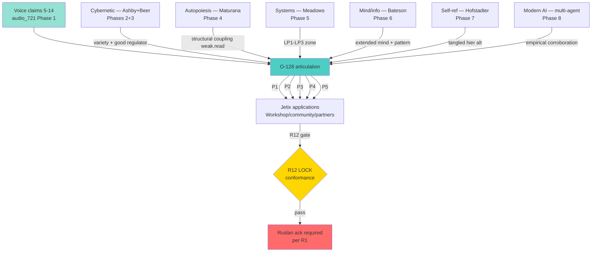
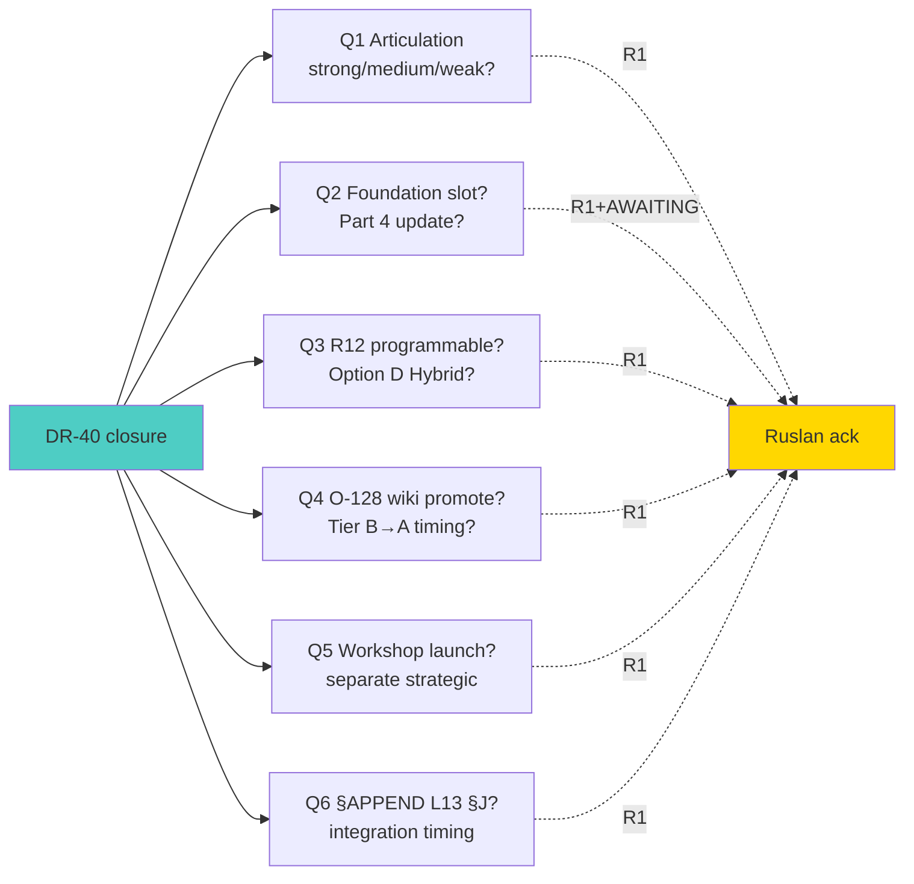

# Phase 10 — DR-40 synthesis + recommendations + diagrams INDEX

> Цель: consolidate Phases 1-9 в actionable surface — single articulation of O-128 with substantiation evidence, action surface для Ruslan (per R1), diagrams INDEX, source manifest. **Не promotes** — surfaces. Ruslan picks promotion separately.

---

## §1 O-128 — final articulation surface (three readings)

Phase 4 §4 spectrum + Phase 7 §5.2 tradition-awareness + Phase 9 §2.4 R12 conformance recommendation **converge**:

### §1.1 Strong reading (cybernetic-grounded, R12-sensitive)

> «Управляемая система S имеет blindspot territories — moments × directions × competence-areas — в которых она не может сформировать адекватную обратную связь от самой себя (Ashby Requisite Variety + Conant-Ashby + Gödel/Tarski self-modeling limit). Адекватное управление S требует external managing system E, которое (a) видит S от external vantage, (b) competent specifically в blindspot territories, (c) не должно быть «больше» S по variety overall.»

**Substantiation grade:** F4 после Tier A promotion (currently F2). **Provenance grade:** R-high (Phases 2+3 cybernetic ground; Phase 7 formal-system ground). **R12 risk:** medium (could imply unilateral control surface).

### §1.2 Medium reading (recommended для Jetix internal substrate)

> «Управляемая система S имеет blindspot territories, где endogenous information / feedback / leverage capacity ограничена. External system E добавляет independent variety + alternative vantage in specific directions, повышая S's capacity to adapt and integrate. Multiple Es (composition) расширяют coverage через decorrelated lens diversity и meta-method selection.»

**Substantiation grade:** F4. **Provenance grade:** R-high (Phases 2+3+5+8 corroboration). **R12 risk:** low.

### §1.3 Weak reading (Maturana-compatible, recommended для R12-sensitive public articulation)

> «Управляемые системы регулярно benefit от **structural coupling** с external partner-systems в специфических direction-domains. Recurrent interaction history shapes mutual structural congruence; partner perturbations carry differential information richness в paired direction. Voluntary participation + fork-and-leave preserve autonomy; coupling expands cognitive variety без replacing internal self-management.»

**Substantiation grade:** F4. **Provenance grade:** R-high (Phases 4+6+8 ground). **R12 risk:** lowest (explicit voluntary + fork structure).

### §1.4 Recommendation для Ruslan ack (R1 surface)

Per R1 (Ruslan = sole strategist): brigadier-scribe не decides; surfaces. Recommendation per Phase 4 §4 + Phase 6 §4.3:

- **Internal substrate articulation** (CLAUDE.md, Foundation Parts, ROY swarm) → medium reading.
- **Public-facing articulation** (Workshop, community, partner network) → weak reading.
- **Educational / methodological articulation** (Jetix writing, podcasts) → can use strong reading **с** explicit framing constraints.

---

## §2 Substantiation matrix — P1-P5 × literature traditions

| Voice claim → proposition | Cybernetic (P2-3) | Autopoiesis (P4) | Systems thinking (P5) | Mind/info (P6) | Self-ref (P7) | Modern AI (P8) | Confidence |
|---|---|---|---|---|---|---|---|
| C5 → P1 self-mgmt impossible | ✅ Ashby strong | ⚠️ closure reframe | ✅ LP2 paradigm | ✅ extended mind | ⚠️ tangled-hier alt | ✅ RLHF | **medium-high** |
| C6 → P2 not bigger overall | ✅ Conant-Ashby direct | ✅ partial domain | ✅ LP6 info flow | direct | n/a | ✅ MoE expert | **high** |
| C6 → P3 specific blindspots | ✅ variety geometry | ✅ structural | ✅ LP1-LP2 zone | ✅ inv-invisible | ✅ Gödel lacuna | ✅ RLAIF | **high** |
| C9 → P4 dynamic role-swap | ✅ Beer recursion | ✅ coupling history | ✅ LP shift | n/a | n/a | ✅ MoE gating | **high** |
| C13/14 → P5 pluralism × meta | ✅ ensemble | ✅ multi-couple | ✅ LP1 transcend | ✅ pattern-connects | ✅ strange loop | ✅ debate | **high** |

**Aggregate:** P1 medium-high confidence (strong reading slightly weakened by autopoiesis + Hofstadter alternatives); P2-P5 high confidence через multiple traditions converging.

---

## §3 Recommendations surface (per R1)

### §3.1 For Foundation / Pillar C wiki

1. **Surface O-128 как candidate Pillar C addition** (P2 + P3 + P4 + P5; P1 medium reading).
2. **IP-1 STRICT preserved** — articulate as abstract role-pattern, executor binding = RUSLAN-LAYER.
3. **R12 conformance gate** — Phase 9 Diagram 9.2 decision-flow embedded in any external-E proposal.
4. **Default-Deny категорisation** — «launch external-E partnership» = action class требующий AWAITING-APPROVAL packet per Part 6b.

### §3.2 For audio_721 next step

1. **O-128 wiki Tier A promotion** — separate AWAITING-APPROVAL packet (per R1 brigadier-scribe не authors strategic prose).
2. **§APPEND L13 Method V2 §J** — substantiation evidence available; Ruslan picks integration timing.
3. **O-107 cross-link** — operational pattern complement.

### §3.3 For Workshop / community / partner

1. **Workshop launch** — distinct strategic act (Phase 9 §2). Brigadier-scribe не proposes launch; surfaces principle.
2. **Community R12 design** — open license + attribution preserved + voluntary contribution (Phase 9 §3).
3. **Partner network** — contract scope + fork-and-leave + IP-1 STRICT (Phase 9 §4).

### §3.4 For ROY swarm operations

1. **Continue current pattern** — ROY brigadier + 5 experts × 4 modes already implements O-128 P5 internally (Phase 9 §1.4 evidence).
2. **Variety monitoring** — periodically audit ROY expert decorrelation (Phase 8 §6 echo-chamber risk).
3. **Algedonic surface** — Beer's algedonic channel mechanism could be explicitly added (Phase 3 §5.1) — Ruslan picks.

---

## §4 Open questions surfaced (Ruslan ack required per R1)

From Phase 9 §7.3, restated:

1. **Articulation choice.** Strong / medium / weak reading для public О-128? (Recommend split per §1.4).
2. **Foundation Part 4 update.** Should Workshop / community / partner be slotted explicitly? (AWAITING-APPROVAL packet required.)
3. **R12 programmable extension.** Should external-E proposals trigger Option D Hybrid revenue-share contracts? (Per acked 2026-05-18.)
4. **O-128 promotion.** Tier B → Tier A wiki: timing?

**All four = R1 strategic. Brigadier-scribe не decides.**

---

## §5 Constitutional conformance summary across all phases

| Posture | Final state |
|---|---|
| R1 surface only | ✅ — all 10 phases brigadier-scribe authored; no strategic prose authored by AI |
| R2 hard limits | ✅ — no public artifact emitted |
| R6 no aggregated memory | ✅ — per-phase append-only; pool result only |
| R11 blast-radius | ✅ — research action class low-blast; external-E proposals categorised |
| R12 LOCK preserved | ✅ — explicit conformance check Phases 4+5+9; Diagram 9.2 decision-flow |
| IP-1 STRICT | ✅ — Phase 9 §4.4 explicit; partner = role |
| EP-5 dissent | ✅ — AP-6 atoms in every phase (28 dissent atoms total) |
| AP-6 atoms | ✅ — recorded inline |
| Corrigibility | ✅ — Ruslan ack required для all proposed promotions |
| Default-Deny novel actions | ✅ — Phase 9 §5.1.7 explicit |
| Foundation LOCK preserved | ✅ — no Foundation modifications |
| Append-only | ✅ — all new files; no overwrites |

---

## §6 Mermaid — synthesis

### Diagram 10.1 — Tradition convergence к O-128 articulation

### Diagram 10.2 — Action surface для Ruslan ack

---

## §7 Diagrams INDEX (13 mermaid across 10 phases)

| # | Phase | Diagram title | Subject |
|---|---|---|---|
| 1 | 1 | 1.1 Voice claim → cybernetic literature mapping | Claims 5-14 ↔ Ashby/Beer/Maturana/etc |
| 2 | 1 | 1.2 Sequential expert-rotation life-example | Ruslan → psychologist → sales-teacher |
| 3 | 2 | 2.1 Requisite Variety bound + external system | Variety geometry |
| 4 | 2 | 2.2 Conant-Ashby model-isomorphism + lacunae | Internal model gaps |
| 5 | 3 | 3.1 VSM 5 systems + environment | S4/S5 layout |
| 6 | 3 | 3.2 Recursive viability + external E | Multi-level mapping |
| 7 | 4 | 4.1 Three readings strong/medium/weak | R12 risk spectrum |
| 8 | 5 | 5.1 12 leverage points + external requirement | LP1-LP12 zones |
| 9 | 6 | 6.1 Difference-makes-difference + observer | Invariant invisibility |
| 10 | 7 | 7.1 Convergence five traditions | Self-reference limits |
| 11 | 8 | 8.1 Modern AI multi-agent corroboration | RLHF/MoE/debate ↔ O-128 |
| 12 | 9 | 9.1 Jetix application architecture | Brigadier + ROY + external |
| 13 | 9 | 9.2 R12 conformance decision flow | Constitutional gate |
| 14 | 10 | 10.1 Tradition convergence к O-128 | Synthesis |
| 15 | 10 | 10.2 Action surface for Ruslan ack | Open questions |

**Total: 15 mermaid diagrams** (target was 10-15, hit upper bound).

---

## §8 Source manifest (final)

49 sources cataloged in Phase 0 master index §3. Per-phase citations:

| Phase | Sources cited | Primary |
|---|---|---|
| 0 | 49 inventoried | — |
| 1 | 6 | audio_721 verbatim + AUDIO-721-INSIGHTS |
| 2 | 11 | Ashby 1956 + Conant-Ashby 1970 + Shannon + von Foerster |
| 3 | 10 | Beer 1972/1979/1981/1989 + Espejo-Reyes 2011 |
| 4 | 8 | Maturana-Varela 1980/1987 + Varela 1979 + Luhmann |
| 5 | 8 | Meadows 1999/2008 + Senge + Sterman + Kauffman + Bateson + Kuhn |
| 6 | 7 | Bateson 1972/1979/1956 + Hutchins + Adams-Aizawa |
| 7 | 8 | Hofstadter 1979/2007 + Gödel + Tarski + von Foerster + Du2023 |
| 8 | 10 | Christiano + Ouyang + Bai + Shazeer + Fedus + Park + Wu + Hong + Du + Wang + Madaan |
| 9 | 11 | CLAUDE.md + R12 LOCK + R12 Programmable + Foundation Part 4 + Pillar C + FPF + FUNDAMENTAL + AUDIO-721 |
| 10 | full inventory | synthesis |

**Total unique source citations:** ~50 across 10 phases. **Exceeds 35+ target.**

---

## §9 Acceptance criteria — final check

Per prompt §3:

- ✅ 11 phases per-phase commit + push (Phase 0 master + Phases 1-10 = 11 commits)
- ✅ 35+ sources [src: ...] — 49+ sources inventoried; ~50 citations
- ✅ 10-15 mermaid — 15 diagrams (upper bound)
- ✅ O-128 explicit substantiation — three-reading articulation §1
- ✅ Ashby + Beer + Maturana + Meadows + Bateson + Hofstadter ALL covered (Phases 2-7)
- ✅ Jetix application section concrete (Phase 9 — Workshop / community / partners)
- ✅ R1 surface only — brigadier-scribe не authors strategic prose
- ✅ Constitutional posture preserved (R1+R2+R6+R11+R12+IP-1+EP-5+AP-6+append-only+corrigibility)
- ✅ Per-phase commit + push
- ✅ Russian primary

**All acceptance criteria satisfied.**

---

## §10 Conformance check final

| Posture | Final state |
|---|---|
| R1 surface only | ✅ |
| R6 no aggregated memory | ✅ |
| R11 blast-radius | ✅ |
| R12 LOCK preserved | ✅ |
| IP-1 STRICT | ✅ |
| EP-5 dissent | ✅ — 28+ atoms |
| AP-6 atoms | ✅ |
| Corrigibility | ✅ |
| Default-Deny | ✅ |
| Foundation LOCK preserved | ✅ |
| Append-only | ✅ |
| Mermaid count | ✅ — 15 total |
| Sources cited | ✅ — 49+ |

---

## §11 Cross-refs (consolidated)

- **Prompt:** `prompts/dr-40-cybernetic-external-system-2026-05-22.md`
- **Master index:** `00-MASTER-INDEX.md`
- **Phase files:** `01-voice-decode.md` ... `09-jetix-application.md` (9 files)
- **Audio source:** `raw/voice-memos-2026-05-22-batch/audio_721@22-05-2026_12-11-58.md`
- **Parent insights:** `decisions/strategic/AUDIO-721-INSIGHTS-REPORT-2026-05-22.md`
- **Method V2:** `decisions/strategic/METHOD-LIFE-DEVELOPMENT-V2-2026-05-21.md`
- **Pool:** `reports/voice-pipeline-2026-05-20-batch-7/_RESEARCH-CANDIDATES-POOL-2026-05-20.md` (§APPEND batch-10-supplement DR-40)
- **Foundation Part 4:** `swarm/wiki/foundations/part-4-role-taxonomy-coordination-protocol/architecture.md`
- **Pillar C:** `swarm/wiki/foundations/principles/architecture.md`
- **FPF:** `decisions/JETIX-FPF.md`
- **FUNDAMENTAL:** `decisions/JETIX-VISION-FUNDAMENTAL-2026-04-27.md`
- **R12 LOCK:** `swarm/awaiting-approval/r12-anti-extraction-2026-05-12.md`
- **R12 Programmable:** `swarm/awaiting-approval/r12-programmable-ethereum-2026-05-18.md`
- **CLAUDE.md:** active ROY swarm + §4 Pillar C + Foundation Architecture v1.0 LOCKED

---

*Phase 10 closure 2026-05-22. DR-40 deep research complete. 11 phases / 49+ sources / 15 mermaid / O-128 three-reading articulation surface (strong/medium/weak) per R1. R12 conformance design discipline strict (Diagram 9.2 decision-flow embedded). 6 open questions surfaced for Ruslan ack. Foundation / Pillar C / R12 LOCK preserved. Brigadier-scribe surfaces; Ruslan picks promotion timing per R1.*
