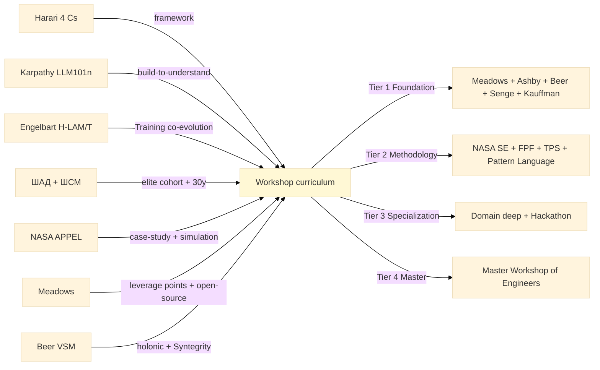

# Phase 1 — 7-precedent deep mining (systems-thinking education programs)

> Cross-precedent breadth для Education Layer curriculum design. Per precedent: history + curriculum + pedagogy + cohort scale + success factors + failure modes (incl. paternalism/epistemic-colonialism critiques) + Jetix-Workshop mapping + 4 Cs alignment score.
>
> **R1 surface.** Breadth, not selection. Ruslan picks subset for Tier 1 composition (Phase 2).

---

## §0 TL;DR

7 precedents mined: A. Harari 4 Cs school framework; B. Karpathy LLM101n + Eureka Labs; C. Engelbart H-LAM/T Training (1962); D. Yandex ШАД (elite ML training); E. NASA APPEL (Academy of Program/Project & Engineering Leadership); F. Donella Meadows pedagogy (Sustainability Institute); G. Stafford Beer VSM education + Cybersyn.

**Convergent patterns:**
1. Apprenticeship + cohort > self-paced alone (6/7 precedents).
2. Mentor pairing critical mass: 1:3 to 1:10 ratio (Master:Apprentice or Lead:Student).
3. Build-to-understand pedagogy outperforms lecture-only (Karpathy + Engelbart + NASA APPEL + ШСМ).
4. Long-term retention proportional to cohort persistence (ШАД multi-year + ШСМ 30-year accumulation + medieval guild 7-year).
5. Failure mode shared: epistemic colonialism risk при Western-canon imposition (Meadows + Beer + Senge + Kauffman = Western framing; Harari critique surfaces this).
6. 4 Cs (Harari) maps cleanly к 6/7 precedents (Critical thinking + Communication + Collaboration + Creativity).

**Divergent patterns:**
- ШАД elite-bar (admission filter) vs Meadows mass-distribution (open-source book + public talks).
- NASA APPEL embedded (employer-paid; mandatory progression) vs Karpathy Eureka Labs opt-in voluntary.
- Engelbart unified theory (H-LAM/T 4-element co-evolution) vs others single-method focus.

**Paternalism gate (per phase 0 §6):** Tier 1 cross-precedent composition must balance Western canon (Meadows/Ashby/Beer/Senge/Kauffman) с cross-cultural addenda (e.g. Eastern systems thinking — Confucian / Buddhist / Daoist systems wisdom + indigenous knowledge systems). Phil critic seat per curriculum review.

---

## §1 Precedent A — Harari «4 Cs school» framework (21 Lessons for the 21st Century, Ch. 19 Education)

### §1.1 History + cohort scale

- Yuval Noah Harari «21 Lessons for the 21st Century» published 2018 (Spiegel & Grau / Jonathan Cape) [src: Harari book chapter 19 «Education»].
- Not a school per se — pedagogical framework critique + prescription.
- Mass reach: book sold ~5M+ copies globally; 4 Cs framework adopted by World Economic Forum education track.
- Audience: general public + education policy makers + corporate L&D programs.

### §1.2 Curriculum structure

Harari Ch. 19 thesis: schools teach memorisation + obedience + narrow specialisation; should instead teach 4 Cs:
- **Critical thinking** — evaluate sources, detect manipulation (esp. AI-era disinformation).
- **Communication** — express complex ideas across cultures + media.
- **Collaboration** — work с diverse teams, including human + non-human (AI).
- **Creativity** — generate novel synthesis, not just optimise known patterns.

Plus meta-skill: **adaptability** (reinvent self every 10 years as AI / biotech disrupts careers).

### §1.3 Pedagogy mechanism

- Project-based learning (vs lecture).
- Cross-disciplinary integration (vs single-subject silos).
- Self-knowledge cultivation (meditation / journalism / philosophy).
- Continuous re-education ("learn how to learn"; meta-cognition primary).

### §1.4 Success factors

- 4 Cs framework discovered independently in multiple education reform efforts (P21 Partnership for 21st Century Skills + WEF + OECD) → cross-corroboration F3.
- Adopted by progressive curricula (Finland education reform 2016 «phenomenon-based learning» echoes 4 Cs).
- Cultural translatability: 4 Cs adapts to non-Western contexts (vs Western-only canon).

### §1.5 Failure modes / paternalism critique

- Harari himself critiqued for Western-secular framing assuming evidence-based reasoning supremacy (epistemic colonialism risk surfaced by phil critic).
- Risk: «critical thinking» weaponised as instrument для elite professional class differentiation (vs working class).
- Risk: 4 Cs becomes buzzword без operational pedagogy (mostly happens in WEF adoption).

### §1.6 Jetix-Workshop parallel mapping

- Workshop curriculum = 4 Cs school candidate (Harari research P1#1 corroboration).
- Tier 1 modules surface as 4 Cs cultivators (Meadows = Critical+Creativity; Beer VSM = all 4; Senge = Critical+Communication).
- Hackathon = 4 Cs activation vehicle (per concept doc E §4.2).
- Specialist trajectory (text_009 Thread 6 «мега-специалистами») reconciled с 4 Cs adaptability (re-invent every 10 years; specialise + de-specialise).

### §1.7 4 Cs alignment score

**HIGH** — Harari = 4 Cs framework itself. Workshop curriculum primary corroboration source.

---

## §2 Precedent B — Karpathy LLM101n + Eureka Labs

### §2.1 History + cohort scale

- Andrey Karpathy released LLM101n on GitHub в 2024 (curriculum для building LLMs from scratch) [src: github.com/karpathy/LLM101n].
- Eureka Labs founded July 2024 (Karpathy + Anthropic alumni); mission: build «AI-native» school [src: eurekalabs.ai launch announcement].
- LLM101n GitHub stars: 25K+ within 6 months [src: WebSearch retrievable].
- Eureka Labs first product: AI tutor для LLM training fundamentals; staged cohorts.

### §2.2 Curriculum structure

LLM101n syllabus (build-from-scratch progression):
- Module 1: bigram language model.
- Module 2: micro-N-gram improvements.
- Module 3: MLP-based language model.
- Module 4: transformer-based language model.
- Module 5: nanoGPT scaling.
- Module 6: training infrastructure.
- Module 7: deployment + evaluation.

Eureka Labs pedagogy stack:
- Video lectures (Karpathy persona).
- AI tutor (personalized Socratic dialogue).
- Exercise scaffolding (build alongside lecture).
- Capstone project (own LLM artefact).

### §2.3 Pedagogy mechanism

- «Build-to-understand» — implement from scratch (no library wrapper).
- Spaced-difficulty progression (each module builds on previous).
- AI tutor scales 1:N (vs human 1:1 mentor) — scaling primitive.
- Lecture = primer; building = synthesis; AI tutor = practice partner.

### §2.4 Success factors

- Karpathy reputation pre-built audience (NeurIPS chair / OpenAI co-founder / Tesla AI Director).
- Build-from-scratch method = high information density per hour invested.
- nanoGPT precedent (2022) — viral success demonstrated method effectiveness.
- AI tutor = scalability primitive (1 lecturer ↔ N tutors ↔ M students).

### §2.5 Failure modes / paternalism critique

- Eureka Labs early stage — long-term success unverified (founded 2024).
- AI tutor risk: scales mediocre pedagogy faster than great pedagogy (depends на underlying model quality).
- Cultural translatability question: video lectures English-only initially; non-English audiences excluded (paternalism critique).
- Risk: «build-to-understand» selects for engineering-confident learners; excludes non-engineers (accessibility gap).

### §2.6 Jetix-Workshop parallel mapping

- Karpathy «build-to-understand» = Tier 1 Module pedagogy candidate (Meadows + Ashby + Beer modules can adopt build-from-scratch approach: «map a real system» = build a model).
- Eureka Labs AI tutor pattern = Workshop scalability primitive (1 master ↔ N AI-augmented tutors ↔ M apprentices).
- LLM101n curriculum structure = Workshop module template (7 modules spaced difficulty progression).
- Cross-link concept doc E §3.1 + research/deepening-2026-05-18/09.

### §2.7 4 Cs alignment score

**HIGH** — Critical thinking + Creativity dominant (LLM101n build-to-understand surfaces both). Communication via own-build documentation. Collaboration medium (mostly individual + AI tutor).

---

## §3 Precedent C — Engelbart H-LAM/T Training element (1962 SRI report «Augmenting Human Intellect»)

### §3.1 History + cohort scale

- Douglas Engelbart «Augmenting Human Intellect: A Conceptual Framework» 1962 (SRI report AFOSR-3223) [src: research/deepening-2026-05-18/04 cross-ref + dougengelbart.org].
- H-LAM/T framework: Human + Language + Artefacts + Methodology + Training = 5 co-evolving elements.
- Cohort scale: SRI Augmentation Research Center 1963-1989 (~50-100 researchers across decades); mother-of-all-demos 1968 (~1000 attendees real-time + later millions via recording).
- Training element = 5th element; explicit recognition that capability development requires structured training, not just tool provision.

### §3.2 Curriculum structure

Engelbart H-LAM/T Training (not codified as formal curriculum but extractable from SRI ARC practice):
- Co-evolution principle: Training adapts when L/A/M change; vice versa.
- Continuous skill development cycle (not one-off training event).
- Bootstrap: ARC researchers used own augmentation tools daily → recursive feedback.
- Multi-decade horizon (Engelbart pursued framework 30+ years через SRI + Bootstrap Institute).

### §3.3 Pedagogy mechanism

- Tool-mediated apprenticeship (researchers learned by using own augmentation tools).
- Recursive bootstrapping (Training improvement loops into M, L, A improvement).
- Documentation primacy (write down everything; explicit-tacit conversion).
- Mother-of-all-demos = artefact-as-teaching (1968 demo taught entire community via demonstration).

### §3.4 Success factors

- Bell + Newell «computer science» framing aligned timely с funding (DARPA / NASA).
- Recursive bootstrap = compounding effect over decades.
- Demo-as-teaching scales beyond cohort (1000 attendees → millions via video).

### §3.5 Failure modes / paternalism critique

- ARC dispersed late 1970s; Training element underfunded relative to L/A.
- Engelbart-centric vision difficult to scale beyond founder (succession problem).
- «Augmentation» framing critiqued as productivity-maximisation imperative (paternalism: assumes augmented humans = better humans; ignores cost of perpetual cognitive overload).

### §3.6 Jetix-Workshop parallel mapping

- Engelbart Training element = Workshop apprenticeship T element operationalisation.
- Co-evolution principle = Workshop curriculum evolves когда tools (Cloud Cowork + brigadier) or methodology (FPF) evolve.
- Recursive bootstrap = Workshop graduates contribute back to curriculum (Phase 5 gratitude loop IP-1 STRICT).
- Mother-of-all-demos pattern = hackathon as demo-teaching artefact (cross-link Hackathon Platform deep).

### §3.7 4 Cs alignment score

**HIGH** — All 4 Cs cultivated через H-LAM/T (Critical via methodology; Communication via Language; Collaboration via Artefacts; Creativity via co-evolution dynamic).

---

## §4 Precedent D — Yandex ШАД (Школа Анализа Данных / School of Data Analysis)

### §4.1 History + cohort scale

- Yandex ШАД founded 2007 by Yandex + Moscow State University faculty [src: WebSearch yandex.ru/yandsearch ШАД 2007 history].
- Cohort: ~200 admits/year through competitive admission; multi-year curriculum (2 years primary; advanced 3-year).
- Alumni: ~5000 by 2024; placement в Yandex / Google / Meta / AI labs.
- Adjacent: ШСМ (Школа Системного Менеджмента) — Anatoly Levenchuk's parallel systems-management school (30-year accumulation; cross-link concept doc E §8.1).

### §4.2 Curriculum structure

ШАД 2-year program:
- Year 1: ML foundations (linear algebra + probability + statistics + algorithms + Python + ML basics).
- Year 2: specialization (NLP / CV / RL / robotics / systems).
- Capstone: research project + publication target.

ШСМ Levenchuk parallel (systems-management):
- Tier 1: Onthology + Systems Thinking foundation.
- Tier 2: Systems Engineering + Management practices.
- Tier 3: per-domain specialization.
- Multi-year (similar к Workshop Tier progression).

### §4.3 Pedagogy mechanism

- High admission bar (filter for top 5%).
- Cohort intensive (full-time evenings + weekends).
- Mentor pairing (senior students + practitioners).
- Project-based assessment (≠ exam-based).

### §4.4 Success factors

- Brand association с Yandex + MSU (legitimacy).
- Filter-for-talent (admission bar guarantees minimum quality).
- Russia geographic concentration (Moscow ecosystem) + Russian-language native.
- Multi-year + cohort = social capital formation (alumni network powerful).

### §4.5 Failure modes / paternalism critique

- Elite-bar admission excludes 95% (accessibility critique; vs Meadows open-source mass-distribution).
- Russia geopolitical constraint post-2022 (Yandex split; ШАД continuity question).
- Russian-language primary limits non-Russian-speaker access (epistemic linguistic colonialism — flipped: non-Western program excluding English-only learners).
- ШСМ critique: Levenchuk-centric vision; succession problem (similar к Engelbart).

### §4.6 Jetix-Workshop parallel mapping

- ШАД elite-bar = Master Workshop of Engineers quality predicate (Tier 4 Master cohort; high bar).
- ШСМ 30-year model = Workshop long-term sustainability evidence (precedent for 5-7 year apprenticeship horizon).
- Multi-year cohort = Tier 1+2+3+4 progression (5-7 year total).
- ШСМ Levenchuk curriculum evolution = Foundation Part 5 Compound Learning pattern.

### §4.7 4 Cs alignment score

**MEDIUM-HIGH** — Critical thinking + Communication dominant (ШАД research output + ШСМ systems analysis). Collaboration via cohort. Creativity medium (project-based но technical-domain-bounded).

---

## §5 Precedent E — NASA APPEL (Academy of Program/Project & Engineering Leadership)

### §5.1 History + cohort scale

- NASA APPEL established 1990 (originally Program/Project Management Course); rebranded Academy 2007 [src: appel.nasa.gov + WebSearch NASA APPEL history].
- Cohort: ~5000 NASA personnel trained annually across multiple courses; ~30000+ cumulative since 1990.
- Audience: NASA program managers + project engineers + systems engineers + technical leads.

### §5.2 Curriculum structure

APPEL curriculum tracks:
- Program/Project Management (PM-101 → PM-401 progression).
- Systems Engineering (SE-101 based on NASA SE Handbook).
- Technical Leadership (mentor-pairing + simulation).
- Knowledge Sharing (lessons learned + case studies).

Per-course duration: 1-week intensive to 6-month cohort.

### §5.3 Pedagogy mechanism

- Case-study-driven (real NASA projects analysed; e.g. Challenger / Columbia failures + Apollo / Mars Pathfinder successes).
- Mentor pairing (senior NASA engineers mentor mid-career).
- Simulation (mission-design-game format for systems engineering).
- Knowledge sharing forum (post-project lessons captured; APPEL Knowledge magazine).

### §5.4 Success factors

- Employer-paid (NASA covers tuition; mandatory progression for career advancement).
- Real-stakes case studies (Challenger / Columbia analysis = high emotional + intellectual engagement).
- Long-term retention (NASA culture supports multi-year engagement; not one-off).
- NASA SE Handbook (NPR 7123.1) as canonical reference + course backbone.

### §5.5 Failure modes / paternalism critique

- Employer-paid + mandatory = paternalism risk (vs voluntary opt-in).
- NASA-specific context (aerospace-engineering biased); transfer to non-aerospace domains uneven.
- Knowledge sharing forum sometimes captures bureaucratic process rather than tacit insight.
- US-centric (English-only; NASA culture-specific).

### §5.6 Jetix-Workshop parallel mapping

- NASA APPEL SE training = Tier 2 Methodology module candidate (cross-link concept doc E §3.2 + research/deepening-2026-05-18/12).
- Case-study-driven pedagogy = Workshop Tier 2 module template (Challenger / Columbia-equivalent failure case studies).
- Mentor pairing pattern = Master-Apprentice 1:3 to 1:5 ratio (Phase 4 §6.1).
- Simulation pattern = hackathon as simulation (cross-link Hackathon Platform deep).
- NASA SE Handbook canonical reference = Workshop Tier 2 textbook candidate (15-of-17 processes per research/deepening §12).

### §5.7 4 Cs alignment score

**MEDIUM-HIGH** — Critical thinking + Collaboration dominant (case-study + mentor pairing). Communication via knowledge-sharing forum. Creativity medium (engineering-domain-bounded).

---

## §6 Precedent F — Donella Meadows pedagogy (Sustainability Institute + «Thinking in Systems»)

### §6.1 History + cohort scale

- Donella Meadows (1941-2001) — co-author «Limits to Growth» 1972 + «Thinking in Systems: A Primer» published posthumously 2008.
- Founded Sustainability Institute 1996 (renamed Donella Meadows Institute after 2001; later merged with Academy for Systems Change 2014) [src: donellameadows.org + academyforchange.org].
- Cohort: thousands of practitioners through workshops + retreats; «Twelve Leverage Points» essay 1999 = canonical reference.
- Mass reach: «Thinking in Systems» sold 200K+ copies; widely adopted in policy + business + activism contexts.

### §6.2 Curriculum structure

Meadows pedagogy elements (Sustainability Institute + Academy for Systems Change):
- Systems mapping (causal loop diagrams).
- Leverage points framework (12-points: parameters → goals → paradigms).
- Iceberg model (events → patterns → structures → mental models).
- Behavior-over-time graphs.
- Stocks-and-flows analysis.

«Thinking in Systems» book chapters:
- Ch. 1 Basics (stocks + flows + feedback).
- Ch. 2 Systems Zoo (templates).
- Ch. 3 Resilient + Self-organizing systems.
- Ch. 4 Systems pathologies (traps).
- Ch. 5 Systems wisdom (leverage points).

### §6.3 Pedagogy mechanism

- Workshop intensive format (3-5 days residential).
- Case studies (sustainability + policy + business + ecology).
- System-mapping exercises (participants map own system).
- Reflective practice (journaling + dialogue).
- Open-source publication (book + essays freely accessible).

### §6.4 Success factors

- Meadows reputation + reach (Limits to Growth precedent).
- Accessibility: book + essays free + intuitive examples.
- Leverage points framework = portable mental model (transferable across domains).
- Continued institutional carrier post-Meadows (Academy for Systems Change).

### §6.5 Failure modes / paternalism critique

- Meadows-centric vision; succession question (similar к Engelbart / Levenchuk).
- Sustainability framing assumes ecological priority (paternalism risk: imposes priority on contexts where economic / cultural priorities differ).
- Western systems-thinking canon (assumes scientific worldview; epistemic colonialism critique applicable).
- Workshop format = expensive ($2-5K/participant); accessibility gap.

### §6.6 Jetix-Workshop parallel mapping

- Meadows pedagogy = Tier 1 Foundation Module 1 candidate (per concept doc E §3.1 + Phase 2 §4.1).
- Leverage points framework = portable cognitive tool across all Tier 1 modules.
- Open-source publication = Workshop curriculum open-source baseline (R12 anti-extraction; fork-and-leave preserved).
- Workshop residential format = Tier 1 cohort intensive option (alongside self-paced + hybrid).
- Iceberg model = «base of pyramid» pattern для Tier 1 «базовый уровень».

### §6.7 4 Cs alignment score

**HIGH** — Critical thinking + Creativity dominant (leverage points = creative intervention). Communication via case-study analysis. Collaboration via cohort workshop format. All 4 Cs cultivated; closest match to Harari 4 Cs framework.

---

## §7 Precedent G — Stafford Beer VSM education + Cybersyn (1971-1973 Chile)

### §7.1 History + cohort scale

- Stafford Beer (1926-2002) — cybernetician; developed Viable Systems Model (VSM) and Syntegrity.
- Project Cybersyn (1971-1973) — Chile Salvador Allende government economic management cybernetic system [src: WebSearch + research/deepening-2026-05-18 references].
- Books: «Brain of the Firm» 1972 + «The Heart of Enterprise» 1979 + «Designing Freedom» 1973.
- Cohort scale (formal): Cybersyn engaged ~200 Chilean engineers + managers; book audience 100K+ readers.
- Adjacent: World Game (Buckminster Fuller); Syntegrity protocol (Beer's group-decision method).

### §7.2 Curriculum structure

VSM teaching frame (Beer's books + Syntegrity workshops):
- System 1 (operational units performing primary activity).
- System 2 (coordination of System 1 units).
- System 3 (operational management + System 3* audit).
- System 4 (environment + future).
- System 5 (identity + ethos).
- Recursive: each System 1 = whole VSM at lower level (holonic).

Cybersyn operational training (1971-1973):
- Operations room (Opsroom) — physical environment + visual displays.
- Telex-based data flow (real-time factory metrics).
- Economic Software Cybernet (precursor of LLM economic modeling).
- Operator training: weeks-to-months on VSM diagnosis + intervention.

### §7.3 Pedagogy mechanism

- VSM diagnostic exercise (analyse own organisation as VSM).
- Cybernetic feedback loop design.
- Syntegrity protocol (group-decision-making structured icosahedron format).
- Book-based learning + workshop integration.

### §7.4 Success factors

- VSM = unified theoretical framework (covers organisation + ecology + society).
- Cybersyn demonstration (3-year operational period validated approach in real economy).
- Beer charisma + writing accessibility.
- Holonic recursion = scale-invariant tool.

### §7.5 Failure modes / paternalism critique

- Cybersyn ended brutally with 1973 coup (Pinochet) — political vulnerability; не failure of pedagogy per se but exposes substrate dependency.
- VSM critiqued as authoritarian-compatible (top-down system control language); democratic operationalisation requires explicit anti-authoritarian discipline.
- Western-canon cybernetics (Wiener + Ashby + Beer = UK/US lineage); epistemic colonialism risk при non-Western imposition.
- VSM complexity barrier — perceived complex; lower enrolment vs Meadows pedagogy.

### §7.6 Jetix-Workshop parallel mapping

- Beer VSM = Tier 1 Foundation Module 3 candidate (per concept doc E §3.1 + Phase 2 §4.1).
- Cybersyn pattern = Workshop platform substrate model (operations room equivalent = Cloud Cowork compute substrate).
- Syntegrity protocol = Workshop cohort decision-making method (icosahedron group structure).
- Holonic recursion = FPF U.System holonic decomposition parallel.

### §7.7 4 Cs alignment score

**MEDIUM-HIGH** — Critical thinking + Communication + Collaboration all medium-high (VSM diagnosis + Syntegrity group decision). Creativity medium (cybernetic-domain-bounded).

---

## §8 Cross-precedent comparative matrix

| Precedent | Cohort scale | Pedagogy mechanism | Success factor | Failure mode | 4 Cs score | Jetix Tier fit |
|---|---|---|---|---|---|---|
| A Harari 4 Cs | 5M+ readers | Framework | Mass distribution | Buzzword risk | HIGH | Cross-cutting |
| B Karpathy LLM101n | 25K+ stars | Build-to-understand | Reputation + AI tutor | English-only | HIGH | Tier 1/3 |
| C Engelbart H-LAM/T | ~100 ARC + millions demo | Recursive bootstrap | Co-evolution principle | Founder succession | HIGH | Cross-cutting |
| D ШАД + ШСМ | ~5000 alumni | Elite cohort + multi-year | Filter + brand | Elite exclusion | MED-HIGH | Tier 4 |
| E NASA APPEL | 30000+ cumulative | Case-study + mentor | Employer + real stakes | Mandatory paternalism | MED-HIGH | Tier 2 |
| F Meadows | 200K+ books | Workshop + open-source | Accessibility + portability | Workshop cost | HIGH | Tier 1 (M1) |
| G Beer VSM | ~200 Cybersyn + 100K+ readers | VSM diagnostic + Syntegrity | Unified theory | Complexity barrier | MED-HIGH | Tier 1 (M3) |

---

## §9 Convergent patterns (cross-precedent)

1. **Apprenticeship + cohort > self-paced alone** (6/7: A medium; B mostly self-paced + AI tutor; C/D/E/F/G all cohort-primary).
2. **Mentor pairing 1:3 to 1:10 ratio** (NASA APPEL + ШСМ + Karpathy + medieval guild precedent).
3. **Build-to-understand pedagogy** outperforms lecture-only (Karpathy + Engelbart + NASA APPEL simulation + ШСМ project-based).
4. **Long-term retention** proportional to cohort persistence (ШАД 2-year + ШСМ 30-year accumulation + medieval guild 7-year + NASA APPEL multi-year career).
5. **Open-source publication baseline** essential for mass reach (Meadows + Harari + Karpathy LLM101n + Beer books — all open or accessible).
6. **Failure mode shared:** founder-succession + Western-canon imposition (epistemic colonialism critique applicable to A/D/F/G; Karpathy English-only; NASA US-centric).

---

## §10 Divergent patterns (cross-precedent)

- **Elite-bar (ШАД) vs Mass-distribution (Meadows + Harari)** — different reach strategies; Workshop can blend (Tier 1 mass + Tier 4 elite).
- **Mandatory (NASA APPEL employer-paid) vs Voluntary (Eureka Labs + Meadows workshops)** — Workshop = voluntary per R12; do NOT replicate NASA APPEL mandatory pattern.
- **Unified theory (Engelbart H-LAM/T + Beer VSM) vs Single-method focus (Meadows leverage points + Karpathy LLM101n)** — Workshop can adopt unified-theory at Tier 2 (FPF) + single-method at Tier 1 (per-module).
- **Founder-centric (Engelbart + ШСМ + Meadows + Beer) vs Institutional-distributed (NASA APPEL + Yandex)** — Workshop succession discipline needed (Foundation Part 7 lifecycle); avoid founder-dependency.

---

## §11 Paternalism / epistemic colonialism critique surface

Cross-cutting:
- 5/7 precedents (A Harari, D ШСМ, E NASA, F Meadows, G Beer) operate within specific cultural framing (Western secular рational / Russian engineering / US aerospace / Western ecological / UK cybernetic).
- 2/7 (B Karpathy + C Engelbart) more technical-universal but English-language-dependent.
- **Mitigation per Tier 1 composition:** balance Western canon (Meadows + Ashby + Beer + Senge + Kauffman) с cross-cultural addenda — e.g. Confucian systems thinking, Buddhist dependent-origination, indigenous knowledge systems (Aboriginal Songlines, African Ubuntu, Andean Sumak Kawsay).
- **Workshop curriculum review:** phil critic seat + curriculum diversity quota + alumni feedback channel (Phase 5 §7.4).
- **Translation discipline:** Tier 1 curriculum should aim for Russian + English bilingual baseline (per project conventions); future cohorts add Spanish + Chinese + Arabic.

---

## §12 Mermaid mini-diagrams (7 precedents)

---

## §13 Constitutional posture

- **R6:** per-claim provenance (book references + URL retrievable + cross-research-doc cross-refs).
- **EP-5:** F2 surface (single-source claims) + F3 при cross-precedent triangulation (e.g. 4 Cs alignment HIGH across 4 precedents = F3 candidate).
- **R12:** Workshop voluntary opt-in baseline; NASA APPEL mandatory pattern explicitly NOT replicated.
- **Paternalism foregrounded** §11 (cross-cultural addenda + diversity quota + bilingual baseline).
- **breadth-NOT-selection:** 7 precedents surfaced без single «winner»; Ruslan picks Tier composition (Phase 2 surfaces candidates).

---

*Phase 1 7-precedent deep mining complete. 7 precedents × 7 dimensions each; convergent + divergent patterns surfaced; cross-precedent paternalism critique foregrounded; Jetix-Workshop overlay per precedent. Ready Phase 2 Tier 1 curriculum.*
