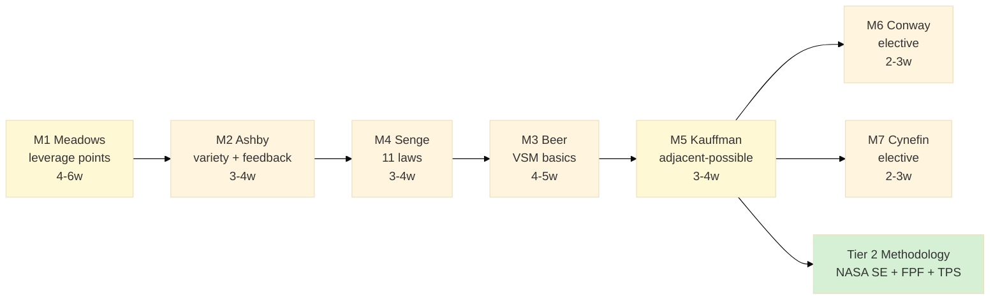

# Phase 2 — Tier 1 Foundation curriculum (5-7 systems-thinking core modules)

> **R1 surface.** 7 candidate modules surfaced; Ruslan picks 5-7 final composition. Sequencing recommendation surfaced as one option; не singular mandate.
>
> **Paternalism mitigation foregrounded:** all modules opt-in; multiple pedagogical paths preserved per module; fork-and-leave at module boundary; cross-cultural addenda per §6.

---

## §0 TL;DR

7 candidate Tier 1 modules surfaced based on concept doc E §3.1 + Phase 1 cross-precedent corroboration:

1. **M1 Meadows leverage points + systems mapping** (4-6 weeks; HIGH 4 Cs)
2. **M2 Ashby requisite variety + feedback loops** (3-4 weeks; HIGH Critical)
3. **M3 Beer VSM basics** (4-5 weeks; HIGH Comm + Collab)
4. **M4 Senge 11 laws** (3-4 weeks; HIGH Critical + Comm)
5. **M5 Kauffman adjacent-possible + emergence** (3-4 weeks; HIGH Creativity)
6. **M6 Conway's Law + sociotechnical** (2-3 weeks elective; HIGH Critical + Comm)
7. **M7 Cynefin + sense-making** (2-3 weeks elective; MED all)

**Recommended sequence (Ruslan picks):** M1 → M2 → M4 → M3 → M5 → (M6+M7 electives). Full Tier 1 duration: 5-7 months cohort / 8-12 months self-paced.

**Quality predicate:** «Trainee maps non-trivial system + identifies 3 leverage points within 2 hours» (per concept doc E §3 spirit). Mentor sign-off required tier completion.

**Paternalism mitigation:** modules opt-in; recommended sequence ≠ enforced; multiple pedagogical paths (lecture / case / Socratic / build-to-understand); cross-cultural addenda; fork-and-leave at module boundary; alumni feedback channel; phil critic curriculum review seat.

---

## §1 Module 1 — Meadows leverage points + systems mapping

### §1.1 Source
- Donella Meadows «Thinking in Systems: A Primer» (2008) + «Leverage Points: Places to Intervene in a System» essay (1999) [src: donellameadows.org/archives/leverage-points-places-to-intervene-in-a-system + research/deepening-2026-05-18/05 cross-ref].
- Cross-link Phase 1 §6 Precedent F (Meadows pedagogy).

### §1.2 Duration
- Cohort: 4-6 weeks (3-5 hrs/week + 8-10 hrs reflection).
- Self-paced: 6-10 weeks.

### §1.3 Pedagogy mechanism
- Lecture-discussion hybrid (open-source video lectures + cohort Socratic dialogue).
- System-mapping exercise: each trainee maps a real-world system (own work / community / family / project).
- Case study: classic Meadows examples (fishery collapse / climate feedback / poverty trap).
- Reflective journaling: per-week insight capture.

### §1.4 Assessment
- Map a non-trivial system (e.g. own project) + identify 3 leverage points + propose 1 intervention.
- Peer review (2 peers + 1 mentor).
- Mentor sign-off для module completion.

### §1.5 4 Cs alignment
- **Critical thinking HIGH** — leverage points evaluation requires deep analysis of system structure.
- **Communication MEDIUM** — system map = visual communication artefact.
- **Collaboration MEDIUM** — peer review + cohort dialogue.
- **Creativity HIGH** — intervention design = creative synthesis.

### §1.6 Cross-precedent corroboration
- Meadows pedagogy (Phase 1 §6) — primary source.
- Beer VSM (Phase 1 §7) — leverage points complement VSM diagnosis.
- Engelbart H-LAM/T (Phase 1 §3) — leverage points = M(ethodology) element.

### §1.7 Paternalism mitigation
- Open-source book + essay freely accessible (Meadows estate honored open-access).
- Case studies include non-Western examples (e.g. South Asian water management, African Ubuntu economic systems) — phil critic addendum.
- Multiple intervention frames (technical / social / ecological / political) preserved; no singular «correct» intervention.

---

## §2 Module 2 — Ashby requisite variety + feedback loops

### §2.1 Source
- W. Ross Ashby «An Introduction to Cybernetics» (1956), Chapter 11 «Requisite Variety» [src: pcp.vub.ac.be/ASHBBOOK.html + classic cybernetics reference].
- Adjacent: Norbert Wiener «Cybernetics» (1948); Heinz von Foerster second-order cybernetics.

### §2.2 Duration
- Cohort: 3-4 weeks (3 hrs/week + 5-8 hrs exercises).
- Self-paced: 5-7 weeks.

### §2.3 Pedagogy mechanism
- Lecture: variety + entropy + control intuitions (Ashby's law «only variety can absorb variety»).
- Feedback-loop simulation exercise (simple stock-and-flow simulator; identify reinforcing vs balancing loops).
- Case study: control systems (thermostat / immune response / market price discovery).
- Variety mismatch diagnosis: identify a real-world system where control variety < disturbance variety.

### §2.4 Assessment
- Identify variety mismatch in real system + propose variety increase intervention.
- Simulate (paper + simple Python notebook) feedback loop dynamics.
- Mentor sign-off + written analysis (1-2 pages).

### §2.5 4 Cs alignment
- **Critical thinking HIGH** — variety analysis requires structured decomposition.
- **Communication MEDIUM** — written analysis primary.
- **Collaboration LOW-MEDIUM** — mostly individual + occasional peer review.
- **Creativity MEDIUM** — intervention design.

### §2.6 Cross-precedent corroboration
- Beer VSM (Phase 1 §7) — Ashby = VSM foundation.
- Engelbart H-LAM/T (Phase 1 §3) — variety = augmentation rationale.
- NASA APPEL SE (Phase 1 §5) — requisite variety embedded в NASA risk management.

### §2.7 Paternalism mitigation
- Ashby framing = formal mathematical; minimizes cultural bias (cross-culturally translatable).
- Case studies span ecology / biology / economics / management (multi-domain).
- Critics' addendum: «requisite variety» weaponizable as control imperative (top-down management); explicit anti-authoritarian discipline в discussion.

---

## §3 Module 3 — Beer VSM (Viable Systems Model) basics

### §3.1 Source
- Stafford Beer «The Heart of Enterprise» (1979) + «Diagnosing the System for Organizations» (1985) [src: ResearchGate Beer + cybernetics archive].
- Case study: Project Cybersyn 1971-1973 Chile [src: WebSearch + Eden Medina «Cybernetic Revolutionaries» 2011].

### §3.2 Duration
- Cohort: 4-5 weeks (3-5 hrs/week + 8-10 hrs VSM diagnosis exercise).
- Self-paced: 7-9 weeks.

### §3.3 Pedagogy mechanism
- Lecture: VSM five systems (S1-S5) + recursive holonic structure.
- VSM diagnostic exercise: trainee diagnoses own organization (workplace / family / community) as VSM.
- Cybersyn historical case study (3-year operational period + 1973 coup ending).
- Syntegrity protocol introduction (Beer's group-decision icosahedron format) — optional supplementary workshop.

### §3.4 Assessment
- VSM diagnostic of own organization (identify S1-S5; surface variety mismatches; propose 1 intervention).
- Peer review pairing.
- Mentor sign-off.

### §3.5 4 Cs alignment
- **Critical thinking MEDIUM-HIGH** — VSM diagnosis structured analysis.
- **Communication HIGH** — VSM diagram = visual communication primary.
- **Collaboration HIGH** — VSM diagnosis often requires group input; Syntegrity = group method.
- **Creativity MEDIUM** — intervention design + variety amplification.

### §3.6 Cross-precedent corroboration
- Beer (Phase 1 §7) — primary source.
- Cybersyn = Engelbart H-LAM/T parallel (Cloud Cowork substrate parallel).
- ШСМ Levenchuk (Phase 1 §4) — VSM adopted в Levenchuk's systems-management curriculum.

### §3.7 Paternalism mitigation
- VSM critiqued as authoritarian-compatible (top-down system control language); explicit anti-authoritarian discipline в discussion.
- Cybersyn case study includes 1973 coup political vulnerability — surfaces substrate-political dependency.
- Holonic recursion principle preserves bottom-up agency (each S1 = whole VSM at lower level).
- Cross-cultural addendum: indigenous + non-Western governance VSM analogues (e.g. African palaver tradition; Andean ayllu collective; Iroquois Confederacy Great Law) per phil critic seat.

---

## §4 Module 4 — Senge 11 laws of systems thinking (Fifth Discipline)

### §4.1 Source
- Peter Senge «The Fifth Discipline: The Art & Practice of the Learning Organization» (1990; 2nd ed 2006) [src: ResearchGate Senge + WebSearch].
- Adjacent: «The Fifth Discipline Fieldbook» (1994) — practical exercises.

### §4.2 Duration
- Cohort: 3-4 weeks (3 hrs/week + 5-8 hrs case studies).
- Self-paced: 5-7 weeks.

### §4.3 Pedagogy mechanism
- Lecture: 11 laws of systems thinking (Senge Ch. 4).
  1. Today's problems come from yesterday's solutions.
  2. The harder you push, the harder the system pushes back.
  3. Behavior grows better before it grows worse.
  4. The easy way out usually leads back in.
  5. The cure can be worse than the disease.
  6. Faster is slower.
  7. Cause and effect are not closely related in time and space.
  8. Small changes can produce big results; but the areas of highest leverage are often the least obvious.
  9. You can have your cake and eat it too — but not at once.
  10. Dividing an elephant in half does not produce two small elephants.
  11. There is no blame.
- Organizational behavior case studies (industries: tech / healthcare / education / NGO).
- Senge 5 disciplines introduction (personal mastery / mental models / shared vision / team learning / systems thinking).
- Identify 3 Senge laws operating in own work context.

### §4.4 Assessment
- Identify 3 Senge laws in own work + propose intervention per law.
- Group dialogue session (4-6 trainees).
- Mentor sign-off + 1-page reflection.

### §4.5 4 Cs alignment
- **Critical thinking HIGH** — pattern recognition в behavior.
- **Communication HIGH** — narrative case-study writing.
- **Collaboration MEDIUM** — group dialogue.
- **Creativity LOW-MEDIUM** — primarily pattern recognition + intervention application.

### §4.6 Cross-precedent corroboration
- Senge book mass adoption corporate L&D + business schools.
- Cross-link Beer VSM (Senge influenced by Beer) + Meadows (mutually corroborative leverage frame).
- NASA APPEL knowledge sharing forum echoes Senge «learning organization».

### §4.7 Paternalism mitigation
- Senge framing = organizational; assumes hierarchical org context; cross-cultural addenda needed (community / family / cooperative / network contexts).
- «Personal mastery» critiqued as productivity-imperative paternalism (assumes self-improvement supreme); rebalance via Stoic + Buddhist + Confucian self-cultivation alternatives.
- «There is no blame» (Law 11) Western pragmatic framing; non-Western frameworks (e.g. South African Ubuntu Truth and Reconciliation) offer richer accountability discipline — phil critic addendum.

---

## §5 Module 5 — Kauffman adjacent-possible + emergence

### §5.1 Source
- Stuart Kauffman «At Home in the Universe» (1995) + «Reinventing the Sacred» (2008) + «The Origins of Order» (1993, academic) [src: santafe.edu + Kauffman biographical].
- Cross-link Steven Johnson «Where Good Ideas Come From» (2010) popularization of adjacent-possible.

### §5.2 Duration
- Cohort: 3-4 weeks (3 hrs/week + 5-8 hrs exercises).
- Self-paced: 5-7 weeks.

### §5.3 Pedagogy mechanism
- Lecture: emergence + self-organization + adjacent-possible.
  - NK fitness landscapes intuition (Kauffman classic).
  - Autocatalytic sets (origin of life biology framing).
  - Boolean networks (Kauffman's early work).
- Biology examples (evolution + ecosystems + immune system).
- Technology examples (innovation diffusion + Cambrian explosion of mobile apps).
- Adjacent-possible exercise: identify 3 adjacent-possible moves для own project / career / community.

### §5.4 Assessment
- Identify 3 adjacent-possible moves в own context + propose 1 experiment.
- Peer review.
- Mentor sign-off + 1-page experiment design.

### §5.5 4 Cs alignment
- **Critical thinking MEDIUM** — emergence intuition vs deductive reasoning.
- **Communication LOW-MEDIUM** — primarily own-context application.
- **Collaboration MEDIUM** — peer adjacent-possible exploration.
- **Creativity HIGH** — adjacent-possible = creativity primitive.

### §5.6 Cross-precedent corroboration
- Kauffman Santa Fe Institute complexity science lineage.
- Cross-link Karpathy LLM101n nanoGPT (Cambrian-explosion-of-mobile-apps parallel).
- Engelbart bootstrap (recursive adjacent-possible).

### §5.7 Paternalism mitigation
- Kauffman framing = secular naturalist; assumes scientific worldview; explicit acknowledgment of religious / spiritual / cultural frames where «adjacent-possible» maps к ancestor wisdom / vocational calling / fate.
- Risk: «innovation imperative» (always seek adjacent-possible) paternalism; rebalance: stability / continuity / preservation also valid value-orientations.

---

## §6 Module 6 (elective) — Conway's Law + sociotechnical systems

### §6.1 Source
- Mel Conway «How Do Committees Invent?» (1968 Datamation) [src: melconway.com/Home/Committees_Paper.html].
- Adjacent: «Team Topologies» (Matthew Skelton + Manuel Pais 2019) — modern Conway-aware org design.
- Sociotechnical systems literature (Tavistock Institute 1950s; Trist + Bamforth coal mining studies).

### §6.2 Duration
- Cohort: 2-3 weeks (3 hrs/week + 4-6 hrs case studies).
- Self-paced: 4-5 weeks.

### §6.3 Pedagogy mechanism
- Lecture: Conway's Law («organizations design systems that mirror their communication structures»).
- Inverse Conway maneuver (deliberately structure team to produce desired system structure).
- Case study: software architecture mirroring org chart (Amazon two-pizza teams; Spotify model; LMS at scale).
- Identify Conway's Law operating в own organization.

### §6.4 Assessment
- Identify Conway's Law in own org + propose 1 inverse-Conway intervention.
- 1-page diagnostic.

### §6.5 4 Cs alignment
- **Critical thinking HIGH** — org structure / system structure mirror analysis.
- **Communication HIGH** — diagnostic writing primary.
- **Collaboration MEDIUM** — org analysis often group-input.
- **Creativity LOW-MEDIUM** — intervention design.

### §6.6 Cross-precedent corroboration
- Cross-link Beer VSM (org structure invariants).
- Cross-link Senge «team learning» discipline.
- NASA APPEL org design intersects Conway.

### §6.7 Paternalism mitigation
- Conway framing = engineering organizational; cross-cultural variants (e.g. Japanese keiretsu, German Mitbestimmung codetermination, Mondragón cooperative) per phil critic.
- Inverse Conway critiqued as managerial-engineering imposition; preserve worker agency in restructure.

---

## §7 Module 7 (elective) — Cynefin + sense-making

### §7.1 Source
- Dave Snowden «Cynefin» framework (2003 onwards; «A Leader's Framework for Decision Making» HBR 2007) [src: cognitive-edge.com + WebSearch Snowden Cynefin].
- Adjacent: «The Cynefin Co» institutional carrier.

### §7.2 Duration
- Cohort: 2-3 weeks (3 hrs/week + 4-6 hrs case studies).
- Self-paced: 4-5 weeks.

### §7.3 Pedagogy mechanism
- Lecture: 4 + 1 Cynefin domains (Clear / Complicated / Complex / Chaotic + Confused / Disorder).
- Per-domain decision-making method (best practice vs good practice vs emergent practice vs novel practice).
- Case study: real decisions classified across domains.
- Classify 5 current decisions across domains.

### §7.4 Assessment
- Classify 5 decisions across Cynefin domains + propose method per domain.
- Peer pairing dialogue.
- 1-page reflection.

### §7.5 4 Cs alignment
- **Critical thinking MEDIUM** — domain classification.
- **Communication MEDIUM** — written analysis.
- **Collaboration MEDIUM** — peer dialogue.
- **Creativity MEDIUM** — emergent / novel practice design.

### §7.6 Cross-precedent corroboration
- Cynefin adopted в NATO + UK government policy + tech industry.
- Cross-link Meadows leverage points (different framing of intervention).
- Cross-link NASA APPEL risk management (chaotic / complex distinction).

### §7.7 Paternalism mitigation
- Cynefin Welsh-derived name + Snowden Welsh framing — culturally specific lineage acknowledged; framework adapts across cultures.
- Risk: Cynefin used as managerial-classification tool to dismiss complex-domain practitioners as «not best-practice»; preserve practitioner voice.

---

## §8 Tier 1 sequencing recommendation (Ruslan picks)

### §8.1 Recommended order
M1 (Meadows) → M2 (Ashby) → M4 (Senge) → M3 (Beer VSM) → M5 (Kauffman) → (M6 Conway + M7 Cynefin electives)

**Rationale:** M1 = accessibility primer (Meadows open-source + mass adoption); M2 = formal foundation (Ashby variety); M4 = behavioral application (Senge laws); M3 = unified framework (Beer VSM); M5 = creativity / emergence (Kauffman); M6+M7 electives для depth.

### §8.2 Alternative orders
- **Build-to-understand bias:** M5 → M2 → M1 → M3 → M4 → M6+M7 (start с emergence + variety formal foundations).
- **VSM-first:** M3 → M2 → M1 → M4 → M5 → M6+M7 (start с unified framework).
- **Senge organizational primer:** M4 → M1 → M2 → M3 → M5 → M6+M7 (start с familiar org-context Senge).

### §8.3 Per-module dependencies
- M1 → no prerequisites (entry point).
- M2 → optional M1 (concept of leverage helps).
- M3 → requires M2 (variety) + M1 (leverage).
- M4 → no strict prerequisites (Senge accessible).
- M5 → optional M2 (variety) — emergence builds on cybernetics.
- M6 → optional M1 (leverage) + M4 (Senge team learning).
- M7 → optional M3 (Beer) — VSM domain typology hints at Cynefin domains.

### §8.4 Duration full Tier 1
- Cohort 5 core modules (M1+M2+M3+M4+M5): 17-23 weeks (4-5.5 months).
- Cohort 7 modules: 22-31 weeks (5.5-8 months).
- Self-paced 5 modules: 28-38 weeks (6.5-9 months).
- Self-paced 7 modules: 36-50 weeks (8.5-12 months).

### §8.5 Mermaid sequencing diagram

---

## §9 Tier 1 4 Cs alignment matrix

| Module | C1 Critical | C2 Communication | C3 Collaboration | C4 Creativity |
|---|---|---|---|---|
| M1 Meadows | HIGH | MEDIUM | MEDIUM | HIGH |
| M2 Ashby | HIGH | MEDIUM | LOW-MED | MEDIUM |
| M3 Beer VSM | MED-HIGH | HIGH | HIGH | MEDIUM |
| M4 Senge | HIGH | HIGH | MEDIUM | LOW-MED |
| M5 Kauffman | MEDIUM | LOW-MED | MEDIUM | HIGH |
| M6 Conway | HIGH | HIGH | MEDIUM | LOW-MED |
| M7 Cynefin | MEDIUM | MEDIUM | MEDIUM | MEDIUM |

**Tier 1 aggregate 4 Cs cultivation:**
- 5-module core (M1+M2+M3+M4+M5): all 4 Cs MEDIUM-HIGH+ coverage.
- 7-module full (+ M6+M7): all 4 Cs HIGH coverage.
- 4 Cs alignment per concept doc E §3.1 + Harari research P1#1 **satisfied** with 5-module minimum.

---

## §10 Quality predicate (Tier 1 completion)

Per concept doc E §3 spirit + Phase 1 §1.6 Harari Workshop overlay:
- «Trainee maps a non-trivial system + identifies 3 leverage points + proposes 1 intervention within 2-hour facilitated exercise».
- Mentor sign-off required: mentor evaluates rigor (not pass/fail; surfaces specific gaps + readiness signal for Tier 2).
- Capstone: trainee's cumulative project portfolio across 5-7 modules (system maps + diagnostics + interventions).

---

## §11 Pedagogy options per module

Each module supports 3 pedagogical modes:
1. **Cohort lecture-discussion** (synchronous; 3-5 hrs/week; mentor-led).
2. **Self-paced study guide** (asynchronous; book + essays + exercises + mentor consultation on-demand).
3. **Build-to-understand** (Karpathy pattern; build artefact alongside theory; nanoGPT-equivalent for systems thinking — e.g. build a small system simulator).

**Hybrid (recommended):** cohort onboarding + self-paced deepening + cohort capstone session.

---

## §12 Paternalism mitigation Tier 1 (cross-module)

- All modules **opt-in voluntary** (R12 anti-extraction per concept doc E §9 R12 preserved).
- Recommended sequence **≠ enforced** (trainee can self-direct; mentor advises but doesn't impose).
- **Fork-and-leave at module boundary** — trainee can exit без penalty after any module completion.
- **Multiple pedagogical paths** per module (cohort / self-paced / build-to-understand) prevent monoculture.
- **Cross-cultural addenda** per module (non-Western systems-thinking traditions; phil critic seat in curriculum review).
- **Anonymous feedback channel** per cohort (non-zealot voice protected; Phase 5 §7.4 mitigation pattern applies).
- **Curriculum diversity quota** — Tier 1 v2.0 should include ≥1 non-Western framework primary module (e.g. Confucian systems thinking, Buddhist dependent-origination); v1.0 acknowledges Western-canon limitation explicitly.
- **Bilingual baseline** Russian + English; Tier 1 v2.0 add Spanish + Chinese + Arabic.

---

## §13 Cross-link к Tier 2-3-4

Tier 1 → Tier 2 transition:
- Tier 2 Methodology = NASA SE (life/work/body-as-spaceship per Phase 3) + TPS Hansei + Pattern Language + FPF discipline.
- Tier 1 prerequisites for Tier 2: M1 + M2 + (M3 or M4 or M5).

Tier 2 → Tier 3 transition:
- Tier 3 Specialization = domain deep-dive + hackathon participation.
- Hackathon = Tier 3 activation vehicle (cross-link Hackathon Platform deep).

Tier 3 → Tier 4 transition:
- Tier 4 Master apprenticeship = Master Workshop of Engineers (per Phase 4 §6.7).

---

## §14 Constitutional posture

- **R1:** 7 modules surfaced as candidates; Ruslan picks 5-7 final composition + sequencing.
- **R6:** per-module source citation + cross-precedent corroboration.
- **R12:** opt-in voluntary + fork-and-leave + diversity quotas per §12.
- **EP-5:** F2-F3 per module (F2 surface для new module variants; F3 при cross-precedent corroboration — Meadows F3, Beer F3, etc.).
- **Paternalism foregrounded** §12.
- **breadth-NOT-selection:** 7 modules + 3 alternative sequencings + 3 pedagogical modes — Ruslan picks subset.

---

*Phase 2 Tier 1 Foundation 5-7 modules curriculum complete. 7 modules × source + duration + pedagogy + assessment + 4 Cs alignment + cross-precedent + paternalism mitigation. Sequencing recommendation surfaced as one option. Ruslan picks final composition. Ready Phase 3 NASA life/work/body integration.*
