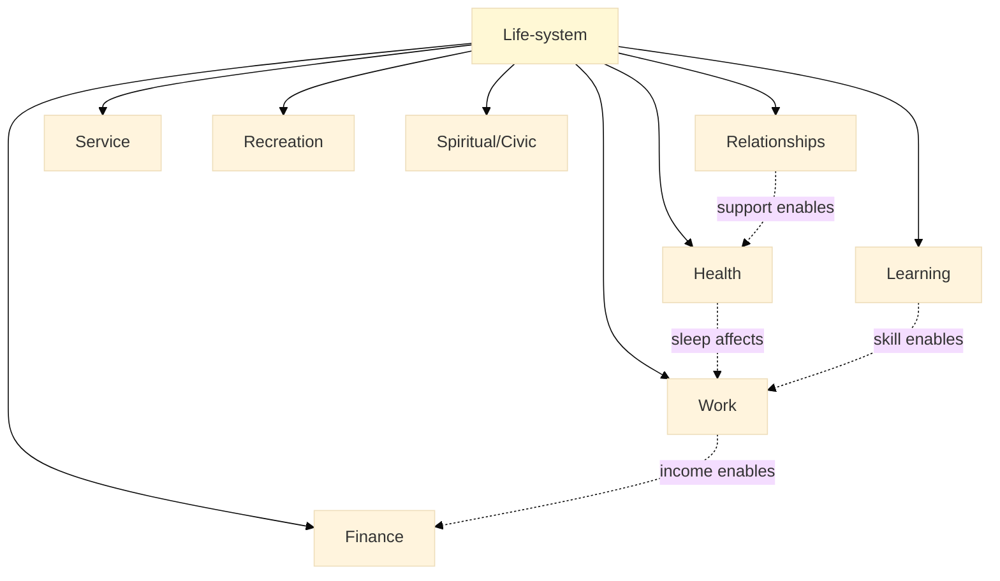
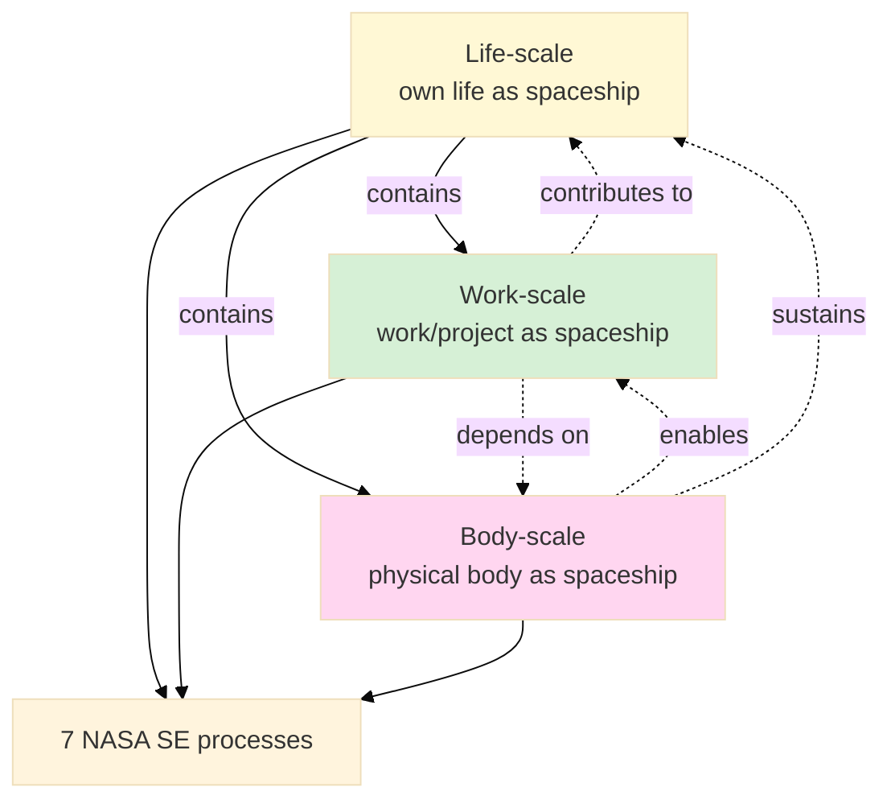
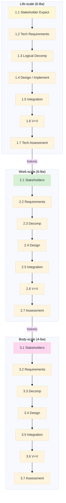

# Phase 3 — NASA framework integration (life/work/body-as-spaceship)

> text_009 Thread 8 (text_009:¶6): «адекватные люди вот вот почему так бы не подходить к разработке своей жизни круто круто что выходит вот как раз это относись к своей работе к своему там телу например точно так же как к космолету какому-то очень сложная система».
>
> Tier 2 Methodology module candidate: NASA Systems Engineering 7 processes applied к 3 nested scales (life / work / body). Holonic: each scale = sub-system + supersystem of next-level.
>
> **Paternalism mitigation foregrounded:** life-data privacy explicit (R12 — no extraction without explicit consent); secular framework compatibility surfaced; opt-in module enrolment.

---

## §0 TL;DR

NASA SE framework (per NPR 7123.1 Systems Engineering Processes Requirements; 17 total processes; 15-of-17 fit Jetix per research/deepening-2026-05-18/12) applied к 3 nested scales — life / work / body — produces Tier 2 Methodology module candidate.

**7 NASA SE processes selected** (subset of 15-of-17; rest in Tier 3+ specialization):
1. Stakeholder Expectations Definition
2. Technical Requirements Definition
3. Logical Decomposition
4. Design Solution / Implementation
5. Product Integration
6. Verification + Validation
7. Technical Assessment (periodic audit)

**3 nested scales (holonic):**
- **Life-scale** — own life as spaceship (personal life-design).
- **Work-scale** — work / project / Jetix as spaceship (per-project lifecycle).
- **Body-scale** — physical body as spaceship (health / fitness / sleep / nutrition).

Holonic structure: body ⊂ work ⊂ life; each scale = whole NASA SE process at its level.

**Pedagogy:** Module per 6-8 weeks; lecture + own-scale application + mentor pairing (TPS-style sensei-deshi from research/deepening-2026-05-18/14); cohort 10-20 ideal.

**Paternalism mitigation:** opt-in enrolment; **life-data privacy explicit** (no extraction of life-data without explicit consent — R12 enforcement); fork-and-leave preserved; secular NASA framework compatibility surfaced для cultural/religious frames.

---

## §1 NASA SE framework baseline

### §1.1 NPR 7123.1 17 processes
NASA Procedural Requirements 7123.1 «Systems Engineering Processes Requirements» (current rev 2020) — 17 processes organized в 3 categories:
- **System Design Processes (4):** Stakeholder Expectations / Requirements / Logical Decomposition / Design Solution.
- **Product Realization Processes (5):** Product Implementation / Integration / Verification / Validation / Transition.
- **Technical Management Processes (8):** Technical Planning / Requirements Management / Interface Management / Technical Risk Management / Configuration Management / Technical Data Management / Technical Assessment / Decision Analysis.

[src: NASA NPR 7123.1 + NASA Systems Engineering Handbook NASA/SP-2016-6105 + research/deepening-2026-05-18/12].

### §1.2 15-of-17 Jetix fit (prior research)
Research/deepening §12 identified 15 of 17 NASA SE processes fit Jetix engineering context; 2 (Mission Assurance + Hardware-specific Risk) NASA-aerospace-specific.

### §1.3 7-process subset для Tier 2
Selected 7 processes balance comprehensiveness + accessibility (8-12 week module budget per scale × 3 scales = 24-36 weeks total Tier 2 component):
1. Stakeholder Expectations Definition (NPR 7123.1 §3.1).
2. Technical Requirements Definition (§3.2).
3. Logical Decomposition (§3.3).
4. Design Solution / Implementation (§3.4 + §4.1).
5. Product Integration (§4.2).
6. Verification + Validation (§4.3 + §4.4).
7. Technical Assessment (§5.7).

---

## §2 Sub-module 1.1: Stakeholder Expectations (life-scale)

### §2.1 Method
Identify life-stakeholders:
- Self (current + future).
- Family (partner, children, parents, siblings).
- Community (friends, neighbors, faith / philosophical / civic).
- Employer + colleagues + clients.
- Society (broader civic + species + ecology — optional).

Per-stakeholder expectations elicitation:
- Socratic dialogue (mentor-facilitated).
- Journaling exercises (per-stakeholder reflection).
- Where applicable: direct conversation (with explicit consent + boundary discipline).

### §2.2 Conflict surface + AP-6 dissent preservation
- Stakeholder expectations often conflict (self-fulfillment vs family obligation; career vs health; etc.).
- Surface conflicts explicitly — do NOT auto-resolve.
- AP-6 dissent preservation per Pillar C: surface conflicts to trainee, NOT impose resolution.

### §2.3 Duration
2-3 weeks (4-6 hrs/week + reflection time).

### §2.4 Paternalism gate
- **Privacy boundary explicit** — direct conversation с stakeholders is voluntary; trainee can analyse expectations from own perspective without direct elicitation.
- **No platform extraction** of life-data — exercises stay in trainee's private workspace; mentor sees abstracted insights only with trainee consent.

---

## §3 Sub-module 1.2: Technical Requirements (life-scale)

### §3.1 Method
Derive requirements from §2 stakeholder expectations:
- Functional requirements (what life-system must do).
- Performance requirements (how well; quantified where possible).
- Constraints (resources / values / commitments / ethics).
- Verifiability discipline: each requirement carries testable acceptance criteria.

### §3.2 Example translation
- Stakeholder: «self wants meaningful work + financial stability».
- Functional requirement: «work activities produce X% time on flow-inducing tasks».
- Performance: «60% workweek on flow tasks measured weekly».
- Constraint: «monthly income ≥ €N covers fixed costs + savings rate».
- Acceptance criteria: weekly time-tracking + monthly budget review.

### §3.3 Duration
2 weeks.

### §3.4 Paternalism gate
- Requirements = trainee-authored; mentor advises но не imposes.
- «Measurable» is a discipline option; non-measurable values (e.g. aesthetic / spiritual / relational) preserved separately under «values + constraints» category.

---

## §4 Sub-module 1.3: Logical Decomposition (life-scale)

### §4.1 Method
Decompose life-system into life-areas:
- Health (physical, mental, emotional).
- Work / vocation.
- Relationships (intimate, family, friends, professional, community).
- Finance + resource management.
- Learning + growth.
- Service / contribution.
- Recreation + play.
- Spiritual / philosophical / civic engagement.

Hierarchy + interface definition: each life-area = sub-system; identify interfaces (where life-areas interact).

### §4.2 Mermaid example

### §4.3 Duration
2 weeks.

### §4.4 Paternalism gate
- Life-area decomposition = trainee's choice; defaults presented as menu, NOT mandate.
- Religious / philosophical / civic engagement = optional category; not all worldviews bracket «spiritual» separately (e.g. integrated traditions like Daoism / Confucianism / Indigenous integrated practice).

---

## §5 Sub-module 1.4: Design Solution / Implementation (life-scale)

### §5.1 Method
Per-area implementation plan:
- Action-level steps (concrete; bounded duration).
- Habit infrastructure (recurring; e.g. weekly review, daily sleep target).
- Tooling (calendar, journaling app, financial tracker, exercise log).
- Resource allocation (time / money / attention).

Cross-link Tier 1 M1 Meadows leverage points (apply leverage discipline к implementation).

### §5.2 Duration
3 weeks.

### §5.3 Paternalism gate
- Trainee picks own tooling; instructor surfaces options, NOT mandates specific apps / platforms.
- Habit infrastructure ≠ self-optimization imperative; sustainable rhythm respected.

---

## §6 Sub-module 1.5: Product Integration (life-scale)

### §6.1 Method
Cross-area coherence:
- Interface conflicts surfaced (e.g. work-hours vs sleep target; financial saving vs recreation budget).
- Trade-off analysis (when conflicts surface, surface trade-offs explicit; let trainee decide).
- Re-balancing iterations (per-week or per-month adjustments).

Cross-link Tier 1 M2 Ashby variety (variety-matching across life-areas).

### §6.2 Duration
2 weeks.

### §6.3 Paternalism gate
- Trade-offs surfaced, NOT decided by mentor / curriculum.
- Trainee's value-ordering preserved (mentor doesn't impose «health > work» or «family > career»).

---

## §7 Sub-module 1.6: Verification + Validation (life-scale)

### §7.1 Method
TPS Hansei pattern (cross-link research/deepening-2026-05-18/14):
- Per-week reflection: did actions execute? did outcomes match expectations?
- Per-quarter retrospective: do current requirements still serve current expectations? do expectations need re-elicitation?
- Per-year deep retrospective: full re-elicitation cycle + life-design adjustments.

Verification = «did we build right» (actions matched plan).
Validation = «did we build the right thing» (outcomes matched intent).

### §7.2 Duration
Ongoing (integrated weekly; 6-month structured curriculum coverage).

### §7.3 Paternalism gate
- Reflection = trainee-private; mentor sees abstracted insights with consent.
- «Failure» framing reframed as feedback signal (TPS Hansei = no-blame reflection).

---

## §8 Sub-module 1.7: Technical Assessment (life-scale)

### §8.1 Method
Annual life-audit format:
- Stakeholder expectations re-elicitation.
- Requirements update.
- Decomposition adjustment.
- Implementation efficacy review.
- Integration adjustment.
- V+V cycle review.

NASA-style «Major Project Review» applied к annual life cadence.

### §8.2 Duration
Ongoing (annual rhythm; full module coverage 1 audit cycle within Tier 2 timeframe).

### §8.3 Paternalism gate
- Audit cadence trainee-chosen (annual recommended but can be every 18-24 months; or quarterly micro-audits).

---

## §9 Work-scale (sub-module 2: work-as-spaceship)

### §9.1 Method
Same 7 processes applied к work / professional / Jetix project scale:
- Stakeholder Expectations: project clients, team members, sponsors, end-users, regulators.
- Requirements: project functional + performance + constraints.
- Logical Decomposition: project sub-systems (front-end / back-end / infrastructure / docs / community).
- Design Solution / Implementation: per sub-system delivery.
- Integration: cross-sub-system coherence.
- V+V: per-iteration review.
- Technical Assessment: project major review.

Cross-link NASA SE 15-of-17 (research/deepening-2026-05-18/12) — Jetix project application primary.

### §9.2 Holonic relation к life-scale
- Work = sub-system of life-system.
- Work-stakeholders ⊆ Life-stakeholders (with additional project-specific stakeholders).
- Work-requirements derive from work-stakeholder expectations + constrained by life-scale resource allocation.

### §9.3 Duration
6-8 weeks per sub-module 2 (compressed vs life-scale because trainee already familiar с patterns from life-scale).

### §9.4 Paternalism gate
- Project = trainee's chosen project (Workshop project or external).
- No imposition of project type / domain / methodology.

---

## §10 Body-scale (sub-module 3: body-as-spaceship)

### §10.1 Method
Same 7 processes applied к physical / biological subsystem:
- Stakeholder Expectations: self (current + future health states); medical professionals (where applicable); family (caregiving expectations).
- Requirements: health functional (mobility, energy, cognitive function); performance (specific metrics where trainee wants; e.g. cardio capacity, sleep duration); constraints (medical conditions, accessibility, values).
- Logical Decomposition: musculoskeletal / cardiovascular / metabolic / nervous / immune / endocrine systems; sleep / nutrition / exercise / stress-management / connection / sunlight / hydration practices.
- Implementation: habit infrastructure (sleep, nutrition, exercise, stress, social) integrated с life-scale.
- Integration: cross-system trade-offs (e.g. cardio vs strength training balance).
- V+V: monthly health metrics + annual physical.
- Technical Assessment: annual deep audit.

### §10.2 Quantified-self tooling integration
- Optional quantified-self tooling (sleep tracker, fitness tracker, blood markers).
- **Privacy critical:** data stays на trainee's devices / accounts; platform never sees raw health data.

### §10.3 Cross-link к life-coach pattern
- DEPRECATED life-coach agent pattern referenced (per CLAUDE.md DEPRECATED-2026-05-17 status); structural pattern preserved (per Foundation Part 4 role taxonomy abstract).
- Body-scale = self-administered NASA SE (NOT outsourced to life-coach by default).

### §10.4 Duration
4-6 weeks per sub-module 3 (compressed; patterns familiar by this point).

### §10.5 Paternalism gate
- **Medical advice boundary explicit:** Workshop curriculum NOT medical advice; trainee retains medical decision authority + works с medical professionals.
- Cultural body practices (e.g. Ayurvedic, TCM, Indigenous practices, religious fasting, yoga, qigong) acknowledged + integrated where trainee chooses; NOT replaced by Western biomedical-only frame.
- Quantified-self **opt-in**; non-quantified body practice (intuitive movement, somatic awareness) equally valid.

---

## §11 Holonic structure (cross-scale)

**Holonic principle:** each scale = whole NASA SE process at its level; recursive structure (Beer VSM parallel — cross-link Tier 1 M3).

**Conway's Law parallel** (cross-link Tier 1 M6): organization structure mirrors system structure → trainee's life-system structure (decomposition) mirrors trainee's mental-model structure.

---

## §12 Pedagogy

### §12.1 Module structure
- Module 1 (Life-scale): 6-8 weeks comprehensive (longest; trainee learns patterns).
- Module 2 (Work-scale): 6-8 weeks (compressed; pattern transfer).
- Module 3 (Body-scale): 4-6 weeks (further compressed; well-established patterns).

Total Tier 2 NASA SE component: 16-22 weeks (4-5.5 months).

### §12.2 Pedagogical mechanism
- **Lecture-discussion** (synchronous; mentor-led; NASA SE process per session).
- **Case study** — NASA mission examples (Apollo / Mars Pathfinder / Curiosity / Webb) demonstrate process application aerospace; translate к personal scale.
- **Own-life application** — trainee applies each process к own life / work / body.
- **Mentor pairing** (TPS sensei-deshi pattern; 1:5 mentor:trainee ratio).
- **Cohort size:** 10-20 trainees optimal (balance individual attention + cohort dialogue).

### §12.3 Assessment
- Per sub-module: deliverable artefact (stakeholder map / requirements doc / decomposition diagram / implementation plan / integration analysis / V+V cycle report / technical assessment).
- Per scale (life/work/body): integrated portfolio.
- Mentor sign-off + cohort peer review.
- Capstone: trainee's life-system design document (across 3 scales) — private; abstract version shared с mentor consent.

---

## §13 Paternalism mitigation summary (Tier 2 NASA SE)

- **Opt-in module enrolment** (R12 anti-extraction).
- **Personal data privacy** — life-data / work-data / body-data stays trainee-private; platform never extracts raw data (R12 explicit).
- **Fork-and-leave preserved** at sub-module boundary.
- **Religious / philosophical compatibility** surface — NASA framework = secular; non-conflict с most worldviews; phil critic surfaces edge cases (e.g. how «requirements engineering» frame relates к Buddhist contingency frame; how «stakeholder expectations» relate к Confucian filial duty; how «verification + validation» relate к Indigenous ancestor consultation traditions).
- **Medical advice boundary** explicit (body-scale).
- **Non-quantified options preserved** (intuitive / somatic / aesthetic practices).
- **Cultural body practices integrated** (Ayurvedic / TCM / yoga / qigong / Indigenous practices) per trainee choice.

---

## §14 Cross-link к Tier 1 + Tier 3

### §14.1 Tier 1 → Tier 2 prerequisites
- Tier 1 M1 Meadows leverage points (для §5 implementation leverage discipline).
- Tier 1 M2 Ashby variety (для §6 integration variety-matching).
- Tier 1 M3 Beer VSM OR M4 Senge (для holonic structure intuition).

### §14.2 Tier 2 NASA SE → Tier 3 transition
- Tier 3 Specialization = trainee picks domain (ML/AI, systems engineering, organizational design, ecology, etc.).
- Domain-specific NASA SE application (e.g. ML system development; biotech systems engineering; community ecology systems analysis).
- Hackathon participation as activation vehicle (cross-link Hackathon Platform deep).

### §14.3 Tier 2 other modules (parallel candidates)
- TPS Hansei + Kaizen (cross-link research/deepening §14) — explicit-tacit reflection cycle.
- Pattern Language method (Alexander → Cunningham → Karpathy; cross-link research/deepening §05).
- FPF discipline (universal merger language; cross-link concept doc E §3.2).

---

## §15 Mermaid: 7 NASA SE processes × 3 scales

---

## §16 Constitutional posture

- **R1:** Module structure surfaced as candidate; Ruslan picks final Tier 2 composition (NASA SE life/work/body may be 1 module OR 3 separate modules; ordering may vary).
- **R6:** NPR 7123.1 + NASA SE Handbook + research/deepening §12 + concept doc E §5 cross-references.
- **R12 STRICT:** life-data + work-data + body-data privacy explicit; no platform extraction; trainee-private workspace.
- **EP-5:** F3 candidate (NASA SE = R6 cross-precedent corroboration via research/deepening §12; multi-source).
- **Paternalism foregrounded** §13.
- **Holonic integrity:** cross-scale holonic structure preserved (life ⊃ work ⊃ body; not collapsed to single-scale).

---

*Phase 3 NASA life/work/body-as-spaceship complete. 7 processes × 3 scales mapped; holonic structure preserved; life-data privacy explicit; cultural / religious compatibility surfaced; non-quantified options preserved. Ready Phase 4 Master-Apprentice operationalisation.*
