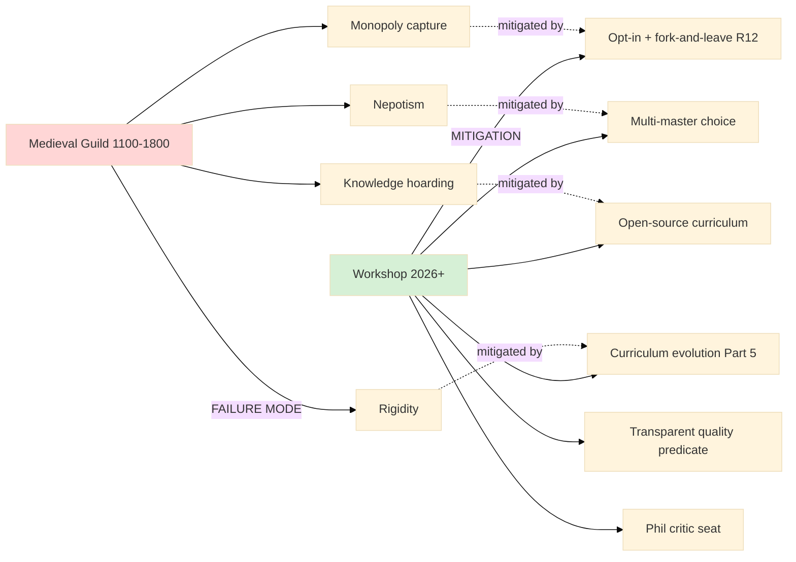
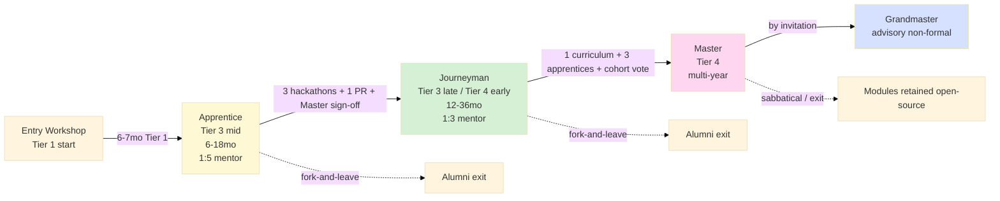

# Phase 4 — Master-Apprentice operationalisation (4-role typology + Workshop)

> **R1 surface.** 4-role typology + ratios + compensation discipline + transition criteria surfaced as candidates; Ruslan picks. Master Workshop of Engineers cohort targets surfaced; не autonomous activation.
>
> **IP-1 STRICT.** Role typology = abstract role-types (A.2 Foundation); executor bindings (specific person filling Master / Journeyman / Apprentice role) = RUSLAN-LAYER per `shared/schemas/executor-binding.yaml.template`. Foundation parts NEVER name specific person.
>
> **Paternalism mitigation foregrounded:** Master-Apprentice = voluntary entry per side; quality predicate transparent; fork-and-leave at role transition; medieval guild failure modes (rigidity / nepotism / monopoly capture) actively mitigated.

---

## §0 TL;DR

**4-role typology** (A.2 abstract role-types; IP-1 strict):
1. **Apprentice** (Tier 3 mid): active supervised learner; 6-18 months; 1:5 ratio Journeyman:Apprentice.
2. **Journeyman** (Tier 3 late / Tier 4 early): independent practitioner + can teach apprentices; 12-36 months; 1:3 ratio Master:Journeyman.
3. **Master** (Tier 4): domain expert + curriculum contributor + Apprentice teacher; multi-year cumulative.
4. **Grandmaster** (advisory; non-formal): external advisor (Karpathy / Sutton / Hinton class); occasional engagement.

**Transition criteria:**
- Apprentice → Journeyman: 6-month min + 3 hackathon participations + 1 significant PR + Master sign-off.
- Journeyman → Master: 18-month min + curriculum contribution + 3 apprentice mentoring + Master cohort vote.
- Master → Grandmaster: by invitation (advisory; not tier transition).

**Compensation discipline (R12 Mondragón ratio cap):**
- Apprentice: stipend / scholarship / tuition cover.
- Journeyman: increasing stipend + paid mentoring + paid PR work.
- Master: salary / equity / curriculum royalty (Mondragón ratio cap — highest paid Master ≤ 9× lowest paid Apprentice stipend per Clan Charter + R12 enforcement).
- Grandmaster: optional honorarium per engagement; advisory не employment.

**Hackathon = primary activation vehicle** (cross-link Hackathon Platform deep + concept doc E §4).

**Cross-precedent:** ШСМ (Anatoly Levenchuk 30-year) + Medieval guild (1100-1800 AD failure-modes-aware) + Karpathy mentor lineage + NASA APPEL mentor pairing + TPS sensei-deshi pattern.

**Master Workshop of Engineers target:** 10-50 founding Masters Q3-Q4 2026 (cohort assembly; cross-link Outreach Phase 6 Class 2). **Ruslan personal action** — НЕ autonomous platform recruitment.

---

## §1 Role typology (A.2; IP-1 Role≠Executor)

### §1.1 IP-1 strict framing

Per FUNDAMENTAL FPF IP-1 + Bundle 1 D-1 anti-conflation:
- **Foundation роли = abstract role-types** (Apprentice / Journeyman / Master / Grandmaster = A.2 U.Episteme role abstractions).
- **Executor bindings RUSLAN-LAYER** — specific person filling role = per `shared/schemas/executor-binding.yaml.template`.
- Foundation parts (Workshop architecture) MUST NOT name specific person (e.g. "Karpathy is the Grandmaster"); only role abstraction.
- Operational artefacts (cohort rosters, mentor assignments) live in RUSLAN-LAYER overlay; не Foundation.

### §1.2 Apprentice role

- **Status:** active learner; supervised.
- **Duration:** 6-18 months per specialization.
- **Output:**
  - Assisted hackathon participation (≥3 per Apprentice→Journeyman transition).
  - Minor PRs to curriculum or Workshop tooling (≥1 significant).
  - Tier 1 Foundation 5-7 modules completed (cross-link Phase 2).
  - Tier 2 Methodology 1 module completed (NASA SE life/work/body OR TPS OR Pattern Language OR FPF).
- **Mentor pairing:** 1:5 Journeyman:Apprentice (1 Journeyman mentors 5 Apprentices simultaneously).
- **Compensation:** stipend / scholarship / Workshop tuition cover.

### §1.3 Journeyman role

- **Status:** independent practitioner; can teach apprentices.
- **Duration:** 12-36 months.
- **Output:**
  - Independent hackathon participation (no longer requires Master mentor pairing; can mentor own apprentices в hackathons).
  - Significant PRs (≥3 substantial Workshop contributions).
  - Apprentice mentoring (≥3 apprentices mentored to completion).
  - Tier 3 Specialization domain demonstrated (own project / paper / artefact).
- **Mentor pairing:** 1:3 Master:Journeyman (1 Master mentors 3 Journeymen simultaneously).
- **Compensation:** increasing stipend + paid mentoring (per-hour mentor rate) + paid PR work (per-contribution).

### §1.4 Master role

- **Status:** domain expert + curriculum contributor + Apprentice teacher.
- **Duration:** multi-year cumulative; no fixed end.
- **Output:**
  - Hackathon judging participation (≥4 events/year).
  - Curriculum module authoring (≥1 module/year — Tier 1 or Tier 2 or Tier 3 specialization).
  - Apprentice teaching (≥5 apprentices supported through Tier 1+2 simultaneously).
  - Master cohort governance (curriculum review, dissent surfacing, Phil critic seat).
- **Mentor pairing:** Master cohort peer-pairing (Masters review each other's curriculum contributions).
- **Compensation:** salary / equity / curriculum royalty (Mondragón ratio cap enforced; cross-link §4 compensation discipline).
- **Cross-precedent:** ШСМ Anatoly Levenchuk + medieval guild master + NASA APPEL senior mentor.

### §1.5 Grandmaster role (advisory; non-formal Workshop role)

- **Status:** external advisor.
- **Output:** occasional guidance + curriculum review + reputation lending (≠ formal Workshop employment).
- **Outreach:** Master Workshop of Engineers cohort entry pathway (cross-link Outreach Phase 6 Class 1 L1 targets).
- **Compensation:** optional honorarium per engagement; advisory не employment.
- **L1 priority candidates (executor bindings RUSLAN-LAYER overlay):** Karpathy / LeCun / Sutskever / Hassabis / Hinton / Sutton / Ng / Bengio / Goodfellow / Schmidhuber. **Ruslan personal action** to engage; не autonomous platform contact.

---

## §2 Hackathon as Master-Apprentice activation pattern

### §2.1 Activation mechanism
Hackathon platform = primary Master-Apprentice activation vehicle:
- **Apprentices participate** (learning vehicle; supervised by Journeyman mentor).
- **Journeymen mentor apprentices** (Journeyman:Apprentice 1:5 ratio in hackathon context becomes 1:2-1:3 due to intensive engagement).
- **Masters judge + select winners** (judging criteria per Workshop curriculum quality predicate).
- **Grandmasters provide occasional remote review** (high-profile events).

### §2.2 Cross-link concept doc E §4 Pattern Language teaching
- Hackathon = Alexander → Cunningham → Karpathy Pattern Language teaching vehicle.
- Patterns surface through problem-solving (vs lecture).
- Mentor pairing = pattern transfer (TPS sensei-deshi pattern).
- Solution artefact = pattern documentation (concrete instance).

### §2.3 Per-event activation discipline
- Pre-event: Master sets curriculum-aligned challenge; Journeymen + Apprentices register.
- Event execution: cohort intensive 24-48 hrs typical; mentor pairing active throughout.
- Post-event: TPS Hansei reflection cycle (cross-link research/deepening §14); Master sign-off на progression milestones.

### §2.4 Cross-link Hackathon Platform deep research
Per research/hackathon-platform-deep-2026-05-18/ (parallel run): hackathon platform deep variant survey + first event Q3 2026 blueprint. Education Layer Tier 3 activation vehicle = hackathon platform output.

---

## §3 Curriculum progression mechanism (transition criteria)

### §3.1 Apprentice → Journeyman
**Threshold (Ruslan picks; surfaced as candidate):**
- 6-month minimum tenure.
- 3 hackathon participations (≥1 with significant contribution).
- 1 significant PR (curriculum / Workshop tooling / cohort support).
- Tier 1 Foundation 5 modules completed (M1-M5; M6-M7 electives optional).
- Tier 2 Methodology 1 module completed.
- Master sign-off (any active Master; not specific person required).

**Failure modes (mitigation):**
- Risk: «6-month minimum» becomes rigid (some apprentices ready earlier; some later).
  - Mitigation: «minimum» NOT enforced rigidly; Master sign-off can grant exception either direction (faster OR slower trajectory).
- Risk: hackathon participation count becomes credentialism vs skill development.
  - Mitigation: Master sign-off evaluates quality of participation, не count alone.

### §3.2 Journeyman → Master
**Threshold:**
- 18-month minimum tenure as Journeyman.
- Curriculum contribution: ≥1 module authored or substantial co-authored.
- Apprentice mentoring: ≥3 apprentices mentored to completion of Tier 1.
- Master cohort vote (super-majority — 2/3 of Masters).
- Tier 3 Specialization domain demonstrated (project / paper / artefact / community recognition).

**Failure modes (mitigation):**
- Risk: Master cohort vote becomes nepotism gate.
  - Mitigation: vote criteria transparent + public; appeal process (Phil critic seat).
- Risk: «curriculum contribution» becomes formal-quantity vs substantive-quality.
  - Mitigation: contribution review by cohort + alumni feedback; substantive quality discipline.

### §3.3 Master → Grandmaster
By invitation (advisory; not tier transition).
- Grandmaster engagement = relationship, не employment promotion.
- Initiated by Ruslan personally (or by Master cohort with Ruslan ack) per Outreach Phase 6 Class 1 L1 targets.

### §3.4 Reverse transitions (fork-and-leave)
- Apprentice exit: voluntary at module boundary; refund discipline per Charter (R12 anti-extraction; tuition cover continues for Tier 1 modules already paid; portfolio retained by Apprentice).
- Journeyman exit: voluntary; mentor-mentee relationships gracefully closed; Workshop access continues at alumni level.
- Master exit / sabbatical: voluntary; curriculum modules authored remain (open-source); compensation accrued retained.
- **Fork-and-leave** preserved across all transitions (R12 enforcement).

---

## §4 Per-role compensation discipline (R12 Mondragón ratio cap)

### §4.1 Apprentice compensation
- Stipend / scholarship covering Workshop tuition + minimum living allowance (geography-adjusted).
- Per Clan Charter cross-link (decisions/JETIX-FIRST-CLAN-CHARTER-2026-05-12.md): Apprentice stipend baseline = €X (Berlin metro adjusted; equivalent elsewhere).
- Tier 1 tuition refundable upon graceful exit before module completion (R12 enforcement).

### §4.2 Journeyman compensation
- Increasing stipend (year-over-year increment).
- Paid mentoring: per-hour rate (≥€Y/hr) for active mentor sessions.
- Paid PR work: per-contribution rate (≥€Z per significant PR).

### §4.3 Master compensation
- Salary or equity stake in Workshop entity.
- Curriculum royalty: per-module ongoing royalty as long as module remains active.
- **Mondragón ratio cap** (per Pillar C §4.2 R12 + Clan Charter): highest paid Master compensation ≤ 9× lowest paid Apprentice stipend.
- **Wage ratio audit** per quarter (R12 enforcement check).

### §4.4 Grandmaster compensation
- Per-engagement honorarium (per advisory session or per curriculum review).
- Не employment; не tier transition.

### §4.5 R12 enforcement check per tier
- Wage ratio audit quarterly (Mondragón cap ≤ 9×).
- Fork-and-leave audit per transition (no penalty enforced).
- Anti-extraction audit: no Workshop entity extracts beyond agreed share from Apprentice / Journeyman / Master.

### §4.6 Cross-link к R12 programmable enforcement
Per CLAUDE.md §4.2 R12 programmable Ethereum substrate (acked 2026-05-18 Option D Hybrid):
- Wage ratio cap enforced via smart contract per-Clan opt-in.
- Quadratic Funding (QF) revenue distribution to Apprentice / Journeyman / Master per contribution.
- Fork-and-leave exit tokens preserved.
- 4 RUSLAN-LAYER action classes constitutionally denied: extraction_beyond_share / wage_ratio_violation / non_consensual_distribution / fork_prevention_attempt.

---

## §5 ШСМ precedent (Anatoly Levenchuk 30-year accumulation)

### §5.1 ШСМ Foundation context
- Школа Системного Менеджмента (ШСМ) — Anatoly Levenchuk's systems-management school.
- 30-year curriculum evolution (early lineage from 1990s ASOFA / SOFT consultancy; ШСМ formal 2006-2008+ onwards).
- Multi-cohort progression (Tier 1 entry; multi-year apprenticeship to senior practitioner).
- Curriculum evolution mechanism: Levenchuk updates 1-2 textbook releases/year + cohort feedback integration.

### §5.2 Lessons for Master Workshop
- Long-term apprenticeship sustainable when:
  - Curriculum evolves continuously (avoid stagnation).
  - Cohort cohesion preserved (alumni network = social substrate).
  - Founder transition planned (succession risk explicit).
- Failure mode: founder-centric vision difficult to scale beyond founder.
- Mitigation: Master cohort governance (≥3 active Masters from Phase 2; Phil critic seat; succession discipline per Foundation Part 7 lifecycle).

### §5.3 Levenchuk teaching trajectory pattern
- Daily writing / publishing (Telegram + LiveJournal + book updates).
- Multi-rhythm curriculum (intensive workshops + multi-week courses + multi-year cohorts).
- Open-source baseline (textbooks publicly accessible; cohort access via tuition).

### §5.4 Cross-link Outreach Phase 6
Levenchuk = potential Grandmaster advisory candidate (Russian-language ML/AI + systems community influence).

---

## §6 Medieval guild precedent (1100-1800 AD)

### §6.1 Historical pattern
- Apprentice → Journeyman → Master progression в craft guilds (Europe primarily; analogous patterns Japan / China / Middle East).
- Quality predicate enforced by Master inspection («masterpiece» test for Master qualification).
- Progressive responsibility transitions (Apprentice supervised → Journeyman traveling work → Master independent + teaching).
- Geographic + craft community (guild = local + craft-specific; multi-master local concentration).

### §6.2 Failure modes (historical)
- **Rigidity:** guild rules ossified; innovation suppressed (e.g. printing press resistance by scribe guilds).
- **Nepotism:** master sons preferred for apprenticeship; outsiders excluded.
- **Monopoly capture:** guilds restricted entry to maintain prices; consumer harm.
- **Geographic / craft monopoly:** single guild controlled regional craft; no alternatives.
- **Knowledge hoarding:** master techniques kept secret to preserve scarcity rent.

### §6.3 Mitigation для Workshop
- **Opt-in voluntary + fork-and-leave** (R12) — vs guild compulsory membership.
- **Open-source curriculum** (Phase 2 §12) — vs guild secret knowledge.
- **Multi-master choice** — Apprentice picks Master; Journeyman picks Master; cohort can have multiple Masters per domain — vs single-master apprenticeship.
- **Transparent quality predicate** (curriculum-aligned; не master-discretion-only) — vs subjective masterpiece test.
- **Phil critic seat** (Workshop governance) — vs guild internal closure.
- **Curriculum evolution mechanism** (Foundation Part 5 Compound Learning) — vs guild ossification.

### §6.4 Mermaid: medieval guild vs Workshop comparison

---

## §7 Master Workshop of Engineers operationalisation (text_009 Thread 14 «не ступеньки ниже»)

### §7.1 Cohort assembly target
- **Founding cohort:** 10-50 Masters Q3-Q4 2026.
- **Profile:** domain experts (ML/AI engineering, systems engineering, organizational design, etc.) с curriculum contribution intent.
- **Curriculum contribution requirement:** 1 module per Master в first year.
- **Hackathon judging participation:** ≥4 events/year per Master.

### §7.2 Recruitment cross-link Outreach Phase 6
Per `decisions/strategic/JETIX-OUTREACH-SYSTEM-SCALABLE-2026-05-18.md` Phase 6 Class 2: Master Workshop targets surface as 100-1000 candidate pool; founding cohort 10-50 within Q3-Q4 2026.

**Ruslan personal action** для recruitment (per «не autonomous platform recruitment» constraint concept doc E §10 anti-list).

### §7.3 L1 priority Grandmaster targets (RUSLAN-LAYER overlay)
Per concept doc E §3.4 Tier 4 + Outreach Phase 6 Class 1:
- Karpathy / LeCun / Sutskever / Hassabis / Hinton / Sutton / Ng / Bengio / Goodfellow / Schmidhuber (ML/AI L1 lineage; Outreach Phase 6 Class 1).
- Additional adjacencies: Karl Friston (free-energy / active inference) / Carlos Gershenson (complex systems) / Anatoly Levenchuk (systems management).

**IP-1 strict:** specific person bindings RUSLAN-LAYER (этот §7.3 lives в research artefact, NOT Foundation); Foundation parts only name abstract Grandmaster role.

### §7.4 Master cohort governance
- Quarterly Master cohort meeting (curriculum review + dissent surface + succession discipline).
- Phil critic seat (rotating among Masters; surfaces paternalism / epistemic colonialism / lock-in risks).
- Curriculum diversity quota (≥1 non-Western framework primary per Tier; ≥1 non-English module by year 2).
- Alumni feedback channel (anonymous; integrated into curriculum evolution).

### §7.5 Capstone activation: first hackathon Q3 2026
- Master Workshop of Engineers founding cohort participates в first hackathon as judges + curriculum-aligned challenge setters.
- Cross-link concept doc E §7 EL-T2 falsifier (first hackathon includes teaching component).

---

## §8 TPS sensei-deshi pattern integration

### §8.1 Pattern source
Toyota Production System mentor pattern (sensei = master; deshi = apprentice):
- Long-term relationship (years).
- Daily/weekly observation + correction.
- Tacit knowledge transmission (TPS Hansei + Kaizen pedagogy).
- Cross-link research/deepening-2026-05-18/14 tacit-explicit-tps-mechanism.

### §8.2 Workshop application
- Master ↔ Apprentice + Journeyman pairing modeled on sensei-deshi.
- Weekly mentor session (1-2 hrs).
- Monthly cohort review (Master + Journeymen + Apprentices).
- Quarterly Hansei reflection (TPS pattern; cross-link NASA SE Tier 2 §1.6 V+V cycle).

### §8.3 Tacit → explicit conversion discipline
- Apprentice journals weekly insight (tacit→explicit).
- Master surfaces pattern names (explicit naming = transmission primitive).
- Cohort dialogue (peer apprentices share patterns; explicit→tacit re-instantiation in peers).

---

## §9 Karpathy mentor lineage cross-precedent

### §9.1 Lineage pattern
- Geoffrey Hinton mentored Andrey Karpathy (PhD adviser Stanford).
- Karpathy now mentors next-gen ML researchers + LLM101n / Eureka Labs cohort.
- Multi-generational lineage = sustainable mentor pattern.

### §9.2 Workshop application
- Master Workshop of Engineers founding cohort = lineage origin.
- Year 2+ Masters mentor next-gen Masters (succession primitive).
- Karpathy = potential Grandmaster contact (RUSLAN-LAYER overlay; Ruslan personal action).

---

## §10 Mermaid: 4-role progression flow

---

## §11 Paternalism mitigation summary (Master-Apprentice)

- **Voluntary entry per side:** Master accepts; Apprentice consents (no pressured matching).
- **Quality predicate transparent:** Apprentice + Journeyman know progression criteria up front (publicly published).
- **Fork-and-leave at role transition:** preserved (R12).
- **Multi-master choice:** Apprentice can choose different Master at role transition (avoid single-master lock-in).
- **Medieval guild failure modes mitigated** §6.3.
- **Phil critic seat** в Master cohort governance.
- **Anonymous feedback channel** для apprentice / journeyman dissent.
- **Curriculum diversity quota** ≥1 non-Western framework primary per Tier.
- **R12 Mondragón compensation cap** ≤ 9× wage ratio audited quarterly.
- **IP-1 strict** — Foundation role abstract; executor binding RUSLAN-LAYER; no Foundation lock-in to specific persons.

---

## §12 Cross-link к Hackathon Platform + Outreach + ML/AI engineers

- **Hackathon Platform deep:** primary activation vehicle; Tier 3 Specialization launch point.
- **Outreach Phase 6:** Class 2 Master Workshop targets recruitment; Class 1 L1 Grandmaster targets.
- **ML/AI engineers H-ML-1:** «under-served by current education» refutable via Master Workshop launch.
- **Recursive Engine:** plan-execute methodology = Tier 2 module candidate.
- **System Merger Protocol:** FPF discipline = Tier 2 module candidate.

---

## §13 Constitutional posture

- **R1:** 4-role typology + ratios + thresholds + cohort targets surfaced as candidates; Ruslan picks final operational params.
- **R6:** ШСМ + medieval guild + NASA APPEL + Karpathy + TPS cross-precedent corroboration.
- **R12 STRICT:** opt-in + fork-and-leave + Mondragón ratio cap + R12 programmable Ethereum substrate cross-link.
- **IP-1 STRICT:** Foundation role abstract; executor bindings RUSLAN-LAYER; specific persons NEVER named в Foundation parts.
- **EP-5:** F3 candidate per (4-role typology + Mondragón cap = cross-precedent corroboration).
- **Paternalism foregrounded** §11.

---

*Phase 4 Master-Apprentice operationalisation complete. 4-role typology + ratios + thresholds + compensation discipline + ШСМ + medieval guild + TPS + Karpathy cross-precedents + Master Workshop of Engineers cohort assembly. IP-1 strict preserved. Ready Phase 5 Gratitude prophecy IP-1 STRICT.*
