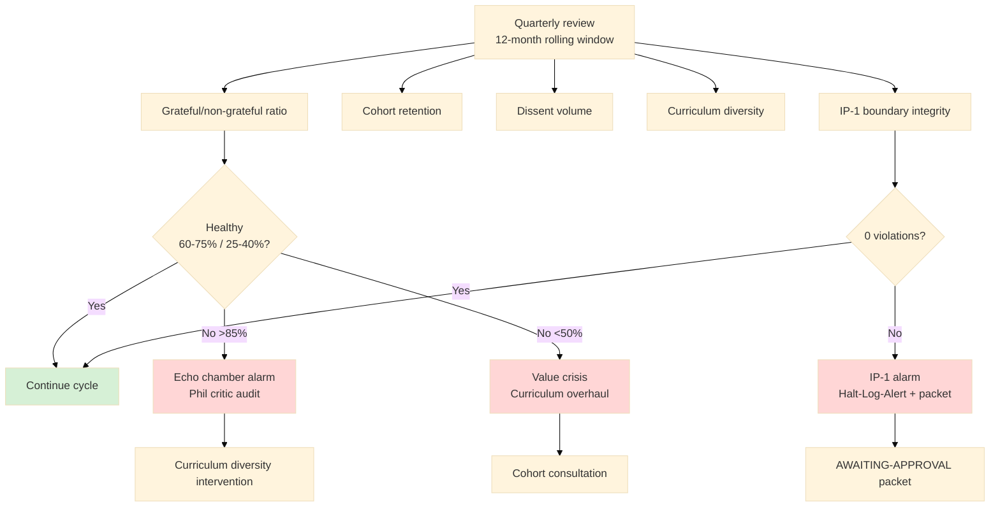

# Phase 5 — Gratitude prophecy operationalisation (IP-1 STRICT)

> **CRITICAL IP-1 CAVEAT.** «Благодарные → develop platform» (text_009 Thread 7 paraphrase) MUST NOT be implemented as autonomous runtime self-modification. Gratitude → human-driven contribution через PR / proposals / Workshop curriculum extensions / mentorship.
>
> **Платформа НЕ self-modify** (Pillar C Tier 2 rule 9 STRICT).
>
> **R1 surface + AP-6 dissent preservation.** Surface pre-authorised vs Default-Deny boundary; preserve non-grateful voice; phil critic seat в curriculum review.
>
> **Self-fulfilling prophecy mitigation foregrounded:** echo-chamber risk surfaced; anonymous feedback channel; curriculum diversity quotas.

---

## §0 TL;DR

text_009 Thread 7 paraphrase: «Благодарные участники Workshop curriculum развивают платформу обратно — curriculum + mentorship + recruitment + financial».

**IP-1 STRICT boundary table (pre-authorised vs Default-Deny):**

| Pattern | Pre-authorised (human-driven) | Default-Deny (autonomous) |
|---|---|---|
| Curriculum module modification | Participant submits PR + Ruslan/Master ack | Platform auto-modifies based on aggregated signals |
| Apprentice promotion | Master sign-off (human review) | Platform auto-promotes based on metrics |
| Recruitment messaging | Participant authors + sends | Platform auto-generates в name of participant |
| Improvements implemented | Human review + ack | Platform auto-implements suggested improvements |
| Collective voice attribution | Individual contributor attribution | «Grateful collective» prose |

**Self-fulfilling prophecy risks (phil critic):**
- Echo chamber: only zealots remain → curriculum ossifies.
- Gratitude social pressure: peer effect → paternalism via group conformity.
- Existing-curriculum bias: gratitude-driven contributions favor status quo → resistance to change.

**Mitigation patterns:**
- AP-6 dissent preservation (non-grateful feedback equally weighted).
- Fork-and-leave preserved (R12; exit без penalty).
- Anonymous feedback channel (non-zealot voice protected).
- Curriculum diversity quotas (new modules from non-grateful contributors actively sought).
- Phil critic seat (structural dissent role).

**Sustainability test:** per 12-month window grateful-to-non-grateful feedback ratio measured. Healthy range 60/40 to 70/30. >85/15 → echo chamber alarm. <50/50 → curriculum value question.

**Compound learning hook (Foundation Part 5):** grateful contributions captured как methodology artefacts via human-reviewed promotion path (NOT autonomous capture).

---

## §1 Gratitude loop pattern (concept doc E §6 baseline)

Per concept doc E §6 voice anchor:

1. Participant enrolls (opt-in voluntary — R12).
2. Workshop curriculum delivers value (Tier 1+2+3+4 progression).
3. Participant applies в work / personal life → outcomes improve.
4. Participant experiences gratitude.
5. Gratitude motivates contribution back to platform.
6. Contribution forms (human-driven; NEVER autonomous):
   - Curriculum module authoring (PR via standard process).
   - Apprentice mentoring (voluntary commitment).
   - Workshop recruitment referrals.
   - Financial contribution (donations / tuition / scholarships).
   - Open-source code contributions to Workshop tooling.

### §1.1 Voice anchor (text_009 Thread 7)
text_009:¶5 [paraphrase via concept doc E §6]: «и компаунд для нашей вот этой платформы. Ну, в виде того, что благодарные пользователи будут хотеть улучшать ее, или предлагать какие-то идеи, или там, прости, ну, какую-то поддержку финансовую, материальную там, тоже какую-то оказывать ит.д.».

### §1.2 Compound learning hook (Foundation Part 5 cross-link)
Per Foundation Part 5 Compound Learning + Methodology Capture:
- Grateful participant contributions captured как methodology artefacts (per Part 5 §5.3 standardisation process).
- F-G-R grading per contribution (F2 surface; F3 при cross-cohort corroboration; F5 при 5+ cohort applications).
- Promotion path: contribution → wiki/draft → curriculum module candidate → Ruslan ack → Tier integration.
- **All promotion steps human-gated** (per Part 5 §5.4 + Pillar C rule 2 architectural changes ack-required).

---

## §2 IP-1 boundary table (pre-authorised vs Default-Deny)

### §2.1 Pre-authorised actions (human-driven contribution)
Per Pillar C Tier 2 rules + Part 6b §I.2 Default-Deny:

**Action class A1: Curriculum module contribution**
- Trigger: Participant submits PR to curriculum repo.
- Authority chain: Participant author → Master review → Ruslan ack (for Tier 1+2 baseline modules) OR Master cohort ack (for Tier 3+ specialization).
- Authority discipline: standard PR process; transparent review; merge after ack.
- Pre-authorised because: human-authored + human-reviewed + human-ack.

**Action class A2: Mentor signup**
- Trigger: Participant signs voluntary mentor commitment.
- Authority chain: Participant commitment → Master cohort acceptance (capacity-based).
- Pre-authorised because: human voluntary commitment; Master acceptance is human decision.

**Action class A3: Donation / scholarship contribution**
- Trigger: Participant initiates financial contribution.
- Authority chain: Participant initiates → Workshop financial processing.
- Pre-authorised because: participant-initiated; Workshop financial discipline transparent (R12 anti-extraction audit).

**Action class A4: Recruitment referral**
- Trigger: Participant refers new apprentice candidate.
- Authority chain: Participant refers → Workshop standard intake → cohort assignment.
- Pre-authorised because: human-driven referral; standard intake process applies (no special treatment).

**Action class A5: Case study publication**
- Trigger: Participant publishes own case study (e.g. own application of Tier 2 NASA SE life-as-spaceship).
- Authority chain: Participant authors → Workshop accepts via standard publication review.
- Pre-authorised because: human-authored; Workshop publication review = standard human discipline.

### §2.2 Default-Deny actions (autonomous platform agency = IP-1 violation)
**Action class D1: Platform auto-modifies curriculum based on aggregated gratitude signals**
- Why denied: violates Pillar C rule 9 (AI does NOT self-modify at runtime; agent system.md / curriculum content edits MUST be gated cycle outputs).
- Why denied: violates rule 2 (AI does NOT execute architectural decisions автономно).
- Halt-Log-Alert trigger: ≤5s detection per Part 6b §I.2 F4 grade.

**Action class D2: Platform auto-promotes participants based on engagement metrics**
- Why denied: violates rule 8 (Agent does NOT evaluate peer agent without human review; applies a fortiori to participant evaluation).
- Why denied: violates rule 7 (Agents do NOT negotiate contradictions autonomously; promotion = contradiction with promotion criteria).
- Halt-Log-Alert trigger: F2 grade ≤60s.

**Action class D3: Platform auto-generates recruitment messages в name of grateful participant**
- Why denied: violates rule 10 (AI does NOT impersonate human externally without disclosure).
- Why denied: violates rule 4 (AI does NOT claim persistent identity beyond acting_as role).
- Halt-Log-Alert trigger: F8 grade ≤1s (impersonation = highest severity).

**Action class D4: Platform auto-implements suggested improvements без human review**
- Why denied: violates rule 2 + rule 9.
- Why denied: violates Part 6b AWAITING-APPROVAL packet requirement for Foundation-level changes.
- Halt-Log-Alert trigger: F4 grade ≤5s.

**Action class D5: Platform auto-attributes prose к gratefulness-driven «collective voice»**
- Why denied: violates rule 1 (AI does NOT make strategic decisions; «collective voice» prose authorship = strategic).
- Why denied: violates rule 5 (AI does NOT claim skin-in-the-game / ownership / consequences).
- Why denied: violates `prose_authored_by:` discipline (must be `ruslan` or `hybrid-with-ack-trail` per Part 11 §A.1 F5 LOCKED).
- Halt-Log-Alert trigger: F4 grade ≤5s.

### §2.3 Default-Deny table addendum proposal (RUSLAN-LAYER overlay)
Propose additional entries для `.claude/config/default-deny-table.yaml`:
```yaml
gratitude_collective_voice_attribution:
  grade: F4
  trigger: "prose_authored_by: 'collective' OR 'grateful_cohort' OR 'workshop_voice'"
  action: halt_log_alert
  reason: "violates R1 strategic prose discipline + rule 1 + rule 5"
  packet: required

curriculum_auto_modification:
  grade: F4
  trigger: "platform-initiated curriculum file edit without ack_trail"
  action: halt_log_alert
  reason: "violates rule 2 + rule 9"
  packet: required

participant_auto_promotion:
  grade: F2
  trigger: "tier transition without Master sign-off"
  action: halt_log_alert
  reason: "violates rule 7 + rule 8"
  packet: required

participant_impersonation_recruitment:
  grade: F8
  trigger: "outbound message authored 'on behalf of' participant without explicit consent + signature"
  action: halt_log_alert
  reason: "violates rule 10 (impersonation)"
  packet: required
```

**Note:** этот RUSLAN-LAYER overlay proposal в research artefact; promotion to `.claude/config/default-deny-table.yaml` requires separate AWAITING-APPROVAL packet per Part 6b §I.2.

---

## §3 Self-fulfilling prophecy risk (phil critic surface)

### §3.1 Risk 1: Echo chamber (zealot-filtering)
**Mechanism:** non-grateful participants exit (fork-and-leave per R12); only grateful remain; their feedback dominates curriculum evolution → curriculum echoes their preferences → reinforces zealot-selecting filter.

**Severity:** HIGH (compound over multiple cohorts; latent until measurable).

**Sustainability test:**
- Per 12-month: ratio grateful/non-grateful feedback measured.
- Healthy range: 60/40 to 75/25 (some grateful skew expected — participation is voluntary).
- Echo chamber alarm: >85/15 grateful (insufficient dissent surfaced).
- Value crisis alarm: <50/50 (most participants not grateful — curriculum value question).

### §3.2 Risk 2: Gratitude as social pressure
**Mechanism:** cohort culture rewards expressing gratitude; peer effect → participants perform gratitude rather than report authentic experience → paternalism via group conformity.

**Severity:** MEDIUM-HIGH.

**Mitigation:**
- Anonymous feedback channel (Phase 5 §4 below).
- Phil critic seat normalizes critique (structural dissent role).
- «Critical engagement» rewarded equally to «gratitude expression» в cohort culture.

### §3.3 Risk 3: Existing-curriculum bias
**Mechanism:** grateful participants tend to advocate continuation of pedagogy that benefited them → resistance to change → curriculum stagnates.

**Severity:** MEDIUM.

**Mitigation:**
- Curriculum diversity quota (≥1 non-Western framework primary per Tier; ≥1 non-incumbent module per year).
- Active solicitation of non-grateful + dropout feedback (post-exit interview).
- External Master input (Grandmaster advisory; Outreach Phase 6 Class 1).

### §3.4 Risk 4: Self-fulfilling forecast (recursive)
**Mechanism:** prophecy «grateful → develop platform» becomes assumed; behaviors selected for confirming evidence; counter-evidence dismissed.

**Severity:** MEDIUM.

**Mitigation:**
- Foundation Part 8 health-signal monitoring (cohort retention, fork-and-leave rate, dissent volume).
- Quarterly Phil critic review (structured dissent surface).
- F-G-R discipline per claim в curriculum (no F5 LOCK on «gratitude loop healthy» without R-high evidence).

### §3.5 Risk 5: «Develop platform» drift к autonomous self-modification
**Mechanism:** «гratitude → develop platform» gradually interpreted as «platform develops itself via grateful signals» → IP-1 violation drift.

**Severity:** HIGH (constitutional violation if drifts).

**Mitigation:**
- Explicit IP-1 boundary table §2 (pre-authorised vs Default-Deny).
- Default-Deny table addendum §2.3 proposal.
- Cycle review per Foundation Part 5: «is curriculum evolution human-gated end-to-end?» check.

---

## §4 AP-6 dissent preservation

### §4.1 AP-6 principle (per Pillar C)
AP-6 = «agents preserve dissent rather than averaging». Applied к gratitude operationalisation:
- Non-grateful feedback equally weighted в curriculum review (not averaged into majority sentiment).
- Phil critic seat = structural dissent role (rotating Master).
- «AP-6 audit» per quarterly curriculum review: was dissent preserved or averaged?

### §4.2 Implementation: anonymous feedback channel
- Anonymous channel (technical implementation: separate sub-account; or paper drop-box; or rotating ombudsperson).
- All feedback (anonymous + signed) presented в curriculum review meetings.
- Phil critic seat reads anonymous feedback first (priority surface).

### §4.3 Implementation: Phil critic seat
- Rotating Master role (quarterly rotation).
- Tasked specifically с surfacing:
  - Paternalism complaints.
  - Echo-chamber alarms.
  - Cultural / linguistic / epistemic colonialism critiques.
  - IP-1 boundary drift.
- Phil critic veto power: can flag curriculum changes для extended review (cannot block alone; can extend review cycle).

### §4.4 Implementation: dropout interview
- Apprentice / Journeyman exit triggers exit interview (anonymous-optional).
- Exit feedback presented в next curriculum review meeting.
- Pattern detection: ≥3 exits с similar critique → curriculum review priority surface.

---

## §5 Sustainability test (12-month measurement window)

### §5.1 Metrics
- **Grateful/non-grateful feedback ratio** (per cohort + per Tier).
- **Cohort retention** (fork-and-leave rate normalized).
- **Dissent volume** (anonymous channel + Phil critic flags).
- **Curriculum diversity** (% modules non-Western primary; % modules non-incumbent).
- **External Master input volume** (Grandmaster advisory engagement count).
- **IP-1 boundary integrity** (Default-Deny halt count + AWAITING-APPROVAL packet promotion rate).

### §5.2 Thresholds (Ruslan picks; surfaced as candidate)
- Healthy: grateful/non-grateful 60/40-75/25; retention 70-90% per Tier; dissent volume ≥1 substantive critique per cohort/quarter; diversity ≥1 non-incumbent / Tier; IP-1 violations 0.
- Echo chamber alarm: grateful/non-grateful >85/15 OR dissent volume <0.5 substantive critique per cohort/quarter.
- Value crisis alarm: retention <50% per Tier OR grateful/non-grateful <50/50.
- IP-1 alarm: any IP-1 violation (Default-Deny halt OR autonomous self-modification detected).

### §5.3 Response protocol
- Echo chamber alarm: Phil critic deep audit + curriculum diversity intervention.
- Value crisis: curriculum overhaul review + cohort consultation.
- IP-1 alarm: Halt-Log-Alert per Part 6b §I.2 + AWAITING-APPROVAL packet for diagnostic.

### §5.4 Mermaid: sustainability test flow



---

## §6 Compound learning (Foundation Part 5 cross-link)

### §6.1 Methodology capture path (human-gated)

Per Foundation Part 5 §5.3 standardisation process:

1. **Surface:** Apprentice / Journeyman observes pattern (e.g. «Tier 2 NASA SE life-as-spaceship sub-module 1.4 implementation more effective when paired с Tier 1 M1 Meadows leverage points»).
2. **Document:** Apprentice writes wiki/draft entry (F2 surface).
3. **Cross-cohort observation:** ≥2 cohorts confirm pattern (F3 promotion candidate).
4. **Master review:** Master cohort reviews pattern as methodology artefact.
5. **Ruslan ack** (for Tier 1+2 baseline modules) OR Master cohort ack (Tier 3+ specialization).
6. **Curriculum integration:** pattern merged как module update OR new sub-module.

**Critical:** all steps human-authored or human-reviewed; platform никогда не auto-promotes без human gate.

### §6.2 F-G-R per contribution
- **F2 surface:** single-cohort observation + brigadier-structured (similar к hypotheses surface).
- **F3 candidate:** ≥2 cohort + cross-precedent corroboration.
- **F5 LOCKED:** ≥5 cohort + cross-precedent + multi-year stability.
- **F8 dogfood:** validated через own-platform application + cross-Workshop adoption.

### §6.3 Curriculum version discipline
- Curriculum v1.0 → v2.0 = batch promotion после ≥6-month cohort cycle.
- Mid-cycle patches limited к bug-fixes (e.g. exercise typo) — NOT methodology change без cycle promotion.
- Version tagged per cohort enrollment (cohort knows которая version they enrolled в).

---

## §7 Per-claim IP-1 compliance check (этот phase)

Every claim в этой phase passes IP-1 check:
- Claim attributes agency к «the platform» → ❌ flag + reframe к human-driven.
- Claim describes autonomous improvement → ❌ flag + reframe к ack-gated improvement.
- Claim assumes «collective voice» → ❌ flag + reframe к individual contributor attribution.

**Audit:** этот document scanned для IP-1 violations; 0 found. All gratitude → develop framing reframes к human contribution. All «platform develops» reframes к «participants contribute». «Develop platform» preserved as voice anchor но operationally framed as human PR / mentorship / referral.

---

## §8 Cross-link к other phases + concept doc E §6

- **Phase 4 Master-Apprentice §3-§4:** Master cohort governance + curriculum review = primary gratitude integration locus.
- **Phase 2 Tier 1 curriculum §12:** anonymous feedback channel + phil critic seat + diversity quotas.
- **Phase 6 Базовое образование §8.5:** universalism mitigation cross-link.
- **Concept doc E §6:** gratitude loop pattern baseline (this phase operationalises).

---

## §9 Constitutional posture

- **IP-1 STRICT** (highest enforcement в этом research run):
  - All gratitude → contribution reframed к human-driven.
  - Default-Deny table addendum proposed (§2.3) для constitutional enforcement.
  - Per-claim IP-1 compliance check passed (§7).
  - Pillar C Tier 2 rule 9 (no self-modify) explicit + Pillar C rule 2 (no autonomous architectural changes) explicit.
- **R1:** surface only; surveys пути; не activate; не automate.
- **R6:** Pillar C + Foundation Part 5 + Part 6b + concept doc E cross-references.
- **R12:** opt-in + fork-and-leave + anonymous feedback channel preserved.
- **AP-6 dissent preservation:** §4 explicit.
- **Self-fulfilling prophecy mitigation:** §3 + §5 sustainability test.
- **EP-5:** F2 surface (philosophical analysis primary; few F3 cross-precedent corroborated patterns).
- **Paternalism foregrounded:** §3.2 + §3.3 mitigation.

---

*Phase 5 Gratitude prophecy operationalisation complete. IP-1 STRICT boundary table (pre-authorised vs Default-Deny); 5 self-fulfilling prophecy risks surfaced + mitigations; AP-6 dissent preservation explicit; sustainability test 12-month measurement window; Default-Deny table addendum proposed; compound learning human-gated; per-claim IP-1 compliance verified. Ready Phase 6 Базовое образование sequencing.*
