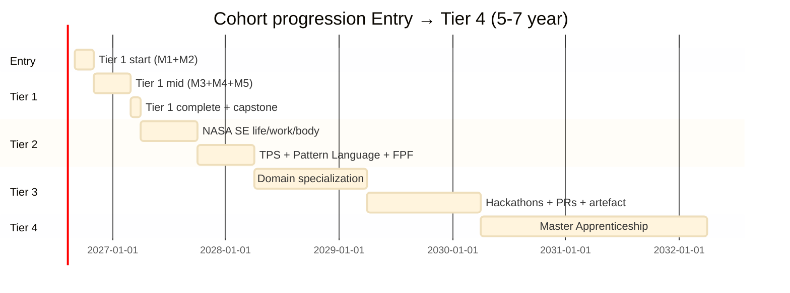

# Phase 6 — Базовое образование sequencing (Options A/B/C/D + cohort progression Entry → Tier 4)

> **R1 surface.** 4 Options surfaced; не auto-pick. Ruslan = sole strategist picks Option A/B/C/D.
>
> **Universalism mitigation foregrounded.** «Базовое образование» framing = aspiration; NOT universalist mandate. Workshop curriculum opt-in voluntary. Cultural / philosophical / religious compatibility surfaced. Multiple pedagogical paths preserved per stage.
>
> **Cohort progression sequencing:** Entry → Tier 1 → Tier 2 → Tier 3 → Tier 4 surfaced as candidate timeline; Ruslan picks final.

---

## §0 TL;DR

### §0.1 «Базовое образование» Options (concept doc E §4.3)
- **Option A:** all Workshop curriculum Tier 1 (systems-thinking + methodology basics).
- **Option B:** subset Tier 1 (top 5-10 concepts).
- **Option C:** participation в ≥1 hackathon + reflection cycle.
- **Option D:** Ruslan specifies (hybrid OR alternative).

### §0.2 Cohort progression sequencing (Entry → Tier 4)
6 stages × duration × curriculum scope × mentor ratio × quality predicate (§2 table).

### §0.3 Specialist trajectory observability
Per concept doc E §7 EL-T4 falsifier: «≥3 participants emerge as domain specialists within 18 months».
- Specialist criteria: domain expertise + community recognition + product / paper / project artefact.
- Per-cohort tracking.
- Falsifier: 0 specialists emerge within 18 months → trajectory premise refuted.

### §0.4 Universalism mitigation
- «Базовое образование» framing = aspiration; not universalist mandate.
- Workshop curriculum opt-in voluntary throughout.
- Multiple pedagogical paths preserved (cohort / self-paced / hybrid).
- Cultural / language / philosophical compatibility surfaced.
- Fork-and-leave preserved at every stage boundary.
- Diversity quotas per Tier (non-Western framework primary + non-English module by year 2).

---

## §1 «Базовое образование» Options A/B/C/D (Ruslan picks)

### §1.1 Option A — «Базовый уровень» = all Workshop curriculum Tier 1 (5-7 modules)

**Definition:** baseline = complete Tier 1 Foundation 5-7 modules (Meadows + Ashby + Beer + Senge + Kauffman + optional Conway + Cynefin).

**Pros:**
- Comprehensive systems-thinking foundation.
- Coherent (modules cross-reference each other).
- Mirrors Harari 4 Cs framework (Phase 1 §1).
- Quality predicate clear (system mapping + 3 leverage points + 1 intervention per concept doc E §3).

**Cons:**
- High time investment (5-7 months cohort; 8-12 months self-paced).
- Accessibility barrier (time + cost + cognitive load).
- Universalism risk (positions Tier 1 as «должен for all»).

**Falsifier:** cohort completion rate <30% at 6-month mark → too high barrier; Option A unsustainable as mass framing.

**4 Cs alignment:** all 4 HIGH coverage (Phase 2 §9 matrix).

**Universalism mitigation:** opt-in voluntary; fork-and-leave at module boundary; multiple pedagogical modes (cohort / self-paced / build-to-understand).

---

### §1.2 Option B — «Базовый уровень» = subset Tier 1 (top 5-10 concepts)

**Definition:** baseline = curated subset of Tier 1 concepts (e.g. top 5-10 key ideas across modules).

**Possible curation:**
1. Meadows leverage points framework (M1 core).
2. Ashby «requisite variety» (M2 core).
3. Beer VSM 5-systems intuition (M3 core).
4. Senge «laws of systems thinking» (M4 core; subset of 11).
5. Kauffman adjacent-possible (M5 core).
6. Iceberg model (Meadows + Senge cross-cutting).
7. Feedback loops (reinforcing + balancing) (M1 + M2 cross-cutting).
8. Holonic structure (M3 + emergence cross-cutting).
9. Conway's Law intuition (M6 elective core).
10. Cynefin 4-domain classification (M7 elective core).

**Pros:**
- Accessible (lower time investment; 2-3 months cohort; 4-5 months self-paced).
- Modular (can be standalone or as Tier 1 entry).
- Opt-in friendly (lower commitment threshold).

**Cons:**
- Shallow (concepts surfaced без deep practice).
- Risk «buzzword-itis» (terms without operational discipline).
- Falsifier: trainee inability to apply concepts after subset completion.

**Falsifier:** post-subset application test failure rate >50% → shallow framing refuted.

**4 Cs alignment:** Critical thinking + Communication MEDIUM-HIGH; Collaboration + Creativity MEDIUM.

**Universalism mitigation:** opt-in; clear «introduction» framing (NOT mastery); pathway to Option A для deeper engagement.

---

### §1.3 Option C — «Базовый уровень» = ≥1 hackathon + reflection cycle

**Definition:** baseline = participation в ≥1 hackathon с structured reflection (TPS Hansei pattern).

**Mechanism:**
- Hackathon participation (~48-72 hours typical).
- Mentor pairing during event (Journeyman or Master).
- Post-event reflection cycle (1-2 weeks structured Hansei + Kaizen exercises).
- Pattern Language teaching (Alexander → Cunningham → Karpathy lineage).

**Pros:**
- Applied learning (immediate practice).
- Low-barrier entry (single event commitment).
- TPS Hansei pattern (proven pedagogy from research/deepening §14).
- Cross-link Hackathon Platform deep (primary activation vehicle).

**Cons:**
- Depth question (single event limited theoretical foundation).
- Missing systems-thinking core (Tier 1 frameworks not surfaced explicitly).
- Falsifier: post-hackathon retention rate <40% at 3-month mark.

**Falsifier:** ≤30% post-hackathon Tier 1 enrollment at 3-month mark → activation pathway weak; Option C alone insufficient.

**4 Cs alignment:** Critical thinking + Creativity HIGH (hackathon problem-solving); Communication + Collaboration HIGH (team formation + mentor pairing).

**Universalism mitigation:** strong opt-in (single event); explicit «activation» framing (NOT mastery); pathway to Option A or B для deeper engagement.

---

### §1.4 Option D — Ruslan specifies (hybrid OR alternative)

**Definition surface для Ruslan ack:**

**Sub-option D1: Hybrid C → B → A**
- Stage 1: Option C (hackathon activation).
- Stage 2: Option B (Tier 1 subset).
- Stage 3: Option A (full Tier 1).
- Trainee progresses at own pace; no enforced sequence.

**Sub-option D2: Tier-1 module 1+2 only**
- Baseline = M1 Meadows + M2 Ashby (minimum-viable Tier 1; 8-10 weeks).
- Lighter than Option A; deeper than Option B.

**Sub-option D3: Domain-specific baseline**
- Baseline differs по domain interest (e.g. ML/AI cohort = M2 + M5 + Karpathy LLM101n adaptation; Org-design cohort = M3 + M4 + M6).
- Per-domain trajectory.

**Sub-option D4: Tier 0 pre-baseline**
- Pre-Tier-1 «Tier 0» (4-6 weeks; introduction to systems thinking + own-context mapping).
- Then Option A or B follows.

**Sub-option D5: Voice / arts / non-engineering baseline**
- Adapted Tier 1 for non-engineering audiences (e.g. educators / community organizers / artists / clinicians).
- Different case studies + different module composition.

**Ruslan picks (sub-option OR new variant).**

---

### §1.5 Options comparative matrix

| Option | Duration | Depth | Accessibility | Universalism risk | Falsifier |
|---|---|---|---|---|---|
| A Full Tier 1 | 5-12 mo | HIGH | LOW-MED | HIGH | <30% completion |
| B Tier 1 subset | 2-5 mo | MED-LOW | HIGH | MEDIUM | >50% application fail |
| C Hackathon | 1 event + 2w | LOW-MED | HIGH | LOW | <40% retention |
| D1 Hybrid C→B→A | progressive | HIGH | HIGH | LOW | per-stage falsifier |
| D2 M1+M2 only | 8-10 wk | MEDIUM | MED-HIGH | MEDIUM | <30% completion |
| D3 Domain-specific | varies | HIGH per domain | HIGH | LOW (no universal) | per-domain falsifier |
| D4 Tier 0 + A | 9-16 mo | HIGH | LOW-MED | HIGH | combined |
| D5 Non-eng baseline | 5-7 mo | HIGH per audience | HIGH per audience | LOW | per-audience falsifier |

**Surfacing observation:** Options D1 + D3 = lowest universalism risk (no singular «base»); accommodate diversity of pathways. Ruslan picks.

---

## §2 Cohort progression sequencing (Entry → Tier 4)

### §2.1 Stage table

| Stage | Duration | Curriculum scope | Mentor ratio | Quality predicate |
|---|---|---|---|---|
| Entry (Tier 1 start) | 1-2 mo | Module 1-2 (Meadows + Ashby) | 1:20 (lecture cohort) | Self-assessment passing |
| Mid Tier 1 | 2-4 mo | Module 3-5 (Beer + Senge + Kauffman) | 1:10 (small cohort) | System mapping + leverage point exercise |
| Tier 1 complete | 5-7 mo total | All 5-7 modules | 1:5 (Master pairing introduces) | Cumulative project portfolio + mentor sign-off |
| Tier 2 Methodology | 6-12 mo | NASA SE life/work/body + TPS + Pattern Language + FPF | 1:5 | Workshop project execution |
| Tier 3 Specialization | 12-24 mo | Domain-specific deepening | 1:5 (Journeyman pairing) | Hackathon participation + 1 significant PR + own artefact |
| Tier 4 Master Apprenticeship | 24+ mo | Master Workshop activities | 1:3 (Master pairing) | Curriculum contribution + apprentice mentoring |

### §2.2 Per-stage cohort discipline
- Cohort size 10-20 ideal (Phase 3 §12.2 pedagogy recommendation).
- Synchronous touchpoints (weekly + monthly).
- Async deepening (self-paced study).
- Mentor pairing escalates from lecture-cohort к individual pairing as tier progression.

### §2.3 Cumulative timeline
- Entry → Tier 4 transition: ~5-7 years cumulative.
- Comparable к ШСМ multi-year apprenticeship + Karpathy mentor lineage 4-7 years PhD-equivalent depth.

### §2.4 Mermaid Gantt (illustrative)

---

## §3 Self-paced vs cohort options

### §3.1 Cohort
- Synchronous + mentor pairing + accountability + cohort dialogue.
- **Recommended** для most trainees.
- 1:20 → 1:10 → 1:5 → 1:3 mentor ratio progression.
- Cohort size 10-20 ideal.

### §3.2 Self-paced
- Asynchronous + materials open-source + occasional mentor consultation.
- Suitable for self-directed learners + geographic isolation + time constraints.
- 1.3-2× duration vs cohort.

### §3.3 Hybrid
- Cohort onboarding (Entry stage cohort intensive).
- Self-paced deepening (Tier 1 middle).
- Cohort capstone (Tier 1 completion).
- Tier 2-4 cohort primary с self-paced optional sub-modules.
- **Highly recommended** option (combines benefits).

---

## §4 Specialist trajectory observability (EL-T4 falsifier)

### §4.1 Specialist criteria
Per concept doc E §7 EL-T4 + text_009 Thread 6 «мега-специалистами»:
- **Domain expertise** demonstrated (≥1 substantial artefact: paper / product / project / community).
- **Community recognition** (peer recognition в domain community; e.g. invited talk, publication, contribution acceptance).
- **Product / paper / project artefact** publicly accessible.

### §4.2 Tracking
- Per-cohort specialist count (annual review).
- Per-Tier specialist rate (% reaching specialist status).
- Specialist domain diversity (ML/AI / systems-engineering / organizational design / etc.).

### §4.3 Falsifier
EL-T4: «≥3 participants emerge as domain specialists within 18 months» (per concept doc E §7).
- Refutation: 0 specialists emerge within 18 months → trajectory premise refuted.
- Mitigation if refuted: Tier 3 Specialization design review; cohort selection criteria review; mentor support intensification.

### §4.4 Cross-link Outreach Phase 6 + ML/AI engineers
- Class 5 (Разрабы / инженеры) = primary Tier 3 cohort source.
- Class 2 (Master Workshop) = primary Tier 4 cohort source.
- ML/AI engineers H-ML-1 «under-served by current education» refutable via Education Layer launch + specialist emergence tracking.

---

## §5 Universalism mitigation discipline (CRITICAL)

### §5.1 Framing discipline
- «Базовое образование» framing **= aspiration**; NOT universalist mandate.
- Workshop curriculum **opt-in voluntary** at every stage.
- Multiple pedagogical paths preserved (cohort / self-paced / hybrid).
- Cultural / linguistic / philosophical compatibility surfaced.
- Fork-and-leave preserved at every stage boundary (R12 enforcement).

### §5.2 Cultural / linguistic / philosophical compatibility surface

**Cultural addenda per Tier 1 module:**
- M1 Meadows: South Asian water management + African Ubuntu economic systems (vs Western ecology-primary framing).
- M2 Ashby: cross-cultural variety-matching examples (e.g. Pacific island canoe navigation + Polynesian wayfinding).
- M3 Beer VSM: African palaver + Andean ayllu + Iroquois Confederacy Great Law (vs UK cybernetics-primary).
- M4 Senge: Confucian filial duty + Ubuntu accountability + Buddhist dependent-origination (vs Western individual mastery-primary).
- M5 Kauffman: religious / spiritual / ancestral wisdom framings (vs scientific naturalism-primary).
- M6 Conway: keiretsu + Mitbestimmung + Mondragón (vs US tech-primary).
- M7 Cynefin: Welsh-derived name preserved; cross-cultural decision domains.

**Linguistic baseline:**
- Russian + English (project conventions).
- Tier 1 v2.0 add Spanish + Chinese + Arabic.

**Philosophical compatibility:**
- NASA SE Tier 2 = secular baseline; cultural addenda surfaced (cf. Phase 3 §10.5).
- Apprenticeship Tier 3-4 = neutral on personal worldview.

### §5.3 Diversity quotas per Tier
- ≥1 non-Western framework primary per Tier (curriculum diversity quota).
- ≥1 non-incumbent module per year (mitigate existing-curriculum bias per Phase 5 §3.3).
- Phil critic seat в curriculum review (Phase 5 §4.3).

### §5.4 Anti-mandate framing examples (recommended)

Examples of language to use (R1 surface; Ruslan picks final):
- ✅ «Workshop предлагает Tier 1 Foundation как путь к системному мышлению».
- ✅ «У всех людей может быть базовое системное мышление, если они выберут этот путь».
- ❌ «Все должны пройти Tier 1 Foundation» (universalist mandate).
- ❌ «Базовый уровень обязателен для всех» (universalism violation).

### §5.5 Anti-paternalism check per stage

| Stage | Paternalism check |
|---|---|
| Entry | «Самооценка» не обязательна; trainee может пропустить |
| Tier 1 | Multiple pedagogical paths; cohort vs self-paced choice |
| Tier 2 | Life-data privacy explicit (R12) |
| Tier 3 | Domain choice per trainee; no «obligatory» domain |
| Tier 4 | Master Workshop entry by invitation + acceptance (both sides) |

---

## §6 Cross-link к Outreach Phase 6 + Hackathon Platform deep + ML/AI engineers

### §6.1 Outreach Phase 6 target audience taxonomy
Per `decisions/strategic/JETIX-OUTREACH-SYSTEM-SCALABLE-2026-05-18.md` Phase 6:
- **Class 1 L1 (Karpathy / LeCun / etc.)** = Grandmaster advisory role candidate (Tier 4 cross-link Phase 4 §1.5).
- **Class 2 Master Workshop targets** = Tier 4 Master role candidate (cross-link Phase 4 §7).
- **Class 5 Разрабы / инженеры** = Tier 1 + Tier 2 candidate (primary Tier 3 cohort source).
- **Class 3 Investors / Class 4 Bloggers / Class 6 Customers** = adjacent audience (Hackathon Platform).

### §6.2 Hackathon Platform = Tier 3 activation vehicle
- Hackathon = primary Master-Apprentice activation (cross-link Phase 4 §2).
- Tier 3 Specialization launch via hackathon participation.
- Option C «hackathon + reflection» = lowest-barrier baseline pathway.

### §6.3 ML/AI engineers H-ML-1 refutation
- Per research/ml-ai-engineers-2026-05-18/09-hypotheses-bank-breadth.md H-ML-1 «ML engineers under-served by current education».
- Education Layer launch + specialist emergence tracking = refutation test.
- 18-month falsifier: ≥3 ML/AI specialists emerge → H-ML-1 refuted (or substantially weakened).

---

## §7 Recommended sequence (R1 surface; Ruslan picks)

### §7.1 Recommendation framing
Brigadier surfaces recommendation **as one option among others**; Ruslan picks.

### §7.2 Recommended (one option)
**Option D1 (hybrid C → B → A) + cohort progression Entry → Tier 4.**

**Rationale:**
- Lowest universalism risk (no singular «база»; progressive deepening).
- Lowest accessibility barrier at entry (Option C = single hackathon).
- Highest depth at completion (Option A = full Tier 1 → Tier 4 multi-year).
- Cross-link Hackathon Platform deep (primary activation vehicle).
- Specialist trajectory observable per cohort (EL-T4 falsifier testable).

**Alternative paths preserved:**
- Trainee chooses to start at Option A directly (skip Option C activation).
- Trainee chooses Option B subset only (lighter engagement; valid endpoint).
- Trainee follows D3 domain-specific path (e.g. ML/AI cohort с adapted Tier 1).
- Trainee follows D5 non-engineering path.

### §7.3 «Базовое образование» framing recommendation (R1 surface)
- Use «базовое системное мышление как путь» (path) NOT «базовое образование для всех» (mandate).
- Workshop курса offers; people choose to walk path.
- Aspiration framing preserved (text_009 Thread 6 voice anchor); universalism framing avoided.

---

## §8 Constitutional posture

- **R1:** Options A/B/C/D surfaced; не auto-pick; Ruslan = sole strategist picks.
- **R6:** concept doc E §4.3 + Phase 2 Tier 1 curriculum + Phase 4 Master-Apprentice cross-references.
- **R12:** opt-in + fork-and-leave preserved per stage; universalism mitigation explicit.
- **EP-5:** F2 surface (Options framing); F3 для cohort progression sequencing (cross-precedent ШСМ + Karpathy lineage corroboration).
- **Paternalism foregrounded** §5.
- **Universalism mitigation** explicit (CRITICAL для этой phase).

---

*Phase 6 Базовое образование sequencing complete. 4 Options + 5 sub-options surfaced; cohort progression Entry → Tier 4 specified; universalism mitigation foregrounded; specialist trajectory observability (EL-T4 falsifier); recommended Option D1 hybrid surfaced as one option among others. Ruslan picks. Ready Phase 7 Hypothesis bank.*
