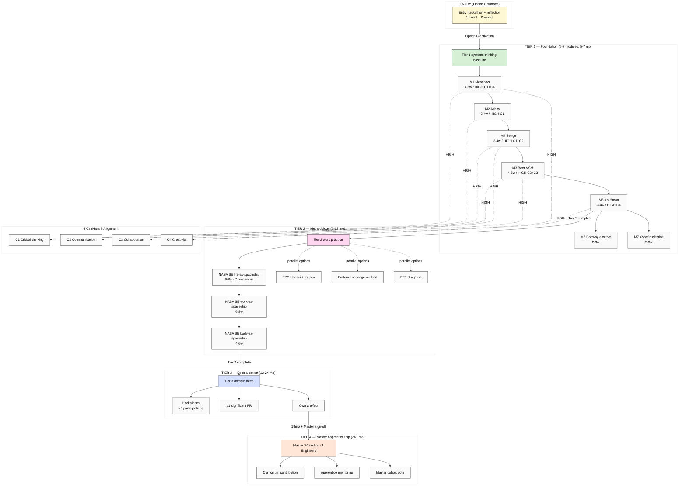

# Education Layer 4-tier structure + 4 Cs alignment overview

---

*Education Layer 4-tier structure with Entry (Option C) activation; 5-7 Tier 1 modules; 3-scale Tier 2 NASA SE; Tier 3 hackathon + PR + artefact; Tier 4 Master Workshop. 4 Cs alignment HIGH coverage across 5-module core.*
