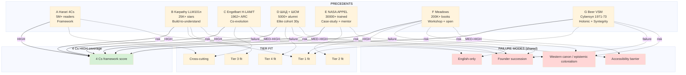

# 7-precedent comparison matrix (Harari + Karpathy + Engelbart + ШАД/ШСМ + NASA APPEL + Meadows + Beer)

```mermaid
%%{init: {'theme':'base'}}%%
graph TB
    subgraph "PRECEDENTS"
        A[A Harari 4Cs<br/>5M+ readers<br/>Framework]
        B[B Karpathy LLM101n<br/>25K+ stars<br/>Build-to-understand]
        C[C Engelbart H-LAM/T<br/>1962+ ARC<br/>Co-evolution]
        D[D ШАД + ШСМ<br/>5000+ alumni<br/>Elite cohort 30y]
        E[E NASA APPEL<br/>30000+ trained<br/>Case-study + mentor]
        F[F Meadows<br/>200K+ books<br/>Workshop + open]
        G[G Beer VSM<br/>Cybersyn 1971-73<br/>Holonic + Syntegrity]
    end

    subgraph "4 Cs HIGH coverage"
        FC[4 Cs framework score]
    end

    subgraph "TIER FIT"
        TX[Cross-cutting]
        T1f[Tier 1 fit]
        T2f[Tier 2 fit]
        T3f[Tier 3 fit]
        T4f[Tier 4 fit]
    end

    subgraph "FAILURE MODES (shared)"
        FM1[Founder succession]
        FM2[Western canon / epistemic colonialism]
        FM3[Accessibility barrier]
        FM4[English-only]
    end

    A -->|HIGH| FC
    B -->|HIGH| FC
    C -->|HIGH| FC
    D -->|MED-HIGH| FC
    E -->|MED-HIGH| FC
    F -->|HIGH| FC
    G -->|MED-HIGH| FC

    A -.-> TX
    B -.-> T1f
    B -.-> T3f
    C -.-> TX
    D -.-> T4f
    E -.-> T2f
    F -.-> T1f
    G -.-> T1f

    C -.->|failure| FM1
    D -.->|failure| FM1
    F -.->|failure| FM1
    G -.->|failure| FM1
    A -.->|risk| FM2
    F -.->|risk| FM2
    G -.->|risk| FM2
    D -.->|risk| FM3
    F -.->|risk| FM3
    B -.->|risk| FM4
    E -.->|risk| FM4

    style FC fill:#d6f0d6
    style FM1 fill:#ffd6d6
    style FM2 fill:#ffd6d6
    style FM3 fill:#ffd6d6
    style FM4 fill:#ffd6d6
```
