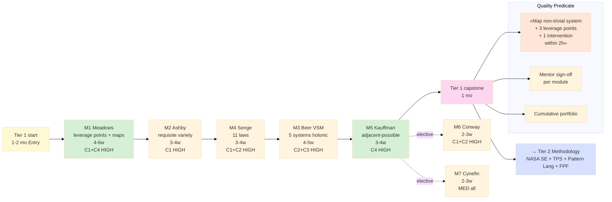
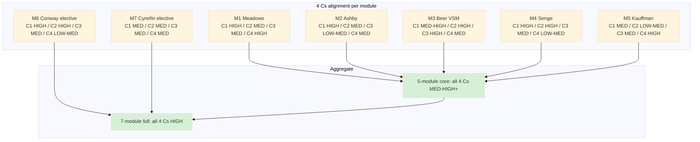

# Tier 1 Foundation modules — recommended sequence + 4 Cs alignment matrix

```mermaid
%%{init: {'theme':'base'}}%%
graph LR
    Start[Tier 1 start<br/>1-2 mo Entry] --> M1
    M1[M1 Meadows<br/>leverage points + maps<br/>4-6w<br/>C1+C4 HIGH] --> M2
    M2[M2 Ashby<br/>requisite variety<br/>3-4w<br/>C1 HIGH] --> M4
    M4[M4 Senge<br/>11 laws<br/>3-4w<br/>C1+C2 HIGH] --> M3
    M3[M3 Beer VSM<br/>5 systems holonic<br/>4-5w<br/>C2+C3 HIGH] --> M5
    M5[M5 Kauffman<br/>adjacent-possible<br/>3-4w<br/>C4 HIGH] --> Cap[Tier 1 capstone<br/>1 mo]
    M5 -.->|elective| M6[M6 Conway<br/>2-3w<br/>C1+C2 HIGH]
    M5 -.->|elective| M7[M7 Cynefin<br/>2-3w<br/>MED all]
    Cap --> T2[→ Tier 2 Methodology<br/>NASA SE + TPS + Pattern Lang + FPF]

    subgraph "Quality Predicate"
        QP[«Map non-trivial system<br/>+ 3 leverage points<br/>+ 1 intervention<br/>within 2h»]
        MS[Mentor sign-off<br/>per module]
        Port[Cumulative portfolio]
    end

    Cap --> QP
    Cap --> MS
    Cap --> Port

    style Start fill:#fff8d5
    style M1 fill:#d6f0d6
    style M5 fill:#d6f0d6
    style Cap fill:#ffd6f0
    style T2 fill:#d6e0ff
    style QP fill:#ffe6d6
```

## 4 Cs alignment matrix

```mermaid
%%{init: {'theme':'base'}}%%
graph TB
    subgraph "4 Cs alignment per module"
        M1m[M1 Meadows<br/>C1 HIGH / C2 MED / C3 MED / C4 HIGH]
        M2m[M2 Ashby<br/>C1 HIGH / C2 MED / C3 LOW-MED / C4 MED]
        M3m[M3 Beer VSM<br/>C1 MED-HIGH / C2 HIGH / C3 HIGH / C4 MED]
        M4m[M4 Senge<br/>C1 HIGH / C2 HIGH / C3 MED / C4 LOW-MED]
        M5m[M5 Kauffman<br/>C1 MED / C2 LOW-MED / C3 MED / C4 HIGH]
        M6m[M6 Conway elective<br/>C1 HIGH / C2 HIGH / C3 MED / C4 LOW-MED]
        M7m[M7 Cynefin elective<br/>C1 MED / C2 MED / C3 MED / C4 MED]
    end

    subgraph "Aggregate"
        Agg5[5-module core: all 4 Cs MED-HIGH+]
        Agg7[7-module full: all 4 Cs HIGH]
    end

    M1m --> Agg5
    M2m --> Agg5
    M3m --> Agg5
    M4m --> Agg5
    M5m --> Agg5
    M6m --> Agg7
    M7m --> Agg7
    Agg5 --> Agg7

    style Agg5 fill:#d6f0d6
    style Agg7 fill:#d6f0d6
```
