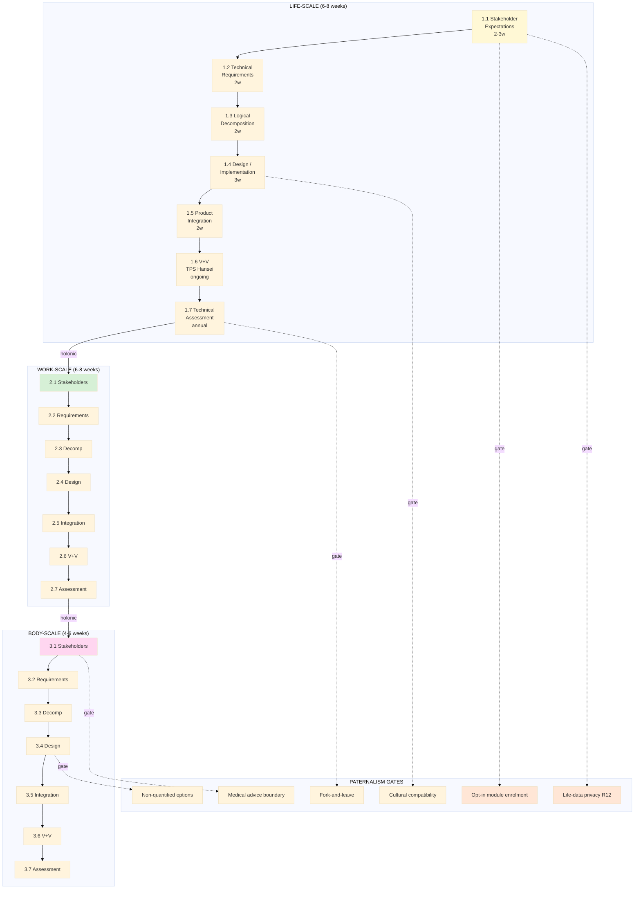
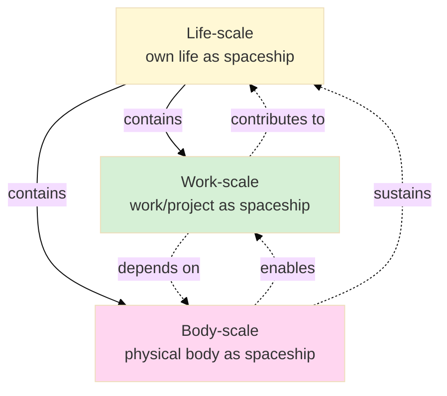

# NASA SE 7 processes × 3 nested scales (life-as-spaceship + work-as-spaceship + body-as-spaceship)

```mermaid
%%{init: {'theme':'base'}}%%
graph TB
    subgraph "LIFE-SCALE (6-8 weeks)"
        L1[1.1 Stakeholder<br/>Expectations<br/>2-3w]
        L2[1.2 Technical<br/>Requirements<br/>2w]
        L3[1.3 Logical<br/>Decomposition<br/>2w]
        L4[1.4 Design /<br/>Implementation<br/>3w]
        L5[1.5 Product<br/>Integration<br/>2w]
        L6[1.6 V+V<br/>TPS Hansei<br/>ongoing]
        L7[1.7 Technical<br/>Assessment<br/>annual]
        L1 --> L2 --> L3 --> L4 --> L5 --> L6 --> L7
    end

    subgraph "WORK-SCALE (6-8 weeks)"
        W1[2.1 Stakeholders]
        W2[2.2 Requirements]
        W3[2.3 Decomp]
        W4[2.4 Design]
        W5[2.5 Integration]
        W6[2.6 V+V]
        W7[2.7 Assessment]
        W1 --> W2 --> W3 --> W4 --> W5 --> W6 --> W7
    end

    subgraph "BODY-SCALE (4-6 weeks)"
        B1[3.1 Stakeholders]
        B2[3.2 Requirements]
        B3[3.3 Decomp]
        B4[3.4 Design]
        B5[3.5 Integration]
        B6[3.6 V+V]
        B7[3.7 Assessment]
        B1 --> B2 --> B3 --> B4 --> B5 --> B6 --> B7
    end

    L7 -->|holonic| W1
    W7 -->|holonic| B1

    subgraph "PATERNALISM GATES"
        PG1[Opt-in module enrolment]
        PG2[Life-data privacy R12]
        PG3[Fork-and-leave]
        PG4[Cultural compatibility]
        PG5[Non-quantified options]
        PG6[Medical advice boundary]
    end

    L1 -.->|gate| PG1
    L1 -.->|gate| PG2
    L7 -.->|gate| PG3
    L4 -.->|gate| PG4
    B4 -.->|gate| PG5
    B1 -.->|gate| PG6

    style L1 fill:#fff8d5
    style W1 fill:#d6f0d6
    style B1 fill:#ffd6f0
    style PG1 fill:#ffe6d6
    style PG2 fill:#ffe6d6
```

## Holonic structure (cross-scale)

```mermaid
%%{init: {'theme':'base'}}%%
graph TB
    LS[Life-scale<br/>own life as spaceship]
    WS[Work-scale<br/>work/project as spaceship]
    BS[Body-scale<br/>physical body as spaceship]
    LS -->|contains| WS
    LS -->|contains| BS
    WS -.->|depends on| BS
    WS -.->|contributes to| LS
    BS -.->|enables| WS
    BS -.->|sustains| LS
    style LS fill:#fff8d5
    style WS fill:#d6f0d6
    style BS fill:#ffd6f0
```
