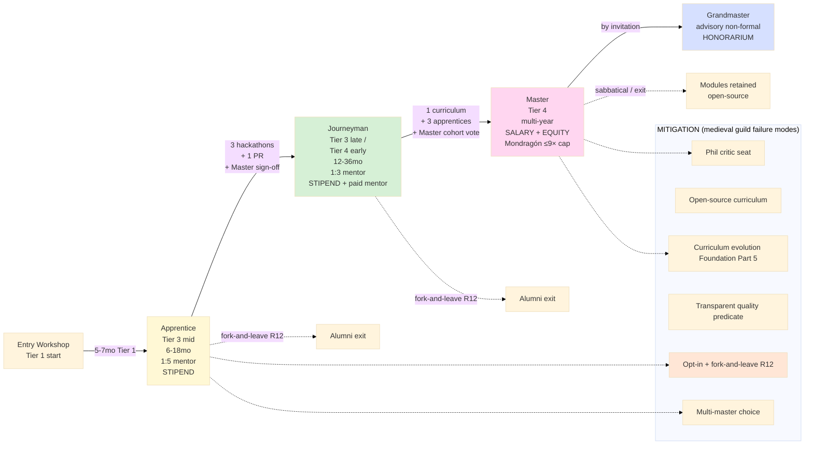
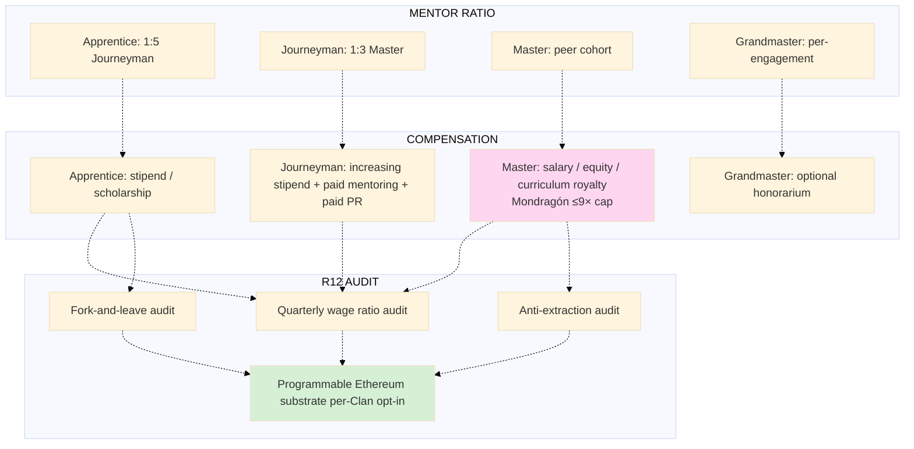

# Master-Apprentice 4-role progression flow

```mermaid
%%{init: {'theme':'base'}}%%
graph LR
    E[Entry Workshop<br/>Tier 1 start] -->|5-7mo Tier 1| A
    A[Apprentice<br/>Tier 3 mid<br/>6-18mo<br/>1:5 mentor<br/>STIPEND]
    A -->|3 hackathons<br/>+ 1 PR<br/>+ Master sign-off| J
    J[Journeyman<br/>Tier 3 late /<br/>Tier 4 early<br/>12-36mo<br/>1:3 mentor<br/>STIPEND + paid mentor]
    J -->|1 curriculum<br/>+ 3 apprentices<br/>+ Master cohort vote| M
    M[Master<br/>Tier 4<br/>multi-year<br/>SALARY + EQUITY<br/>Mondragón ≤9× cap]
    M -->|by invitation| G[Grandmaster<br/>advisory non-formal<br/>HONORARIUM]

    A -.->|fork-and-leave R12| Exit1[Alumni exit]
    J -.->|fork-and-leave R12| Exit2[Alumni exit]
    M -.->|sabbatical / exit| Exit3[Modules retained<br/>open-source]

    subgraph "MITIGATION (medieval guild failure modes)"
        Mit1[Opt-in + fork-and-leave R12]
        Mit2[Open-source curriculum]
        Mit3[Multi-master choice]
        Mit4[Transparent quality predicate]
        Mit5[Phil critic seat]
        Mit6[Curriculum evolution Foundation Part 5]
    end

    A -.-> Mit1
    A -.-> Mit3
    M -.-> Mit5
    M -.-> Mit6

    style A fill:#fff8d5
    style J fill:#d6f0d6
    style M fill:#ffd6f0
    style G fill:#d6e0ff
    style Mit1 fill:#ffe6d6
```

## Per-tier mentor ratio + compensation

```mermaid
%%{init: {'theme':'base'}}%%
graph TB
    subgraph "MENTOR RATIO"
        R1[Apprentice: 1:5 Journeyman]
        R2[Journeyman: 1:3 Master]
        R3[Master: peer cohort]
        R4[Grandmaster: per-engagement]
    end

    subgraph "COMPENSATION"
        C1[Apprentice: stipend / scholarship]
        C2[Journeyman: increasing stipend + paid mentoring + paid PR]
        C3[Master: salary / equity / curriculum royalty<br/>Mondragón ≤9× cap]
        C4[Grandmaster: optional honorarium]
    end

    subgraph "R12 AUDIT"
        QA[Quarterly wage ratio audit]
        FE[Fork-and-leave audit]
        EE[Anti-extraction audit]
        PE[Programmable Ethereum substrate per-Clan opt-in]
    end

    R1 -.-> C1
    R2 -.-> C2
    R3 -.-> C3
    R4 -.-> C4

    C1 -.-> QA
    C2 -.-> QA
    C3 -.-> QA
    C3 -.-> EE
    C1 -.-> FE

    QA -.-> PE
    FE -.-> PE
    EE -.-> PE

    style C3 fill:#ffd6f0
    style PE fill:#d6f0d6
```
