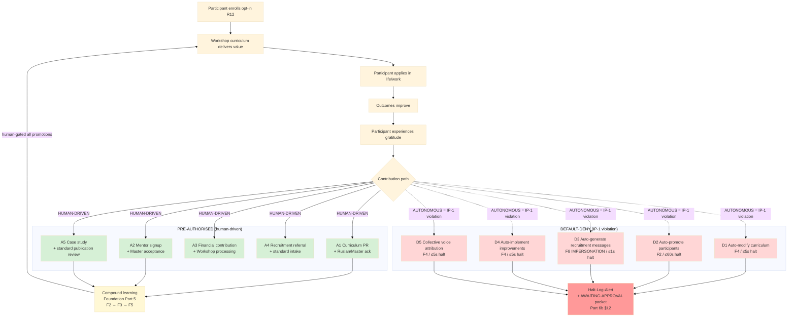
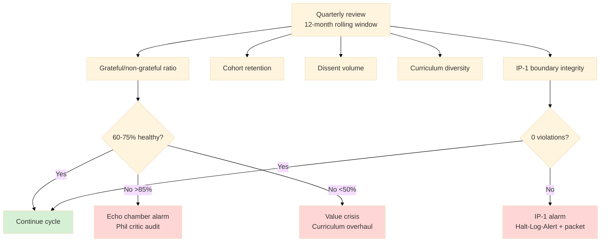

# Gratitude loop IP-1 STRICT boundary

```mermaid
%%{init: {'theme':'base'}}%%
graph TB
    P[Participant enrolls opt-in R12] --> V[Workshop curriculum delivers value]
    V --> A[Participant applies in life/work]
    A --> O[Outcomes improve]
    O --> G[Participant experiences gratitude]
    G --> C{Contribution path}

    subgraph "PRE-AUTHORISED (human-driven)"
        PA1[A1 Curriculum PR<br/>+ Ruslan/Master ack]
        PA2[A2 Mentor signup<br/>+ Master acceptance]
        PA3[A3 Financial contribution<br/>+ Workshop processing]
        PA4[A4 Recruitment referral<br/>+ standard intake]
        PA5[A5 Case study<br/>+ standard publication review]
    end

    subgraph "DEFAULT-DENY (IP-1 violation)"
        DD1[D1 Auto-modify curriculum<br/>F4 / ≤5s halt]
        DD2[D2 Auto-promote participants<br/>F2 / ≤60s halt]
        DD3[D3 Auto-generate recruitment messages<br/>F8 IMPERSONATION / ≤1s halt]
        DD4[D4 Auto-implement improvements<br/>F4 / ≤5s halt]
        DD5[D5 Collective voice attribution<br/>F4 / ≤5s halt]
    end

    C -->|HUMAN-DRIVEN| PA1
    C -->|HUMAN-DRIVEN| PA2
    C -->|HUMAN-DRIVEN| PA3
    C -->|HUMAN-DRIVEN| PA4
    C -->|HUMAN-DRIVEN| PA5
    C -.->|AUTONOMOUS = IP-1 violation| DD1
    C -.->|AUTONOMOUS = IP-1 violation| DD2
    C -.->|AUTONOMOUS = IP-1 violation| DD3
    C -.->|AUTONOMOUS = IP-1 violation| DD4
    C -.->|AUTONOMOUS = IP-1 violation| DD5

    DD1 --> H[Halt-Log-Alert<br/>+ AWAITING-APPROVAL packet<br/>Part 6b §I.2]
    DD2 --> H
    DD3 --> H
    DD4 --> H
    DD5 --> H

    PA1 --> CL[Compound learning<br/>Foundation Part 5<br/>F2 → F3 → F5]
    PA2 --> CL
    PA5 --> CL

    CL -->|human-gated all promotions| V

    style PA1 fill:#d6f0d6
    style PA2 fill:#d6f0d6
    style PA3 fill:#d6f0d6
    style PA4 fill:#d6f0d6
    style PA5 fill:#d6f0d6
    style DD1 fill:#ffd6d6
    style DD2 fill:#ffd6d6
    style DD3 fill:#ffd6d6
    style DD4 fill:#ffd6d6
    style DD5 fill:#ffd6d6
    style H fill:#ff9999
    style CL fill:#fff8d5
```

## Sustainability test (12-month window)

```mermaid
%%{init: {'theme':'base'}}%%
graph TB
    Q[Quarterly review<br/>12-month rolling window]
    Q --> M1[Grateful/non-grateful ratio]
    Q --> M2[Cohort retention]
    Q --> M3[Dissent volume]
    Q --> M4[Curriculum diversity]
    Q --> M5[IP-1 boundary integrity]
    M1 --> H{60-75% healthy?}
    H -->|Yes| OK[Continue cycle]
    H -->|No >85%| EA[Echo chamber alarm<br/>Phil critic audit]
    H -->|No <50%| VA[Value crisis<br/>Curriculum overhaul]
    M5 --> IP{0 violations?}
    IP -->|No| IA[IP-1 alarm<br/>Halt-Log-Alert + packet]
    IP -->|Yes| OK
    style EA fill:#ffd6d6
    style VA fill:#ffd6d6
    style IA fill:#ffd6d6
    style OK fill:#d6f0d6
```
