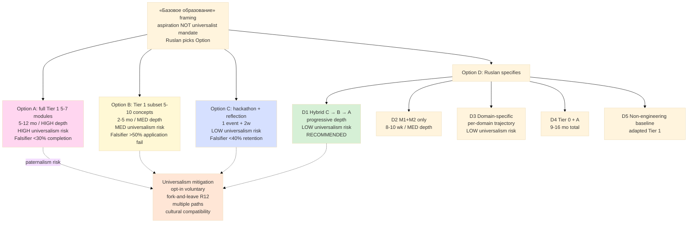
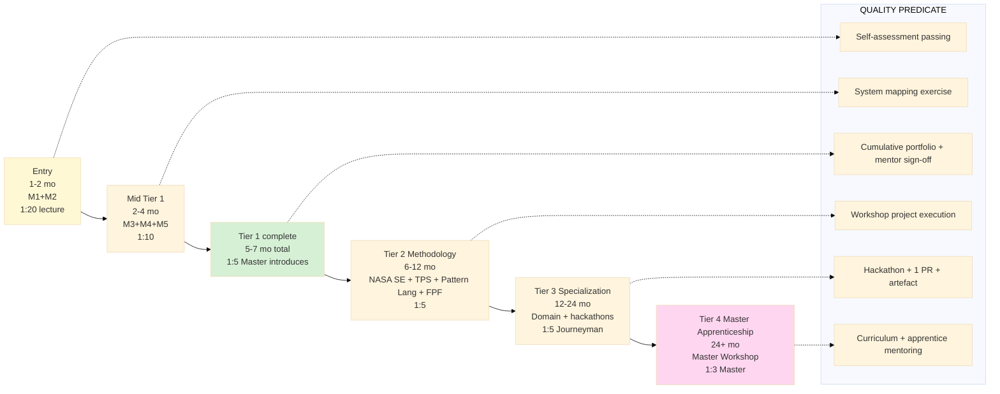

# «Базовое образование» Options A/B/C/D matrix (R1 surface — Ruslan picks)

```mermaid
%%{init: {'theme':'base'}}%%
graph TB
    Q[«Базовое образование» framing<br/>aspiration NOT universalist mandate<br/>Ruslan picks Option]

    Q --> A[Option A: full Tier 1 5-7 modules<br/>5-12 mo / HIGH depth<br/>HIGH universalism risk<br/>Falsifier &lt;30% completion]
    Q --> B[Option B: Tier 1 subset 5-10 concepts<br/>2-5 mo / MED depth<br/>MED universalism risk<br/>Falsifier &gt;50% application fail]
    Q --> C[Option C: hackathon + reflection<br/>1 event + 2w<br/>LOW universalism risk<br/>Falsifier &lt;40% retention]
    Q --> D[Option D: Ruslan specifies]

    D --> D1[D1 Hybrid C → B → A<br/>progressive depth<br/>LOW universalism risk<br/>RECOMMENDED]
    D --> D2[D2 M1+M2 only<br/>8-10 wk / MED depth]
    D --> D3[D3 Domain-specific<br/>per-domain trajectory<br/>LOW universalism risk]
    D --> D4[D4 Tier 0 + A<br/>9-16 mo total]
    D --> D5[D5 Non-engineering baseline<br/>adapted Tier 1]

    A -.->|paternalism risk| Mit[Universalism mitigation<br/>opt-in voluntary<br/>fork-and-leave R12<br/>multiple paths<br/>cultural compatibility]
    B -.-> Mit
    C -.-> Mit
    D1 -.-> Mit

    style D1 fill:#d6f0d6
    style A fill:#ffd6f0
    style B fill:#fff8d5
    style C fill:#d6e0ff
    style Mit fill:#ffe6d6
```

## Cohort progression Entry → Tier 4

```mermaid
%%{init: {'theme':'base'}}%%
graph LR
    E[Entry<br/>1-2 mo<br/>M1+M2<br/>1:20 lecture] --> T1m[Mid Tier 1<br/>2-4 mo<br/>M3+M4+M5<br/>1:10]
    T1m --> T1c[Tier 1 complete<br/>5-7 mo total<br/>1:5 Master introduces]
    T1c --> T2[Tier 2 Methodology<br/>6-12 mo<br/>NASA SE + TPS + Pattern Lang + FPF<br/>1:5]
    T2 --> T3[Tier 3 Specialization<br/>12-24 mo<br/>Domain + hackathons<br/>1:5 Journeyman]
    T3 --> T4[Tier 4 Master Apprenticeship<br/>24+ mo<br/>Master Workshop<br/>1:3 Master]

    subgraph "QUALITY PREDICATE"
        QP1[Self-assessment passing]
        QP2[System mapping exercise]
        QP3[Cumulative portfolio + mentor sign-off]
        QP4[Workshop project execution]
        QP5[Hackathon + 1 PR + artefact]
        QP6[Curriculum + apprentice mentoring]
    end

    E -.-> QP1
    T1m -.-> QP2
    T1c -.-> QP3
    T2 -.-> QP4
    T3 -.-> QP5
    T4 -.-> QP6

    style E fill:#fff8d5
    style T1c fill:#d6f0d6
    style T4 fill:#ffd6f0
```
