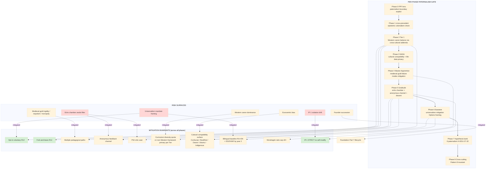

# Paternalism mitigation per-stage gates

```mermaid
%%{init: {'theme':'base'}}%%
graph TB
    subgraph "PER-PHASE PATERNALISM GATE"
        P0[Phase 0 FPF lens<br/>paternalism boundary explicit]
        P1[Phase 1 cross-precedent<br/>epistemic colonialism check]
        P2[Phase 2 Tier 1<br/>Western canon balance via cross-cultural addenda]
        P3[Phase 3 NASA<br/>cultural compatibility + life-data privacy]
        P4[Phase 4 Master-Apprentice<br/>medieval guild failure modes mitigation]
        P5[Phase 5 Gratitude<br/>echo chamber + anonymous channel + dissent]
        P6[Phase 6 Базовое<br/>universalism mitigation Options framing]
        P7[Phase 7 Hypothesis bank<br/>6 paternalism H-EDU-27-32]
        P8[Phase 8 Cross-cutting<br/>Pattern 8 invariant]
    end

    P0 --> P1 --> P2 --> P3 --> P4 --> P5 --> P6 --> P7 --> P8

    subgraph "MITIGATION INVARIANTS (across all phases)"
        I1[Opt-in voluntary R12]
        I2[Fork-and-leave R12]
        I3[Multiple pedagogical paths]
        I4[Anonymous feedback channel]
        I5[Phil critic seat]
        I6[Curriculum diversity quota<br/>≥1 non-Western framework primary per Tier]
        I7[Cultural compatibility surface<br/>Confucian / Buddhist / Daoist / Ubuntu / Indigenous]
        I8[Bilingual baseline RU+EN<br/>+ ES/ZH/AR by year 2]
        I9[Mondragón ratio cap ≤9×]
        I10[IP-1 STRICT no self-modify]
    end

    P2 -.-> I1
    P2 -.-> I2
    P2 -.-> I3
    P2 -.-> I7
    P5 -.-> I4
    P5 -.-> I5
    P5 -.-> I6
    P5 -.-> I10
    P4 -.-> I9
    P6 -.-> I7
    P6 -.-> I8

    subgraph "RISK SURFACES"
        R1[Universalism mandate framing]
        R2[Western canon dominance]
        R3[Eurocentric bias]
        R4[Echo chamber zealot filter]
        R5[Founder succession]
        R6[Medieval guild rigidity / nepotism / monopoly]
        R7[IP-1 violation drift]
    end

    R1 -.->|mitigated| I1
    R1 -.->|mitigated| I8
    R2 -.->|mitigated| I6
    R3 -.->|mitigated| I7
    R4 -.->|mitigated| I4
    R4 -.->|mitigated| I5
    R5 -.->|mitigated| Foundation[Foundation Part 7 lifecycle]
    R6 -.->|mitigated| I3
    R7 -.->|mitigated| I10

    style I1 fill:#d6f0d6
    style I2 fill:#d6f0d6
    style I10 fill:#d6f0d6
    style R1 fill:#ffd6d6
    style R4 fill:#ffd6d6
    style R7 fill:#ffd6d6
```
