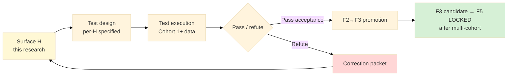

# 37 H bank — Education Layer breadth visualisation

```mermaid
%%{init: {'theme':'base'}}%%
graph TB
    subgraph "CURRICULUM (7 H)"
        H1[H-EDU-1 Tier 1 sufficient]
        H2[H-EDU-2 M1+M2 minimum-viable]
        H3[H-EDU-3 M3 enrolment lower]
        H4[H-EDU-4 self-paced &lt;50% cohort]
        H5[H-EDU-5 4Cs predicts outcomes]
        H6[H-EDU-6 NASA SE life most transformational]
        H7[H-EDU-7 M6+M7 electives &lt;30%]
    end

    subgraph "CROSS-PRECEDENT (7 H)"
        H8[H-EDU-8 4Cs maps cleanly F3]
        H9[H-EDU-9 Karpathy build-to-understand portable]
        H10[H-EDU-10 ШСМ sustainable vs guild F3]
        H11[H-EDU-11 NASA APPEL adapts F3]
        H12[H-EDU-12 Meadows more accessible than Beer]
        H13[H-EDU-13 Engelbart recursive bootstrap]
        H14[H-EDU-14 Pattern Language portable]
    end

    subgraph "MASTER-APPRENTICE (6 H)"
        H15[H-EDU-15 1:5 Journeyman:Apprentice ratio]
        H16[H-EDU-16 1:3 Master:Journeyman ratio]
        H17[H-EDU-17 50-cohort Q4 2026 feasible]
        H18[H-EDU-18 3-hackathon requirement pulls velocity]
        H19[H-EDU-19 ШСМ closest sustainable F3]
        H20[H-EDU-20 Mondragón cap preserves R12 F3]
    end

    subgraph "GRATITUDE IP-1 (6 H)"
        H21[H-EDU-21 PR process catches 95%+ F3 IP-1]
        H22[H-EDU-22 ratio 60-75% stable]
        H23[H-EDU-23 anonymous channel preserves dissent]
        H24[H-EDU-24 Phil critic seat reduces echo]
        H25[H-EDU-25 fork-and-leave 2-15%]
        H26[H-EDU-26 compound learning human-gated]
    end

    subgraph "PATERNALISM (6 H)"
        H27[H-EDU-27 opt-in preserves dignity]
        H28[H-EDU-28 cultural compatibility check]
        H29[H-EDU-29 multi-path reduces barriers]
        H30[H-EDU-30 no R12 lock-in]
        H31[H-EDU-31 diversity quota prevents echo]
        H32[H-EDU-32 specialist trajectory observable]
    end

    subgraph "CROSS-STREAM (5 H)"
        H33[H-EDU-33 Hackathon = Tier 3 vehicle]
        H34[H-EDU-34 Outreach reuses Tier 1+2]
        H35[H-EDU-35 Recursive Engine Tier 2 module]
        H36[H-EDU-36 System Merger Tier 2 module]
        H37[H-EDU-37 H-ML-1 refutable via Education Layer]
    end

    subgraph "F-GRADE"
        F2g[F2 surface = 31 H]
        F3g[F3 candidate = 6 H<br/>H-EDU-8/10/11/19/20/21]
    end

    H8 --> F3g
    H10 --> F3g
    H11 --> F3g
    H19 --> F3g
    H20 --> F3g
    H21 --> F3g

    style F3g fill:#d6f0d6
    style F2g fill:#fff8d5
    style H21 fill:#ffd6f0
```

## Test design pipeline (per H)

```mermaid
%%{init: {'theme':'base'}}%%
graph LR
    Surface[Surface H<br/>this research] --> Test[Test design<br/>per-H specified]
    Test --> Exec[Test execution<br/>Cohort 1+ data]
    Exec --> Eval{Pass / refute}
    Eval -->|Pass acceptance| Pro[F2→F3 promotion]
    Eval -->|Refute| Cor[Correction packet]
    Pro --> Lock[F3 candidate → F5 LOCKED<br/>after multi-cohort]
    Cor --> Surface

    style Surface fill:#fff8d5
    style Lock fill:#d6f0d6
    style Cor fill:#ffd6d6
```
