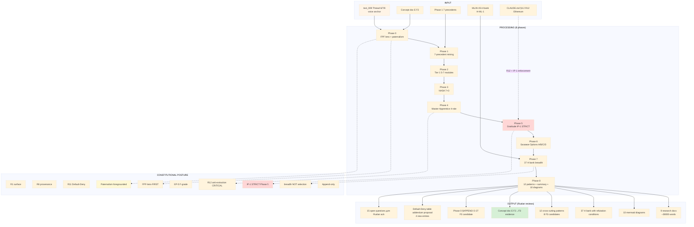
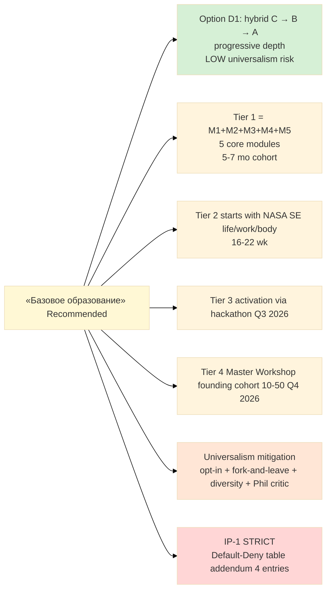

# Master TL;DR — Education Layer Deep Research at-a-glance

```mermaid
%%{init: {'theme':'base'}}%%
graph TB
    subgraph "INPUT"
        VC[text_009 Thread 6/7/8<br/>voice anchor]
        E[Concept doc E F2]
        P1[Phase 1 7 precedents]
        P14[ML/AI 45-H bank<br/>H-ML-1]
        CL[CLAUDE.md §4.2 R12 Ethereum]
    end

    subgraph "PROCESSING (8 phases)"
        F0[Phase 0<br/>FPF lens + paternalism]
        F1[Phase 1<br/>7-precedent mining]
        F2[Phase 2<br/>Tier 1 5-7 modules]
        F3[Phase 3<br/>NASA 7×3]
        F4[Phase 4<br/>Master-Apprentice 4-role]
        F5[Phase 5<br/>Gratitude IP-1 STRICT]
        F6[Phase 6<br/>Базовое Options A/B/C/D]
        F7[Phase 7<br/>37 H bank breadth]
        F8[Phase 8<br/>12 patterns + summary + 10 diagrams]
    end

    subgraph "OUTPUT (Ruslan reviews)"
        O1[9 research docs<br/>~28000 words]
        O2[10 mermaid diagrams]
        O3[37 H bank with refutation conditions]
        O4[12 cross-cutting patterns<br/>8 F3 candidates]
        O5[Concept doc E F2→F3 evidence]
        O6[Phase 0 §APPEND O-27 F3 candidate]
        O7[Default-Deny table addendum proposal<br/>4 new entries]
        O8[15 open questions для Ruslan ack]
    end

    VC --> F0
    E --> F0
    P1 --> F1
    F0 --> F1
    F1 --> F2
    F2 --> F3
    F3 --> F4
    F4 --> F5
    CL -.->|R12 + IP-1 enforcement| F5
    F5 --> F6
    F6 --> F7
    P14 --> F7
    F7 --> F8

    F8 --> O1
    F8 --> O2
    F8 --> O3
    F8 --> O4
    F8 --> O5
    F8 --> O6
    F8 --> O7
    F8 --> O8

    subgraph "CONSTITUTIONAL POSTURE"
        C1[R1 surface]
        C2[R6 provenance]
        C3[R11 Default-Deny]
        C4[R12 anti-extraction CRITICAL]
        C5[IP-1 STRICT Phase 5]
        C6[EP-5 F-grade]
        C7[breadth NOT selection]
        C8[FPF-lens-FIRST]
        C9[Paternalism foregrounded]
        C10[Append-only]
    end

    F0 -.-> C8
    F5 -.-> C5
    F0 -.-> C9
    F4 -.-> C4
    F7 -.-> C7

    style F5 fill:#ffd6d6
    style C5 fill:#ffd6d6
    style C9 fill:#fff8d5
    style O5 fill:#d6f0d6
    style VC fill:#fff4e6
```

## Recommended Option (R1 surface — Ruslan picks)

```mermaid
%%{init: {'theme':'base'}}%%
graph LR
    R[«Базовое образование» Recommended]
    R --> D1[Option D1: hybrid C → B → A<br/>progressive depth<br/>LOW universalism risk]
    R --> T1[Tier 1 = M1+M2+M3+M4+M5<br/>5 core modules<br/>5-7 mo cohort]
    R --> T2[Tier 2 starts with NASA SE life/work/body<br/>16-22 wk]
    R --> T3[Tier 3 activation via hackathon Q3 2026]
    R --> T4[Tier 4 Master Workshop founding cohort 10-50 Q4 2026]
    R --> Mit[Universalism mitigation<br/>opt-in + fork-and-leave + diversity + Phil critic]
    R --> IP[IP-1 STRICT<br/>Default-Deny table addendum 4 entries]

    style R fill:#fff8d5
    style D1 fill:#d6f0d6
    style IP fill:#ffd6d6
    style Mit fill:#ffe6d6
```
