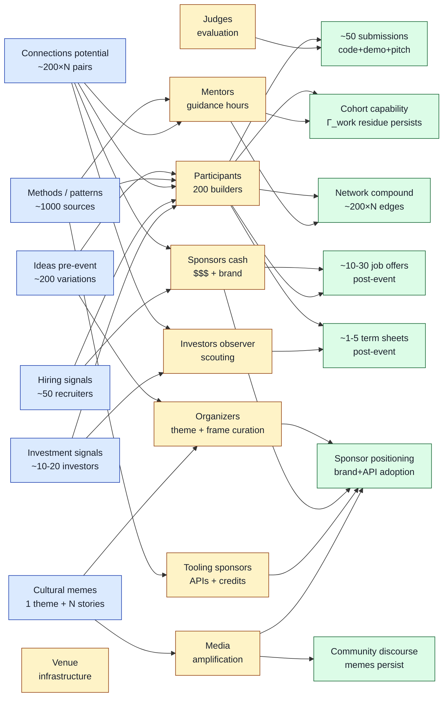

# Diagram 01 — Hackathon information-flow anatomy

> Sankey-style visualization of 6 income streams → 9 stakeholder transformations → N outputs.

**Reading the diagram:**
- **Blue** = 6 income streams (pre-event state)
- **Yellow** = 9 stakeholder roles (transformation layer)
- **Green** = 7 output categories (post-event state)

**Key info-flow observations:**
- Participants (PRT) = most-edges node — central to all 6 streams + 5 output categories (highest info-flow density)
- Sponsors cash (SPC) = high cost-overhead role (per Hackonomics 101 — $400 cost / $200 raised) — расположен в hiring + positioning flows
- Information ≠ guaranteed conversion: 200 ideas → ~50 submissions → ~10-30 hires → ~1-5 term sheets (funnel attrition expected; healthy)
- Cultural memes (I6 → O6) = persists in community discourse beyond event boundary

[src: parent 02-fpf-mapping §5; volumes empirical typical 200-participant event]
