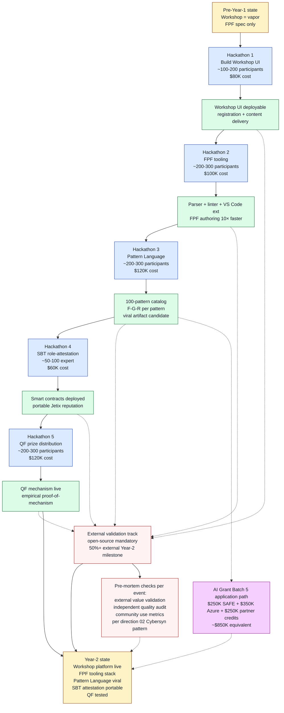

# Diagram 02 — Jetix self-bootstrapping hackathon compound

> Hypothesis C recursive amplification visualization. Each event builds substrate; substrate enables next event.

**Reading the diagram:**
- **Blue** = 5 hackathon events Year-1 (~$480K total cost)
- **Green** = 5 outputs per event (compound substrate)
- **Yellow** = pre-event and post-Year-1 states
- **Red** = pre-mortem + external-validation risk-mitigation loop (anti-cult-formation discipline per direction 02 Cybersyn)
- **Purple** = AI Grant investor scenario (per profile 06)

**Recursive amplification properties:**
- H1 output (Workshop UI) → enables H2 hosting + curriculum
- H2 output (FPF tooling) → enables H3 productivity + community
- H3 output (Pattern Language viral) → enables H4 attraction + investor signal
- H4 output (SBT) → enables H5 mechanism testing + Hypothesis A portability
- H5 output (QF) → empirical proof for next year hackathon series

**Critical risk-mitigation:**
- Each output forks к external-validation track (dotted lines)
- Year-2 milestone: 50%+ external participants (escape-velocity check)
- Per-event pre-mortem (Cybersyn-pattern anti-cult-formation discipline)

[src: parent 03-jetix-hypotheses-deep §3 + Ethereum architecture §04+§06]
