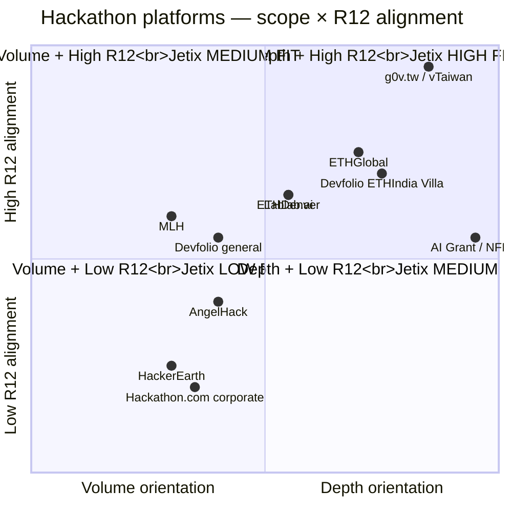

# Diagram 03 — Platform comparison quadrant

> 11 major platforms positioned across 2 primary axes: scope (volume vs depth) × info-flow alignment with Jetix R12.

**Reading the quadrant:**

**Q1 (Depth + High R12) — Jetix HIGH FIT:**
- **g0v.tw** — strongest precedent; 12-year self-bootstrapping civic-tech; CC0 mandatory; community-volunteer
- **AI Grant** — accelerator (small-cohort depth); equity-based но d/acc-friendly; potential investor scenario
- **ETHGlobal** — Web3 ecosystem + open-source mandatory + Jetix Ethereum arch alignment
- **Devfolio ETHIndia Villa** — explicit «more intentional, smaller circle» format

**Q2 (Volume + High R12) — Jetix MEDIUM FIT:**
- **ETHDenver** — 25K participants but open-source mandatory + Web3 ethos; partial fit
- **Lablab.ai** — 7-day cadence + API-sponsor model + AI focus; Anthropic alignment helps

**Q3 (Volume + Low R12) — Jetix LOW FIT:**
- **HackerEarth** — 10M devs but recruitment-extractive model
- **Hackathon.com corporate** — sponsor-driven default; corporate IP dominance
- **AngelHack** — 300K devs but city-series sponsor extraction pattern

**Q4 (Depth + Low R12) — Jetix MEDIUM FIT:**
- (Few representatives — most depth events naturally lean к higher R12 alignment)

**Jetix engagement strategy implication:**
- **Phase 1 priority targets:** Q1 quadrant (g0v / AI Grant / ETHGlobal / Devfolio Villa)
- **Phase 2-3 secondary:** Q2 quadrant (ETHDenver / Lablab)
- **Skip / minimal:** Q3 quadrant

[src: parent 04-inventory §2 8-dimension matrix; quadrant positioning subjective brigadier judgment per R1]
