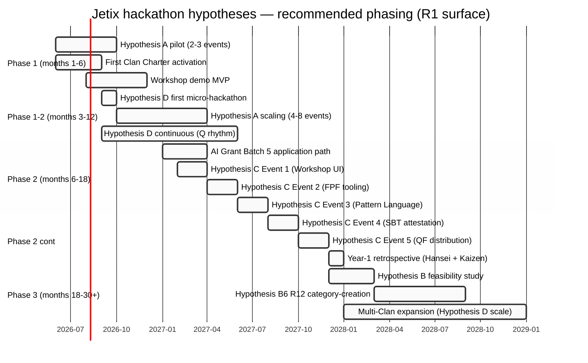

# Diagram 04 — Hypothesis priority roadmap (gantt)

> Recommended phasing across 4 hypotheses (R1 surface — Ruslan decides actual).

**Reading the roadmap:**

**Phase 1 (months 1-6, Jun-Nov 2026):**
- Hypothesis A pilot — 2-3 external hackathon attendances (lowest cost / immediate learning)
- First Clan Charter activation (Charter signatories ≥3)
- Workshop demo MVP (prerequisite для Hypothesis C)

**Phase 1-2 hybrid (months 3-12, Aug 2026 - Jun 2027):**
- Hypothesis D first micro-hackathon (when Charter signatories ≥3)
- Hypothesis A continues scaling (4-8 events Year-1 total)
- Hypothesis D quarterly cadence sustained

**Phase 2 (months 6-18, Jan-Dec 2027):**
- AI Grant Batch 5 application (per profile 06)
- Hypothesis C 5-event Year-1 series (bi-monthly cadence)
- Year-1 retrospective (Hansei + Kaizen per direction 14 TPS gaps)

**Phase 3 (months 18-30+, Dec 2027 onward):**
- Hypothesis B feasibility (only if reputation + budget established)
- Hypothesis B6 R12-compliant world record category-creation alternative
- Multi-Clan expansion (when 2+ Clans active)

**Critical dependencies:**
- Workshop demo MVP prerequisite для Hypothesis C
- Charter signatories ≥3 prerequisite для Hypothesis D
- Hypothesis A learning informs Hypothesis C design

**R1 caveat:** Brigadier surface. Ruslan = sole strategist on actual timeline + scope.

[src: parent 03-jetix-hypotheses-deep §5 ranked recommendation]
