# Diagram 05 — Harari Nexus overlay on hackathon ecosystem

> Visualization of how Harari Nexus framework's 3 theories of information + mythology+bureaucracy stack + self-correcting mechanisms map к hackathon dynamics.

```mermaid
graph TB
    %% Harari Nexus framework
    subgraph NEXUS ["Harari Nexus framework (2024)"]
        N1["3 theories of information"]
        N2["Mythology + bureaucracy stack"]
        N3["Self-correcting mechanisms"]
        N4["AI as alien intelligence (rupture)"]
        N5["Silicon Curtain risk"]
    end

    %% Hackathon ecosystem layers
    subgraph HACKATHON ["Hackathon ecosystem"]
        H_MYTH["Mythology layer:<br/>theme · narrative · winner stories<br/>Power Rangers metaphor"]
        H_BUREAU["Bureaucracy layer:<br/>rules · judging · IP · prizes"]
        H_INFO["6 info streams compressed:<br/>ideas · methods · connections<br/>hiring · investment · cultural memes"]
        H_SELF["Self-correction signals:<br/>✓ open-source ✓ multi-judge<br/>✗ sponsor lock-in ✗ winner bias"]
        H_AI["AI hackathons emerging:<br/>Lablab.ai · AI Grant<br/>Anthropic/OpenAI/Mistral focus"]
    end

    %% Jetix architectural response
    subgraph JETIX ["Jetix architectural response"]
        J_FGR["F-G-R discipline<br/>= operationalization 'complete historical view'"]
        J_DUAL["vision/00 §3+§4 dual layer<br/>= mythology + bureaucracy stack"]
        J_R12["R12 anti-extraction<br/>= dataism counter"]
        J_AP6["AP-6 preserve dissent<br/>= anti-witch-hunt"]
        J_C["Hypothesis C self-bootstrapping<br/>= recursive amplification"]
        J_WORKSHOP["Workshop concept<br/>= 4 Cs counter useless-class"]
    end

    %% Mappings
    N1 -->|"naive / populist / complete historical"| H_INFO
    N1 -->|"requires explicit reliability tagging"| J_FGR

    N2 -->|"binding stories + filtering rules"| H_MYTH
    N2 -->|"binding stories + filtering rules"| H_BUREAU
    N2 -->|"dual-layer Foundation principle"| J_DUAL

    N3 -->|"error-detection + revision capacity"| H_SELF
    N3 -->|"AP-6 + /project-de-morph + Hansei"| J_AP6

    N4 -->|"new event format (AI hackathons)"| H_AI
    N4 -->|"Pillar C R1/R4/R5/R9/R10 anti-agency"| J_R12

    N5 -->|"smart contracts opacity risk"| J_DUAL

    H_INFO -->|"velocity 10-1000× advantage"| J_C
    H_INFO -->|"strongest single-artefact match"| J_WORKSHOP

    %% Dataism risk overlay
    subgraph DATAISM ["Harari Homo Deus dataism critique"]
        D1["Output-volume worship"]
        D2["Time-commodification"]
        D3["Build-for-build's sake"]
        D4["Talent-data extraction"]
        D5["Sponsor theme dilution"]
        D6["Burnout normalization"]
    end

    D1 -.->|"counter"| J_R12
    D2 -.->|"counter"| J_WORKSHOP
    D3 -.->|"counter pre-mortem"| J_C
    D4 -.->|"counter"| J_R12
    D5 -.->|"counter"| J_R12
    D6 -.->|"counter Workshop sustainable"| J_WORKSHOP

    classDef harari fill:#fef3c7,stroke:#92400e,color:#1a202c
    classDef hackathon fill:#dbeafe,stroke:#1e40af,color:#1a202c
    classDef jetix fill:#dcfce7,stroke:#166534,color:#1a202c
    classDef dataism fill:#fef2f2,stroke:#991b1b,color:#1a202c
    class N1,N2,N3,N4,N5 harari
    class H_MYTH,H_BUREAU,H_INFO,H_SELF,H_AI hackathon
    class J_FGR,J_DUAL,J_R12,J_AP6,J_C,J_WORKSHOP jetix
    class D1,D2,D3,D4,D5,D6 dataism
```

**Reading the diagram:**

**3 source-frameworks (yellow / blue / red):**
- Harari Nexus (yellow) = theoretical framework parent
- Hackathon ecosystem (blue) = empirical event format
- Harari Homo Deus dataism (red) = critique lens

**Jetix architectural response (green):**
- F-G-R discipline = operationalization Nexus «complete historical view»
- vision/00 §3+§4 dual = mythology + bureaucracy stack
- R12 anti-extraction = dataism counter
- AP-6 preserve dissent = anti-witch-hunt
- Hypothesis C self-bootstrapping = recursive amplification
- Workshop concept = 4 Cs counter useless-class

**Solid arrows:** direct framework mapping
**Dotted arrows (red→green):** Jetix structural counter к dataism failure modes

**Key insights:**
- Jetix's existing architecture pre-existed Nexus framework but maps cleanly («pre-validated» by Harari Nexus 2024)
- AI hackathons (Lablab.ai / AI Grant) emerging = Harari's «alien intelligence» rupture realizing
- Self-correction partial in hackathon ecosystem; Jetix discipline strengthens
- Dataism risks ALL counterable by Pillar C R12 + Workshop + F-G-R

[src: parent 01-fundamentals §5 + 04-nexus-jetix-lens §3 + 02-homo-deus-jetix-lens §3]
