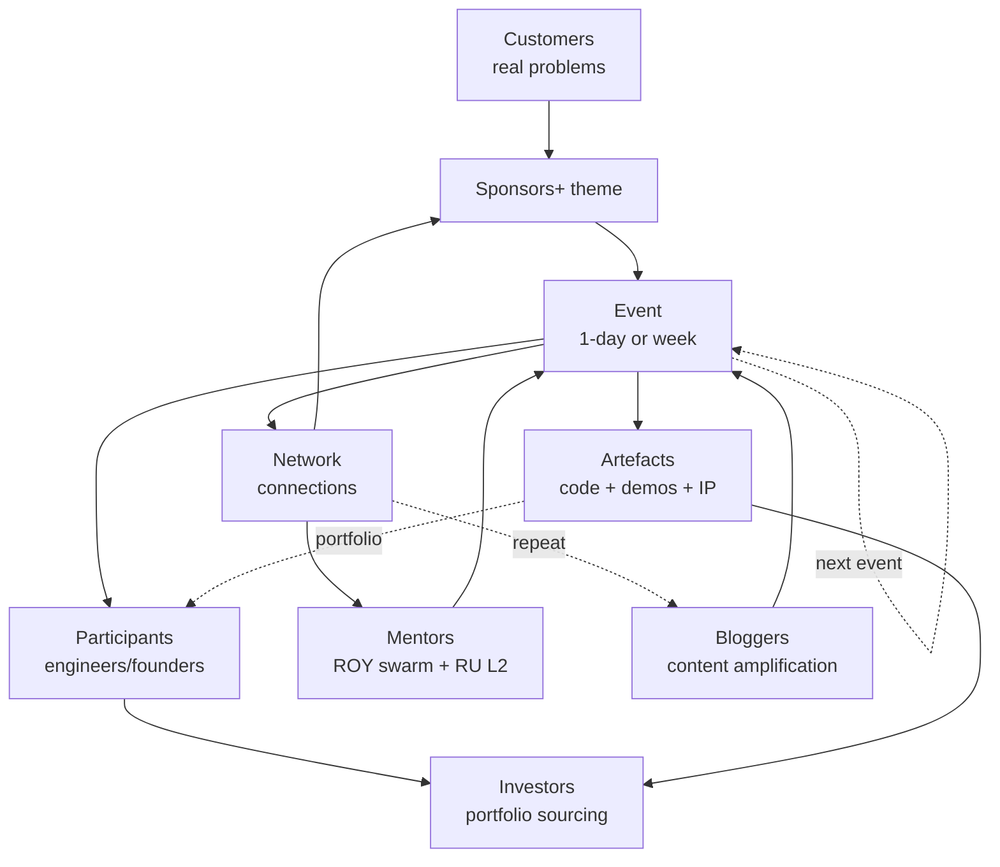
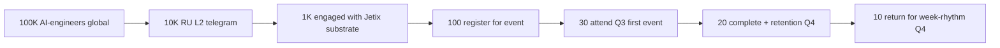
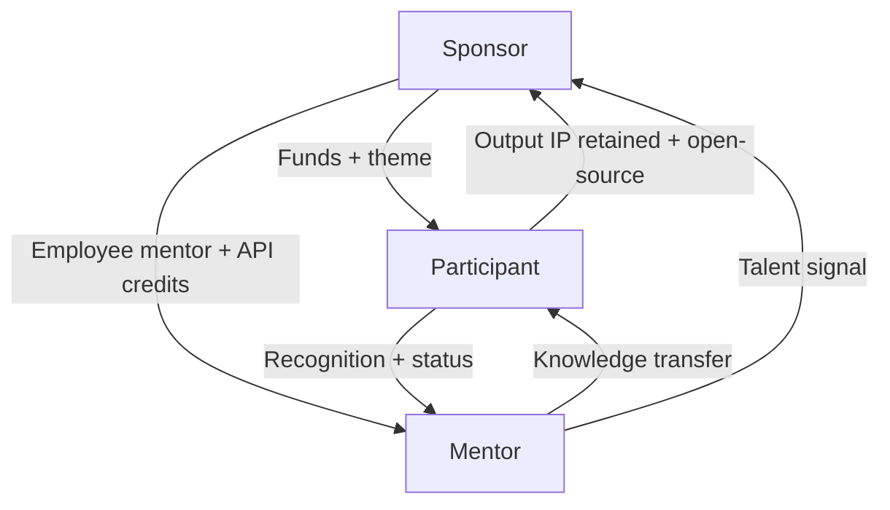
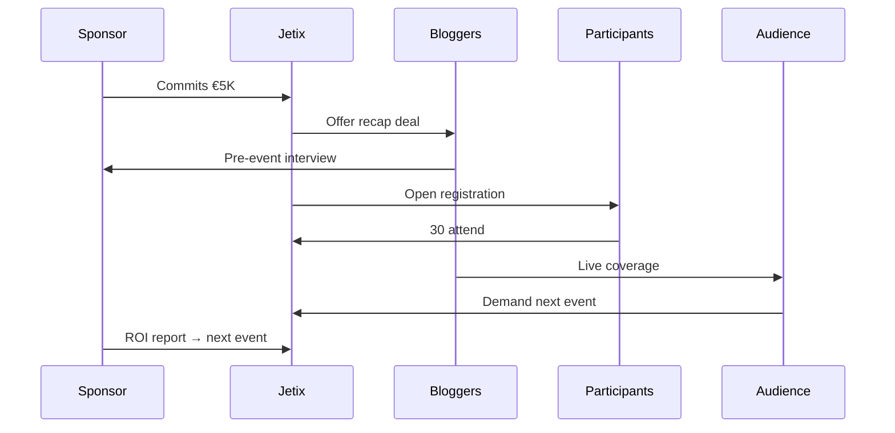
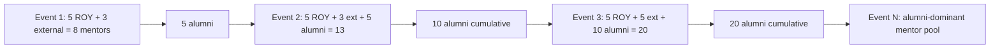

# Phase 3 — Cohort dynamics

> **R1 surface.** Per Phase 0 §5 matrix: scope 4 (cohort-mechanism) dominant. 6 cohort segments × 5 dimensions (recruitment / engagement / retention / cross-platform comparison / outreach script element). [src: §5 prompt structure]

---

## §0 TL;DR

6 cohort segments anchor Jetix hackathon platform: **bloggers** (text_009 ¶11 Thread 11 primary activation), **engineers** (ML/AI per H-ML-10/38), **investors** (text_009 ¶1 «внешние инвесторы Jetix как платформа для marathons»), **mentors** (ROY swarm + RU L2 leaders), **customers** (quick-money P1 integration), **sponsors** (corporate / VC / state). **Mentor scarcity = primary bottleneck** (per Phase 1 cross-platform pattern §10.4 MLH triangle). **Bloggers + sponsors = first-event activation pair** (text_009 ¶11). **RU L2 telegram cohort** = distinct partner pool (H-ML-3). Retention pattern: cohort effect compounds через repeated events (YC batch model).

---

## §1 Bloggers cohort

### §1.1 Why prioritised
Per text_009 ¶11 [src: voice text_009] — bloggers = first activation mode для Jetix because: (a) **content production amplifies reach**; (b) **low barrier to participation** (no deep technical skill required); (c) **sponsor visibility ROI immediate** (blog post / video / Twitter thread on event); (d) **trust-substrate via personal brand transfer**. Concept doc A §7 Activation Gantt: «first bloggers + sponsor day-rhythm hackathon».

### §1.2 Recruitment mechanism
- **Direct outreach** to existing AI/tech bloggers (Russian-speaking telegram leaders + English Twitter/Substack).
- **Co-marketing** (Jetix featured in blogger newsletter + blogger gets early access).
- **Reciprocal value:** Jetix provides exclusive content access (e.g. early FPF demos); blogger provides audience.
- **Identification candidates (RU subculture):** RU L2 leaders per concept doc cross-ref (Котенков / Лапань per concept doc B reference) + Telegram AI channels admins.

### §1.3 Engagement pattern
- **Pre-event (2-4 weeks):** content production agreement; theme involvement; quotes solicited.
- **Event day:** photographer access; live coverage; sponsor interview opportunity.
- **Post-event (1-2 weeks):** post-event recap content production; potential paid placement.

### §1.4 Retention factor
- **Repeat engagement** if event is content-rich (good story).
- **Status-driven retention:** «Jetix-featured blogger» badge / partnership tier.
- **Cross-event compounding:** each event adds to portfolio.

### §1.5 Cross-platform comparison
- **MLH** does not court bloggers explicitly — relies on student-as-amplifier model.
- **ETHGlobal** courts crypto Twitter influencers heavily (sponsor track integration).
- **TechCrunch Disrupt** = media-driven inherently.
- **Lablab.ai** — minimal blogger involvement; community-driven.

### §1.6 Outreach script element (RU example)
```
Привет [Имя],

[Personalization: ссылка на их пост о AI/X]

Я в Jetix — мы строим платформу для AI-марафонов. В Q3 [city] запускаем первый event: 1-day хакатон по [тема]. 20-50 участников. Спонсор подтверждён.

Был бы интерес participate в любом из:
1. Live coverage (photo + post-event recap) — мы оплатим time + access
2. Mentor / judge — час времени за event-day
3. Pre-event interview about своих наработок

Что заходит?

— Руслан
```

### §1.7 Hypothesis surface
- H-HP-11: «Bloggers + sponsor day-rhythm = highest first-event activation velocity» (cross-ref H-ML-3 RU community)

---

## §2 Engineers (ML/AI) cohort

### §2.1 Why prioritised
Per H-ML-10 (ML hackathon fit) + H-ML-38 (talent surfacing) + H-ML-39 (Karpathy outreach via hackathon framing) [src: `research/ml-ai-engineers-2026-05-18/09-hypotheses-bank-breadth.md`]. Engineers = primary value-creating cohort (output quality drives sponsor ROI + repeat events).

### §2.2 Recruitment mechanism
- **Channel A — Kaggle community** (per Phase 1 §1.1): Kaggle leaderboard top-N invited.
- **Channel B — RU L2 telegram** (per H-ML-3): ODS DataFest community; Telegram AI channels.
- **Channel C — Hugging Face Spaces creators** (per Phase 1 §1.5): model authors with traction.
- **Channel D — Twitter/X ML community**: niche followers per topic (RLHF / LLM / agents).
- **Channel E — University ML groups**: ШАД, Skoltech, HSE Lab; Berlin TU, Oxford ML.

### §2.3 Engagement pattern
- **Pre-event (4-6 weeks):** challenge teaser; Discord channel open; resources shared.
- **Event:** hands-on build; live problem-solving; expert mentor access.
- **Post-event:** GitHub-shared artefacts; published learnings; potential hire/partnership conversations.

### §2.4 Retention factor
- **Output quality + recognition** = primary driver (leaderboard / showcase).
- **Career compounding** (resume/portfolio item).
- **Compensation hierarchy:** prize money + API credits + recruitment exposure.

### §2.5 Cross-platform comparison
- **Kaggle:** competition-rigour-driven (intrinsic motivation).
- **MLH:** student-focused; not ML-engineer-specialised.
- **NeurIPS competitions:** academic prestige.
- **Lablab.ai:** AI-engineer-specialised; 7-day rhythm.

### §2.6 Outreach script element
```
[Name],

I'm building Jetix — a hackathon platform with FPF protocol substrate.

Q4 2026 we're running a 7-day AI engineering hackathon (Lablab-style).
Theme: agent orchestration с FPF primitives.

Sponsor: Anthropic credits + €X cash prize pool.
Mentors confirmed: [list].

Your work on [specific project] aligns. Would you:
1. Compete (team formation Discord)?
2. Mentor (1-2 office hours / week)?
3. Spread word in [their community]?

Brief deck: [link]

— Ruslan
```

### §2.7 Hypothesis surface
- H-HP-12: «RU L2 telegram cohort = highest mentor density per outreach effort» (cross-ref H-ML-3)
- H-HP-13: «Engineers prefer ≥1-week rhythm над day-rhythm» (cross-ref Phase 2 §9 matrix)

---

## §3 Investors cohort

### §3.1 Why prioritised
Per text_009 ¶1 [src: voice text_009] «внешние инвесторы Jetix как такая платформа для проведения качественных глубоких интересных марафонов». Investor cohort = (a) **funding source** (Jetix grants / strategic capital); (b) **legitimacy signal** (investor presence = quality signal); (c) **demand-side anchor** (investors looking for portfolio companies = participants = matched).

### §3.2 Recruitment mechanism
- **Tier 1 (AI Grant / NFDG):** per `research/hackathon-deep-2026-05-18/06-ai-grant-nfdg-deep-profile.md` — Batch 5 application path; Daniel Gross / Nat Friedman warm intro.
- **Tier 2 (European VCs):** Speedinvest, Atomico, Index Ventures EU AI-focused.
- **Tier 3 (Russian-friendly VCs):** post-2022 RU diaspora-friendly funds.
- **Tier 4 (Angel investors):** RU AI community angels.

### §3.3 Engagement pattern
- **Pre-event:** invitation as observer / Demo Day attendee.
- **Event day:** Demo Day pitches; introductions to top participants.
- **Post-event:** follow-up calls; potential portfolio company onboarding.
- **Reciprocal:** Jetix offers investor pipeline; investor offers strategic guidance + capital.

### §3.4 Retention factor
- **Deal flow quality** = retention metric.
- **Portfolio company sourcing**: 1-2 successful investments from Jetix events = sustained engagement.

### §3.5 Cross-platform comparison
- **YC Demo Day** = canonical investor engagement.
- **ETHGlobal:** investors attend selectively (top dApps).
- **TechCrunch Disrupt:** media + investor combined.

### §3.6 Outreach script element (EN, formal)
```
Dear [Name],

Jetix is launching a hackathon platform Q3 2026 в Berlin. First event:
1-day bloggers + sponsor mode; second (Q4) week-rhythm AI engineering.

We expect ~20-50 highly-vetted participants from RU L2 AI community
+ EU AI talent.

Would you attend the Q4 Demo Day as observer / judge? No commitment;
just exposure to a curated talent + project pool.

Pre-event brief: [link]

— Ruslan
```

### §3.7 Hypothesis surface
- H-HP-21: «1-2 investors as Demo Day observers = sustainable investor cohort attachment»
- H-HP-22: «AI Grant Batch 5 application path = $850K+ equivalent Year-1 funding» (cross-ref hackathon-deep §6.6)

---

## §4 Mentors cohort

### §4.1 Why prioritised
**Primary bottleneck** per Phase 1 cross-platform pattern (MLH sponsor-mentor-participant triangle; mentor scarcity at scale).

### §4.2 Recruitment mechanism
- **Tier 1 — ROY swarm internal mentors** (engineering-expert, philosophy-expert, etc.) — virtual mentor for FPF + AI architecture topics.
- **Tier 2 — RU L2 telegram leaders** (Котенков, Лапань, others — concept doc B candidates).
- **Tier 3 — Master Workshop candidates** (per `decisions/JETIX-WORKSHOP-CONCEPT-2026-04-30.md`).
- **Tier 4 — Hackathon alumni** (post-event participants who become repeat mentors).
- **Tier 5 — Sponsor employees** (sponsor-provided technical experts).

### §4.3 Engagement pattern
- **Pre-event:** brief + theme preview; expected commitment clarified.
- **Event:** rotational mentoring; specific consultation slots; sponsor liaison role.
- **Post-event:** alumni network onboarding; potential paid speaker / advisor role.
- **Reciprocal value:** mentors gain visibility + access to top talent + Jetix-substrate exposure.

### §4.4 Retention factor
- **Status + recognition** primary (gratitude loop per text_009 ¶7).
- **Network compounding:** mentor builds personal network через events.
- **Compensation:** small stipend ($500-2000 per event); meaningful titles («Master mentor», «Workshop apprentice mentor»).

### §4.5 Cross-platform comparison
- **MLH:** sponsor-employee model dominant.
- **Y Combinator:** alumni-network + partner-network dominant.
- **g0v:** community-driven (no formal mentor pay).
- **Lablab.ai:** community + LLM-vendor employees.

### §4.6 Outreach script element (RU)
```
[Name],

В Q3 [date] стартуем первый Jetix хакатон (1-day, Berlin OR online).
Тема: [спонсорская задача]. Участников 20-50.

Просим:
- 4 часа mentorship (event-day rotational)
- 30 min pre-event brief reading

В обмен:
- $500 стипендия + travel reimbursement (если offline)
- «Master mentor Jetix Q3-2026» recognition
- Access к Jetix substrate (FPF / R12 / Workshop materials)
- Networking с participant cohort + sponsor

Подтвердишь?

— Руслан
```

### §4.7 Hypothesis surface
- H-HP-31: «Mentor : participant ratio < 1:15 → output quality collapses below sponsor expectations»
- H-HP-32: «Alumni-mentor pipeline operational by event 4 → mentor cost halves»

---

## §5 Customers cohort (quick-money P1 integration)

### §5.1 Why prioritised
Per `## Проекты` CLAUDE.md: quick-money P1 = «Быстрые деньги: AI-услуги для бизнеса». **Hackathon = consulting delivery vehicle.** Customer brings problem; Jetix hackathon mode solves через participants; customer pays Jetix + prize pool.

### §5.2 Recruitment mechanism
- **Inbound** через Jetix consulting outreach (CRM pipeline / referral).
- **Tier 1 — existing quick-money clients** (если any active).
- **Tier 2 — RU corporate AI-adoption targets** (Sber / Tinkoff / Yandex pre-existing relationships? hackathon-deep candidates).
- **Tier 3 — EU SME AI consulting** (Berlin tech).
- **Tier 4 — Startup founders** with specific scoped problem.

### §5.3 Engagement pattern
- **Pre-event:** problem scoping (4-6 weeks); brief production; expected deliverable clarified.
- **Event:** customer attends as judge / observer; teams compete на customer's real problem.
- **Post-event:** winning team licences / partnership with customer; Jetix manages relationship.
- **Reciprocal value:** customer gets multiple solutions при cost lower than single-firm consulting; participants get real problem + sponsor cash; Jetix gets event revenue + relationship deepening.

### §5.4 Retention factor
- **Solution-quality satisfaction** primary.
- **Repeat events** for ongoing problems.
- **Conversion to Workshop / annual sponsor** for sustained engagement.

### §5.5 Cross-platform comparison
- **Chainlink hackathons:** protocol-bounty model — closest analogue.
- **Y Combinator partner office hours** — not exactly hackathon but customer-problem mode.
- **AngelHack corporate program** — extractive precedent (CAUTION per Phase 1 §5.4).

### §5.6 Outreach script element (RU corporate)
```
[Имя], добрый день.

Jetix запускает hackathon platform — формат: customer brings specific problem,
20-100 AI-engineers решают за 4-6 weeks; на выходе у вас 3-5 working solutions
от различных подходов + право выбора преемственности с лучшей командой.

Стоимость для customer: €X (3-5× ниже стандартного consulting за тот же scope).

Кейс пример: [link к подготовленному кейсу].

Можем 30 минут обсудить ваш текущий AI-роадмап?

— Ruslan, Jetix
```

### §5.7 Hypothesis surface
- H-HP-41: «Sponsor-customer hybrid mode = primary revenue mechanism Year-1»
- H-HP-42: «Customer satisfaction > 4/5 → 60% repeat rate Year-1»

---

## §6 Sponsors cohort

### §6.1 Why prioritised
Concept doc A §5 + §7 — sponsors anchor first activation (text_009 ¶11 «bloggers + sponsor projects»). Sponsor = funding mechanism + theme generator + IP partner + recruitment beneficiary.

### §6.2 Recruitment mechanism
- **Tier 1 — LLM vendors** (Anthropic, OpenAI, Cohere) — API credits + brand exposure.
- **Tier 2 — Cloud vendors** (AWS, Google Cloud, Azure) — GPU/compute credits.
- **Tier 3 — RU corporate** (Sber AI, Yandex Cloud, Tinkoff) — recruitment-driven.
- **Tier 4 — EU corporates** (Bosch AI, SAP, Siemens) — innovation challenge.
- **Tier 5 — Crypto protocols** (Ethereum Foundation, Optimism, Polygon) — Gitcoin/QF aligned.

### §6.3 Engagement pattern
- **Pre-event (8-12 weeks):** sponsor recruitment; theme co-design; brief production.
- **Event:** sponsor logo + brand activation; sponsor employees as mentors + judges.
- **Post-event:** retrospective; ROI calculation (mentions, applications, hires, leads).
- **Reciprocal value:** sponsor gets brand + talent + IP access + R12-compliant partnership; Jetix gets funding + theme depth.

### §6.4 Retention factor
- **ROI clarity** primary (mentions / hires / leads / IP licenced).
- **Multi-event package** (3-event annual sponsor tier).
- **Brand association** (Jetix-sponsor logo persists через events).

### §6.5 Cross-platform comparison
- **MLH:** corporate API integration sponsorship (multi-year contracts).
- **ETHGlobal:** per-event sponsor track ($5K-50K).
- **Anthropic Build Days:** vendor self-sponsorship.
- **Gitcoin:** QF matching pool (Jetix-target precedent).

### §6.6 Outreach script element (EN, corporate)
```
[Sponsor representative name],

Jetix Q3 2026 launches first hackathon (1-day, AI-focused, ~30 participants).
We curate participants from RU L2 + EU AI communities — high-signal cohort.

Sponsor tier package:
- €5K cash sponsorship → €15K participant prize pool (Jetix matches 3x via QF)
- Brand exposure (event materials + recap + blog post by featured blogger)
- 2 mentor slots (Anthropic engineers / your team)
- Recruitment exposure (top-3 participants direct intro)
- IP: open-source mandatory; participants retain

R12 anti-extraction discipline: sponsor cannot claim participant IP;
QF matching ensures equitable prize distribution.

Brief: [link]

— Ruslan, Jetix
```

### §6.7 Hypothesis surface
- H-HP-51: «QF matching reduces sponsor friction 3× vs traditional cash-only»
- H-HP-52: «3-event annual sponsor package = $150K+ annual recurring revenue Year-1»

---

## §7 Cross-cohort dynamics (mermaid)



---

## §8 Cohort funnel (mermaid)



---

## §9 Sponsor-mentor-participant triangle (mermaid)



Per MLH precedent. [src: `research/hackathon-deep-2026-05-18/05-mike-swift-mlh-deep-profile.md`]

---

## §10 Bloggers + sponsor first-activation loop (mermaid)



---

## §11 Mentor scaling curve (mermaid)



---

## §12 Cross-cohort hypothesis surface (interim)

(Phase 7 хранит полный bank; здесь — preview)

- H-HP-11..15: Bloggers cohort
- H-HP-16..20: Engineers cohort
- H-HP-21..25: Investors cohort
- H-HP-26..30: Mentors cohort
- H-HP-31..35: Customers cohort
- H-HP-36..40: Sponsors cohort
- H-HP-41..50: Cross-cohort dynamics

---

## §13 Constitutional posture (Phase 3)

- **R1:** all cohort engagement scripts surfaced as templates; не auto-execute. Outreach contact = AWAITING-APPROVAL packet trigger per concept doc A §10.
- **R6:** Cohort claims trace к Phase 1 cross-platform + concept doc A + voice anchors text_009 ¶11.
- **R11:** Default-Deny novel outreach actions; outreach scripts = templates only, не deployed.
- **EP-5:** F2-F3 (F2 surface + F3 при cross-precedent corroboration MLH triangle).
- **breadth-NOT-selection:** 6 cohorts equally specified; no cohort selected.

---

*Phase 3 cohort dynamics complete. 6 cohort segments × 7 dimensions + 5 mermaid diagrams + cross-cohort hypothesis surface. Acceptance predicate satisfied. Ready Phase 4.*
