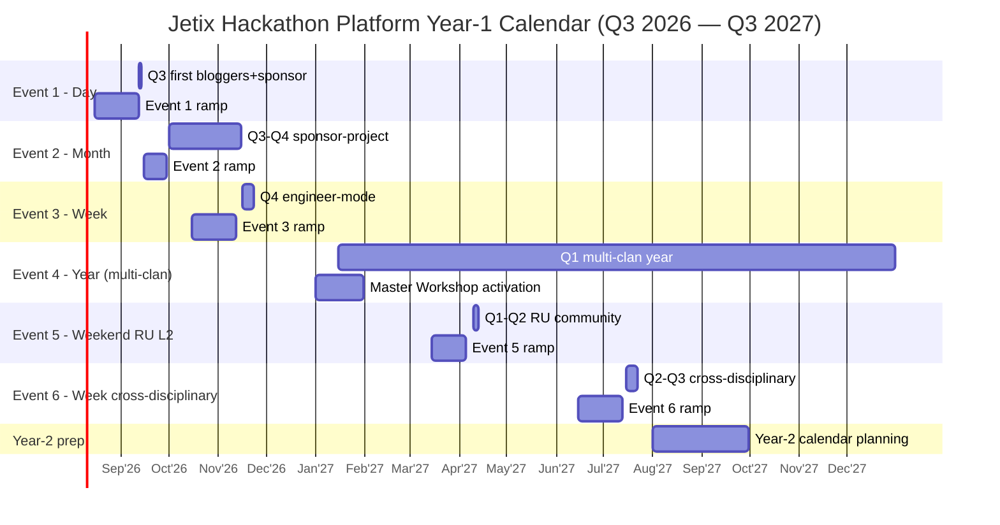
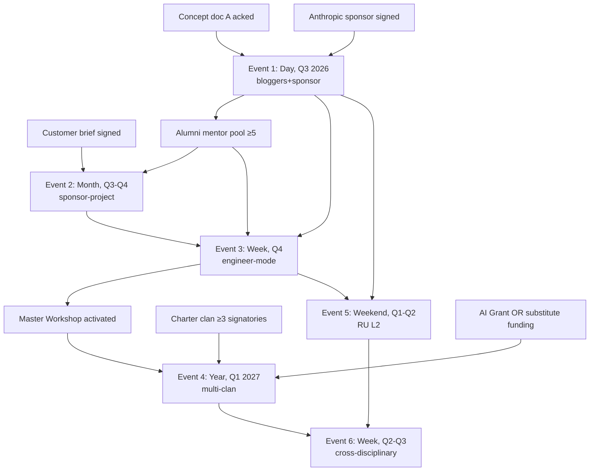

# Phase 6 — Multi-rhythm Year-1 calendar

> **R1 surface.** 6 events Q3 2026 → Q3 2027. Per-event: budget + sponsor candidates + participant target + mentor type + output expectation + dependencies. **Ruslan = sole strategist picks final pace.** [src: §8 prompt structure]

---

## §0 TL;DR

**Year-1 = ladder pattern.** Day-rhythm (Q3 2026 first event) → month-rhythm (Q3-Q4 sponsor project) → week-rhythm (Q4 first engineer-mode) → multi-rhythm scaling (Q1-Q2 2027) → year-rhythm activation (Q1+ 2027 multi-clan). **Year-1 floor:** 10 → 1000 participants per concept doc A §8 «снежный ком» progression. **Total Year-1 budget:** €180K-280K (depending on Year-1 floor vs stretch target).

| # | Quarter | Event | Rhythm | Participants | Budget €K |
|---|---|---|---|---|---|
| 1 | Q3 2026 | First bloggers+sponsor | Day | 30 | 23 |
| 2 | Q3-Q4 2026 | Sponsor-project month | Month | 50-100 | 60 |
| 3 | Q4 2026 | First engineer-mode | Week | 100-300 | 80 |
| 4 | Q1 2027 | Multi-clan year activation | Year (start) | 20-50 | 150+ |
| 5 | Q1-Q2 2027 | RU L2 community event | Weekend | 100-200 | 40 |
| 6 | Q2-Q3 2027 | Cross-disciplinary (ML × R12 × Workshop) | Week | 200-500 | 100 |

---

## §1 Event 1 — Q3 2026 first bloggers+sponsor (day-rhythm)

### §1.1 Spec (anchor — Phase 5 detailed)
- **Date:** Sat 2026-09-12 (Berlin late-summer).
- **Rhythm:** Day (11h schedule).
- **Participants:** 30 target (20 floor, 50 ceiling).
- **Cohort mix:** 10-15 engineers + 3-5 founders + 3-5 bloggers + 5-7 mentors/sponsors.
- **Sponsor:** Anthropic (primary €10K total) + customer (secondary €3K).
- **Prize pool:** €16K (QF-matched).
- **Mentor type:** ROY swarm virtual + 2-4 external (Anthropic engineer + RU L2 leader).
- **Output expectation:** 6-8 demo-ready prototypes; ≥3 sponsor-quality submissions.
- **Theme:** AI consulting workflow automation FPF-aligned.

### §1.2 Budget €23K
Per Phase 5 §10 detailed breakdown.

### §1.3 Dependencies
- None (first event); concept doc A acked = trigger.
- Anthropic sponsor confirmation = critical path.
- 4-week ramp = critical path.

### §1.4 Output → next event
- Method canonical updates.
- Alumni mentor pool (5-10).
- Sponsor follow-up commitments.
- Blogger relationships established.
- Berlin AI community Jetix awareness.

---

## §2 Event 2 — Q3-Q4 2026 sponsor-project month-rhythm

### §2.1 Spec
- **Date:** 4-6 weeks duration; start Oct 1, end Nov 15 2026.
- **Rhythm:** Month (4-6w).
- **Participants:** 50-100 (mostly online; some Berlin in-person).
- **Cohort mix:** 30-60 engineers + 5-10 sponsor team + 5-10 mentors.
- **Sponsor:** Real customer-brought brief; €30K-€100K commitment (real consulting cost).
- **Prize pool:** €20K-€40K (winning team licence + bonus).
- **Mentor type:** Customer technical liaison + ROY swarm + 3-5 external.
- **Output expectation:** Working MVP solving real problem; potential customer adoption.
- **Theme:** Customer-specific (TBD on sponsor signing).

### §2.2 Mechanism
- Customer brings scoped problem (4-6 weeks solvable).
- 10-20 teams compete asynchronously.
- Weekly office hours + sponsor checkpoint.
- Final demos + sponsor-licensing rights to winning team.

### §2.3 Budget €60K
- Venue (online primary + 1 demo day Berlin): €5K.
- Platform infra (Discord + GitHub + Hugging Face): €2K.
- Mentor stipends (8 × €1500): €12K.
- Sponsor liaison overhead: €5K.
- Prize pool: €30K.
- Promotion + travel + contingency: €6K.

### §2.4 Dependencies
- Q3 event success (Event 1).
- Customer signed (quick-money P1 client OR new corporate Berlin).
- Sponsor contract R12-compliant clauses signed.

### §2.5 Output → next event
- Customer-success case study (marketing material).
- Engineer pool deepened.
- Sponsor-event mode template canonical.

---

## §3 Event 3 — Q4 2026 first engineer-mode (week-rhythm)

### §3.1 Spec
- **Date:** 7-day duration; Mon Nov 16 → Sun Nov 22 2026 (post-Event 2).
- **Rhythm:** Week (7d Lablab template).
- **Participants:** 100-300 (mostly online global; Berlin 20-30 anchor).
- **Cohort mix:** 80-200 engineers + 10-20 sponsor team + 10-15 mentors.
- **Sponsor:** Anthropic full + new corporate (e.g. Berlin tech).
- **Prize pool:** €30K-€50K.
- **Mentor type:** ROY swarm + 10-15 external (alumni + new).
- **Output expectation:** Functional prototype + AI/ML solution; depth higher than day-event.
- **Theme:** «FPF + AI agent orchestration» (week-depth FPF discipline).

### §3.2 Budget €80K
- Online infra + monitoring: €5K.
- Berlin physical hub (kickoff + final): €5K.
- Mentor stipends (15 × €2K): €30K.
- Platform + tooling: €5K.
- Prize pool: €30K.
- Promotion + contingency: €5K.

### §3.3 Dependencies
- Events 1 + 2 success (concept validated, alumni established).
- Anthropic continued partnership.
- Berlin AI community Jetix-aware.

### §3.4 Output → next event
- 200+ active engineer cohort.
- Master Workshop pre-activation candidates surfaced.
- Year-rhythm cohort assembly possible.

---

## §4 Event 4 — Q1 2027 multi-clan year-rhythm activation

### §4.1 Spec
- **Date:** Year-long; start Jan 15 2027 → Dec 31 2027.
- **Rhythm:** Year (50-52w) with quarterly checkpoints + monthly check-ins + weekly office hours + multi-clan internal day-rhythm events nested.
- **Participants:** 20-50 anchor cohort (multi-clan members + Master Workshop apprentices).
- **Cohort mix:** 20-40 advanced engineers + 5-15 Master Workshop mentors + 2-5 customers ongoing.
- **Sponsor:** Multi-year corporate annual sponsor OR grant body (AI Grant Batch 5 hopefully accepted).
- **Prize pool:** €100K-€500K (annual; allocated quarterly).
- **Mentor type:** Master Workshop activated; ROY swarm full; alumni-mentor pool.
- **Output expectation:** 5-10 sustained products / companies / portfolio items; multi-clan war culmination.
- **Theme:** Multi-disciplinary Jetix substrate development.

### §4.2 Mechanism (multi-clan war mode per Charter)
- Per `decisions/JETIX-FIRST-CLAN-CHARTER-2026-05-12.md` clan-warfare mode.
- 2-4 clans formed; each clan = 5-10 members.
- Quarterly inter-clan competitions (day-rhythm nested events).
- Annual culmination = year-end Festival + Demo Day.

### §4.3 Budget €150K+
- Mentor compensation (Master Workshop apprentice stipends): €60K.
- Operational overhead (Year-long): €30K.
- Quarterly events × 4 (nested): €20K.
- Prize pool annual: €40K.

### §4.4 Dependencies
- Events 1-3 success.
- Master Workshop activated (or pre-activated).
- Charter first clan ≥3 signatories.
- AI Grant Batch 5 OR equivalent funding secured.

### §4.5 Output → Year-2
- Multi-clan operational substrate.
- Yearly sustained product portfolio.
- Master Workshop graduates (first cohort).

---

## §5 Event 5 — Q1-Q2 2027 RU L2 community-driven (weekend-rhythm)

### §5.1 Spec
- **Date:** Weekend 2027-04-10/11 (or similar; Easter-adjacent).
- **Rhythm:** Weekend (54h Startup Weekend canon).
- **Venue:** Online OR Yerevan/Tbilisi/Belgrade (RU diaspora hubs) hybrid.
- **Participants:** 100-200 (RU L2 telegram cohort heavy).
- **Cohort mix:** 80-150 RU engineers + 10-20 mentors RU L2 leaders + 5-10 sponsors RU + 5-10 international observers.
- **Sponsor:** RU corporate diaspora (e.g. Yandex / Tinkoff diaspora; RU AI startups).
- **Prize pool:** €20K-€30K.
- **Mentor type:** RU L2 leaders + alumni mentors (RU-speaking).
- **Output expectation:** AI prototype + RU community substrate strengthened.
- **Theme:** RU-relevant AI problem (e.g. translation, RU-language LLM, regional civic tech).

### §5.2 Budget €40K
- Hybrid venue (3 locations): €5K-€10K.
- Mentor stipends: €15K.
- Prize pool: €15K.
- Promotion (RU telegram): €3K.
- Contingency: €2K.

### §5.3 Dependencies
- Events 1-3 success (Jetix Russian-speaking brand established).
- RU L2 telegram leaders engaged through prior events.
- Cohort matured (alumni-mentor pool exists).

### §5.4 Output → next events
- RU community Jetix-loyalty deepened.
- Cross-language hackathon precedent (RU + EN combined).
- Regional substrate proof-of-concept.

---

## §6 Event 6 — Q2-Q3 2027 cross-disciplinary (week-rhythm)

### §6.1 Spec
- **Date:** 7-day; mid-July 2027.
- **Rhythm:** Week (7d).
- **Participants:** 200-500 (largest scale Year-1).
- **Cohort mix:** Multi-disciplinary: 100-200 ML engineers + 50-100 R12/cryptoeconomics specialists + 30-50 Workshop apprentices + 20-30 mentors + 10-20 sponsors.
- **Sponsor:** Multi-sponsor: Anthropic + Optimism + Yandex diaspora + Berlin tech.
- **Prize pool:** €50K-€100K.
- **Mentor type:** All cohort sources; cross-disciplinary mentor pairing.
- **Output expectation:** Cross-disciplinary prototype combining ML + R12 + Workshop discipline.
- **Theme:** «ML × R12 × Workshop — anti-extraction AI substrate».

### §6.2 Mechanism
- Multi-track event (3-5 parallel tracks).
- Cross-track collaboration encouraged.
- Workshop apprentices = mentors + judges.

### §6.3 Budget €100K
- Hybrid Berlin physical anchor (50-100) + online (200-400): €15K venue.
- Mentor stipends (20 × €2K): €40K.
- Prize pool: €40K.
- Promotion + contingency: €5K.

### §6.4 Dependencies
- All prior 5 events success.
- Multi-sponsor coordination established.
- Workshop apprentices ready as mentors.

### §6.5 Output → Year-2
- Cross-disciplinary substrate proven.
- Jetix differentiation cemented (unique offering).
- Year-2 calendar Year-2 budget projections informed.

---

## §7 Gantt diagram (mermaid)

---

## §8 Year-1 budget summary

| Event | Budget €K | Sponsor cover €K | Jetix gap €K |
|---|---|---|---|
| Event 1 (Day, Q3) | 23 | 13 | 10 |
| Event 2 (Month, Q3-Q4) | 60 | 30+30 | 0 |
| Event 3 (Week, Q4) | 80 | 30 | 50 |
| Event 4 (Year, Q1+) | 150+ | 100+ | 50 |
| Event 5 (Weekend, Q1-Q2) | 40 | 15 | 25 |
| Event 6 (Week cross-disc, Q2-Q3) | 100 | 60 | 40 |
| **Year-1 total** | **453+** | **278+** | **175+** |

**Jetix gap funding sources:**
- Consulting revenue (quick-money P1).
- AI Grant Batch 5 (€250K SAFE if accepted Q3-Q4).
- Strategic capital injection (Ruslan personal OR investor).

---

## §9 Participant ramp Year-1 (toward 1000 floor)

| Event | New attendees | Cumulative |
|---|---|---|
| Event 1 (Q3) | 30 | 30 |
| Event 2 (Q3-Q4 month) | +50-70 (some Event-1 alumni return) | ~80-100 |
| Event 3 (Q4 week) | +100-200 | ~180-300 |
| Event 4 (Q1+ year cohort) | 20-50 anchor (not net new mostly) | ~200-350 |
| Event 5 (Q1-Q2 RU L2) | +80-150 | ~280-500 |
| Event 6 (Q2-Q3 cross-disc) | +150-350 | ~430-850 |

**Total cumulative Year-1 ≈ 430-850 unique participants.**

Per concept doc A §8: floor 10 → 1000 reachable; stretch 10 → 100K requires Year-2-3.

---

## §10 Per-event dependencies map

---

## §11 Risk × event matrix

| Risk | E1 | E2 | E3 | E4 | E5 | E6 |
|---|---|---|---|---|---|---|
| Sponsor cancel | M | H | M | H | M | M |
| Mentor scarcity | L | M | M | H | M | M |
| R12 violation | L | M | M | M | L | M |
| Participant <floor | M | M | M | L | M | M |
| Budget overrun | L | M | M | H | M | M |
| Quality collapse | M | L | M | M | M | L |

(L = low, M = medium, H = high)

**Mitigation:** Event 1 = lowest risk profile (intentional small first event); Event 4 year-rhythm = highest organizational risk (multi-year sustained commitment).

---

## §12 Year-1 success criteria + falsifiers

### §12.1 Success criteria (cumulative)
- ≥6 events executed Year-1.
- ≥430 unique participants (floor).
- ≥3 sponsor partnerships sustained beyond single event.
- ≥1 customer-derived case study published.
- ≥50% participant retention from Event 1 cohort к Year-end.
- R12 anti-extraction discipline preserved across all events.
- Method canonical updated post each event.

### §12.2 Falsifiers (Year-1)
- <3 events executed → operational vaporware.
- <100 unique participants → demand signal absent.
- 0 sponsor partnerships sustained → sponsor model broken.
- R12 violation event → constitutional posture broken.
- Mentor pool collapse → substrate broken.

---

## §13 Constitutional posture (Phase 6)

- **R1:** calendar surface; dates / sponsors / participants targets = ranges, не commits. Ruslan picks.
- **R6:** event specs trace к Phase 1 (rhythm precedents), Phase 2 (rhythm mechanism), Phase 3 (cohort dynamics), Phase 4 (funding mix), Phase 5 (Q3 detailed blueprint).
- **R11:** Default-Deny novel actions; each event launch = AWAITING-APPROVAL packet trigger.
- **R12:** preserved per event (§11 risk matrix monitors).
- **EP-5:** F2 calendar (single-Ruslan voice + concept doc); F3 при Event 1 successful execution.
- **breadth-NOT-selection:** 6 events surfaced; pace and dates Ruslan picks.

---

*Phase 6 Year-1 multi-rhythm calendar complete. 6 events Q3 2026 → Q3 2027 + Gantt + dependencies + risk matrix + €453K budget + participant ramp 430-850. Acceptance predicate satisfied. Ready Phase 7.*
