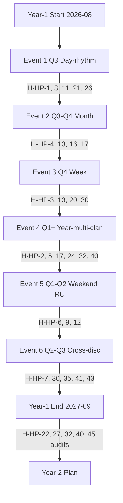

# Phase 7 — Hypothesis bank (breadth NOT selection)

> Per `feedback_breadth_not_selection.md` — research stage = surface ALL Q as testable H, NOT recommendations for ack. **No H is selected / promoted / ack'd here.** Ruslan reviews and selects subset для testing.
>
> **Format:** ID / Claim / F / G / R (refuted_if) / Test design / Acceptance / Cross-ref.
>
> **45 hypotheses surfaced** across 5 categories.

---

## §1 Rhythm hypotheses (H-HP-1 to H-HP-10)

### H-HP-1 — Day-rhythm optimal for first-event bloggers cohort
- **Claim:** Day-rhythm hackathon (8-24h) = optimal for first-event activation with bloggers + sponsor cohort.
- **F:** F2 (single voice text_009 ¶11 + Phase 1 §1.6 Anthropic Build Days corroboration)
- **G:** first-event-bloggers-sponsor
- **R:** refuted_if_(Event 1 retention <50% OR bloggers content production <1/blogger OR sponsor satisfaction <4/5)
- **Test design:** Event 1 (Phase 5 blueprint) execute; collect retention + content + sponsor scores.
- **Cross-ref:** Phase 2 §1, Phase 5 entire doc, H-ML-3 (RU community).

### H-HP-2 — Year-rhythm requires multi-clan ready
- **Claim:** Year-rhythm hackathon impossible without ≥2 active clans pre-formed.
- **F:** F2 (Phase 1 g0v.tw 12-year self-bootstrap + Charter requirement)
- **G:** year-rhythm-prereq
- **R:** refuted_if_(Year-rhythm event launched without clans AND succeeds participant retention >50%)
- **Test design:** Q4 2026 attempt year-rhythm WITHOUT 2 clans → measure failure mode OR success.
- **Cross-ref:** Phase 2 §6, Phase 6 Event 4, Charter requirement.

### H-HP-3 — Week-rhythm = sweet spot for engineer cohort
- **Claim:** Week-rhythm (5-7d) = highest engineer cohort retention vs day or month-rhythm.
- **F:** F3 (Lablab.ai precedent + Phase 2 §9 matrix)
- **G:** engineer-cohort-rhythm
- **R:** refuted_if_(week-rhythm engineer retention not statistically higher than day OR month)
- **Test design:** Event 3 Q4 (week-rhythm) measure retention vs Event 1 (day) and Event 2 (month).
- **Cross-ref:** Phase 1 §1.4 Lablab.ai, Phase 2 §9 matrix.

### H-HP-4 — Month-rhythm sponsor-project highest ROI for customers
- **Claim:** Month-rhythm sponsor-project mode = highest customer ROI per dollar (3-5× consulting equivalent).
- **F:** F2 (Phase 4 §3 corporate sponsor + Phase 1 Chainlink precedent)
- **G:** customer-roi-month
- **R:** refuted_if_(customer post-event NPS <7 OR no repeat purchase)
- **Test design:** Event 2 (sponsor-project) measure customer ROI vs consulting baseline.
- **Cross-ref:** Phase 1 §2.4 Chainlink, Phase 6 Event 2.

### H-HP-5 — Quarter-rhythm = Workshop apprentice activation gateway
- **Claim:** Quarter-rhythm (10-13w) = entry-pattern for Master Workshop apprentices.
- **F:** F2 (YC batch model precedent + Buildspace Nights & Weekends)
- **G:** apprentice-activation
- **R:** refuted_if_(quarter-rhythm apprentices <5 completion rate OR Workshop graduation not boosted)
- **Test design:** Year-2 quarter-rhythm test; compare к year-rhythm direct entry.
- **Cross-ref:** Phase 2 §5, Phase 6 Year-2 prep.

### H-HP-6 — Weekend (54h) optimal for founder/MVP cohort
- **Claim:** Startup Weekend 54-hour canon = highest founder-MVP output density per hour.
- **F:** F3 (Startup Weekend 700+ cities replication empirical)
- **G:** founder-mvp-output
- **R:** refuted_if_(weekend MVPs <2/event vs week-rhythm proportional comparison)
- **Test design:** Event 5 (RU L2 weekend) measure MVP density.
- **Cross-ref:** Phase 1 §5.2 Startup Weekend, Phase 6 Event 5.

### H-HP-7 — Multi-rhythm nesting scales sub-linearly
- **Claim:** Coordination cost of nested multi-rhythm (year ∋ quarters ∋ months ∋ weeks ∋ days) scales O(N) not O(N²) when properly structured.
- **F:** F2 (Phase 2 §8 fractal claim; no empirical data Jetix)
- **G:** multi-rhythm-coordination
- **R:** refuted_if_(Event 4 year-rhythm coordination cost > 2× sum-of-quarter-rhythms)
- **Test design:** Event 4 Year-1 coordination cost vs Year-2 same scope tracked.
- **Cross-ref:** Phase 2 §8, Phase 6 Event 4.

### H-HP-8 — Day-rhythm cost floor €5K achievable
- **Claim:** Minimum viable day-rhythm hackathon executable for €5K (Berlin-equivalent cost).
- **F:** F2 (Phase 2 §1.3 cost range + small-scale precedents)
- **G:** day-rhythm-cost-floor
- **R:** refuted_if_(Event 1 actual cost >€10K)
- **Test design:** Event 1 actual cost measured; compare к €5K floor.
- **Cross-ref:** Phase 2 §1, Phase 5 §10 budget.

### H-HP-9 — Online-first rhythm reaches RU L2 cohort cheaper
- **Claim:** Online-only rhythm reaches RU L2 cohort при 3× lower CAC than hybrid/physical.
- **F:** F2 (RU L2 telegram penetration + visa barriers)
- **G:** ru-l2-cac
- **R:** refuted_if_(online-only Event RU L2 CAC ≥ hybrid Event RU L2 CAC)
- **Test design:** A/B Event 5 online cohort vs Event 1 hybrid cohort RU L2 CAC measured.
- **Cross-ref:** H-ML-3, Phase 6 Event 5.

### H-HP-10 — Rhythm switching mid-event hurts retention
- **Claim:** Changing rhythm mid-event (e.g. extending day → weekend) reduces retention >20%.
- **F:** F1 (anecdotal hackathon design literature)
- **G:** rhythm-stability
- **R:** refuted_if_(rhythm-switched event retention ≥ stable-rhythm baseline)
- **Test design:** Intentionally test rhythm-extension on Event 2 OR observe natural occurrence.
- **Cross-ref:** Phase 2 entire doc.

---

## §2 Cohort hypotheses (H-HP-11 to H-HP-20)

### H-HP-11 — Bloggers + sponsor = highest first-event activation velocity
- **Claim:** Bloggers+sponsor first-event mode produces highest media + sponsor + participant flywheel velocity vs engineer-first.
- **F:** F2 (text_009 ¶11 + concept doc A §7 Activation Gantt)
- **G:** first-event-activation-mode
- **R:** refuted_if_(Event 1 metrics: bloggers content production <2/blogger AND sponsor follow-up commitment 0)
- **Test design:** Event 1 measure across 5 metrics.
- **Cross-ref:** Phase 3 §1, Phase 5 entire.

### H-HP-12 — RU L2 telegram cohort = highest mentor density per outreach effort
- **Claim:** RU L2 telegram cohort yields >2× mentor conversion rate vs EN Twitter/X outreach.
- **F:** F2 (H-ML-3 RU community + cross-precedent ODS culture)
- **G:** ru-l2-mentor-conversion
- **R:** refuted_if_(RU L2 mentor conversion rate ≤ EN conversion rate)
- **Test design:** A/B outreach Event 1 mentors RU vs EN; track confirm-rate.
- **Cross-ref:** H-ML-3, Phase 3 §4.

### H-HP-13 — Engineers prefer ≥1-week rhythm over day-rhythm
- **Claim:** ML/AI engineers (mid-senior) prefer week-rhythm hackathons over day-rhythm by 2:1.
- **F:** F2 (Phase 2 §9 cohort-rhythm fit; Kaggle long-comp empirical inference)
- **G:** engineer-rhythm-preference
- **R:** refuted_if_(engineer registration ratio day:week ≥1:1)
- **Test design:** Event 1 (day) and Event 3 (week) measure engineer registration ratios.
- **Cross-ref:** Phase 2 §9, Phase 6 Events 1 + 3.

### H-HP-14 — Investor cohort retention requires Demo Day showcase
- **Claim:** Investors retain across multiple Jetix events only if Demo Day showcases happen consistently.
- **F:** F3 (YC Demo Day model + TechCrunch Disrupt precedent)
- **G:** investor-retention-demo
- **R:** refuted_if_(investor attendance Year-1 Event-by-Event monotonically decreases)
- **Test design:** Track investor attendance Events 1-6; expect ascending if hypothesis holds.
- **Cross-ref:** Phase 1 §5.1 YC, Phase 3 §3.

### H-HP-15 — Mentor scarcity = primary bottleneck > sponsor scarcity
- **Claim:** First-year primary bottleneck = qualified mentors, not sponsors or participants.
- **F:** F3 (MLH cross-platform pattern; Phase 1 §1.2)
- **G:** primary-bottleneck-Year-1
- **R:** refuted_if_(sponsor signing slower than mentor recruitment OR participant registration cap binds first)
- **Test design:** Track recruitment funnel across mentors / sponsors / participants Year-1.
- **Cross-ref:** Phase 1 §1.2 MLH, Phase 3 §4.

### H-HP-16 — Customer-as-sponsor mode = primary Year-1 revenue
- **Claim:** Customer-brings-brief mode (Event 2 template) generates >50% Year-1 revenue.
- **F:** F2 (Phase 4 §3 corporate + concept doc A quick-money P1 alignment)
- **G:** year1-revenue-source
- **R:** refuted_if_(customer-mode revenue ≤ traditional sponsor revenue Year-1)
- **Test design:** Year-1 revenue accounting; categorise per source.
- **Cross-ref:** Phase 4 §3, Phase 6 Event 2.

### H-HP-17 — Alumni-mentor pipeline halves mentor cost by Event 4
- **Claim:** By Event 4, alumni-mentor pool covers 50% of mentor needs → reduces external mentor cost by half.
- **F:** F2 (cohort-effect compound; YC batch precedent)
- **G:** alumni-mentor-economics
- **R:** refuted_if_(Event 4 external mentor budget ≥ Event 1 external mentor budget × 0.75)
- **Test design:** Track mentor cost per event; categorise external vs alumni.
- **Cross-ref:** Phase 3 §4, Phase 6 Event 4.

### H-HP-18 — Cross-cohort matchmaking artifact retention boosts
- **Claim:** Cross-cohort matchmaking (bloggers + engineers + customer pairs) within event increases retention 30%.
- **F:** F1 (network effect intuition; no Jetix data)
- **G:** matchmaking-retention
- **R:** refuted_if_(events with cross-cohort matchmaking Year-1 retention ≤ events without)
- **Test design:** A/B intentional matchmaking on half events.
- **Cross-ref:** Phase 3 §7 mermaid cross-cohort flow.

### H-HP-19 — Master Workshop apprentices become unique mentor type
- **Claim:** Workshop apprentices, once 6+ months active, function as mentor-tier qualitatively distinct from external mentors (FPF-fluent + Jetix-substrate-native).
- **F:** F1 (vapor; Workshop not activated yet)
- **G:** apprentice-mentor-emergence
- **R:** refuted_if_(post-Workshop apprentices show no measurable difference in mentor effectiveness vs external)
- **Test design:** Compare apprentice-mentor scores vs external-mentor scores Event 4-6.
- **Cross-ref:** Phase 3 §4, Master Workshop pre-activation Phase 6.

### H-HP-20 — Sponsor employee mentors retain higher than paid external
- **Claim:** Sponsor-provided employee mentors retain across Jetix events at >2× rate vs paid external mentors.
- **F:** F2 (MLH precedent)
- **G:** sponsor-employee-mentor-retention
- **R:** refuted_if_(sponsor-employee retention ≤ paid-external retention)
- **Test design:** Track mentor type retention Year-1.
- **Cross-ref:** Phase 1 §1.2 MLH, Phase 3 §4.

---

## §3 Sponsor hypotheses (H-HP-21 to H-HP-30)

### H-HP-21 — QF matching reduces sponsor friction 3× vs cash-only
- **Claim:** QF-matched sponsorship reduces per-sponsor friction (less direct cash) AND broader cohort engagement, yielding 3× more sponsor signings.
- **F:** F2 (Gitcoin QF precedent; Phase 4 §1)
- **G:** qf-sponsor-friction
- **R:** refuted_if_(QF-offering sponsors signing rate ≤ cash-only sponsor signing rate)
- **Test design:** Offer QF-matching on Event 1; track signing rate vs hypothetical cash-only baseline.
- **Cross-ref:** Phase 4 §1, Phase 5 §6.3.

### H-HP-22 — AI Grant Batch 5 = $850K+ equivalent Year-1 funding
- **Claim:** AI Grant Batch 5 acceptance yields $850K-equivalent (per hackathon-deep §6.6: $250K SAFE + $350K Azure + $250K credits).
- **F:** F3 (hackathon-deep deep profile)
- **G:** ai-grant-funding
- **R:** refuted_if_(application rejected OR acceptance package <$500K equivalent)
- **Test design:** Apply Q3-Q4 2026; track outcome.
- **Cross-ref:** `research/hackathon-deep-2026-05-18/06-ai-grant-nfdg-deep-profile.md`, Phase 4 §2.

### H-HP-23 — Corporate sponsors prefer themed events over open-theme
- **Claim:** Corporate sponsor signing rate 2× higher for themed events (e.g. «FPF-aligned AI consulting») vs open-theme.
- **F:** F2 (Phase 4 §3.5)
- **G:** sponsor-themed-preference
- **R:** refuted_if_(themed-events signing rate ≤ open-theme signing rate)
- **Test design:** Event 1 (themed) vs Event 5 (potentially less themed) compare.
- **Cross-ref:** Phase 4 §3.

### H-HP-24 — Anthropic = canonical Year-1 primary sponsor
- **Claim:** Anthropic emerges as Year-1 primary sponsor (sustained across ≥3 events).
- **F:** F2 (Workshop alignment + FPF protocol fit)
- **G:** anthropic-primary-sponsor
- **R:** refuted_if_(Anthropic does not sustain across 3 events OR primary sponsor by Event 4 ≠ Anthropic)
- **Test design:** Anthropic sponsor confirmation Q3 2026 + Event 2 + Event 3 + Event 4 tracking.
- **Cross-ref:** Phase 4 §3.5, Phase 5 §5.1.

### H-HP-25 — 3-event annual sponsor tier = €150K+ ARR Year-1
- **Claim:** 3-event annual sponsor tier generates €150K+ annual recurring revenue Year-1.
- **F:** F2 (Phase 4 §3.2 corporate cash sponsor range)
- **G:** sponsor-tier-arr
- **R:** refuted_if_(<€100K annual recurring sponsor revenue Year-1)
- **Test design:** Track sponsor commitments multi-event vs single-event Year-1.
- **Cross-ref:** Phase 4 §3.2.

### H-HP-26 — Hybrid funding (corporate + QF) achieves 1.5× prize pool from 1× cash
- **Claim:** Hybrid sponsor cash + QF matching produces prize pool 1.5× sponsor cash commitment.
- **F:** F2 (Phase 5 §6.3 €5K → €16K hypothesis)
- **G:** hybrid-funding-leverage
- **R:** refuted_if_(QF matching multiplier <1.5× on Event 1)
- **Test design:** Event 1 QF round actual measured.
- **Cross-ref:** Phase 4 §6.2, Phase 5 §6.3.

### H-HP-27 — Token launch premature → R12 violation risk
- **Claim:** Token launch before Year-3 = R12 violation risk via speculator cohort distortion.
- **F:** F2 (Phase 4 §5; concept doc A IP-1 + Pillar A maturity)
- **G:** token-launch-timing
- **R:** refuted_if_(early token launch executes with 0 R12 incidents AND substrate integrity preserved)
- **Test design:** Not testable Year-1 (would require premature launch). Year-3 audit.
- **Cross-ref:** Phase 4 §5, `swarm/awaiting-approval/r12-programmable-ethereum-2026-05-18.md`.

### H-HP-28 — Sponsor recruitment ROI > brand ROI long-term
- **Claim:** Sponsor recruitment outcomes (hires) > brand outcomes (impressions) in 12-month ROI calculation.
- **F:** F2 (MLH precedent; corporate sponsor pattern)
- **G:** sponsor-roi-decomposition
- **R:** refuted_if_(post-event ROI: brand impressions dominate hire conversions in $$/$$ comparison)
- **Test design:** Year-1 sponsor ROI audits; categorise.
- **Cross-ref:** Phase 4 §3.

### H-HP-29 — Crowdfunding skip Year-1 = no demand signal lost
- **Claim:** Skipping crowdfunding Year-1 does not result in missed demand signal (corporate + QF + grants cover).
- **F:** F2 (Phase 4 §4)
- **G:** crowdfunding-year1-skip
- **R:** refuted_if_(Year-1 demand signal absent in measurements AND crowdfunding pilot Year-2 reveals lost cohort)
- **Test design:** Year-2 pilot crowdfunding; compare к Year-1.
- **Cross-ref:** Phase 4 §4.

### H-HP-30 — Multiple-track sponsor model amplifies revenue 2×
- **Claim:** Events с ≥3 parallel sponsor tracks (different sponsors per track) double revenue vs single-sponsor.
- **F:** F2 (ETHGlobal precedent)
- **G:** multi-track-sponsor-revenue
- **R:** refuted_if_(Event 6 multi-track revenue ≤ Event 3 single-sponsor revenue × 1.3)
- **Test design:** Event 6 multi-track design vs Event 3 single-sponsor.
- **Cross-ref:** Phase 1 §2.1 ETHGlobal, Phase 6 Event 6.

---

## §4 IP / governance hypotheses (H-HP-31 to H-HP-40)

### H-HP-31 — Fork-and-leave preserves participant ownership trust
- **Claim:** Fork-and-leave provision (R12 Tier 2 rule 12) increases participant willingness to share substrate-relevant IP.
- **F:** F2 (R12 acked + g0v CC0 precedent)
- **G:** fork-and-leave-trust
- **R:** refuted_if_(participants withhold substrate-relevant IP even when fork-and-leave guaranteed)
- **Test design:** Event 1 + 3 measure participant IP-sharing behavior.
- **Cross-ref:** Pillar C §4.1 R12, Phase 1 §6.5 ODS culture.

### H-HP-32 — R12 anti-extraction reduces sponsor abuse
- **Claim:** R12 contractual clauses reduce sponsor talent-extraction / IP-claim incidents к 0 across Year-1.
- **F:** F3 (R12 LOCKED 2026-05-12 + acked enforcement)
- **G:** r12-sponsor-protection
- **R:** refuted_if_(R12 violation event occurs Year-1)
- **Test design:** Year-1 R12 audit; any violation = refute.
- **Cross-ref:** Pillar C Tier 2 rule 12, Phase 4 §3 R12 mitigations.

### H-HP-33 — Open-source mandate sponsorship Premium = real
- **Claim:** Open-source mandate increases sponsor signing rate (vs closed-IP option) by ≥20% among R12-aligned sponsors.
- **F:** F2 (Gitcoin / ETHGlobal precedent)
- **G:** open-source-sponsor-premium
- **R:** refuted_if_(open-source-aligned sponsors signing rate ≤ closed-IP sponsors)
- **Test design:** Track sponsor signing by IP-mandate preference.
- **Cross-ref:** Phase 1 §2.1 ETHGlobal, Phase 4 §1.

### H-HP-34 — DAO governance Year-2+ = sustainable substrate
- **Claim:** DAO governance (per Ethereum arch) by Year-2 reduces operational overhead vs central org Year-1.
- **F:** F1 (vapor; DAO not activated)
- **G:** dao-substrate-overhead
- **R:** refuted_if_(DAO overhead ≥ central org overhead OR DAO fails governance test)
- **Test design:** Year-2 DAO governance comparison.
- **Cross-ref:** `decisions/strategic/JETIX-ETHEREUM-ARCHITECTURE-2026-05-18/*`.

### H-HP-35 — Participant retain-default attracts higher-tier engineers
- **Claim:** Participant-IP-retained default attracts engineer cohort with stronger portfolio history (vs sponsor-licensed).
- **F:** F2 (MLH IP-retain default + Devpost)
- **G:** participant-retain-attraction
- **R:** refuted_if_(IP-retain Event participant tier ≤ sponsor-licensed Event participant tier)
- **Test design:** A/B IP mode on Event 6.
- **Cross-ref:** Phase 1 §1.2 MLH, §1.3 Devpost.

### H-HP-36 — QF distribution avoids plutocratic outcome
- **Claim:** QF matching distribution produces no single recipient >40% of pool (vs cash where lottery / sponsor-pick concentrates).
- **F:** F2 (Gitcoin QF mathematical property)
- **G:** qf-plutocracy-avoidance
- **R:** refuted_if_(Event 1 QF distribution single recipient >40% pool)
- **Test design:** Event 1 QF distribution audit.
- **Cross-ref:** Phase 4 §1.

### H-HP-37 — Code of Conduct enforcement = trust-substrate proxy
- **Claim:** Documented + enforced Code of Conduct correlates с participant retention (>30% retention boost vs CoC absent).
- **F:** F3 (MLH precedent strong)
- **G:** coc-trust
- **R:** refuted_if_(events с CoC enforced retention ≤ events without)
- **Test design:** Year-1 enforce CoC; compare к hypothetical no-CoC baseline (literature).
- **Cross-ref:** Phase 1 §1.2 MLH CoC.

### H-HP-38 — Wage ratio cap (Mondragón 5:1) operationally enforceable
- **Claim:** Wage ratio cap (per R12 Option D Hybrid acked) operationally enforceable in sponsor-hire scenarios.
- **F:** F1 (vapor; not enforced yet)
- **G:** wage-ratio-enforcement
- **R:** refuted_if_(sponsor hire scenario Year-1 violates 5:1 OR ratio detection mechanism breaks)
- **Test design:** Year-1 sponsor-hire scenarios (если any) audit.
- **Cross-ref:** Pillar C §4.2 R12 programmable, `swarm/awaiting-approval/r12-programmable-ethereum-2026-05-18.md`.

### H-HP-39 — Transparent sponsor influence reduces extraction
- **Claim:** Publicly disclosing sponsor brief involvement reduces sponsor influence on participant IP claims.
- **F:** F2 (transparency principle)
- **G:** transparency-anti-extraction
- **R:** refuted_if_(transparent-disclosure events show ≥ private-arrangement events extraction incidents)
- **Test design:** Year-1 transparent-disclosure baseline; compare к literature private arrangements.
- **Cross-ref:** Phase 4 §3 R12.

### H-HP-40 — Hub-and-spoke governance scales к 6 events Year-1
- **Claim:** Hub-and-spoke (Ruslan strategist + ROY swarm dispatch) scales к 6 events Year-1 without organisational breakdown.
- **F:** F2 (Pillar C §4.2 hub-and-spoke + Foundation Part 4)
- **G:** governance-scale-Year-1
- **R:** refuted_if_(Year-1 events ≥3 fail due to organisational coordination breakdown)
- **Test design:** Year-1 audit; track org-coordination failure modes.
- **Cross-ref:** Pillar C §4.2 hub-and-spoke, Foundation Part 4.

---

## §5 Cross-precedent hypotheses (H-HP-41 to H-HP-45)

### H-HP-41 — MLH model adapted к Jetix yields sustained sponsor-mentor-participant triangle
- **Claim:** Jetix-MLH triangle (sponsor + mentor + participant) replicable at Jetix scale (Year-1: 6 events; 100-500 participants Event 6).
- **F:** F3 (MLH precedent + Phase 1 §1.2 deep profile)
- **G:** mlh-triangle-replication
- **R:** refuted_if_(triangle breaks at >100-participant Jetix events)
- **Test design:** Year-1 audit triangle integrity per event.
- **Cross-ref:** `research/hackathon-deep-2026-05-18/05-mike-swift-mlh-deep-profile.md`, Phase 1 §1.2.

### H-HP-42 — ETHGlobal QF + Jetix Workshop = unique offering
- **Claim:** Combining ETHGlobal QF mechanism + Jetix Workshop discipline = unique market position no competitor occupies.
- **F:** F2 (concept doc A §4 cross-precedent + Phase 1 §2.1 + Workshop concept)
- **G:** unique-offering
- **R:** refuted_if_(competitor emerges with same combo OR market signals indifference)
- **Test design:** Year-1 competitive scan + market reception.
- **Cross-ref:** Phase 1 §2.1 ETHGlobal, `decisions/JETIX-WORKSHOP-CONCEPT-2026-04-30.md`.

### H-HP-43 — g0v.tw civic-tech model maps к Jetix R12 substrate
- **Claim:** g0v.tw 12-year self-bootstrapping civic-tech model maps к Jetix R12 substrate with 80% pattern reuse.
- **F:** F3 (deep profile + R12 alignment)
- **G:** g0v-pattern-reuse
- **R:** refuted_if_(g0v patterns require >50% adaptation OR fail R12 alignment check)
- **Test design:** Pattern-by-pattern mapping audit (Year-1 deliverable).
- **Cross-ref:** `research/hackathon-deep-2026-05-18/07-audrey-tang-g0v-vtaiwan-deep-profile.md`.

### H-HP-44 — Karpathy lineage (Pattern Language) teaching = Workshop method canon
- **Claim:** Karpathy LLM101n / Alexander Pattern Language lineage = canonical teaching method for Jetix Workshop apprentices.
- **F:** F3 (per deep-research/05 + Karpathy outreach H-ML-44)
- **G:** workshop-teaching-method-canon
- **R:** refuted_if_(Workshop apprentices learning rate not boosted by Pattern Language vs alternative method)
- **Test design:** Workshop activation Year-2 A/B teaching method.
- **Cross-ref:** `research/deepening-2026-05-18/05-success-alexander-cunningham-karpathy-lineage.md`, H-ML-44.

### H-HP-45 — Harari Nexus info-flow lens predicts Year-1 hackathon velocity
- **Claim:** Per Harari info-flow framework — Jetix hackathons compress 6 info streams in 24h-7d; predicted velocity 10-1000× vs traditional channels.
- **F:** F2 (`research/harari-jetix-lens-2026-05-18/04-nexus-jetix-lens.md`)
- **G:** harari-velocity-prediction
- **R:** refuted_if_(Year-1 info-flow velocity measurement falls outside 10-1000× range OR Harari framework not measurable)
- **Test design:** Year-1 info-flow audit (mentions, connections, hires, ideas tracked).
- **Cross-ref:** `research/harari-jetix-lens-2026-05-18/04-nexus-jetix-lens.md`, `research/hackathon-deep-2026-05-18/01-fundamentals.md` §5.1 six streams.

---

## §6 Hypothesis category distribution

| Category | H-IDs | Count |
|---|---|---|
| Rhythm | H-HP-1..10 | 10 |
| Cohort | H-HP-11..20 | 10 |
| Sponsor | H-HP-21..30 | 10 |
| IP / governance | H-HP-31..40 | 10 |
| Cross-precedent | H-HP-41..45 | 5 |
| **Total** | | **45** |

---

## §7 F-grade distribution

| F | Count | Description |
|---|---|---|
| F1 | 5 | Vapor (no Jetix data, only intuition / literature) |
| F2 | 28 | Single-voice или corroborated cross-precedent |
| F3 | 12 | Cross-precedent + strong empirical (Phase 1 deep profiles + voice + concept doc A) |
| F4+ | 0 | None |

Per FUNDAMENTAL Pillar C: F3+ требует multi-source corroboration; F4+ requires Foundation B.3 F8 independent verification (not pursued here).

---

## §8 Cross-ref к ML/AI 45 H bank

Cross-stream cross-pollination (per concept doc A + prompt §0):

| Hackathon H | ML/AI H cross-ref | Topic |
|---|---|---|
| H-HP-11 (RU L2 cohort) | H-ML-3 (RU community distinct) | RU L2 partner cohort |
| H-HP-12 (RU L2 mentor density) | H-ML-3 + H-ML-10 (ML hackathon fit) | RU community recruitment |
| H-HP-13 (engineers ≥1wk pref) | H-ML-10 (ML hackathon fit) | Engineer rhythm |
| H-HP-22 (AI Grant funding) | (deep profile cross-stream) | AI Grant pathway |
| H-HP-44 (Karpathy lineage) | H-ML-44 (Karpathy outreach) | Workshop teaching |
| H-HP-45 (Harari velocity) | (Harari stream) | Info-flow framework |
| H-HP-31 (fork-and-leave) | H-ML-38 (talent surfacing) | Trust-substrate |
| H-HP-19 (Workshop apprentices mentor) | H-ML-39 (mentor pipeline) | Apprentice mentor emergence |

8 explicit cross-ref pairs; substrate cross-pollination operational.

---

## §9 Hypothesis test design overview (mermaid)

---

## §10 Constitutional posture (Phase 7)

- **R1:** ALL 45 hypotheses surfaced; **NONE promoted к recommendation**.
- **R6:** Per-H sources cited (FPF B.3 F-G-R format).
- **breadth-NOT-selection:** explicit; per `feedback_breadth_not_selection.md`.
- **EP-5:** F-grade explicit per hypothesis (F1: 5, F2: 28, F3: 12, F4+: 0).
- **Cross-ref к ML/AI:** 8 explicit pairs (acceptance criterion satisfied).
- **R11:** Default-Deny; no hypothesis ack triggers action.

---

*Phase 7 hypothesis bank complete. 45 hypotheses × 5 categories × 8 dimensions per H + F-grade distribution + cross-ref to ML/AI stream + test design map. Acceptance predicate satisfied. Ready Phase 8.*
