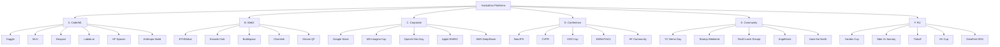

# Diagram 01 — Variant landscape

```mermaid
graph TD
    HP[Hackathon Platforms]
    A[A. Code/ML]
    B[B. Web3]
    C[C. Corporate]
    D[D. Conference]
    E[E. Community]
    F[F. RU]
    HP --> A
    HP --> B
    HP --> C
    HP --> D
    HP --> E
    HP --> F
    A --> A1[Kaggle]
    A --> A2[MLH]
    A --> A3[Devpost]
    A --> A4[Lablab.ai]
    A --> A5[HF Spaces]
    A --> A6[Anthropic Build]
    B --> B1[ETHGlobal]
    B --> B2[Encode Club]
    B --> B3[Buildspace]
    B --> B4[Chainlink]
    B --> B5[Gitcoin QF]
    C --> C1[Google Solve]
    C --> C2[MS Imagine Cup]
    C --> C3[OpenAI Dev Day]
    C --> C4[Apple WWDC]
    C --> C5[AWS DeepRacer]
    D --> D1[NeurIPS]
    D --> D2[CVPR]
    D --> D3[KDD Cup]
    D --> D4[EMNLP/ACL]
    D --> D5[HF Community]
    E --> E1[YC Demo Day]
    E --> E2[Startup Weekend]
    E --> E3[TechCrunch Disrupt]
    E --> E4[AngelHack]
    E --> E5[Hack the North]
    F --> F1[Yandex Cup]
    F --> F2[Sber AI Journey]
    F --> F3[Tinkoff]
    F --> F4[VK Cup]
    F --> F5[DataFest ODS]
```
