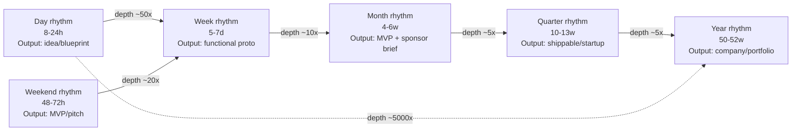

# Diagram 02 — Rhythm-to-output matrix

```mermaid
graph LR
    Day[Day rhythm<br/>8-24h<br/>Output: idea/blueprint]
    Weekend[Weekend rhythm<br/>48-72h<br/>Output: MVP/pitch]
    Week[Week rhythm<br/>5-7d<br/>Output: functional proto]
    Month[Month rhythm<br/>4-6w<br/>Output: MVP + sponsor brief]
    Quarter[Quarter rhythm<br/>10-13w<br/>Output: shippable/startup]
    Year[Year rhythm<br/>50-52w<br/>Output: company/portfolio]
    Day -->|depth ~50x| Week
    Weekend -->|depth ~20x| Week
    Week -->|depth ~10x| Month
    Month -->|depth ~5x| Quarter
    Quarter -->|depth ~5x| Year
    Day -.->|depth ~5000x| Year
```

Output depth correlates super-linearly с rhythm duration. Multi-rhythm ladder = Jetix Year-1 strategy.
