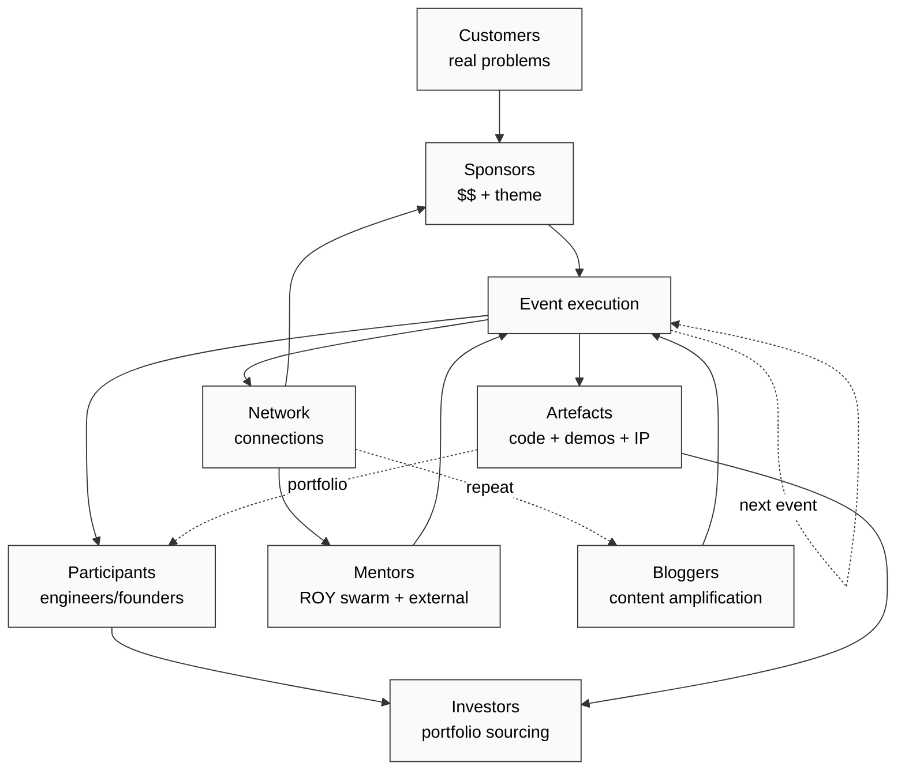

# Diagram 03 — Cohort dynamics graph

```mermaid
%%{init: {'theme':'base', 'themeVariables': {'primaryTextColor':'#000000','textColor':'#000000','lineColor':'#333333','primaryBorderColor':'#333333','primaryColor':'#fafafa','noteTextColor':'#000000','noteBkgColor':'#fff8d5','edgeLabelBackground':'#ffffff'}}}%%
graph TD
    SPONSOR[Sponsors<br/>$$ + theme]
    EVENT[Event execution]
    PARTICIPANT[Participants<br/>engineers/founders]
    MENTOR[Mentors<br/>ROY swarm + external]
    BLOGGER[Bloggers<br/>content amplification]
    CUSTOMER[Customers<br/>real problems]
    INVESTOR[Investors<br/>portfolio sourcing]
    ARTEFACT[Artefacts<br/>code + demos + IP]
    NETWORK[Network<br/>connections]
    SPONSOR --> EVENT
    EVENT --> PARTICIPANT
    MENTOR --> EVENT
    BLOGGER --> EVENT
    EVENT --> ARTEFACT
    EVENT --> NETWORK
    CUSTOMER --> SPONSOR
    PARTICIPANT --> INVESTOR
    ARTEFACT --> INVESTOR
    NETWORK --> SPONSOR
    NETWORK --> MENTOR
    EVENT -.->|next event| EVENT
    ARTEFACT -.->|portfolio| PARTICIPANT
    NETWORK -.->|repeat| BLOGGER
```
