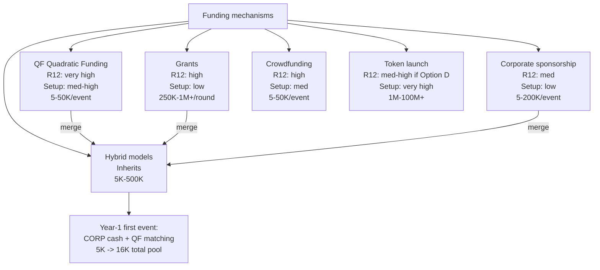

# Diagram 04 — Sponsor + funding mechanism comparison

```mermaid
graph TB
    M[Funding mechanisms]
    QF[QF Quadratic Funding<br/>R12: very high<br/>Setup: med-high<br/>5-50K/event]
    GRANT[Grants<br/>R12: high<br/>Setup: low<br/>250K-1M+/round]
    CORP[Corporate sponsorship<br/>R12: med<br/>Setup: low<br/>5-200K/event]
    CROWD[Crowdfunding<br/>R12: high<br/>Setup: med<br/>5-50K/event]
    TOKEN[Token launch<br/>R12: med-high if Option D<br/>Setup: very high<br/>1M-100M+]
    HYBRID[Hybrid models<br/>Inherits<br/>5K-500K]
    M --> QF
    M --> GRANT
    M --> CORP
    M --> CROWD
    M --> TOKEN
    M --> HYBRID
    QF -->|merge| HYBRID
    GRANT -->|merge| HYBRID
    CORP -->|merge| HYBRID
    HYBRID --> Y1[Year-1 first event:<br/>CORP cash + QF matching<br/>5K -> 16K total pool]
```

**Recommendation (R1):** Hybrid (Corporate cash + QF matching) Year-1; full QF + grants Year-2+; defer Token Year-3+.
