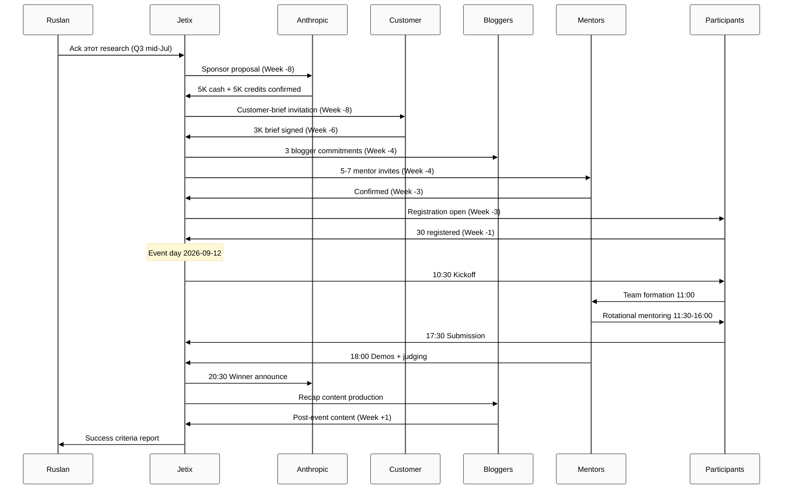

# Diagram 05 — First event Q3 2026 operational flow

```mermaid
%%{init: {'theme':'base', 'themeVariables': {'primaryTextColor':'#000000','textColor':'#000000','lineColor':'#333333','primaryBorderColor':'#333333','primaryColor':'#fafafa','noteTextColor':'#000000','noteBkgColor':'#fff8d5','edgeLabelBackground':'#ffffff'}}}%%
sequenceDiagram
    participant Ruslan
    participant Jetix
    participant Anthropic
    participant Customer
    participant Bloggers
    participant Mentors
    participant Participants
    Ruslan->>Jetix: Ack этот research (Q3 mid-Jul)
    Jetix->>Anthropic: Sponsor proposal (Week -8)
    Anthropic->>Jetix: 5K cash + 5K credits confirmed
    Jetix->>Customer: Customer-brief invitation (Week -8)
    Customer->>Jetix: 3K brief signed (Week -6)
    Jetix->>Bloggers: 3 blogger commitments (Week -4)
    Jetix->>Mentors: 5-7 mentor invites (Week -4)
    Mentors->>Jetix: Confirmed (Week -3)
    Jetix->>Participants: Registration open (Week -3)
    Participants->>Jetix: 30 registered (Week -1)
    Note over Jetix: Event day 2026-09-12
    Jetix->>Participants: 10:30 Kickoff
    Participants->>Mentors: Team formation 11:00
    Mentors->>Participants: Rotational mentoring 11:30-16:00
    Participants->>Jetix: 17:30 Submission
    Mentors->>Jetix: 18:00 Demos + judging
    Jetix->>Anthropic: 20:30 Winner announce
    Jetix->>Bloggers: Recap content production
    Bloggers->>Jetix: Post-event content (Week +1)
    Jetix->>Ruslan: Success criteria report
```
