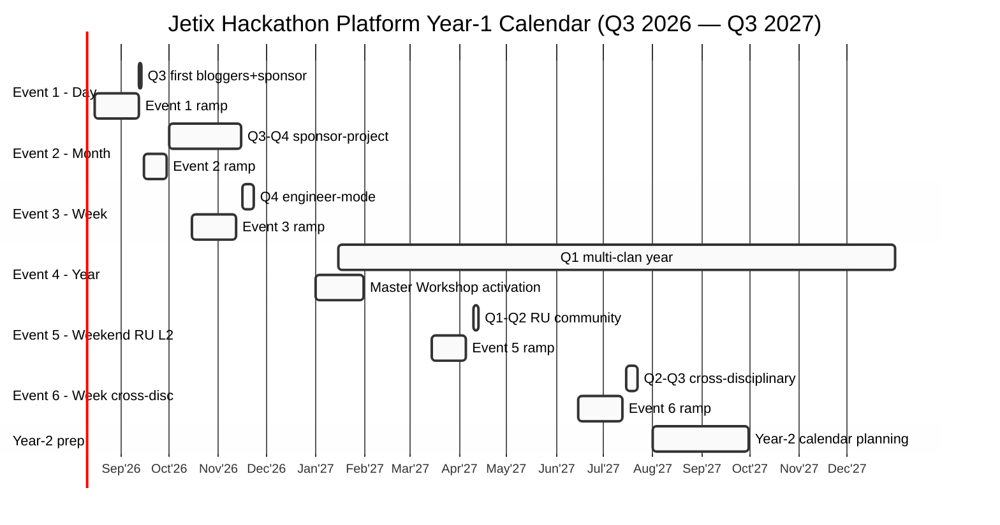

# Diagram 06 — Year-1 multi-rhythm Gantt

```mermaid
%%{init: {'theme':'base', 'themeVariables': {'primaryTextColor':'#000000','textColor':'#000000','lineColor':'#333333','primaryBorderColor':'#333333','primaryColor':'#fafafa','noteTextColor':'#000000','noteBkgColor':'#fff8d5','edgeLabelBackground':'#ffffff'}}}%%
gantt
    title Jetix Hackathon Platform Year-1 Calendar (Q3 2026 — Q3 2027)
    dateFormat  YYYY-MM-DD
    axisFormat  %b'%y
    section Event 1 - Day
    Q3 first bloggers+sponsor :e1, 2026-09-12, 1d
    Event 1 ramp              :ramp1, 2026-08-15, 28d
    section Event 2 - Month
    Q3-Q4 sponsor-project     :e2, 2026-10-01, 45d
    Event 2 ramp              :ramp2, 2026-09-15, 14d
    section Event 3 - Week
    Q4 engineer-mode          :e3, 2026-11-16, 7d
    Event 3 ramp              :ramp3, 2026-10-15, 28d
    section Event 4 - Year
    Q1 multi-clan year        :e4, 2027-01-15, 350d
    Master Workshop activation:msw, 2027-01-01, 30d
    section Event 5 - Weekend RU L2
    Q1-Q2 RU community        :e5, 2027-04-10, 3d
    Event 5 ramp              :ramp5, 2027-03-15, 21d
    section Event 6 - Week cross-disc
    Q2-Q3 cross-disciplinary  :e6, 2027-07-15, 7d
    Event 6 ramp              :ramp6, 2027-06-15, 28d
    section Year-2 prep
    Year-2 calendar planning  :y2plan, 2027-08-01, 60d
```
