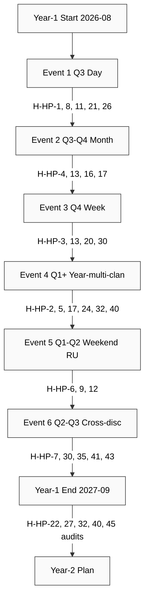

# Diagram 07 — Hypothesis test design map

```mermaid
%%{init: {'theme':'base', 'themeVariables': {'primaryTextColor':'#000000','textColor':'#000000','lineColor':'#333333','primaryBorderColor':'#333333','primaryColor':'#fafafa','noteTextColor':'#000000','noteBkgColor':'#fff8d5','edgeLabelBackground':'#ffffff'}}}%%
graph TD
    YearStart[Year-1 Start 2026-08]
    Event1[Event 1 Q3 Day]
    Event2[Event 2 Q3-Q4 Month]
    Event3[Event 3 Q4 Week]
    Event4[Event 4 Q1+ Year-multi-clan]
    Event5[Event 5 Q1-Q2 Weekend RU]
    Event6[Event 6 Q2-Q3 Cross-disc]
    YearEnd[Year-1 End 2027-09]
    YearStart --> Event1
    Event1 -->|H-HP-1, 8, 11, 21, 26| Event2
    Event2 -->|H-HP-4, 13, 16, 17| Event3
    Event3 -->|H-HP-3, 13, 20, 30| Event4
    Event4 -->|H-HP-2, 5, 17, 24, 32, 40| Event5
    Event5 -->|H-HP-6, 9, 12| Event6
    Event6 -->|H-HP-7, 30, 35, 41, 43| YearEnd
    YearEnd -->|H-HP-22, 27, 32, 40, 45 audits| Y2Plan[Year-2 Plan]
```

Each event tests a specific hypothesis subset. Year-end aggregates audits.
