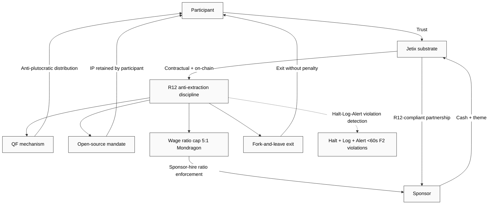

# Diagram 09 — R12 enforcement в hackathon context

```mermaid
%%{init: {'theme':'base', 'themeVariables': {'primaryTextColor':'#000000','textColor':'#000000','lineColor':'#333333','primaryBorderColor':'#333333','primaryColor':'#fafafa','noteTextColor':'#000000','noteBkgColor':'#fff8d5','edgeLabelBackground':'#ffffff'}}}%%
flowchart TD
    PARTICIPANT[Participant]
    SPONSOR[Sponsor]
    JETIX[Jetix substrate]
    R12[R12 anti-extraction discipline]
    QF[QF mechanism]
    OPEN[Open-source mandate]
    WAGE[Wage ratio cap 5:1 Mondragon]
    FORK[Fork-and-leave exit]
    R12 --> QF
    R12 --> OPEN
    R12 --> WAGE
    R12 --> FORK
    QF -->|Anti-plutocratic distribution| PARTICIPANT
    OPEN -->|IP retained by participant| PARTICIPANT
    WAGE -->|Sponsor-hire ratio enforcement| SPONSOR
    FORK -->|Exit without penalty| PARTICIPANT
    PARTICIPANT -->|Trust| JETIX
    JETIX -->|Contractual + on-chain| R12
    SPONSOR -->|Cash + theme| JETIX
    JETIX -->|R12-compliant partnership| SPONSOR
    R12 -.->|Halt-Log-Alert violation detection| HALT[Halt + Log + Alert <60s F2 violations]
```

Per Pillar C §4.1 R12 + §4.2 R12 programmable Ethereum Option D Hybrid acked 2026-05-18 commit `8a3d800`.
