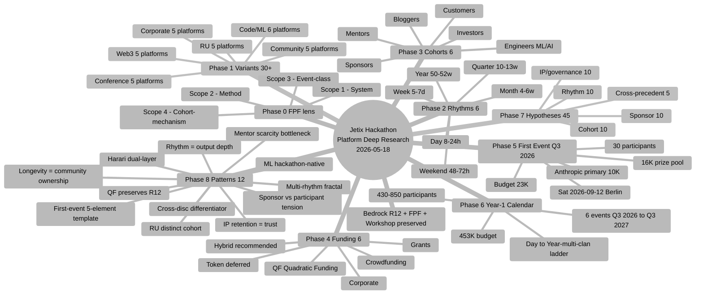

# Diagram 10 — Master TL;DR

```mermaid
%%{init: {'theme':'base', 'themeVariables': {'primaryTextColor':'#000000','textColor':'#000000','lineColor':'#333333','primaryBorderColor':'#333333','primaryColor':'#fafafa','noteTextColor':'#000000','noteBkgColor':'#fff8d5','edgeLabelBackground':'#ffffff'}}}%%
mindmap
  root((Jetix Hackathon<br/>Platform Deep Research<br/>2026-05-18))
    Phase 0 FPF lens
      Scope 1 - System
      Scope 2 - Method
      Scope 3 - Event-class
      Scope 4 - Cohort-mechanism
    Phase 1 Variants 30+
      Code/ML 6 platforms
      Web3 5 platforms
      Corporate 5 platforms
      Conference 5 platforms
      Community 5 platforms
      RU 5 platforms
    Phase 2 Rhythms 6
      Day 8-24h
      Weekend 48-72h
      Week 5-7d
      Month 4-6w
      Quarter 10-13w
      Year 50-52w
    Phase 3 Cohorts 6
      Bloggers
      Engineers ML/AI
      Investors
      Mentors
      Customers
      Sponsors
    Phase 4 Funding 6
      QF Quadratic Funding
      Grants
      Corporate
      Crowdfunding
      Token deferred
      Hybrid recommended
    Phase 5 First Event Q3 2026
      Sat 2026-09-12 Berlin
      Anthropic primary 10K
      30 participants
      16K prize pool
      Budget 23K
    Phase 6 Year-1 Calendar
      6 events Q3 2026 to Q3 2027
      Day to Year-multi-clan ladder
      453K budget
      430-850 participants
    Phase 7 Hypotheses 45
      Rhythm 10
      Cohort 10
      Sponsor 10
      IP/governance 10
      Cross-precedent 5
    Phase 8 Patterns 12
      Longevity = community ownership
      Rhythm = output depth
      ML hackathon-native
      RU distinct cohort
      QF preserves R12
      Sponsor vs participant tension
      Harari dual-layer
      Multi-rhythm fractal
      Cross-disc differentiator
      Mentor scarcity bottleneck
      IP retention = trust
      First-event 5-element template
    Bedrock R12 + FPF + Workshop preserved
```
